# Gantt Diagrams

Gantt charts illustrate project schedules: tasks as horizontal bars on a time axis, with start/end dates and optional sections, milestones, and exclusions. Use them for project timelines, sprint plans, release schedules, and dependency visualization.

## Basic Syntax

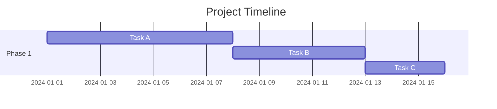

Tasks are sequential by default: each task’s start date defaults to the end of the previous task.

## Task Metadata

A colon `:` separates the task title from its metadata. Metadata items are comma-separated. Valid **tags** (optional, must come first): `active`, `done`, `crit`, `milestone`.

### Tags

| Tag         | Effect                          |
|------------|----------------------------------|
| `active`   | Task shown as currently active   |
| `done`     | Task shown as completed         |
| `crit`     | Critical path (highlighted)     |
| `milestone`| Single point in time (no bar)   |

### Task with tags and duration

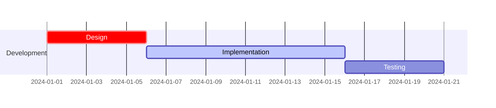

## Start and End Date Rules

Metadata (after tags) is interpreted as:

1. **One item** – when the task ends (date or duration from task start).
2. **Two items** – first = start (explicit date or `after <taskID>`), second = end (date or duration).
3. **Three items** – first = task ID (for `after` / `until`), then start, then end.

### Common patterns

| Syntax | Start | End |
|--------|--------|-----|
| `<endDate>` or `<length>` | End of previous task | As given |
| `<startDate>, <endDate>` | startDate | endDate |
| `<startDate>, <length>` | startDate | start + length |
| `after <taskID>, <endDate>` | End of taskID | endDate |
| `after <taskID>, <length>` | End of taskID | start + length |
| `after <taskID>, until <otherID>` | End of taskID | Start of otherID |

### Using `after` and `until`

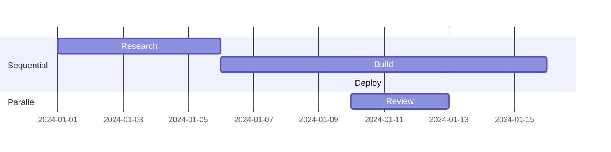

### Multiple dependencies (`after` with several tasks)

Start is the **latest** end date of any referenced task:

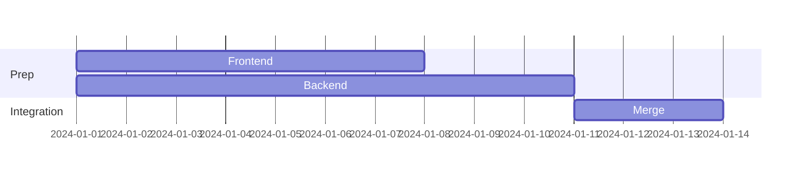

## Title

Optional string at the top of the chart:

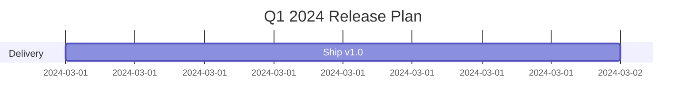

## Excludes

Exclude specific dates or weekdays from duration. Excluded days extend the bar to the right; between consecutive tasks they appear as gaps.

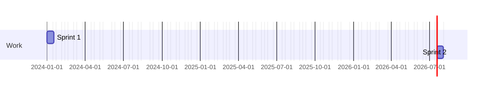

**Formats:** `YYYY-MM-DD`, weekday names (e.g. `sunday`), or `weekends`. Optional `weekend` (v11.0+): `weekend friday` or `weekend saturday` to define which days count as weekend.

## Sections

Group tasks into named sections (e.g. teams or phases). Section name is required.

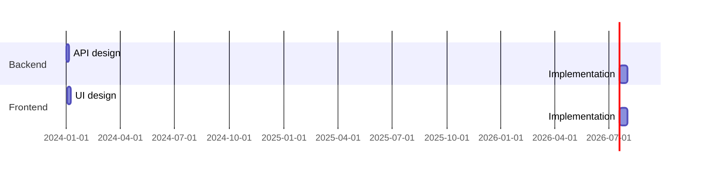

## Milestones

Single instant in time (no duration). Use the `milestone` tag. Position is derived from the given date and “duration” (e.g. date + duration/2).

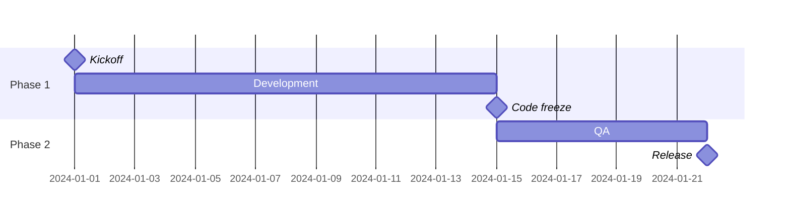

## Vertical Markers

Use `vert` to draw vertical lines at specific dates (deadlines, releases). They don’t use a row.

```mermaid
gantt
    dateFormat YYYY-MM-DD

    vert 2024-01-15 as Deadline
    vert 2024-01-22 as Ship

    section Work
    Task one   :2024-01-01, 10d
    Task two   :after Task one, 12d
```

## Date Formats

### Input: `dateFormat`

Defines how **input** dates in the diagram are parsed. Default: `YYYY-MM-DD`.

```mermaid
gantt
    dateFormat YYYY-MM-DD
    title Input dates like 2024-01-15
```

Common tokens: `YYYY` (4-digit year), `YY`, `MM`/`M`, `DD`/`D`, `Q` (quarter), `HH`/`H`, `mm`, `ss`, `X` (Unix), `x` (Unix ms). See [dayjs format](https://day.js.org/docs/en/parse/string-format/).

### Output: `axisFormat`

Defines how dates are **displayed** on the axis (e.g. `%Y-%m-%d`, `%b %d`).

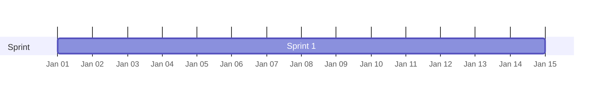

Common: `%Y`, `%m`, `%d`, `%b` (short month), `%B` (full month), `%a`/`%A` (weekday). See [d3-time-format](https://github.com/d3/d3-time-format).

### Axis ticks: `tickInterval`

Control axis tick spacing (v10.3.0+). Pattern: `1day`, `1week`, `1month`, etc.

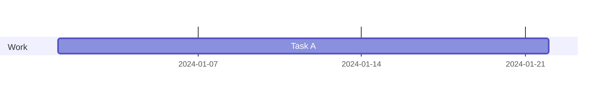

Optional `weekday` (e.g. `weekday monday`) sets the start day for week-based intervals.

## Compact Mode

Show multiple tasks per row via YAML frontmatter:

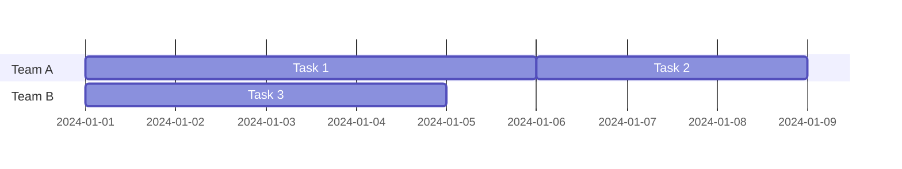

## Styling

Styling uses CSS classes. Common classes (see Mermaid `gantt` styles): `grid.tick`, `grid.path`, `.taskText`, `.taskTextOutsideRight`, `.taskTextOutsideLeft`, `todayMarker`.

### Today marker

Show or style the “today” line:

```
todayMarker stroke-width:5px,stroke:#0f0,opacity:0.5
```

Hide it:

```
todayMarker off
```

## Configuration

Example `ganttConfig` options: `titleTopMargin`, `barHeight`, `barGap`, `topPadding`, `leftPadding`, `rightPadding`, `fontSize`, `axisFormat`, `tickInterval`, `topAxis`, `displayMode`, `weekday`. Set via Mermaid config/CLI.

## Interaction

Bind clicks to tasks (disabled when `securityLevel='strict'`):

```
click taskId href URL
click taskId call callback(arguments)
```

`taskId` is the task’s ID; `callback` is a JS function available on the page.

## Comments

Comments on their own line, prefixed with `%%`:


## Example: Sprint Plan

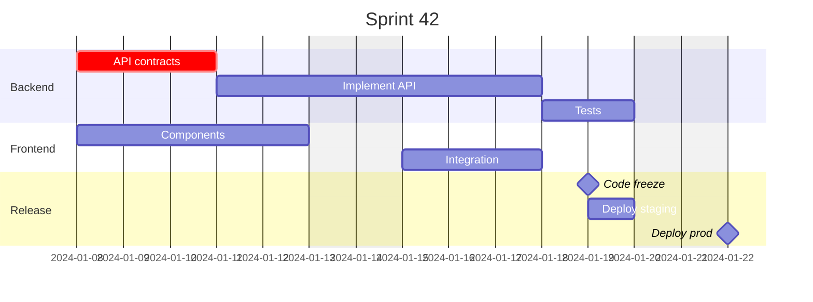

## Example: Project Phases

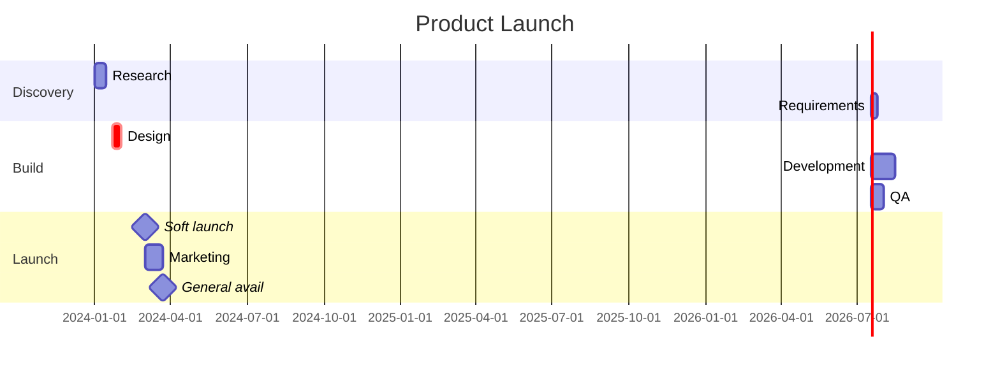

## Example: Bar chart (Gantt as timeline)

```mermaid
gantt
    dateFormat X
    axisFormat %s

    section Events
    Event A   :0, 100
    Event B   :100, 150
    Event C   :150, 200
```

Use `dateFormat X` (Unix seconds) for numeric ranges.

## Best Practices

1. **Use clear task titles** – Short, action-oriented labels.
2. **Sections for groups** – Separate teams, phases, or workstreams.
3. **`dateFormat` and `axisFormat`** – Set once at the top for consistency.
4. **Exclude non-working time** – Use `excludes` so bar lengths match working days.
5. **Critical path** – Mark key tasks with `crit` for at-a-glance focus.
6. **Milestones for gates** – Code freeze, release, go-live as milestones.
7. **Vertical markers** – Use `vert` for deadlines and key dates.
8. **Task IDs** – Give IDs when using `after` / `until` for dependencies.
9. **One timeline per chart** – Keep one project or sprint per diagram.

## Common Patterns

### Sequential tasks

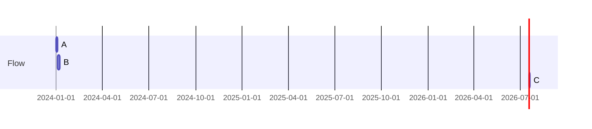

### Parallel tracks

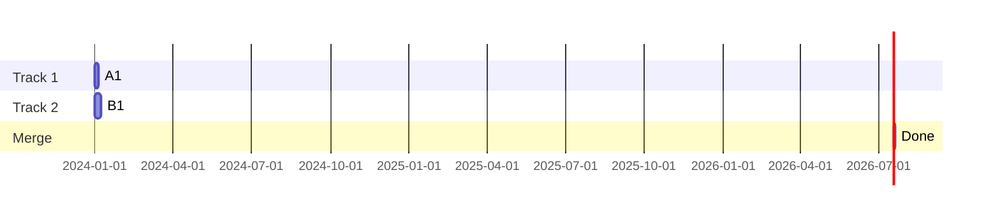

### Fixed-date milestones

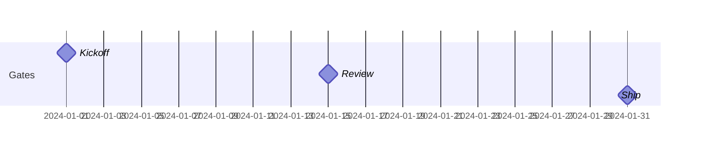

### Working days only

```mermaid
gantt
    dateFormat YYYY-MM-DD
    excludes weekends
    section Sprint
    Work   :2024-01-08, 10d
```
