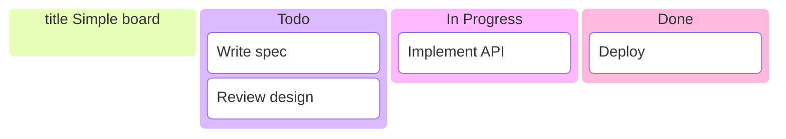
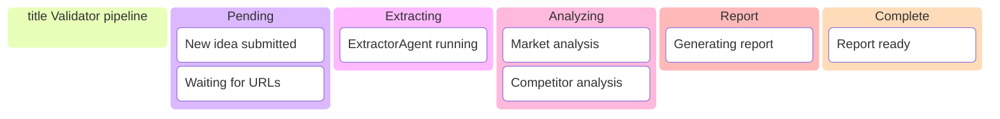
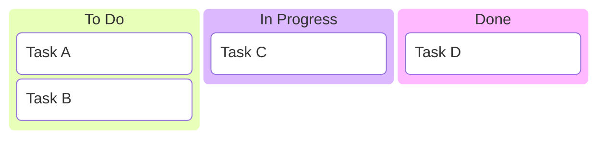

# Kanban Diagrams

Kanban diagrams show tasks moving through workflow stages (columns). Use them for sprint boards, validation pipelines, release workflows, or any process with distinct phases like Todo → In Progress → Done.

**Reference:** [Mermaid Kanban syntax](https://mermaid.js.org/syntax/kanban.html)

## Basic Syntax

Start with the `kanban` keyword, then define columns as `columnId[Column Title]` and list tasks indented under each column.


## Defining Columns

Columns are workflow stages. Each column has a unique ID and an optional title in square brackets.

**Syntax:** `columnId[Column Title]`

- `columnId` – unique identifier for the column
- `[Column Title]` – label shown in the column header


## Adding Tasks to Columns

List tasks under each column with indentation. Each task has a unique ID and a description in square brackets.

**Syntax:** `taskId[Task Description]`

- `taskId` – unique identifier for the task
- `[Task Description]` – text shown on the card



## Task Metadata

Add metadata to tasks with `@{ ... }`. Metadata is rendered on the card.

**Syntax:** `taskId[Task Description] @{ key: value, ... }`

### Supported metadata keys

| Key        | Purpose                          | Example / allowed values      |
|-----------|-----------------------------------|-------------------------------|
| `assigned`| Who is responsible               | `"Alice"`, `"Backend team"`   |
| `ticket` | Ticket or issue ID (for linking)  | `"PROJ-123"`, `"BUG-45"`       |
| `priority`| Urgency                           | `'Very High'`, `'High'`, `'Low'`, `'Very Low'` |

```mermaid
kanban
    title Board with metadata
    backlog[Backlog]
        a[Create docs] @{ assigned: "Alice", ticket: "DOC-1", priority: "High" }
        b[Fix login] @{ assigned: "Bob", ticket: "BUG-2", priority: "Very High" }
    progress[In Progress]
        c[API design] @{ assigned: "Carol", ticket: "FEAT-3" }
    done[Done]
        d[Setup CI] @{ assigned: "Alice", priority: "Low" }
```

## Configuration: ticket links

Use a YAML frontmatter config block to turn ticket IDs into links. `ticketBaseUrl` is the base URL; `#TICKET#` is replaced by the task’s `ticket` value.

```yaml
---
config:
  kanban:
    ticketBaseUrl: 'https://yourproject.atlassian.net/browse/#TICKET#'
---
```

Example: ticket `PROJ-123` becomes a link to `https://yourproject.atlassian.net/browse/PROJ-123`.

## Full example: Sprint board

```mermaid
kanban
    title Sprint 42
    backlog[Backlog]
        s1[Score matrix section] @{ assigned: "Agent", priority: "High" }
        s2[Competitor table] @{ assigned: "Agent", ticket: "V-31" }
    progress[In Progress]
        s3[Financials section] @{ assigned: "Agent", ticket: "V-34", priority: "Very High" }
    review[Review]
        s4[Tech stack section] @{ assigned: "Reviewer" }
    done[Done]
        s5[Problem statement] @{ priority: "Low" }
        s6[Solution section]
```

## Validator workflow example



## Best practices

1. **Unique IDs** – Use distinct `columnId` and `taskId` values (no spaces in IDs).
2. **Indentation** – Keep tasks indented under their column so the parser assigns them correctly.
3. **Short titles** – Column and task labels stay readable in card layout.
4. **Metadata** – Use `assigned` and `priority` for clarity; use `ticket` when you need links.
5. **Column order** – List columns in left-to-right flow (e.g. Backlog → In Progress → Done).
6. **One board per diagram** – One `kanban` block per board to keep rendering predictable.

## Common patterns

### Three-column default


### With task cards



### Priority and assignee only

```mermaid
kanban
    backlog[Backlog]
        b1[Research] @{ assigned: "Dev", priority: "High" }
    doing[Doing]
        b2[Implement] @{ assigned: "Dev", priority: "Very High" }
```

### Ticket linking (with config)

When using `ticketBaseUrl` in config, ensure tasks have `ticket` metadata so the diagram can link to your issue tracker.
