# FigJam Diagram Examples

Detailed examples organized by diagram type and common use cases.

## Table of Contents

- [Flowcharts](#flowcharts)
- [Decision Trees](#decision-trees)
- [Gantt Charts](#gantt-charts)
- [Sequence Diagrams](#sequence-diagrams)
- [State Diagrams](#state-diagrams)
- [Startup & Product Use Cases](#startup--product-use-cases)

---

## Flowcharts

### User Onboarding Flow

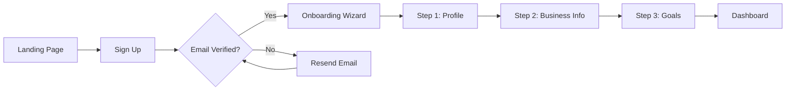

### CI/CD Pipeline

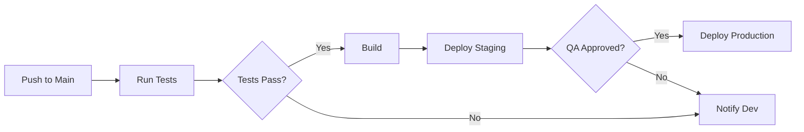

### System Architecture

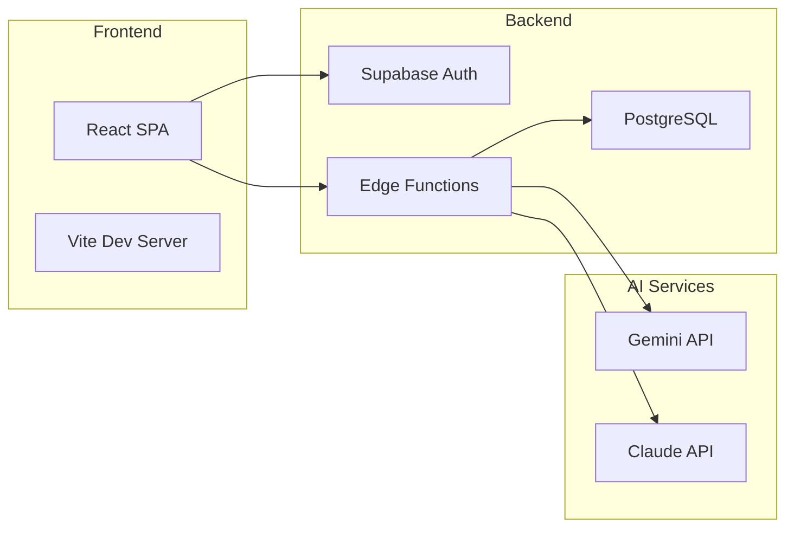

### Data Pipeline

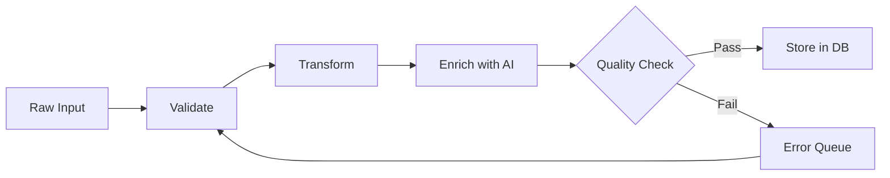

---

## Decision Trees

### Feature Prioritization

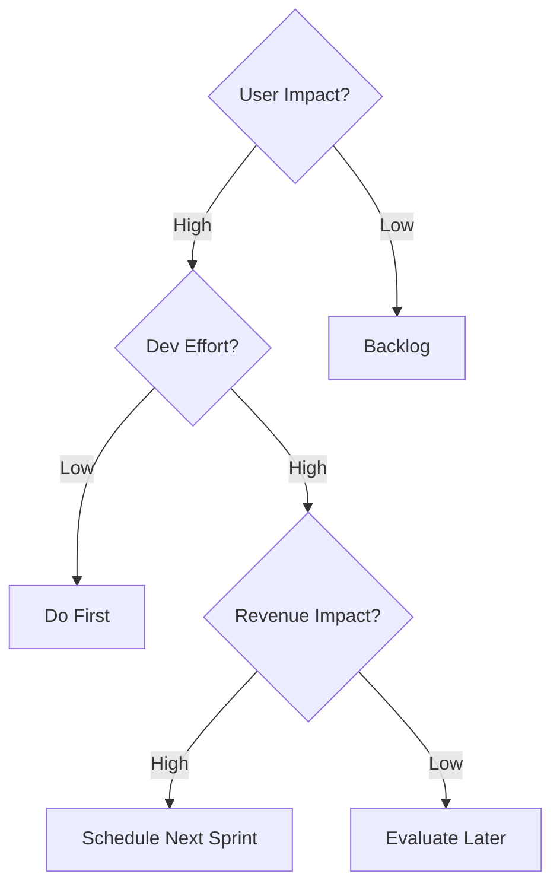

### Bug Triage

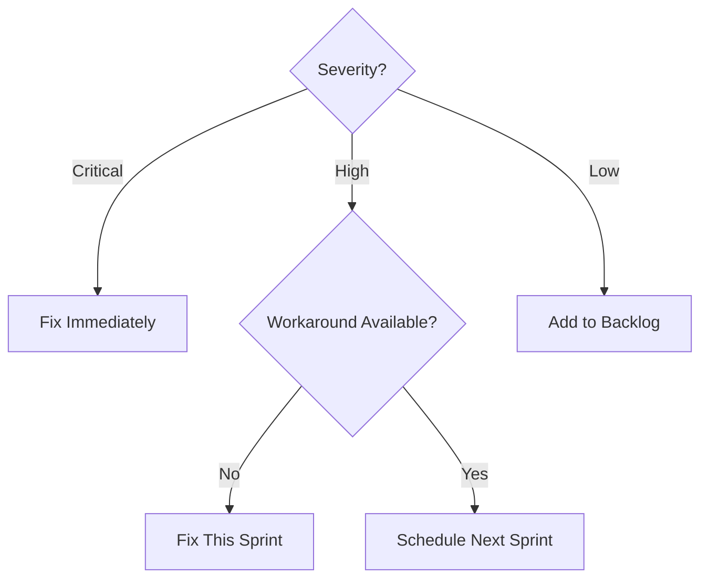

### Customer Support Routing

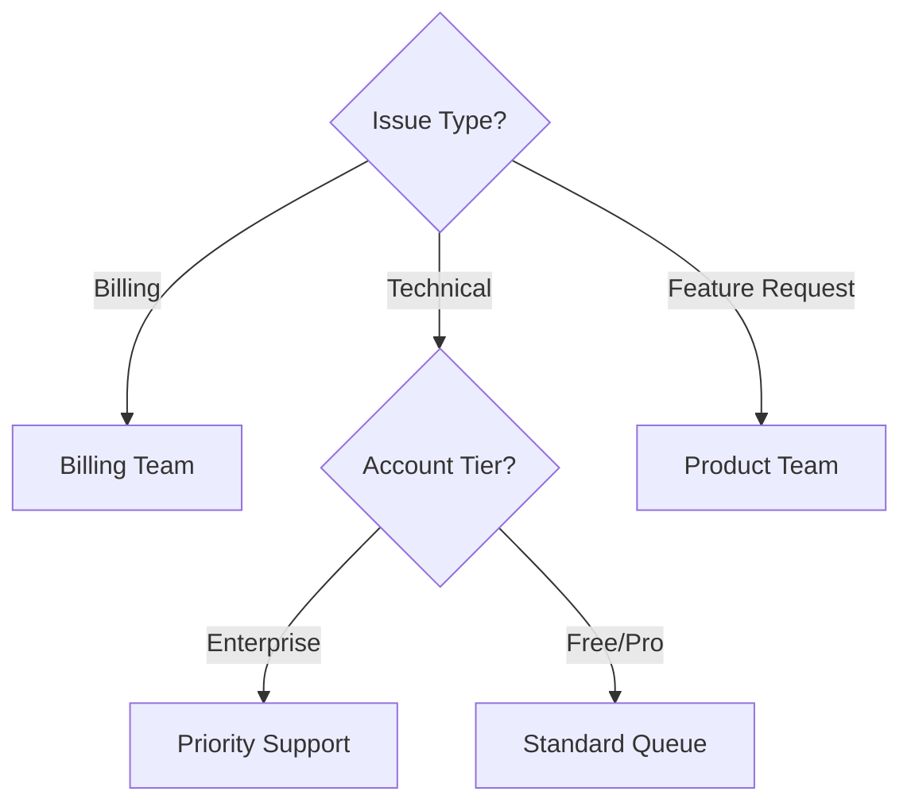

---

## Gantt Charts

### MVP Launch Plan

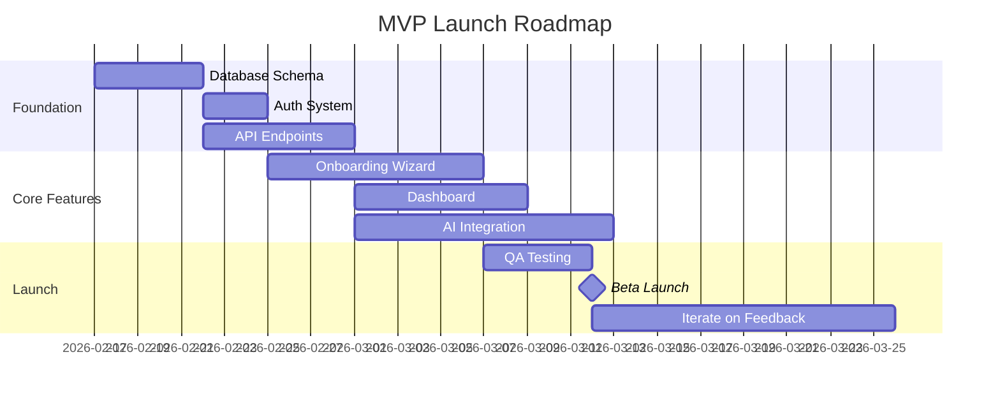

### Sprint Plan

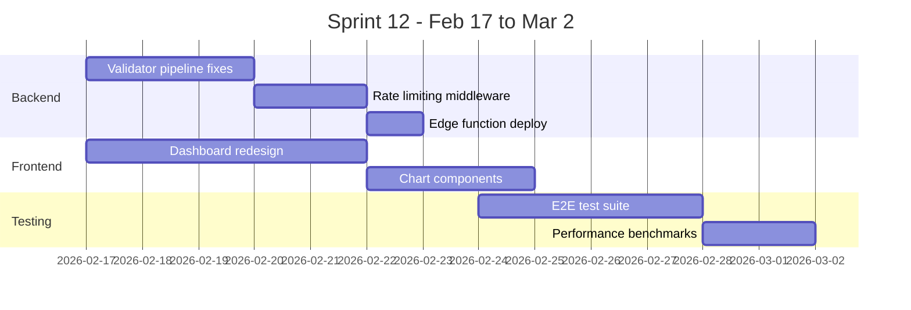

### Product Roadmap (Quarterly)

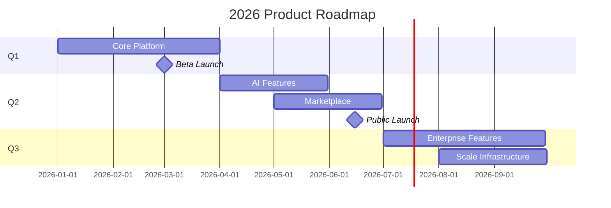

---

## Sequence Diagrams

### OAuth Login Flow

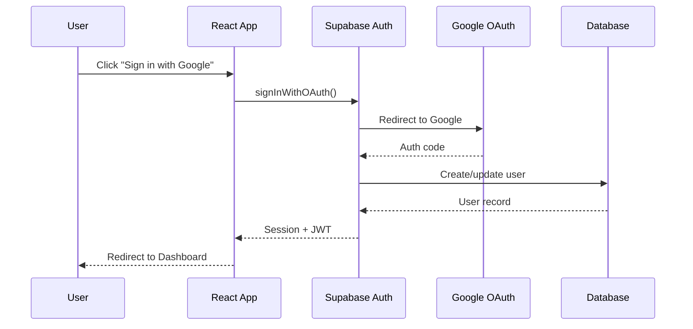

### AI Agent Pipeline

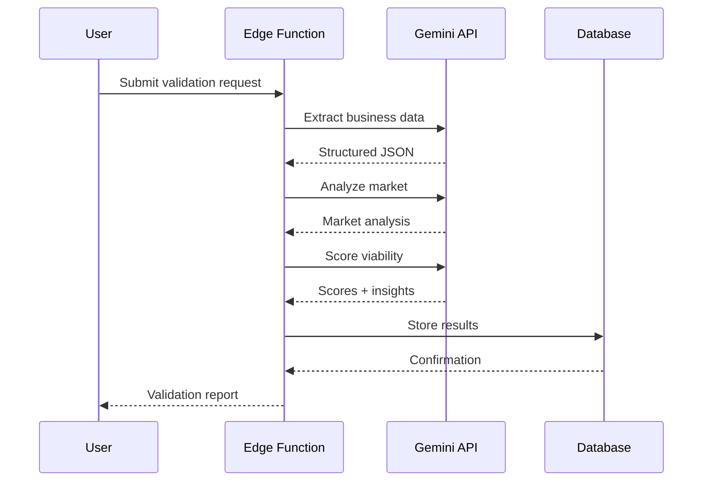

### Webhook Processing

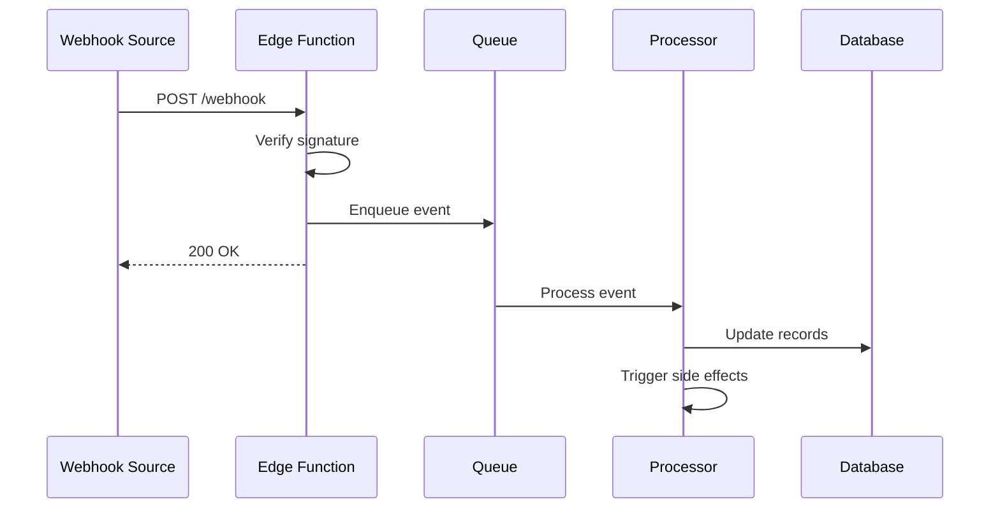

---

## State Diagrams

### Subscription Lifecycle

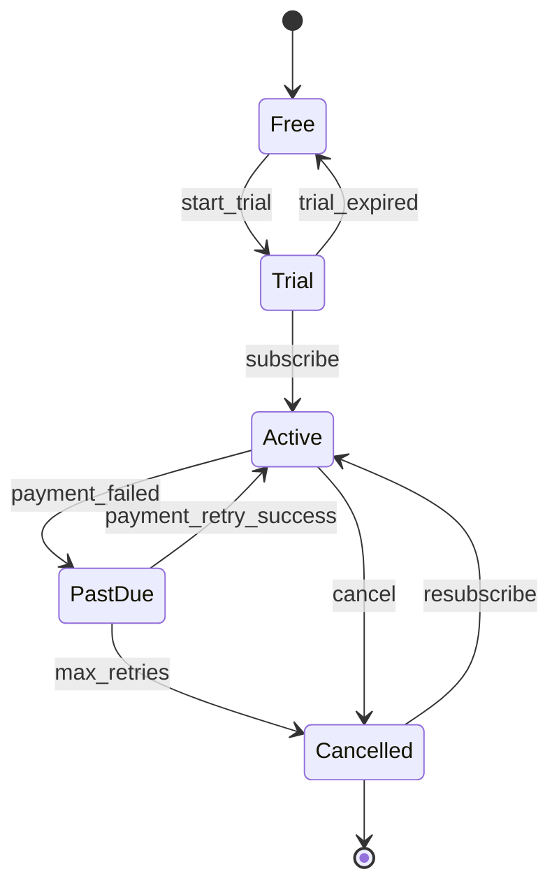

### Validation Pipeline States

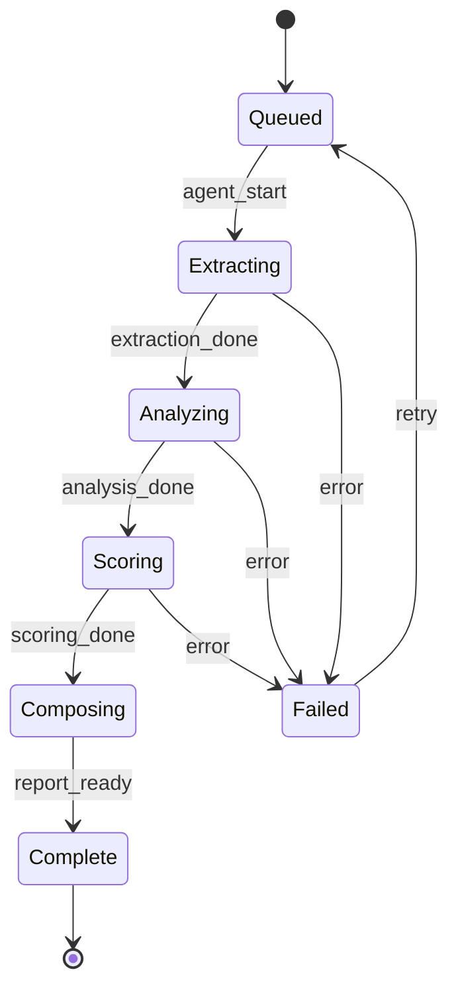

### Pull Request Lifecycle

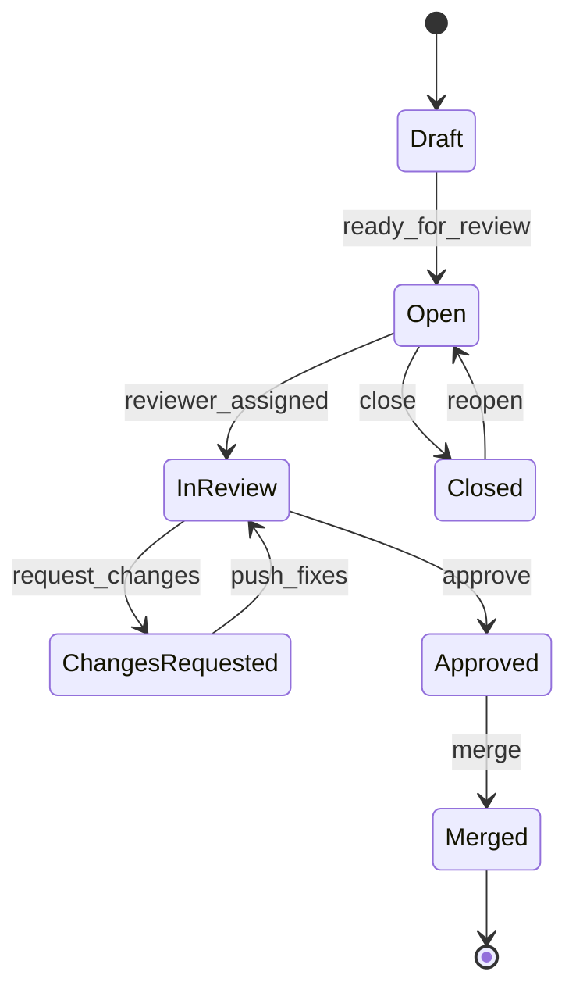

---

## Startup & Product Use Cases

### Lean Validation Process

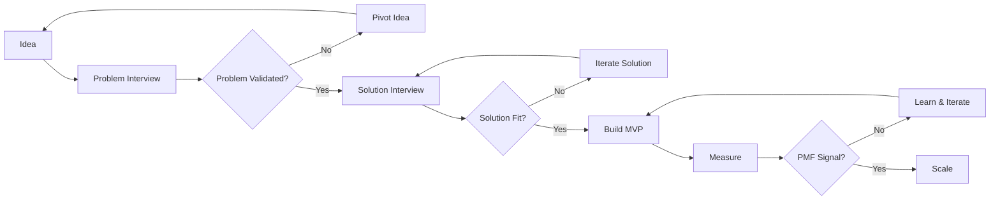

### Fundraising Pipeline

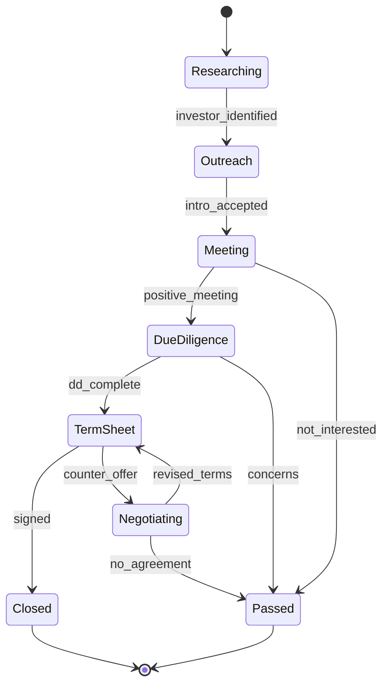

### Customer Journey Map

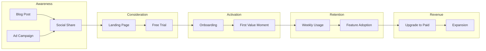

### Event Planning Timeline

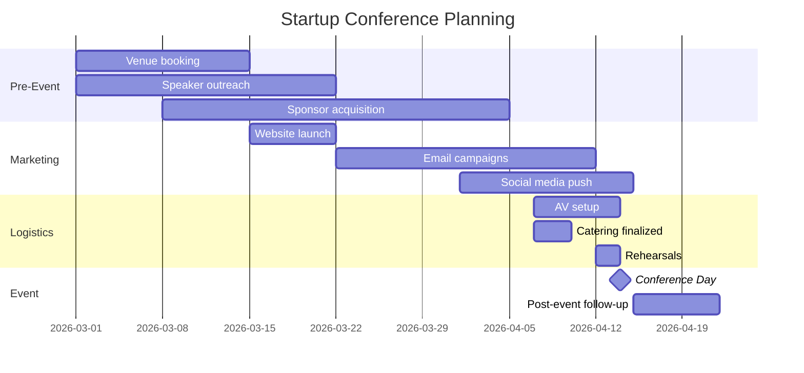
