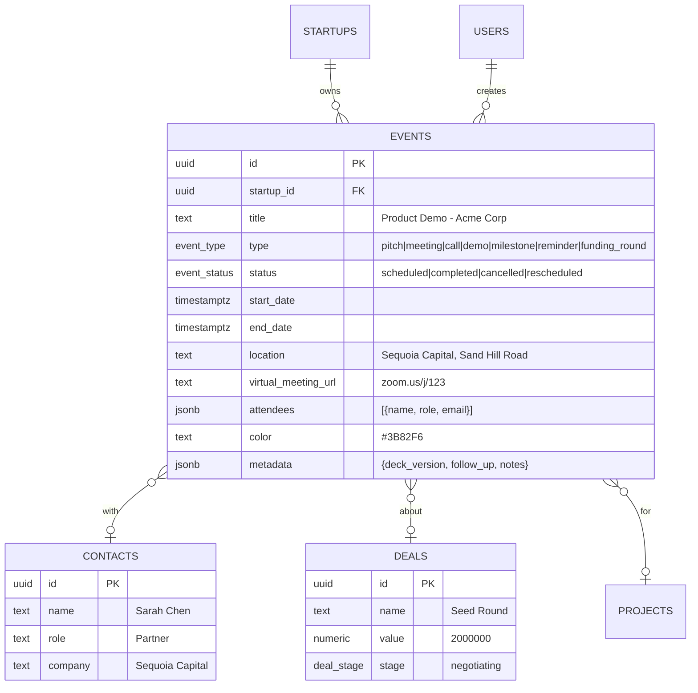
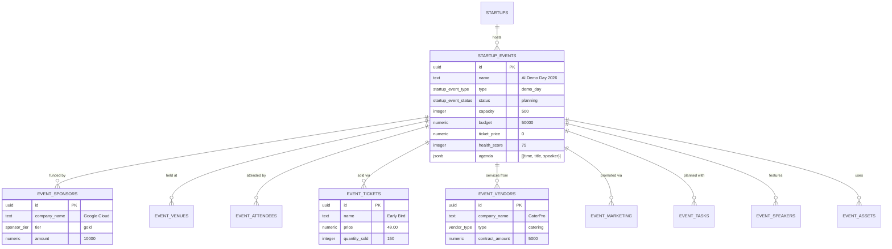
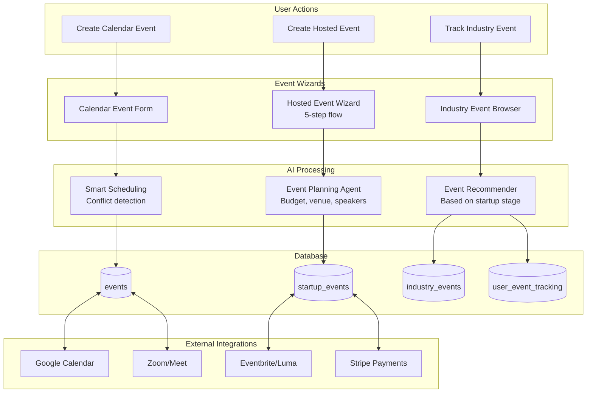
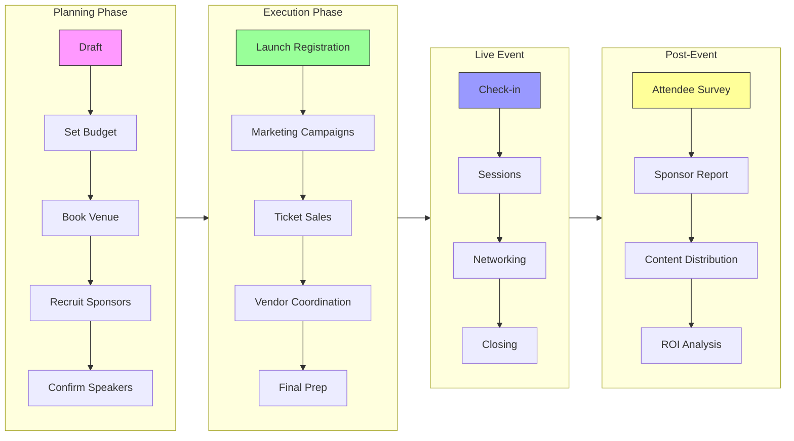
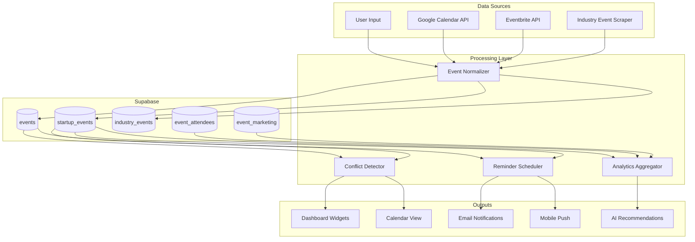
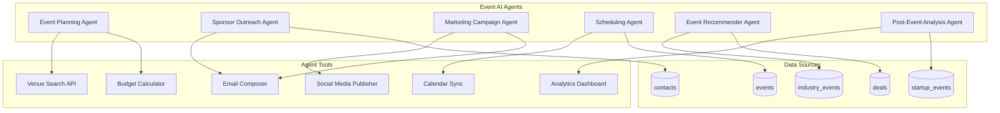
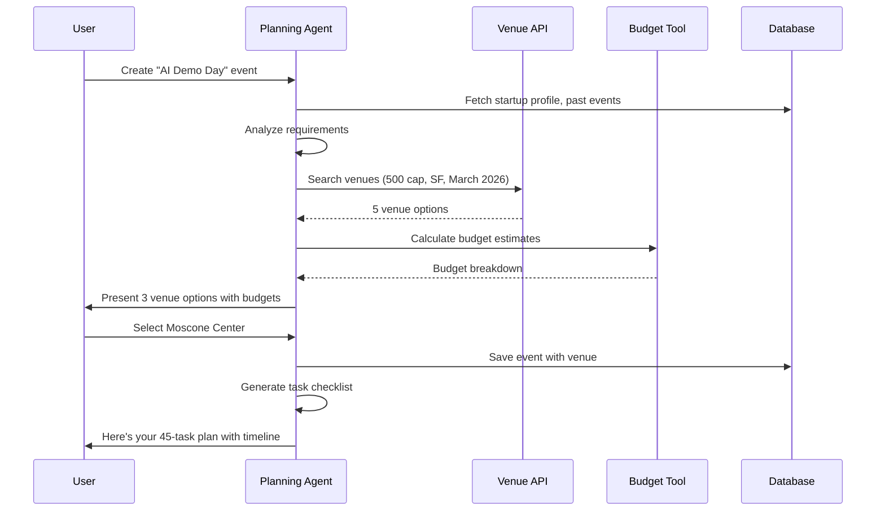
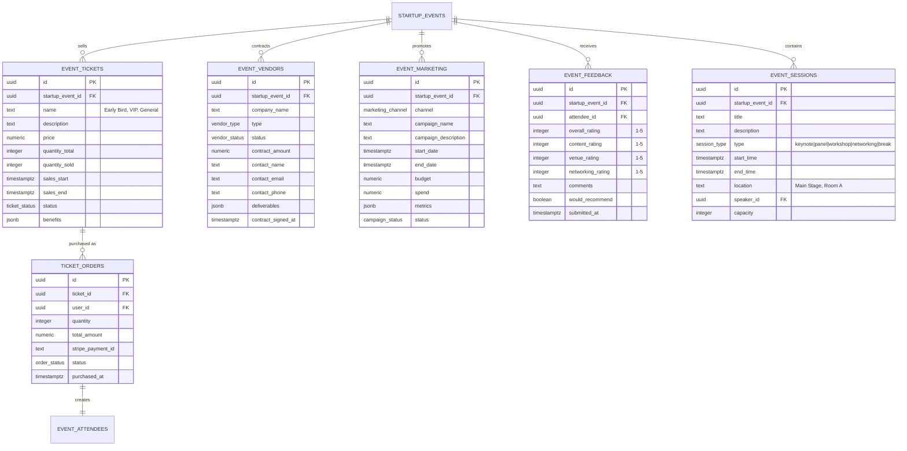

# Events System Architecture

> Comprehensive documentation of the StartupAI events ecosystem including ERD, dataflow, screens, wizards, and AI agents.

## System Overview

The events system consists of **three distinct domains**, each serving a different purpose for startup founders:

| Domain | Table | Purpose | Example |
|--------|-------|---------|---------|
| **Calendar** | `events` | CRM calendar activities | "Pitch to Sequoia at 2pm" |
| **Hosted** | `startup_events` | Events you organize | "Product Launch Demo Day" |
| **Industry** | `industry_events` | Conferences to attend | "NeurIPS 2026, Sydney" |

---

## 1. Entity Relationship Diagram (ERD)

### 1.1 Complete Events ERD

```mermaid
erDiagram
    %% Core Tables
    STARTUPS ||--o{ EVENTS : "has calendar"
    STARTUPS ||--o{ STARTUP_EVENTS : "hosts"
    USERS ||--o{ USER_EVENT_TRACKING : "tracks"

    %% Calendar Events (CRM)
    EVENTS ||--o| CONTACTS : "related to"
    EVENTS ||--o| DEALS : "related to"
    EVENTS ||--o| PROJECTS : "related to"

    %% Hosted Events
    STARTUP_EVENTS ||--o{ EVENT_SPONSORS : "has"
    STARTUP_EVENTS ||--o{ EVENT_VENUES : "at"
    STARTUP_EVENTS ||--o{ EVENT_ATTENDEES : "registers"
    STARTUP_EVENTS ||--o{ EVENT_ASSETS : "uses"
    STARTUP_EVENTS ||--o{ EVENT_SPEAKERS : "features"
    STARTUP_EVENTS ||--o{ EVENT_TICKETS : "sells"
    STARTUP_EVENTS ||--o{ EVENT_VENDORS : "contracts"
    STARTUP_EVENTS ||--o{ EVENT_MARKETING : "promotes"
    STARTUP_EVENTS ||--o{ EVENT_TASKS : "requires"

    %% Industry Events (Reference)
    INDUSTRY_EVENTS ||--o{ EVENT_SPEAKERS : "features"
    INDUSTRY_EVENTS ||--o{ USER_EVENT_TRACKING : "tracked by"

    %% Calendar Events Table
    EVENTS {
        uuid id PK
        uuid startup_id FK
        text title
        text description
        event_type type "meeting|call|pitch|demo|milestone|reminder|funding_round|other"
        event_status status "scheduled|completed|cancelled|rescheduled"
        timestamptz start_date
        timestamptz end_date
        boolean all_day
        text location
        text virtual_meeting_url
        jsonb attendees
        uuid related_contact_id FK
        uuid related_deal_id FK
        uuid related_project_id FK
        integer reminder_minutes
        text recurrence_rule
        text color
        jsonb metadata
    }

    %% Hosted Events Table
    STARTUP_EVENTS {
        uuid id PK
        uuid startup_id FK
        text name
        text slug UK
        text description
        startup_event_type type "conference|meetup|webinar|demo_day|workshop|hackathon|networking|launch|other"
        startup_event_status status "draft|planning|confirmed|live|completed|cancelled|postponed"
        timestamptz event_date
        timestamptz end_date
        event_location_type location_type "in_person|virtual|hybrid"
        integer capacity
        text registration_url
        numeric budget
        numeric ticket_price
        integer health_score
        jsonb agenda
    }

    %% Industry Events Table
    INDUSTRY_EVENTS {
        uuid id PK
        text name
        text slug UK
        text description
        event_category[] categories "research|industry|startup_vc|trade_show|enterprise|developer"
        date event_date
        date end_date
        text location_city
        text location_country
        event_format format "in_person|virtual|hybrid"
        ticket_cost_tier cost "free|$|$$|$$$|$$$$"
        integer startup_relevance "1-5"
        text website_url
    }

    %% Supporting Tables
    EVENT_SPONSORS {
        uuid id PK
        uuid startup_event_id FK
        text company_name
        sponsor_tier tier "title|gold|silver|bronze|partner"
        numeric amount
        sponsor_status status "prospect|negotiating|confirmed|paid"
        jsonb benefits
    }

    EVENT_VENUES {
        uuid id PK
        uuid startup_event_id FK
        text name
        text address
        integer capacity
        numeric cost_per_day
        boolean is_primary
        jsonb amenities
    }

    EVENT_ATTENDEES {
        uuid id PK
        uuid startup_event_id FK
        uuid user_id FK
        text name
        text email
        rsvp_status status "registered|confirmed|waitlisted|cancelled|attended"
        attendee_type type "general|vip|speaker|sponsor|staff"
        text ticket_type
        boolean checked_in
    }

    EVENT_TICKETS {
        uuid id PK
        uuid startup_event_id FK
        text name
        text description
        numeric price
        integer quantity_total
        integer quantity_sold
        timestamptz sales_start
        timestamptz sales_end
        ticket_status status "draft|on_sale|sold_out|closed"
        jsonb benefits
    }

    EVENT_VENDORS {
        uuid id PK
        uuid startup_event_id FK
        text company_name
        vendor_type type "catering|av_equipment|photography|security|decor|printing|other"
        vendor_status status "prospect|negotiating|contracted|paid|completed"
        numeric contract_amount
        text contact_name
        text contact_email
        jsonb deliverables
    }

    EVENT_MARKETING {
        uuid id PK
        uuid startup_event_id FK
        marketing_channel channel "email|social|paid_ads|pr|content|influencer|partner"
        text campaign_name
        timestamptz start_date
        timestamptz end_date
        numeric budget
        numeric spend
        jsonb metrics "impressions|clicks|conversions|registrations"
        campaign_status status "draft|scheduled|active|paused|completed"
    }

    EVENT_TASKS {
        uuid id PK
        uuid startup_event_id FK
        text title
        text description
        task_status status "pending|in_progress|completed|blocked"
        task_priority priority "low|medium|high|urgent"
        uuid assigned_to FK
        timestamptz due_date
        text category "venue|speakers|sponsors|marketing|logistics|content"
    }

    EVENT_SPEAKERS {
        uuid id PK
        uuid startup_event_id FK
        uuid industry_event_id FK
        text speaker_name
        text speaker_title
        text speaker_company
        text speaker_linkedin
        appearance_type type "keynote|panel|fireside|workshop|speaker"
        boolean is_confirmed
    }

    EVENT_ASSETS {
        uuid id PK
        uuid startup_event_id FK
        asset_type type "logo|banner|social_post|email_template|video|presentation|flyer"
        text name
        text file_url
        asset_status status "draft|review|approved|published"
        jsonb metadata
    }

    USER_EVENT_TRACKING {
        uuid id PK
        uuid user_id FK
        uuid industry_event_id FK
        tracking_status status "interested|registered|attending|attended|skipped"
        text notes
        date reminder_date
    }
```

### 1.2 Calendar Events (CRM) Domain



### 1.3 Hosted Events Domain



---

## 2. Dataflow Diagrams

### 2.1 Event Creation Dataflow



### 2.2 Hosted Event Lifecycle



### 2.3 Event Data Synchronization



---

## 3. Screens & User Interfaces

### 3.1 Screen Architecture

```mermaid
flowchart TB
    subgraph MainNav["Main Navigation"]
        N1["/app/events"]
        N2["/app/events/calendar"]
        N3["/app/events/industry"]
    end

    subgraph EventsHub["Events Hub /app/events"]
        H1[Events Dashboard]
        H2[My Hosted Events List]
        H3[Quick Stats Cards]
        H4[AI Panel]
    end

    subgraph Calendar["Calendar /app/events/calendar"]
        C1[Month/Week/Day Views]
        C2[CRM Events]
        C3[Quick Add Modal]
        C4[Event Detail Drawer]
    end

    subgraph Industry["Industry /app/events/industry"]
        I1[Conference Browser]
        I2[Filter by Category/Date/Location]
        I3[Track/Register CTAs]
        I4[Speaker Highlights]
    end

    subgraph Detail["Event Detail Pages"]
        D1[/app/events/:id<br/>Hosted Event Dashboard]
        D2[Event Overview Tab]
        D3[Attendees Tab]
        D4[Sponsors Tab]
        D5[Marketing Tab]
        D6[Tasks Tab]
        D7[Analytics Tab]
    end

    subgraph Wizards["Wizards"]
        W1[/app/events/new<br/>Create Hosted Event]
        W2[Calendar Event Modal]
    end

    N1 --> H1
    N2 --> C1
    N3 --> I1

    H2 --> D1
    D1 --> D2 & D3 & D4 & D5 & D6 & D7

    H1 --> W1
    C1 --> W2
```

### 3.2 Hosted Event Dashboard Wireframe

```
┌─────────────────────────────────────────────────────────────────────────────┐
│ ← Back to Events          AI Demo Day 2026                    Edit | Share  │
├─────────────────────────────────────────────────────────────────────────────┤
│                                                                             │
│  ┌──────────────┐  ┌──────────────┐  ┌──────────────┐  ┌──────────────┐    │
│  │   Status     │  │  Attendees   │  │   Sponsors   │  │   Budget     │    │
│  │  PLANNING    │  │   234/500    │  │    $45K      │  │   $12K left  │    │
│  │  ●●●○○ 60%   │  │   +12 today  │  │   3 of 5     │  │   of $50K    │    │
│  └──────────────┘  └──────────────┘  └──────────────┘  └──────────────┘    │
│                                                                             │
│  ┌─────────────────────────────────────────────────────────────────────┐   │
│  │ Tabs: Overview | Attendees | Sponsors | Speakers | Marketing | Tasks│   │
│  ├─────────────────────────────────────────────────────────────────────┤   │
│  │                                                                     │   │
│  │  📍 Venue: The Moscone Center, San Francisco                       │   │
│  │  📅 Date: March 15, 2026 • 9:00 AM - 6:00 PM PST                   │   │
│  │  🎫 Registration: Open • Early Bird ends Feb 1                      │   │
│  │                                                                     │   │
│  │  ──────────────────────────────────────────────────────────────    │   │
│  │                                                                     │   │
│  │  Agenda                                          [+ Add Session]    │   │
│  │  ┌─────────────────────────────────────────────────────────────┐   │   │
│  │  │ 9:00  │ Registration & Networking                           │   │   │
│  │  │ 10:00 │ Keynote: The Future of AI - Sam Altman             │   │   │
│  │  │ 11:30 │ Panel: Building AI Products - 4 speakers           │   │   │
│  │  │ 12:30 │ Lunch Break (Sponsored by Google Cloud)            │   │   │
│  │  │ 14:00 │ Demo Sessions: 10 Startups                         │   │   │
│  │  │ 16:00 │ Networking & Closing                               │   │   │
│  │  └─────────────────────────────────────────────────────────────┘   │   │
│  │                                                                     │   │
│  └─────────────────────────────────────────────────────────────────────┘   │
│                                                                             │
├─────────────────────────────────────────────────────────────────────────────┤
│  AI Assistant                                                      [Expand] │
│  ┌─────────────────────────────────────────────────────────────────────┐   │
│  │ 💡 Suggested Actions:                                               │   │
│  │ • Send reminder to 45 unconfirmed attendees                        │   │
│  │ • Follow up with 2 sponsor prospects                               │   │
│  │ • 3 tasks overdue - venue contract, speaker bios, catering menu   │   │
│  └─────────────────────────────────────────────────────────────────────┘   │
└─────────────────────────────────────────────────────────────────────────────┘
```

### 3.3 Industry Events Browser Wireframe

```
┌─────────────────────────────────────────────────────────────────────────────┐
│ Industry Events                                    🔍 Search conferences... │
├─────────────────────────────────────────────────────────────────────────────┤
│                                                                             │
│  Filters: [All Categories ▼] [2026 ▼] [All Locations ▼] [Relevance: 4+ ▼]  │
│                                                                             │
│  ┌────────────────────────────────────┐  ┌────────────────────────────────┐ │
│  │ 🏆 NeurIPS 2026                    │  │ 🚀 TechCrunch Disrupt 2026    │ │
│  │ Dec 8-14 • Sydney, Australia       │  │ Oct 13-15 • San Francisco     │ │
│  │                                    │  │                                │ │
│  │ Categories: Research               │  │ Categories: Startup/VC        │ │
│  │ Topics: ML, Deep Learning, LLMs    │  │ Topics: Startups, Funding     │ │
│  │ Startup Relevance: ★★★☆☆          │  │ Startup Relevance: ★★★★★      │ │
│  │ Cost: $$$ ($1,500-2,500)           │  │ Cost: $$$$ ($2,000-5,000)     │ │
│  │                                    │  │                                │ │
│  │ Notable: Y. Bengio, D. Hassabis    │  │ Notable: M. Arrington         │ │
│  │                                    │  │                                │ │
│  │ [Track] [Register →]               │  │ [Track] [Register →]          │ │
│  └────────────────────────────────────┘  └────────────────────────────────┘ │
│                                                                             │
│  ┌────────────────────────────────────┐  ┌────────────────────────────────┐ │
│  │ 💼 NVIDIA GTC 2026                 │  │ 🌐 Web Summit 2026            │ │
│  │ Mar 16-19 • San Jose, CA           │  │ Nov 9-12 • Lisbon, Portugal   │ │
│  │                                    │  │                                │ │
│  │ Categories: Industry               │  │ Categories: Industry          │ │
│  │ Topics: GPU, AI Infra, CUDA        │  │ Topics: Tech, Startups        │ │
│  │ Startup Relevance: ★★★★☆          │  │ Startup Relevance: ★★★★★      │ │
│  │ Cost: Free-$$                      │  │ Cost: $$ ($850-2,500)         │ │
│  │                                    │  │                                │ │
│  │ [✓ Tracking] [Register →]          │  │ [Track] [Register →]          │ │
│  └────────────────────────────────────┘  └────────────────────────────────┘ │
│                                                                             │
└─────────────────────────────────────────────────────────────────────────────┘
```

---

## 4. Wizard Flows

### 4.1 Hosted Event Creation Wizard (5 Steps)

```mermaid
flowchart LR
    subgraph Step1["Step 1: Basics"]
        S1A[Event Name]
        S1B[Event Type]
        S1C[Description]
        S1D[Date & Time]
        S1E[Location Type]
    end

    subgraph Step2["Step 2: Venue"]
        S2A[Search Venues]
        S2B[AI Suggestions]
        S2C[Capacity]
        S2D[Budget Estimate]
        S2E[Amenities Checklist]
    end

    subgraph Step3["Step 3: Sponsors"]
        S3A[Target Amount]
        S3B[Sponsor Tiers]
        S3C[Benefits per Tier]
        S3D[Prospect List]
        S3E[AI Outreach Drafts]
    end

    subgraph Step4["Step 4: Marketing"]
        S4A[Registration Page]
        S4B[Ticket Types]
        S4C[Promo Codes]
        S4D[Email Campaigns]
        S4E[Social Assets]
    end

    subgraph Step5["Step 5: Review"]
        S5A[Summary]
        S5B[Budget Breakdown]
        S5C[Timeline]
        S5D[Task Checklist]
        S5E[Publish / Save Draft]
    end

    Step1 --> Step2 --> Step3 --> Step4 --> Step5
```



### 4.2 Calendar Event Quick-Add Modal

```mermaid
flowchart TB
    subgraph Modal["Quick Add Event"]
        M1[Title Input]
        M2[Type Selector<br/>Meeting|Call|Pitch|Demo]
        M3[Date/Time Picker]
        M4[Duration Preset<br/>15m|30m|1h|Custom]
        M5[Location/Virtual URL]
        M6[Link to Contact/Deal]
        M7[AI: Suggest Time Slots]
    end

    M1 --> M2 --> M3 --> M4 --> M5 --> M6
    M3 -.-> M7
    M7 -.-> M3
```

---

## 5. AI Agents

### 5.1 Agent Architecture



### 5.2 Agent Descriptions

| Agent | Purpose | Triggers | Outputs |
|-------|---------|----------|---------|
| **Event Planning Agent** | Helps plan hosted events end-to-end | User creates new event | Venue suggestions, budget breakdown, timeline, task list |
| **Sponsor Outreach Agent** | Identifies and contacts potential sponsors | Event created with sponsor goals | Prospect list, personalized emails, follow-up reminders |
| **Marketing Campaign Agent** | Creates and optimizes marketing campaigns | Registration opens | Email sequences, social posts, ad copy, landing page copy |
| **Scheduling Agent** | Finds optimal meeting times, detects conflicts | User adds calendar event | Suggested time slots, conflict alerts, attendee availability |
| **Event Recommender Agent** | Suggests industry events to attend | Weekly digest, user profile changes | Personalized event list based on stage, industry, goals |
| **Post-Event Analysis Agent** | Analyzes event success and ROI | Event status → completed | Attendee feedback summary, sponsor ROI, recommendations |

### 5.3 Event Planning Agent Flow



---

## 6. Feature Recommendations

### 6.1 New Tables to Add



### 6.2 Feature Priority Matrix

| Feature | Impact | Effort | Priority |
|---------|--------|--------|----------|
| **Ticketing System** | High | Medium | P1 |
| **Vendor Management** | Medium | Low | P1 |
| **Marketing Campaigns** | High | High | P1 |
| **Session/Agenda Builder** | High | Medium | P1 |
| **Attendee Check-in App** | Medium | Medium | P2 |
| **Sponsor Portal** | Medium | High | P2 |
| **Post-Event Feedback** | Medium | Low | P2 |
| **Live Polling/Q&A** | Low | Medium | P3 |
| **Virtual Event Platform** | Medium | High | P3 |
| **Mobile Event App** | Low | High | P3 |

### 6.3 Integration Recommendations

| Category | Service | Purpose |
|----------|---------|---------|
| **Ticketing** | Stripe | Payment processing |
| **Ticketing** | Eventbrite / Luma | Registration & ticketing |
| **Calendar** | Google Calendar | Sync CRM events |
| **Calendar** | Cal.com | Scheduling meetings |
| **Video** | Zoom / Google Meet | Virtual events |
| **Email** | SendGrid / Resend | Marketing campaigns |
| **Analytics** | Mixpanel | Event engagement tracking |
| **Venues** | Peerspace API | Venue discovery |
| **Check-in** | QR code scanner | Attendee check-in |

---

## 7. Migration Plan

### 7.1 Phase 1: Core Tables (Now)
- [x] `industry_events` - Reference data for conferences
- [x] `event_speakers` - Speaker appearances
- [x] `user_event_tracking` - User tracking of industry events

### 7.2 Phase 2: Ticketing & Vendors (Next)
- [ ] `event_tickets` - Ticket types and pricing
- [ ] `ticket_orders` - Purchase records
- [ ] `event_vendors` - Vendor contracts

### 7.3 Phase 3: Marketing & Sessions
- [ ] `event_marketing` - Campaign tracking
- [ ] `event_sessions` - Agenda/session management
- [ ] `event_feedback` - Post-event surveys

### 7.4 Phase 4: Integrations
- [ ] Stripe webhook handlers
- [ ] Google Calendar sync
- [ ] Email campaign automation
- [ ] Check-in mobile app

---

## 8. Summary

The events system serves three distinct user needs:

1. **Calendar Events** (`events`) - Day-to-day CRM activities: investor pitches, customer demos, team meetings
2. **Hosted Events** (`startup_events`) - Events the startup organizes: demo days, launches, conferences
3. **Industry Events** (`industry_events`) - External conferences to attend: NeurIPS, TechCrunch Disrupt

Each domain has specialized supporting tables, dedicated screens, and AI agents to help founders manage their event-related activities efficiently.

**Key Recommendations:**
- Rename `events` → `calendar_events` for clarity
- Add ticketing, vendor, and marketing tables for hosted events
- Build dedicated AI agents for each event domain
- Integrate with Stripe, Eventbrite, and Google Calendar
