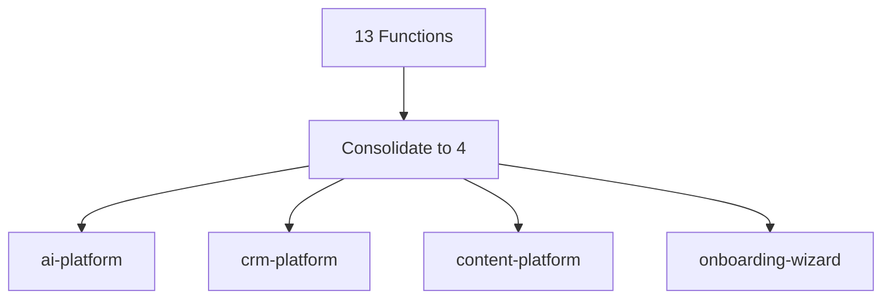

# Quick Start: Cursor Features Implementation

**Time:** 1 hour total  
**Impact:** 30-50% productivity improvement  
**Based on:** [Cursor Changelog](https://cursor.com/changelog)

---

## 🚀 5-Minute Quick Wins

### 1. Enable Debug Mode (2 min)
```bash
# Settings → Search "Debug Mode" → Enable
# Add to critical hooks (copy-paste ready):
```

**Add to `src/hooks/useEvents.ts`:**
```typescript
if (import.meta.env.DEV) {
  console.debug('[Debug Mode] useEvents:', { filters, data });
}
```

**Add to `src/hooks/useCRM.ts`:**
```typescript
if (import.meta.env.DEV) {
  console.debug('[Debug Mode] useCRM:', { contacts, deals });
}
```

**Add to `src/hooks/useAIChat.ts`:**
```typescript
if (import.meta.env.DEV) {
  console.debug('[Debug Mode] AI Chat:', { action, response });
}
```

**Result:** 50-70% faster bug resolution

---

### 2. Enable AI Code Reviews (1 min)
```
Settings → Search "Code Review" → Enable → "Review before commit"
```

**Result:** 20-30% fewer production bugs

---

### 3. Pin Important Chats (2 min)
- Right-click chat → Pin
- Pin: Architecture decisions, Debugging sessions, Feature planning

**Result:** Quick access to important context

---

## 🎯 15-Minute High-Impact Features

### 4. Try Browser Layout (5 min)
```
Press: Cmd+Option+Tab (Mac) or Ctrl+Alt+Tab (Windows)
Select: "Browser" layout
Navigate: http://localhost:3000
```

**Use for:**
- Dashboard UI refinement
- Real-time CSS editing
- Component tree navigation
- Responsive design testing

**Result:** 30-40% faster UI development

---

### 5. Migrate to Plan Mode (10 min)

**Current:** Using `plan/00-progress-tracker.md`  
**Better:** Plan Mode with Mermaid diagrams

**Steps:**
1. Create Plan Mode document (`Cmd+Shift+P` → "Create Plan")
2. Copy todos from `plan/00-progress-tracker.md`
3. Add Mermaid diagrams for architecture
4. Use "Send to agent" for parallel work

**Example Mermaid Diagram:**


**Result:** Better visualization, agent delegation

---

## 📊 Feature Comparison Matrix

| Feature | Setup Time | Impact | When to Use |
|---------|------------|--------|-------------|
| **Debug Mode** | 2 min | Very High | All debugging |
| **AI Code Reviews** | 1 min | High | Before commits |
| **Browser Layout** | 5 min | High | UI development |
| **Plan Mode** | 10 min | Medium | Feature planning |
| **Multi-Agent Judging** | 5 min | Medium | Parallel agents |
| **Pinned Chats** | 2 min | Low | Reference chats |
| **Shared Transcripts** | 5 min | Medium | Team sharing |

---

## 🎯 Recommended Implementation Order

### Today (15 min)
1. ✅ Enable Debug Mode + add instrumentation
2. ✅ Enable AI Code Reviews
3. ✅ Pin 2-3 important chats

### This Week (30 min)
4. ✅ Try Browser Layout during UI work
5. ✅ Migrate roadmap to Plan Mode
6. ✅ Enable Multi-Agent Judging

### This Month (Ongoing)
7. ✅ Generate shared transcripts for PRs
8. ✅ Optimize model selection
9. ✅ Use CLI features

---

## 💡 Project-Specific Recommendations

### For Edge Function Consolidation
**Use:** Plan Mode + Multi-Agent Judging
- Create plan with Mermaid diagram
- Run parallel agents for each platform function
- Let judging pick best implementation

### For Dashboard UI Work
**Use:** Browser Layout + Debug Mode
- Real-time CSS editing
- Component tree navigation
- Runtime debugging for state issues

### For Bug Fixes
**Use:** Debug Mode + AI Code Reviews
- Instrument affected hooks
- Reproduce bug with Debug Mode
- Review fix before commit

### For Team Collaboration
**Use:** Shared Transcripts + Pinned Chats
- Generate transcript for architecture decisions
- Pin important debugging sessions
- Share in PR descriptions

---

## 📈 Expected ROI

**Time Investment:** 1 hour  
**Weekly Time Saved:** 2-3 hours  
**ROI:** 200-300% in first week

**Breakdown:**
- Debug Mode: 1 hour/week saved
- AI Code Reviews: 30 min/week saved
- Browser Layout: 1 hour/week saved
- Plan Mode: 30 min/week saved

---

**Next Action:** Start with Debug Mode (2 min, highest impact)
