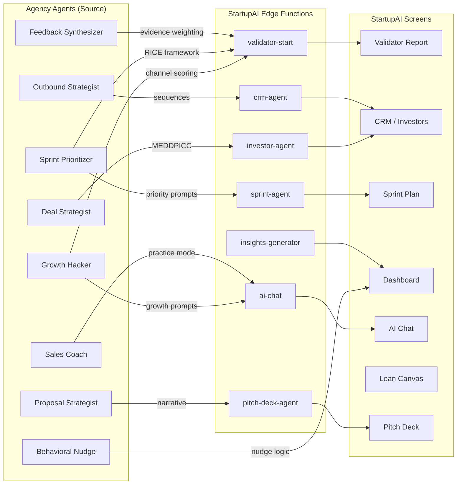
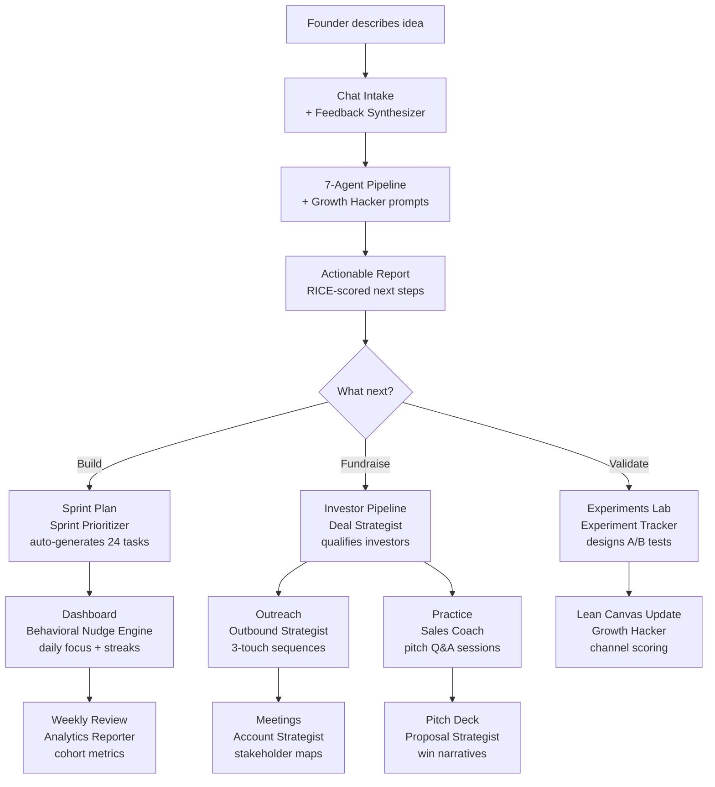
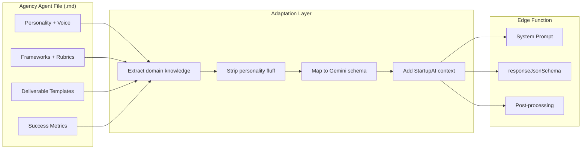

# Agency Agents x StartupAI Integration Plan

> **Source:** [github.com/msitarzewski/agency-agents](https://github.com/msitarzewski/agency-agents) (MIT, 132+ agents, 12 divisions)
> **Target:** StartupAI — AI-powered OS for founders (React + Supabase + Gemini/Claude)
> **Created:** 2026-03-12

---

## Executive Summary

The Agency repo provides 132+ specialized AI agent personas across 12 divisions. StartupAI can adopt **28 agents** across 7 use cases to enhance the validator pipeline, dashboard intelligence, CRM, pitch deck, sprint planning, and AI chat — without building from scratch.

**Integration method:** Copy agent `.md` files into `.claude/agents/` for dev workflow + adapt key agent prompts into edge function system instructions for production AI features.

---

## 1. Agent Selection Matrix

### Tier 1 — Direct Integration (Copy + Use Now)

| # | Agency Agent | Division | StartupAI Module | Use Case | Priority |
|---|-------------|----------|-----------------|----------|----------|
| 1 | **Growth Hacker** | Marketing | Dashboard, Validator | Post-validation growth strategy in report Section 14 (Next Steps) | P0 |
| 2 | **Feedback Synthesizer** | Product | Validator, AI Chat | Synthesize user interview data into validator insights | P0 |
| 3 | **Sprint Prioritizer** | Product | Sprint Plan | AI-generated sprint backlog from validator report actions | P0 |
| 4 | **Deal Strategist** | Sales | CRM, Investors | MEDDPICC deal scoring for investor pipeline | P1 |
| 5 | **Proposal Strategist** | Sales | Pitch Deck | Win narrative structure for AI-generated pitch decks | P1 |
| 6 | **Trend Researcher** | Product | Market Research | TAM/SAM/SOM validation with trend analysis | P1 |
| 7 | **Outbound Strategist** | Sales | CRM, Investors | Investor outreach sequence generation | P1 |
| 8 | **Behavioral Nudge Engine** | Product | Onboarding, Dashboard | Wizard completion nudges, daily engagement hooks | P2 |
| 9 | **Account Strategist** | Sales | Investors | Post-meeting follow-up strategy, QBR prep | P2 |
| 10 | **Sales Coach** | Sales | AI Chat | Pitch practice Q&A with investor objection handling | P2 |

### Tier 2 — Dev Workflow Enhancement (`.claude/agents/`)

| # | Agency Agent | Division | Dev Use Case | Replaces/Enhances |
|---|-------------|----------|-------------|-------------------|
| 11 | **Frontend Developer** | Engineering | React/Tailwind/shadcn implementation | Enhances existing `frontend-designer.md` |
| 12 | **Backend Architect** | Engineering | Supabase schema, edge function design | Enhances existing `supabase-expert.md` |
| 13 | **Database Optimizer** | Engineering | PostgreSQL query tuning, index strategy | New — RLS + pgvector optimization |
| 14 | **Security Engineer** | Engineering | RLS audit, JWT verification, OWASP | Enhances existing `security-auditor.md` |
| 15 | **Code Reviewer** | Engineering | PR reviews, code quality gates | Enhances existing `code-reviewer.md` |
| 16 | **AI Engineer** | Engineering | Gemini/Claude integration patterns | Enhances existing `ai-agent-dev.md` |
| 17 | **Software Architect** | Engineering | System design, domain modeling | New — architecture decisions |
| 18 | **API Tester** | Testing | Edge function testing, integration QA | New — 31 edge functions need coverage |
| 19 | **Performance Benchmarker** | Testing | Lighthouse, bundle analysis, load testing | New — production readiness |
| 20 | **Reality Checker** | Testing | Pre-launch quality gates | New — release certification |

### Tier 3 — Future Features

| # | Agency Agent | Division | Future Module | When |
|---|-------------|----------|--------------|------|
| 21 | **Experiment Tracker** | PM | Experiments Lab | Phase 2 |
| 22 | **Analytics Reporter** | Support | Outcomes Dashboard | Phase 2 |
| 23 | **Executive Summary Generator** | Support | Share Links, PDF export | Phase 2 |
| 24 | **Brand Guardian** | Design | Design system consistency | Phase 2 |
| 25 | **SEO Specialist** | Marketing | Blog, public pages | Phase 2 |
| 26 | **LinkedIn Content Creator** | Marketing | Founder content from report data | Phase 3 |
| 27 | **Whimsy Injector** | Design | Micro-interactions, delight moments | Phase 3 |
| 28 | **MCP Builder** | Specialized | Custom MCP servers for AI chat | Phase 3 |

---

## 2. Real-World Use Cases

### UC-1: Sarah Validates Her B2B SaaS Idea (Enhanced Pipeline)

**Current flow:** Idea -> 7-agent pipeline -> 14-section report -> Lean Canvas
**Enhanced with Agency agents:**

| Step | Current Agent | + Agency Agent | Enhancement |
|------|-------------|---------------|-------------|
| Report Section 8 (Revenue) | Composer Group C | **Growth Hacker** prompts | Viral coefficient, CAC payback, channel-market fit |
| Report Section 12 (Next Steps) | Composer Group D | **Sprint Prioritizer** framework | RICE-scored actions, dependency-mapped 90-day plan |
| Report Section 10 (Risks) | Scoring Agent | **Feedback Synthesizer** patterns | Evidence-weighted risk signals, assumption hierarchy |
| Post-report CRM | Manual investor add | **Outbound Strategist** sequences | Auto-generated outreach templates per investor type |
| Pitch deck generation | `pitch-deck-agent` | **Proposal Strategist** narrative | Win theme structure, objection pre-handling |

**Outcome:** Report goes from "information dump" to "actionable playbook" — founder knows exactly what to do Monday morning.

---

### UC-2: Marcus Prepares $1.5M Pre-Seed Raise (Fundraising)

| Journey Step | Agency Agent | Deliverable |
|-------------|-------------|-------------|
| Investor discovery | **Trend Researcher** | Market timing analysis, "why now" narrative |
| Investor qualification | **Deal Strategist** | MEDDPICC scorecard per investor, red flag detection |
| Outreach drafting | **Outbound Strategist** | 3-touch sequence (cold/warm/follow-up) per investor |
| Meeting prep | **Sales Coach** | Objection bank from validator weaknesses, practice Q&A |
| Term sheet review | **Deal Strategist** | Term comparison matrix, negotiation priorities |
| Follow-up strategy | **Account Strategist** | Stakeholder map, expansion signals, QBR structure |

**Outcome:** CRM becomes an intelligent fundraising command center, not just a contact list.

---

### UC-3: TechBoost Accelerator Onboards 20 Startups (Batch)

| Phase | Agency Agent | Enhancement |
|-------|-------------|-------------|
| Wizard completion | **Behavioral Nudge Engine** | Progress psychology, loss aversion framing, streak mechanics |
| Portfolio comparison | **Analytics Reporter** | Cohort benchmarks, dimension radar overlays |
| Weekly check-ins | **Feedback Synthesizer** | Automated insight extraction from founder updates |
| Demo day prep | **Proposal Strategist** | Pitch narrative framework, investor audience targeting |
| Sprint planning | **Sprint Prioritizer** | Cross-startup dependency detection, shared resource allocation |

---

### UC-4: Daily Dashboard Intelligence (Command Centre)

| Dashboard Widget | Agency Agent | Intelligence Layer |
|-----------------|-------------|-------------------|
| Health Score | **Behavioral Nudge Engine** | Score drop triggers micro-interventions |
| Today's Focus | **Sprint Prioritizer** | RICE-scored daily actions from sprint backlog |
| Top Risks | **Feedback Synthesizer** | Evidence-weighted risk signals with citation |
| Fundraising Readiness | **Deal Strategist** | Investor-readiness gaps with fix sequences |
| AI Coach Panel | **Sales Coach** + **Growth Hacker** | Context-aware coaching based on startup stage |

---

### UC-5: Lean Canvas AI Coach (Enhanced)

| Canvas Box | Agency Agent | Enhancement |
|-----------|-------------|-------------|
| Problem | **Feedback Synthesizer** | Interview pattern extraction, pain severity scoring |
| Customer Segments | **Trend Researcher** | Persona enrichment with market data |
| Unique Value Prop | **Proposal Strategist** | Positioning statement framework |
| Channels | **Growth Hacker** | Channel-market fit scoring, viral loop design |
| Revenue Streams | **Growth Hacker** | Unit economics benchmarks, pricing strategy |
| Cost Structure | **Analytics Reporter** | Burn rate benchmarks by stage and industry |
| Key Metrics | **Sprint Prioritizer** | North Star metric selection, leading indicators |
| Unfair Advantage | **Deal Strategist** | Moat assessment framework |

---

## 3. Screen-by-Screen Enhancement Map

| # | Screen | Current State | Agency Agent(s) | New Capability | Effort |
|---|--------|--------------|-----------------|----------------|--------|
| 01 | Chat Intake | 8-topic coverage | Feedback Synthesizer | Structured interview extraction, signal hierarchy | S |
| 02 | Startup Profile | URL extraction | Trend Researcher | Auto-enriched market context from web signals | M |
| 03 | Validator Report | 14 sections | Growth Hacker, Sprint Prioritizer | Actionable playbook sections, RICE-scored next steps | L |
| 04 | Lean Canvas | AI coach + prefill | Proposal Strategist, Growth Hacker | Positioning framework, channel scoring | M |
| 05 | Sprint Plan | Basic kanban | Sprint Prioritizer | RICE/MoSCoW scoring, dependency mapping, capacity planning | L |
| 06 | Dashboard | Health score, focus | Behavioral Nudge Engine | Micro-interventions, streak mechanics, smart alerts | M |
| 07 | Experiments Lab | CRUD + agent | Experiment Tracker | Hypothesis quality scoring, A/B test design, significance calc | M |
| 08 | Market Research | 50% built | Trend Researcher | Automated trend synthesis, competitor monitoring | L |
| 09 | CRM | Contacts + deals | Deal Strategist, Outbound Strategist | MEDDPICC scoring, outreach sequences | M |
| 10 | Investors | 12-action agent | Deal Strategist, Account Strategist | Qualification scorecards, post-meeting strategy | M |
| 11 | Pitch Deck | AI generation | Proposal Strategist | Win narrative structure, audience-specific framing | S |
| 12 | AI Chat | Claude/Gemini | Sales Coach, Growth Hacker | Stage-aware coaching, practice sessions | M |
| 13 | Documents | CRUD + AI | Executive Summary Generator | Auto-generated summaries, report compilation | S |
| 14 | Events | 85% built | — | No change needed | — |
| 15 | Analytics | 80% built | Analytics Reporter | Cohort analysis, funnel visualization | M |

**Effort:** S = 1-2 days, M = 3-5 days, L = 1-2 weeks

---

## 4. User Journey Enhancements

### Journey 1: Idea to Validated Strategy (Primary)

```
CURRENT:  Idea → Chat → Pipeline → Report → Canvas
ENHANCED: Idea → Chat → Pipeline → Actionable Report → Auto-Sprint → Dashboard Nudges
                 ↑                    ↑                    ↑              ↑
           Feedback           Growth Hacker         Sprint          Behavioral
           Synthesizer        + Proposal Strat.     Prioritizer     Nudge Engine
```

### Journey 2: Report to Fundraising (New)

```
Report Complete → Investor Readiness Check → Investor Discovery → Outreach → Meetings → Terms
                        ↑                          ↑                  ↑          ↑         ↑
                  Deal Strategist          Trend Researcher    Outbound     Sales      Deal
                  (gap analysis)           (market timing)     Strategist   Coach      Strategist
```

### Journey 3: Weekly Execution Loop (Enhanced)

```
Monday: Dashboard → Focus Tasks → Sprint Board
         ↑              ↑             ↑
   Behavioral      Sprint         Sprint
   Nudge Engine    Prioritizer    Prioritizer

Wednesday: Experiments → Evidence → Canvas Update
               ↑            ↑           ↑
         Experiment    Feedback     Growth
         Tracker       Synthesizer  Hacker

Friday: Review → Metrics → Next Week Plan
          ↑          ↑           ↑
    Analytics    Executive    Sprint
    Reporter     Summary Gen  Prioritizer
```

---

## 5. User Stories (New)

| ID | Story | Agency Agent | Acceptance Criteria |
|----|-------|-------------|---------------------|
| US-A1 | As a founder, I want RICE-scored next steps so I know exactly what to do first | Sprint Prioritizer | Report next_steps include reach/impact/confidence/effort scores |
| US-A2 | As a founder, I want investor outreach templates so I don't start from scratch | Outbound Strategist | CRM generates 3-touch sequence per investor profile |
| US-A3 | As a founder, I want deal qualification scores so I focus on winnable investors | Deal Strategist | Each deal shows MEDDPICC score with gap indicators |
| US-A4 | As a founder, I want growth channel recommendations so I pick the right acquisition path | Growth Hacker | Report section includes channel-market fit matrix |
| US-A5 | As a founder, I want pitch practice Q&A so I'm prepared for investor meetings | Sales Coach | AI Chat mode with objection bank from validator weaknesses |
| US-A6 | As a founder, I want daily nudges so I stay on track with my sprint plan | Behavioral Nudge Engine | Dashboard shows streak counter, milestone celebrations |
| US-A7 | As a founder, I want evidence-weighted risks so I know which assumptions to test first | Feedback Synthesizer | Risks ranked by evidence strength, not just severity |
| US-A8 | As a founder, I want my canvas to suggest growth channels so my model is realistic | Growth Hacker | Canvas Channels box includes AI-suggested channels with fit scores |

---

## 6. New Workflow Definitions

### WF-1: Report → Sprint Auto-Generation

```
Trigger: Validator report completed
Agent: Sprint Prioritizer (adapted prompt)
Input: report.priority_actions (all 9 dimensions)
Process:
  1. Extract all priority_actions from report dimensions
  2. Score each with RICE framework (Reach × Impact × Confidence / Effort)
  3. Group into 3 sprints (30/60/90 day)
  4. Detect dependencies between actions
  5. Assign effort estimates
Output: 24 sprint tasks with RICE scores, dependencies, effort tags
Approval: User reviews + confirms before DB write
```

### WF-2: Investor Qualification Pipeline

```
Trigger: User adds investor to CRM
Agent: Deal Strategist (adapted prompt)
Input: investor profile + startup report + market data
Process:
  1. Match investor thesis to startup vertical
  2. Check stage/check-size fit
  3. Score across MEDDPICC dimensions
  4. Identify warm paths (shared connections, portfolio overlap)
  5. Generate qualification summary
Output: Fit score (0-100), gap analysis, recommended approach
Approval: Score shown in CRM card, user decides outreach
```

### WF-3: Growth Channel Selection

```
Trigger: Lean Canvas "Channels" box focused
Agent: Growth Hacker (adapted prompt)
Input: startup profile + market data + customer segments
Process:
  1. Evaluate 12 channel categories against ICP
  2. Score channel-market fit (0-10)
  3. Estimate CAC per channel
  4. Rank by efficiency (reach / cost)
  5. Suggest 3 primary + 2 experimental channels
Output: Channel scorecard with CAC estimates, priority ranking
Approval: User selects channels to add to canvas
```

### WF-4: Pitch Practice Session

```
Trigger: User opens "Practice" mode in AI Chat
Agent: Sales Coach (adapted prompt)
Input: pitch deck + validator report + investor profile
Process:
  1. Generate 10 likely investor questions from report weaknesses
  2. User answers each question
  3. AI evaluates answer quality (specificity, confidence, data backing)
  4. Provides coaching feedback with improvement suggestions
  5. Generates "cheat sheet" of best answers
Output: Practice score, question bank, answer cheat sheet
Approval: User-initiated, read-only
```

---

## 7. Implementation Phases

### Phase A: Dev Workflow (Week 1) — Copy Agents

Copy 10 Agency agents to `.claude/agents/` for development assistance:

```
.claude/agents/
├── agency-frontend-developer.md     # React/Tailwind/shadcn
├── agency-backend-architect.md      # Supabase/PostgreSQL
├── agency-database-optimizer.md     # Query tuning, indexing
├── agency-security-engineer.md      # RLS, OWASP
├── agency-software-architect.md     # System design
├── agency-api-tester.md             # Edge function testing
├── agency-performance-benchmarker.md # Load testing
├── agency-reality-checker.md        # Release gates
├── agency-code-reviewer.md          # PR reviews
├── agency-ai-engineer.md            # Gemini/Claude patterns
```

### Phase B: Validator Enhancement (Weeks 2-3)

Adapt 3 agent prompts into validator composer system instructions:

| Agent | Target | Change |
|-------|--------|--------|
| Growth Hacker | Composer Group C (revenue/channels) | Add channel-market fit, viral coefficient, CAC benchmarks |
| Sprint Prioritizer | Composer Group D (next steps) | Add RICE scoring, dependency detection, sprint grouping |
| Feedback Synthesizer | Scoring Agent (risk assessment) | Add evidence weighting, assumption hierarchy |

### Phase C: CRM + Investors Intelligence (Weeks 4-5)

| Agent | Target Edge Function | New Actions |
|-------|---------------------|-------------|
| Deal Strategist | `investor-agent` | `qualify_investor`, `compare_terms`, `score_deal_meddpicc` |
| Outbound Strategist | `crm-agent` | `generate_outreach_sequence`, `suggest_follow_up` |
| Account Strategist | `investor-agent` | `build_stakeholder_map`, `prep_qbr` |

### Phase D: Dashboard + Sprint Intelligence (Weeks 6-7)

| Agent | Target | New Feature |
|-------|--------|-------------|
| Sprint Prioritizer | `sprint-agent` | RICE scoring, dependency mapping |
| Behavioral Nudge Engine | Dashboard components | Streak counter, milestone celebrations, smart alerts |
| Analytics Reporter | `insights-generator` | Cohort analysis, funnel metrics |

### Phase E: AI Chat Modes (Week 8)

| Agent | Chat Mode | Trigger |
|-------|-----------|---------|
| Sales Coach | "Practice Pitch" | User selects from AI Chat quick actions |
| Growth Hacker | "Growth Strategy" | User asks about channels, acquisition |
| Sprint Prioritizer | "Plan My Week" | User asks about priorities, tasks |

---

## 8. Files to Copy/Create

### From Agency Repo → `.claude/agents/`

```bash
# Dev workflow agents (copy + adapt to StartupAI context)
agency-agents/engineering/engineering-frontend-developer.md
agency-agents/engineering/engineering-backend-architect.md
agency-agents/engineering/engineering-database-optimizer.md
agency-agents/engineering/engineering-security-engineer.md
agency-agents/engineering/engineering-software-architect.md
agency-agents/engineering/engineering-code-reviewer.md
agency-agents/engineering/engineering-ai-engineer.md
agency-agents/testing/testing-api-tester.md
agency-agents/testing/testing-performance-benchmarker.md
agency-agents/testing/testing-reality-checker.md
```

### New Skills → `.agents/skills/`

```
.agents/skills/
├── growth-hacker/SKILL.md          # Adapted from agency Growth Hacker
├── deal-strategist/SKILL.md        # Adapted from agency Deal Strategist
├── sprint-prioritizer/SKILL.md     # Adapted from agency Sprint Prioritizer
├── outbound-strategist/SKILL.md    # Adapted from agency Outbound Strategist
├── feedback-synthesizer/SKILL.md   # Adapted from agency Feedback Synthesizer
├── behavioral-nudge/SKILL.md       # Adapted from agency Behavioral Nudge Engine
└── sales-coach/SKILL.md            # Adapted from agency Sales Coach
```

### Edge Function Prompt Updates

```
supabase/functions/
├── validator-start/agents/composer.ts    # + Growth Hacker + Sprint Prioritizer prompts
├── validator-start/agents/scoring.ts     # + Feedback Synthesizer evidence weighting
├── investor-agent/prompt.ts              # + Deal Strategist MEDDPICC framework
├── crm-agent/prompt.ts                   # + Outbound Strategist sequence generation
├── sprint-agent/prompt.ts                # + Sprint Prioritizer RICE framework
├── ai-chat/modes/                        # NEW: practice-pitch.ts, growth-strategy.ts
└── insights-generator/prompt.ts          # + Analytics Reporter cohort patterns
```

---

## 9. Mermaid Diagrams

### Agent Integration Architecture



### Enhanced User Journey



### Data Flow: Agency Prompt Injection



---

## 10. Success Metrics

| Metric | Current | Target (with Agency) | Agent Source |
|--------|---------|---------------------|-------------|
| Report actionability score | — | >80% of next steps have RICE scores | Sprint Prioritizer |
| Sprint task completion | — | >60% of auto-generated tasks completed | Sprint Prioritizer |
| Investor outreach response rate | — | >15% reply rate | Outbound Strategist |
| Deal qualification accuracy | — | >70% of "qualified" deals reach meeting | Deal Strategist |
| Wizard completion rate | ~85% | >92% | Behavioral Nudge Engine |
| Daily dashboard engagement | — | >70% check daily | Behavioral Nudge Engine |
| Pitch practice sessions/user | — | >3 before first meeting | Sales Coach |
| Channel-market fit coverage | — | 3+ channels scored per report | Growth Hacker |

---

## 11. Risk Assessment

| Risk | Likelihood | Impact | Mitigation |
|------|-----------|--------|------------|
| Agent prompts too generic for startup context | Medium | Medium | Adapt with StartupAI-specific examples, industry data |
| Prompt bloat increases Gemini token costs | Medium | Medium | Extract only frameworks/rubrics, not personality text |
| Too many agents confuse the AI chat experience | Low | High | Limit to 3 chat modes, clear mode selection UI |
| Agency repo updates break adapted prompts | Low | Low | Pin to specific commit, adapt not copy verbatim |

---

## 12. Next Steps

1. **Clone repo**: `git clone https://github.com/msitarzewski/agency-agents.git /tmp/agency-agents`
2. **Phase A**: Copy 10 dev agents to `.claude/agents/` (1 day)
3. **Phase B**: Adapt Growth Hacker + Sprint Prioritizer into composer prompts (3-5 days)
4. **Phase C**: Add Deal Strategist to investor-agent edge function (3-5 days)
5. **Phase D**: Build AI Chat practice mode with Sales Coach (3-5 days)
6. **Phase E**: Add Behavioral Nudge Engine to dashboard components (3-5 days)

**Total estimated effort:** 3-4 weeks for full integration across all 5 phases.

---

*Plan created 2026-03-12. Source: Agency Agents repo (MIT license, 132+ agents).*
