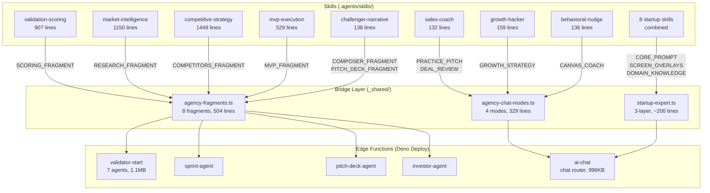
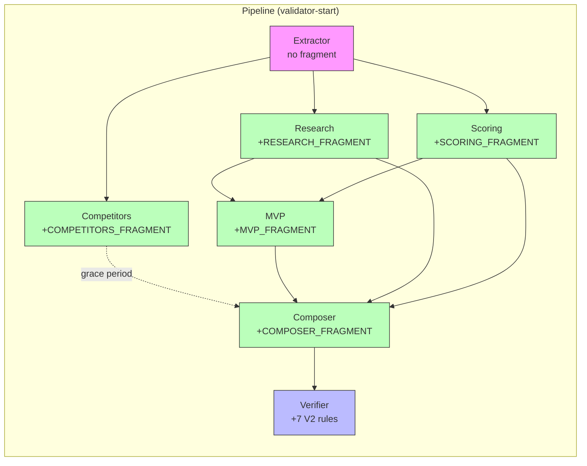
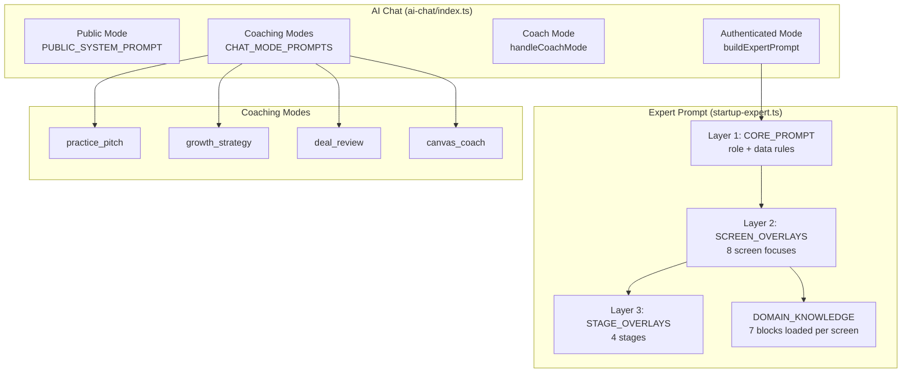
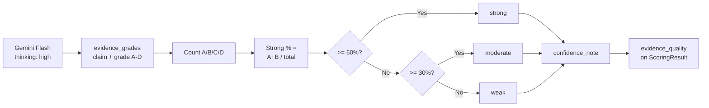

# Skills → Production Audit Report

**Date:** 2026-03-18 | **Scope:** Skills wiring, fragments, edge functions, AI chat, validator pipeline
**Method:** Code inspection against documentation claims | **Confidence:** HIGH

---

## Executive Summary

All Session 45 deliverables are deployed and verified. 8 fragments wired to 8 edge functions. 3-layer expert prompt active. 7 verifier rules + evidence quality live. 674 tests passing. Zero broken imports.

**One remaining gap:** Phase 3 (3 screen overlays + public rate limiting) is planned but not yet implemented.

---

## Verified Inventory

| Asset | Count | Status |
|-------|------:|--------|
| Agency fragments (`_shared/agency-fragments.ts`) | 8 | 🟢 All deployed |
| Chat mode prompts (`_shared/agency-chat-modes.ts`) | 4 | 🟢 All deployed |
| Expert prompt layers (`_shared/startup-expert.ts`) | 3 layers | 🟢 Deployed v90 |
| Screen overlays | 8 explicit | 🟢 8/11 screens covered |
| Stage overlays | 4 | 🟢 idea, pre_seed, seed, series_a |
| Domain knowledge blocks | 7 | 🟢 All mapped to screens |
| Validator agents with fragments | 5/7 | 🟢 scoring, composer, research, competitors, mvp |
| Verifier consistency rules | 11 total | 🟢 4 original + 7 v2 |
| Evidence quality scoring | 1 | 🟢 Deterministic computation |
| Tests | 674 | 🟢 All passing |

---

## Fragment → Edge Function Wiring (verified via grep)

| Fragment | Lines | Edge Function | Import Verified |
|----------|------:|---------------|:---:|
| SCORING_FRAGMENT | 49 | validator-start/scoring.ts | ✅ |
| COMPOSER_FRAGMENT | 71 | validator-start/composer.ts | ✅ |
| RESEARCH_FRAGMENT | 40 | validator-start/research.ts | ✅ |
| COMPETITORS_FRAGMENT | 43 | validator-start/competitors.ts | ✅ |
| MVP_FRAGMENT | 50 | validator-start/mvp.ts | ✅ |
| SPRINT_FRAGMENT | 58 | sprint-agent/index.ts | ✅ |
| PITCH_DECK_FRAGMENT | 52 | pitch-deck-agent/generation.ts | ✅ |
| CRM_INVESTOR_FRAGMENT | 62 | investor-agent/prompt.ts | ✅ |
| **Total** | **425** | **8 edge functions** | **8/8** |

---

## Verifier Rules Inventory

### Original Rules (4)
- Score-verdict alignment
- Top threat in risks check
- Missing pricing step in next_steps
- Zero competitors with high score

### V2 Rules (7) — Added Session 45b
| Code | Rule | Severity |
|------|------|----------|
| V2-R1 | TAM < $100M with market score > 70 | error |
| V2-R2 | Revenue model vs next steps mismatch | warn |
| V2-R3 | Y3 revenue > 50x Y1 | warn |
| V2-R4 | Score < 50 without pivot language | warn |
| V2-R5 | 5+ high-threat competitors, score > 60 | warn |
| V2-R6 | MVP > 5 features, solo founder | warn |
| V2-R7 | TAM > $1B, zero sources | error |

---

## Red Flags & Failure Points

| # | Issue | Severity | Status | Mitigation |
|---|-------|----------|--------|------------|
| 1 | ai-chat public mode has no rate limiting | 🔴 HIGH | Open | Phase 3: add IP-based rate limit |
| 2 | CORS mixed patterns in ai-chat (static vs dynamic) | 🟡 MEDIUM | Open | Phase 3: standardize to getCorsHeaders(req) |
| 3 | 3 screen overlays missing (/market-research, /investors, /experiments) | 🟡 MEDIUM | Open | Phase 3: add overlays |
| 4 | gtm_strategy domain block exists but unmapped to screens | 🟡 LOW | Open | Phase 3: map to /sprint-plan, /lean-canvas |
| 5 | Extractor + Verifier have no fragments (2/7 unwired) | 🟡 LOW | By design | Extractor = extraction not analysis; Verifier = pure JS |
| 6 | beforeunload cleanup in validator-start is best-effort | 🟡 LOW | Mitigated | Pipeline marks failure on deadline timeout |
| 7 | Skill doc claims "42+ deployed" but repo has 30 | 🟡 LOW | Open | Update skill doc separately |
| 8 | prompt-pack README claims public auth but code requires JWT | 🟡 LOW | Open | Fix README or code |
| 9 | index-functions.md says 31 deployed, should be 30 | 🟡 LOW | Open | Fix count + add validator-retry, weekly-review |

---

## Architecture Diagram

## Validator Pipeline Flow

## AI Chat Architecture

## Evidence Quality Flow

---

## Acceptance Checks

| Check | Expected | Actual | Pass |
|-------|----------|--------|:----:|
| Fragments exported | 8 | 8 | ✅ |
| Fragments imported by agents | 8/8 | 8/8 | ✅ |
| Validator agents with fragments | 5/7 | 5/7 | ✅ |
| Verifier V2 rules | 7 | 7 | ✅ |
| Evidence quality computed | Yes | Yes | ✅ |
| Expert prompt wired | Yes | Yes (line 448) | ✅ |
| Screen overlays | 8 | 8 | ✅ |
| Stage overlays | 4 | 4 | ✅ |
| Domain knowledge blocks | 7 | 7 | ✅ |
| Chat coaching modes | 4 | 4 | ✅ |
| TypeScript errors | 0 | 0 | ✅ |
| Build time | <7s | 5.88s | ✅ |
| Tests passing | 674 | 674 | ✅ |
| Deploys successful | 2 | 2 (ai-chat v90 + validator-start v72) | ✅ |
| Public rate limiting | Required | ❌ Not yet | ⚠️ Phase 3 |

---

## Next Steps (Phase 3)

| # | Action | Priority | Effort |
|---|--------|----------|--------|
| 1 | Add public-mode IP rate limiting to ai-chat | 🔴 HIGH | 1h |
| 2 | Add 3 missing screen overlays (/market-research, /investors, /experiments) | 🟡 MEDIUM | 30m |
| 3 | Wire gtm_strategy to /sprint-plan and /lean-canvas screens | 🟡 MEDIUM | 10m |
| 4 | Standardize CORS to getCorsHeaders(req) in ai-chat | 🟡 MEDIUM | 20m |
| 5 | Fix index-functions.md inventory (30 not 31, add 2 missing) | 🟡 LOW | 15m |
| 6 | Update skill doc "42+" → "30" deployed count | 🟡 LOW | 5m |
| 7 | Fix prompt-pack README auth claim | 🟡 LOW | 5m |

**Total Phase 3 estimate:** ~2.5 hours
