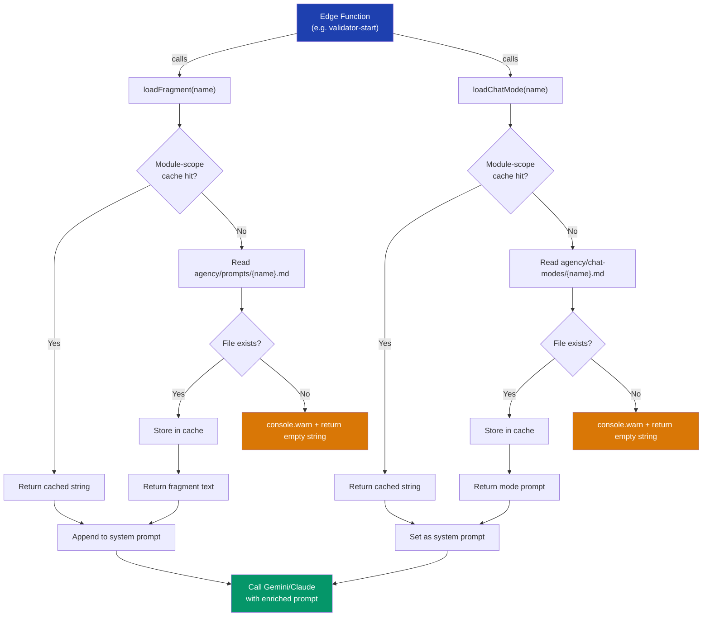

# AGN-01: Agent Loader Runtime

How `agency/lib/agent-loader.ts` loads markdown fragments and chat modes into edge function system prompts at runtime.

## Key Rules

1. **Cache once per cold start** — Deno Deploy isolates persist across requests
2. **Graceful fallback** — Missing file never crashes the edge function
3. **Fragment append** — Fragments are appended to existing system prompts (additive)
4. **Mode replace** — Chat modes replace the full system prompt (substitutive)
