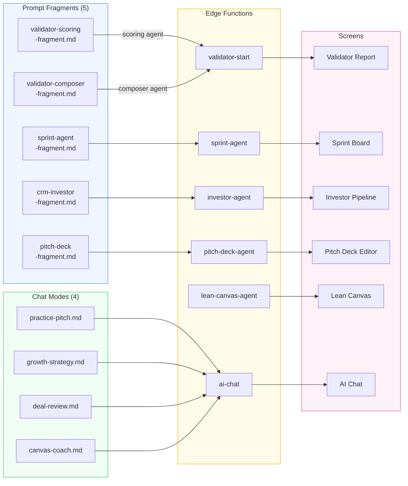

# AGN-02: Fragment & Mode Wiring Map

Which agency files feed which edge functions and screens.

## Wiring Summary

| Fragment | Edge Function | Screen | Frameworks |
|----------|--------------|--------|-----------|
| validator-scoring | validator-start (scoring) | Validator Report | Evidence tiers, bias detection, RICE actions |
| validator-composer | validator-start (composer) | Validator Report | Three-act narrative, win themes, ICE channels |
| crm-investor | investor-agent | Investor Pipeline | MEDDPICC /40, signal timing, email anatomy |
| sprint-agent | sprint-agent | Sprint Board | RICE scoring, Kano class, momentum sequence |
| pitch-deck | pitch-deck-agent | Pitch Deck Editor | Challenger narrative, persuasion architecture |
| practice-pitch | ai-chat | AI Chat | Pitch scoring /50, coaching loop |
| growth-strategy | ai-chat | AI Chat | AARRR funnel, ICE experiments |
| deal-review | ai-chat | AI Chat | MEDDPICC per deal, red flags |
| canvas-coach | ai-chat | AI Chat | Specificity scoring, behavioral nudges |
