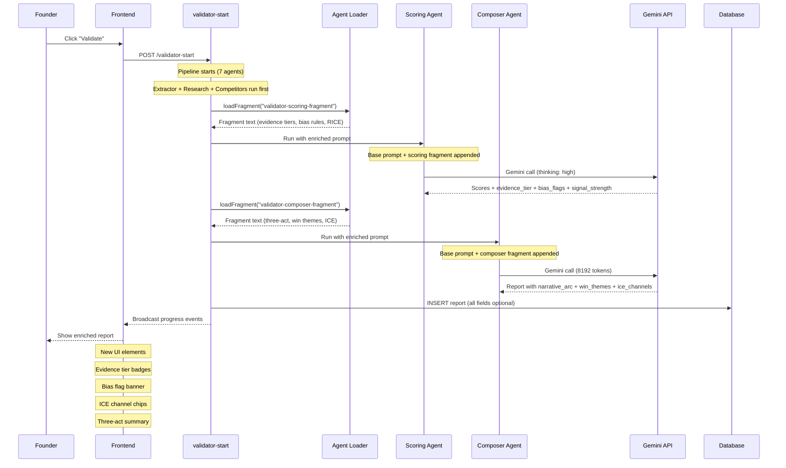

# AGN-03: Validator Enhanced Pipeline

How the scoring and composer agents are enriched with agency fragments during a validation run.

## New Output Fields (all optional)

### From Scoring Agent (via scoring fragment)

| Field | Type | Example |
|-------|------|---------|
| `evidence_tier` | string | `"cited"`, `"founder_claim"`, `"ai_inferred"` |
| `bias_flags` | string[] | `["anchoring", "survivorship"]` |
| `signal_strength` | string | `"Level 3 – multiple data points"` |

### From Composer Agent (via composer fragment)

| Field | Type | Example |
|-------|------|---------|
| `narrative_arc` | object | `{setup, tension, resolution}` |
| `win_themes` | string[] | `["Speed-to-market", "Unit economics"]` |
| `ice_channels` | object[] | `[{channel, impact, confidence, ease, score}]` |

## Backward Compatibility

- All new fields are optional in the report JSONB
- Frontend checks `field?.length > 0` before rendering badges/banners
- Old reports render exactly as before
