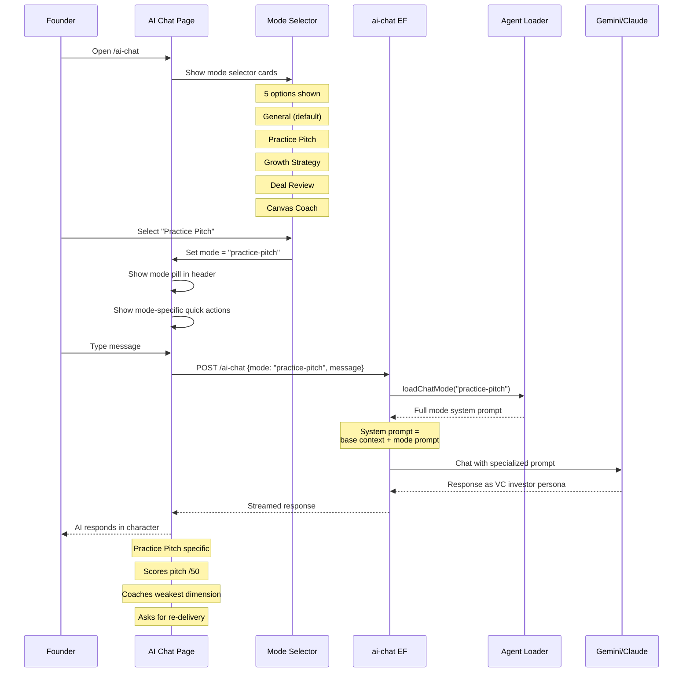

# AGN-04: AI Chat Mode Selection Flow

How a founder selects a chat mode and gets a specialized AI personality.

## Mode Behaviors

| Mode | AI Persona | Scoring | Quick Actions |
|------|-----------|---------|---------------|
| General | Helpful assistant | None | General startup questions |
| Practice Pitch | Skeptical VC investor | /50 (5 dims × 10) | "Score my pitch", "Common objections" |
| Growth Strategy | Growth advisor | AARRR diagnosis | "Diagnose my funnel", "Design experiment" |
| Deal Review | Deal strategist | MEDDPICC /40 | "Score this deal", "Red flags" |
| Canvas Coach | Business model coach | Specificity 0-100% | "Find weakest box", "Sharpen segment" |

## Default Behavior

- No `mode` param → general mode (existing behavior, zero changes)
- Mode prompt loaded only when explicitly selected
- Mode can be changed mid-conversation (clears history)
