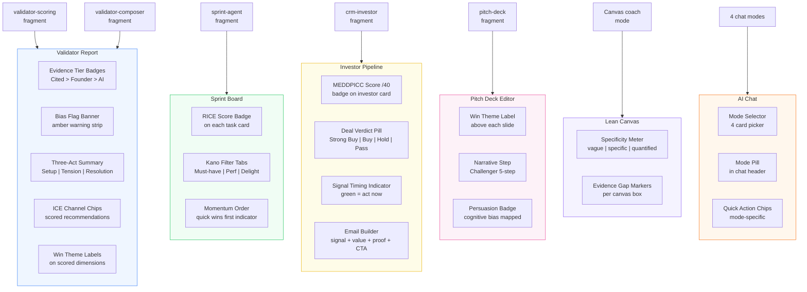

# AGN-05: Screen Enhancement Map

How agency frameworks map to UI components across 6 screens.

## Component Count by Screen

| Screen | New Components | Source Fragment |
|--------|---------------|----------------|
| Validator Report | 5 | scoring + composer |
| Sprint Board | 3 | sprint-agent |
| Investor Pipeline | 4 | crm-investor |
| Pitch Deck Editor | 3 | pitch-deck |
| Lean Canvas | 2 | composer (reused) |
| AI Chat | 3 | 4 chat modes |
| **Total** | **20** | |
