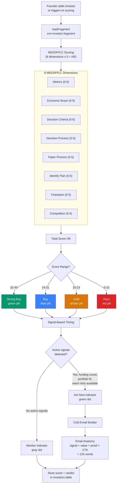

# AGN-06: Investor MEDDPICC Scoring Flow

How the investor-agent scores deals using MEDDPICC and generates cold emails.



## Schema Changes

```sql
ALTER TABLE investors ADD COLUMN meddpicc_score int;
ALTER TABLE investors ADD COLUMN deal_verdict text;
ALTER TABLE investors ADD COLUMN signal_data jsonb;
```

## Email Anatomy (from crm-investor-fragment)

```
Subject: [Signal] — [Value hook] for [Fund name]

[1 sentence: signal that triggered outreach]
[1 sentence: specific value to this investor]
[1 sentence: proof point / traction]
[1 sentence: clear CTA with specific ask]

Total: < 120 words
```
