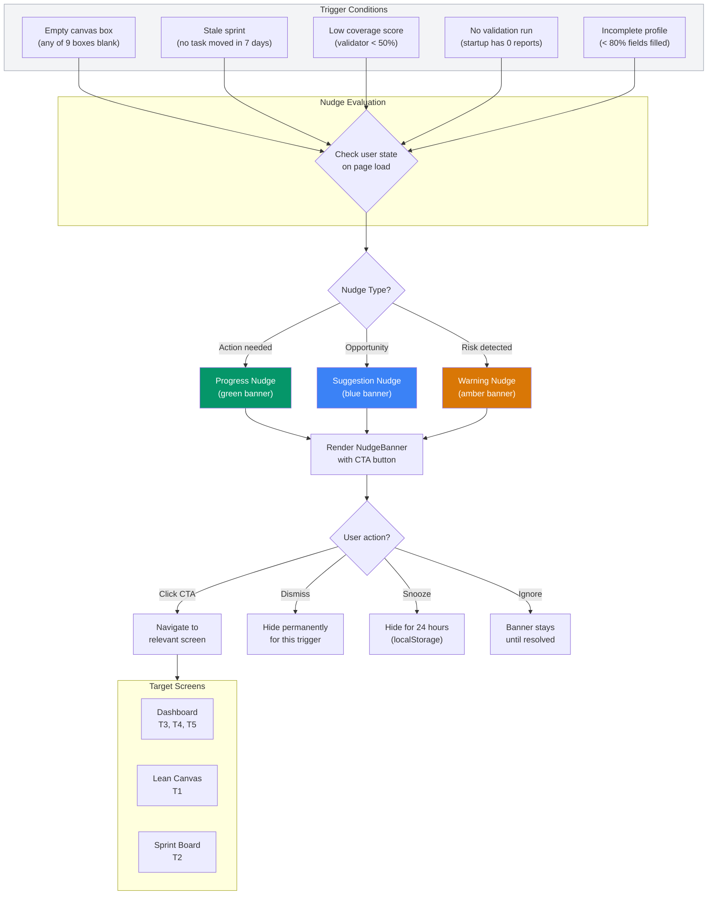

# AGN-07: Behavioral Nudge System

Contextual nudge banners triggered by user state across 3 screens.

## Nudge Rules

| Trigger | Type | Screen | CTA |
|---------|------|--------|-----|
| Empty canvas box | Suggestion | Lean Canvas | "Fill in [box name]" |
| Stale sprint (7d) | Warning | Sprint Board | "Review sprint tasks" |
| Coverage < 50% | Warning | Dashboard | "Continue validation chat" |
| No validation run | Progress | Dashboard | "Validate your idea" |
| Profile < 80% | Progress | Dashboard | "Complete your profile" |

## State Management

- Nudge state stored in `localStorage` (dismissed/snoozed per trigger key)
- No database table needed — pure client-side
- Snooze expires after 24 hours (timestamp comparison)
- Dismiss is permanent per trigger (reset on new session only if trigger changes)
