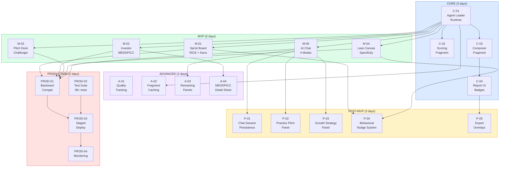

# AGN-08: Phase Dependency Graph

All 22 tasks across 5 phases with dependency arrows.



## Critical Path

```
C-01 → C-02 → C-03 → C-04 → P-05
C-01 → M-05 → P-01/P-02/P-03 → A-03
All MVP → PROD-01 → PROD-03 → PROD-04
```

## Parallelism Opportunities

After C-01 completes, all 5 MVP tasks (M-01 through M-05) can run in parallel.
