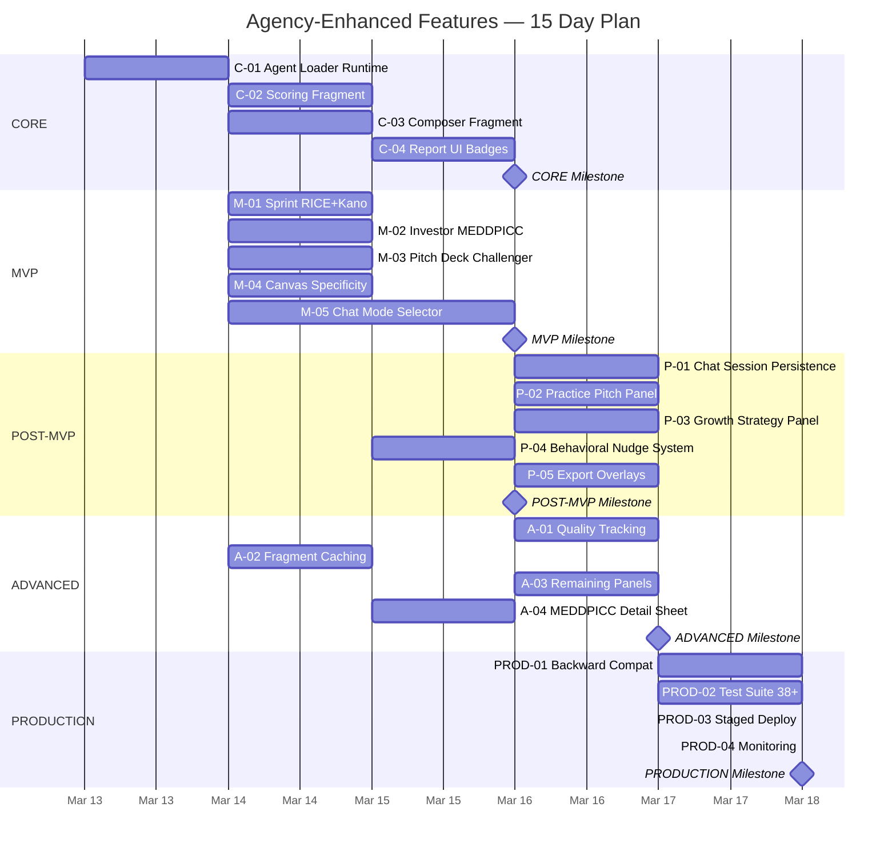

# AGN-09: 5-Phase Implementation Gantt

15-day timeline across 5 phases.

## Phase Milestones

| Phase | Day | Milestone |
|-------|-----|-----------|
| CORE | 3 | Validator reports show evidence tiers + bias flags |
| MVP | 8 | All 6 screens enhanced, 4 chat modes selectable |
| POST-MVP | 11 | Chat sessions persist, nudge banners active |
| ADVANCED | 13 | Quality tracked in ai_runs, caching proven |
| PRODUCTION | 15 | 38+ tests pass, all EFs deployed, monitoring live |

## Solo vs Parallel

- **Solo developer:** ~15 days (sequential)
- **2 developers:** ~10 days (MVP tasks parallelize after C-01)
- **Critical path:** C-01 → M-05 → P-01 → PROD-03 → PROD-04
