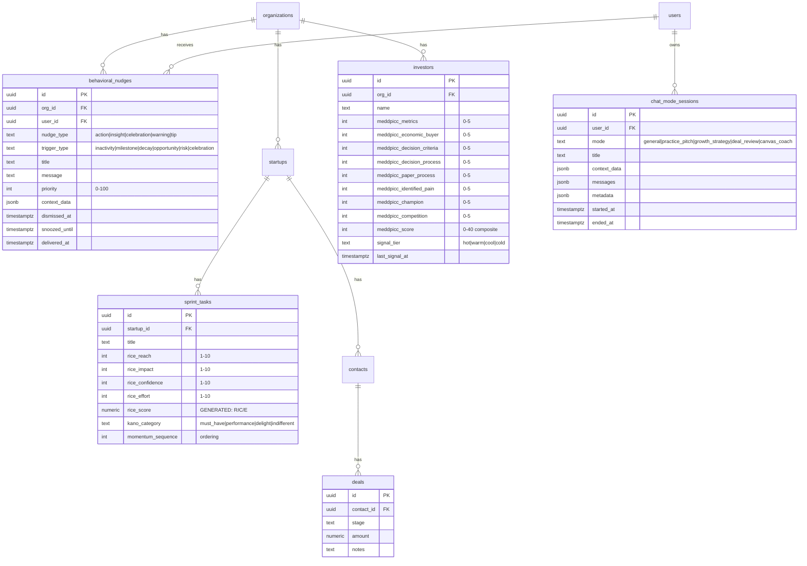

# AGN-10: Agency Schema ERD

> **Type:** Entity Relationship Diagram
> **Phase:** INFRASTRUCTURE
> **Source:** `agency/prompts/100-agency-schema-migrations.md`

---

## Agency Tables & Relationships

## RLS Summary

| Table | Scope | Policy Pattern |
|-------|-------|----------------|
| `sprint_tasks` | org (via startup) | Existing — columns auto-covered |
| `investors` | org | Existing — columns auto-covered |
| `behavioral_nudges` | org + user | 4 new policies: `user_id = auth.uid() AND org_id = user_org_id()` |
| `chat_mode_sessions` | user only | 4 new policies: `user_id = auth.uid()` |
| `deals` | org (via contact→startup) | 1 new INSERT policy (was missing) |

## Index Summary

| Table | Index | Purpose |
|-------|-------|---------|
| `sprint_tasks` | `rice_score DESC` | RICE priority sorting |
| `sprint_tasks` | `kano_category` (partial) | Kano filtering |
| `sprint_tasks` | `momentum_sequence ASC` | Sequence ordering |
| `investors` | `meddpicc_score DESC` | MEDDPICC ranking |
| `investors` | `signal_tier` (partial) | Signal filtering |
| `investors` | `last_signal_at DESC` | Signal recency |
| `behavioral_nudges` | `(org_id, user_id)` | User lookup |
| `behavioral_nudges` | `trigger_type` | Trigger filtering |
| `behavioral_nudges` | `priority DESC` | Priority sorting |
| `behavioral_nudges` | `(org_id, user_id) WHERE dismissed_at IS NULL` | Active nudges |
| `behavioral_nudges` | UNIQUE `(org_id, user_id, nudge_type, trigger_type) WHERE dismissed_at IS NULL` | Dedup |
| `chat_mode_sessions` | `user_id` | User lookup |
| `chat_mode_sessions` | `mode` | Mode filtering |
| `chat_mode_sessions` | `started_at DESC` | Recency |
| `chat_mode_sessions` | `(user_id, mode) WHERE ended_at IS NULL` | Active sessions |

## Constraint Summary

| Table | Constraint | Rule |
|-------|-----------|------|
| `sprint_tasks` | RICE components | 1-10 range each |
| `sprint_tasks` | `kano_category` | Enum: 4 values |
| `sprint_tasks` | `momentum_sequence` | >= 0 |
| `investors` | MEDDPICC dimensions | 0-5 range each |
| `investors` | `meddpicc_score` | 0-40 |
| `investors` | `signal_tier` | Enum: 4 values |
| `behavioral_nudges` | `nudge_type` | Enum: 5 values |
| `behavioral_nudges` | `trigger_type` | Enum: 6 values |
| `behavioral_nudges` | `priority` | 0-100 |
| `chat_mode_sessions` | `mode` | Enum: 5 values |
