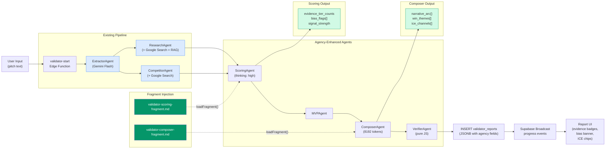
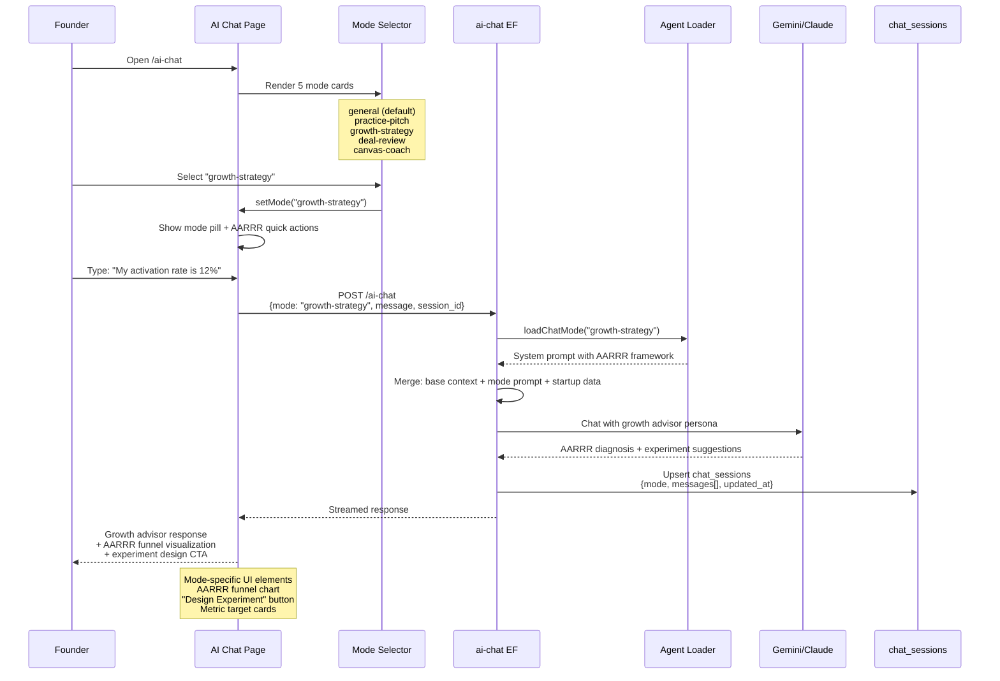
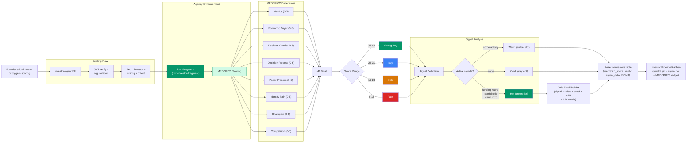
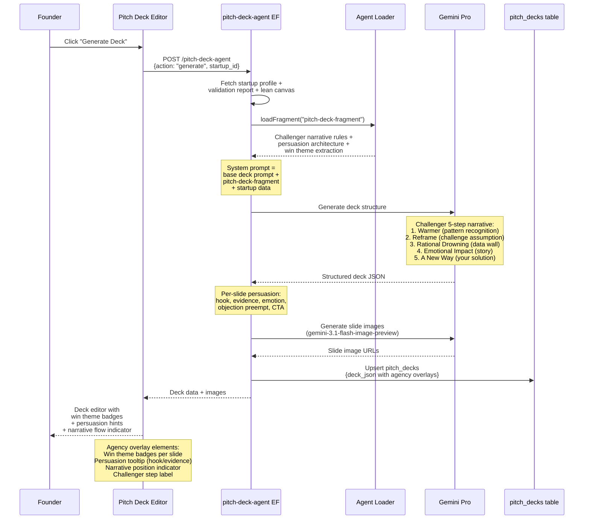
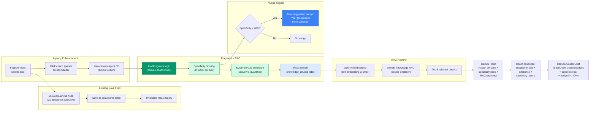
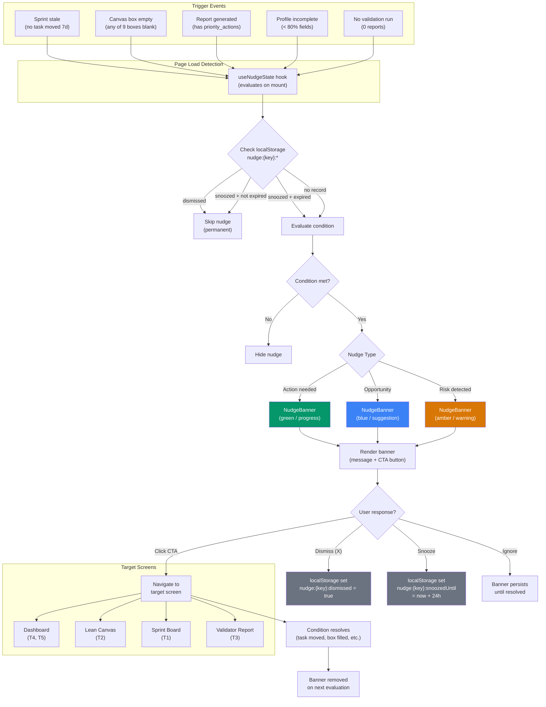
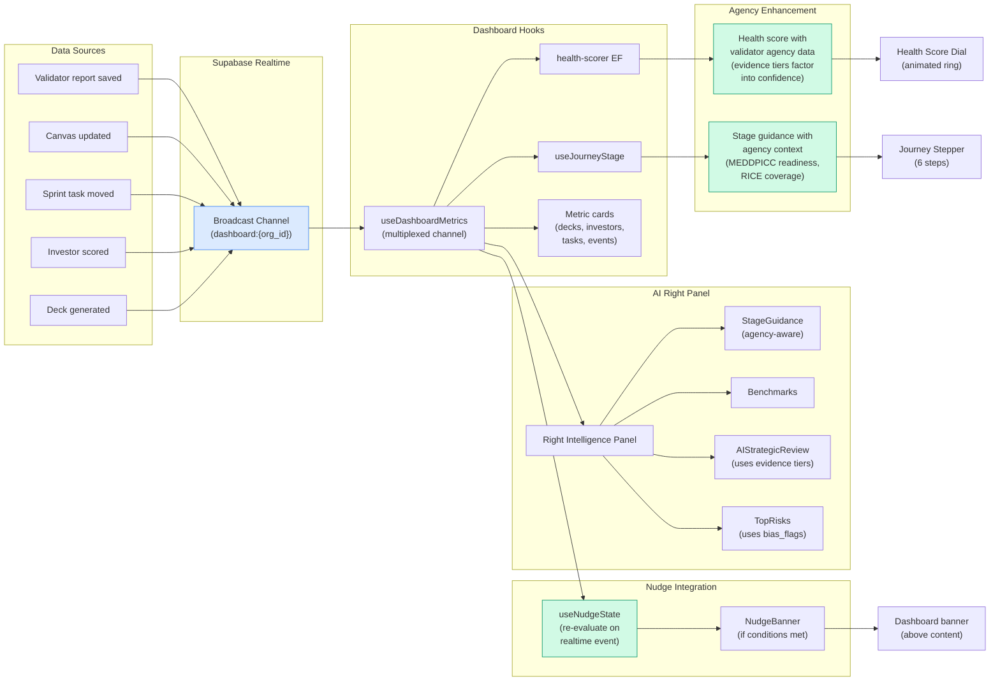

| Aspect | Details |
|--------|---------|
| **Screens** | All agency-enhanced screens (Validator, Chat, Investors, Sprint, Pitch Deck, Canvas, Dashboard) |
| **Features** | 8 Mermaid data flow diagrams covering every agency-enhanced workflow |
| **Edge Functions** | validator-start, ai-chat, investor-agent, sprint-agent, pitch-deck-agent, lean-canvas-agent, health-scorer |
| **Real-World** | "Open `agency/mermaid/` and see exactly how data flows through every agency-enhanced feature" |

## Description

**The situation:** The agency system adds fragments, chat modes, MEDDPICC scoring, RICE/Kano prioritization, Challenger narratives, specificity coaching, behavioral nudges, and realtime dashboards to 7 different screens. Existing Mermaid diagrams (AGN-01 through AGN-09) cover individual components — the agent loader, fragment wiring map, validator pipeline sequence, chat mode selection, screen enhancement map, investor MEDDPICC flow, behavioral nudge system, phase dependency graph, and Gantt timeline. What is missing are end-to-end data flow diagrams that show how data moves through the complete system: from user input through edge functions, AI models, fragment injection, database writes, realtime broadcasts, and back to the UI. Without these, a developer building task 005 (sprint RICE/Kano) has no single diagram showing how validator report actions become RICE-scored sprint cards.

**Why it matters:** Data flow diagrams are the developer's map. When a task prompt says "wire the sprint-agent-fragment into sprint-agent," the developer needs to see the full path: where the data originates (validator report), how it transforms (priority_actions to RICE scores), where it lands (sprint_tasks table), and what triggers the UI update (realtime broadcast or React Query invalidation). Without flow diagrams, developers guess at integration points, miss intermediate transformations, and wire things incorrectly. The existing AGN-03 (validator pipeline sequence) is excellent but covers only one workflow. Seven more are needed.

**What already exists:**
- `agency/mermaid/00-index.md` — Index of 9 existing diagrams (AGN-01 through AGN-09)
- `agency/mermaid/03-validator-enhanced-pipeline.md` — Sequence diagram of scoring + composer fragment injection
- `agency/mermaid/04-chat-mode-flow.md` — Sequence diagram of mode selection and specialized AI response
- `agency/mermaid/06-investor-meddpicc-flow.md` — Flowchart of MEDDPICC scoring to deal verdict
- `agency/mermaid/07-behavioral-nudge-system.md` — Flowchart of trigger conditions to nudge banners
- `agency/prompts/validator-scoring-fragment.md` — Evidence tier rules, bias detection
- `agency/prompts/validator-composer-fragment.md` — Three-act narrative, win themes, ICE channels
- `agency/prompts/crm-investor-fragment.md` — MEDDPICC scorecard, signal timing, email anatomy
- `agency/prompts/sprint-agent-fragment.md` — RICE scoring, Kano classification, momentum sequencing
- `agency/prompts/pitch-deck-fragment.md` — Challenger narrative, persuasion architecture, win themes
- `agency/lib/agent-loader.ts` — `loadFragment()` and `loadChatMode()` utilities

**The build:**
- Create 8 new Mermaid diagrams in `agency/mermaid/` (numbered AGN-10 through AGN-17)
- Each diagram is a `flowchart LR` or `sequenceDiagram` showing the complete data path for one agency workflow
- Use subgraphs to distinguish agency additions (green) from existing infrastructure (blue)
- Each diagram file includes: Mermaid code, field table (new/modified fields), and integration notes
- Update `agency/mermaid/00-index.md` to register all 8 new diagrams

**Example:** Priya is implementing task 005-SRK (Sprint Board RICE/Kano). She opens `agency/mermaid/14-sprint-rice-kano-flow.md` and sees the complete path: Validator report `priority_actions` are imported via `useSprintImport` hook, sent to `sprint-agent` edge function which loads `sprint-agent-fragment.md`, Gemini scores each action with RICE (reach x impact x confidence / effort), classifies via Kano (must-have/performance/delight), sequences for momentum (quick win first), writes to `sprint_tasks` table, and the Sprint Board renders scored cards with RICE badges and Kano classification chips. She knows every file to touch and every data transformation along the way.

## Rationale
**Problem:** Developers lack end-to-end visibility into how agency features transform data across the full system.
**Solution:** 8 comprehensive Mermaid diagrams — one per agency-enhanced workflow — showing complete data paths.
**Impact:** Developers can trace any piece of agency data from origin to UI, reducing integration errors and speeding up implementation.

| As a... | I want to... | So that... |
|---------|--------------|------------|
| Developer | see the full data flow for each agency feature | I know every file and transformation involved |
| Tech lead | review data flows before implementation | I can catch missing integrations and race conditions |
| New contributor | understand how agency fragments reach the UI | I can onboard without reading 25 task prompts |

## Goals
1. **Primary:** 8 Mermaid diagrams covering all agency-enhanced workflows
2. **Quality:** Each diagram traces data from user input to database write to UI render
3. **Clarity:** Subgraphs separate agency additions from existing infrastructure

## Acceptance Criteria
- [ ] Diagram 1 (AGN-10): Validator Pipeline + Agency Flow — complete sequence from user input through 7 agents with fragment injection points
- [ ] Diagram 2 (AGN-11): Chat Mode Selection Flow — mode selector through agent loader to specialized AI response
- [ ] Diagram 3 (AGN-12): MEDDPICC Investor Pipeline Flow — investor add through scoring to deal verdict and email generation
- [ ] Diagram 4 (AGN-13): Sprint Board RICE/Kano Flow — report actions through RICE scoring to Kanban cards
- [ ] Diagram 5 (AGN-14): Pitch Deck Challenger Flow — startup profile through win theme extraction to slide generation
- [ ] Diagram 6 (AGN-15): Lean Canvas Coach Flow — canvas edit through specificity scoring to RAG-backed coaching
- [ ] Diagram 7 (AGN-16): Behavioral Nudge System Flow — trigger events through nudge engine to user actions
- [ ] Diagram 8 (AGN-17): Dashboard Realtime + Agency Flow — data changes through realtime broadcasts to agency-enriched dashboard
- [ ] Each diagram uses subgraphs to distinguish agency additions from existing infrastructure
- [ ] `agency/mermaid/00-index.md` updated with all 8 new entries (AGN-10 through AGN-17)

| Layer | File | Action |
|-------|------|--------|
| Diagram | `agency/mermaid/10-validator-agency-flow.md` | Create |
| Diagram | `agency/mermaid/11-chat-mode-flow.md` | Create |
| Diagram | `agency/mermaid/12-meddpicc-pipeline-flow.md` | Create |
| Diagram | `agency/mermaid/13-sprint-rice-kano-flow.md` | Create |
| Diagram | `agency/mermaid/14-pitch-challenger-flow.md` | Create |
| Diagram | `agency/mermaid/15-canvas-coach-flow.md` | Create |
| Diagram | `agency/mermaid/16-behavioral-nudge-flow.md` | Create |
| Diagram | `agency/mermaid/17-dashboard-realtime-flow.md` | Create |
| Index | `agency/mermaid/00-index.md` | Modify — add AGN-10 through AGN-17 |

---

## Diagram 1: Validator Pipeline + Agency Flow (AGN-10)

**File:** `agency/mermaid/10-validator-agency-flow.md`

Shows how agency fragments inject into the 7-agent pipeline. Scoring and Composer agents receive enriched prompts while Extractor, Research, and Competitors run unchanged. The report output includes agency-specific fields (evidence tiers, bias flags, narrative arc, win themes, ICE channels) alongside standard fields.

### New Fields from Agency Fragments

| Source | Field | Type | Added By |
|--------|-------|------|----------|
| Scoring fragment | `evidence_tier_counts` | `Record<string, {cited, founder, ai_inferred}>` | `validator-scoring-fragment.md` |
| Scoring fragment | `bias_flags` | `Array<{dimension, bias_type, explanation}>` | `validator-scoring-fragment.md` |
| Scoring fragment | `signal_strength` | `'level_1' \| 'level_2' \| ... \| 'level_5'` | `validator-scoring-fragment.md` |
| Composer fragment | `narrative_arc` | `{setup, tension, resolution}` | `validator-composer-fragment.md` |
| Composer fragment | `win_themes` | `string[]` | `validator-composer-fragment.md` |
| Composer fragment | `ice_channels` | `Array<{channel, impact, confidence, ease, score}>` | `validator-composer-fragment.md` |

### Integration Notes

- Fragment injection happens in `pipeline.ts` before each agent call
- All new fields are optional — old reports render without them
- VerifierAgent checks for new fields if present (non-blocking)
- Broadcast events include `has_agency_data: true` flag for frontend conditional rendering

---

## Diagram 2: Chat Mode Selection Flow (AGN-11)

**File:** `agency/mermaid/11-chat-mode-flow.md`

Shows the complete flow from mode selection through agent loader to mode-specific UI rendering. Each mode activates a different AI persona, scoring system, and set of quick actions.

### Mode-to-UI Mapping

| Mode | AI Persona | System Prompt Source | Scoring UI | Quick Actions |
|------|-----------|---------------------|------------|---------------|
| `general` | Helpful assistant | Base prompt only | None | General startup Qs |
| `practice-pitch` | Skeptical VC | `chat-modes/practice-pitch.md` | Pitch score /50 (5 dims x 10) | "Score my pitch", "Objections" |
| `growth-strategy` | Growth advisor | `chat-modes/growth-strategy.md` | AARRR diagnosis | "Diagnose funnel", "Design experiment" |
| `deal-review` | Deal strategist | `chat-modes/deal-review.md` | MEDDPICC /40 | "Score deal", "Red flags" |
| `canvas-coach` | Business model coach | `chat-modes/canvas-coach.md` | Specificity 0-100% | "Find weakest box", "Sharpen segment" |

### Integration Notes

- Mode persists per session (stored in `chat_sessions.mode`)
- Changing mode mid-conversation starts a new session
- `loadChatMode()` returns full system prompt text (cached by agent-loader)
- No mode param falls through to general mode (zero changes to existing behavior)

---

## Diagram 3: MEDDPICC Investor Pipeline Flow (AGN-12)

**File:** `agency/mermaid/12-meddpicc-pipeline-flow.md`

Shows the complete investor workflow from adding an investor through MEDDPICC scoring, signal detection, email generation, and pipeline Kanban rendering.

### Data Transformations

| Step | Input | Output | Storage |
|------|-------|--------|---------|
| MEDDPICC score | Investor profile + startup context | 8 dimension scores, total /40 | `investors.meddpicc_score` |
| Deal verdict | Total score | Strong Buy / Buy / Hold / Pass | `investors.deal_verdict` |
| Signal detection | Investor activity + market events | Hot / Warm / Cold + reasons | `investors.signal_data` JSONB |
| Email generation | Signal + startup value props | Subject + 4-line body < 120 words | `investors.outreach_draft` JSONB |

---

## Diagram 4: Sprint Board RICE/Kano Flow (AGN-13)

**File:** `agency/mermaid/13-sprint-rice-kano-flow.md`

Shows the path from validator report priority actions through RICE scoring and Kano classification to rendered sprint Kanban cards with scoring badges.

```mermaid
flowchart LR
    RPT["Validator Report<br/>priority_actions[]"] --> IMP["useSprintImport hook<br/>(one-click import)"]

    subgraph Import
        IMP --> MAP["Map fields:<br/>action -> title<br/>timeframe -> sprint_name<br/>effort -> priority"]
        MAP --> DEDUP["Dedup via source_action_id<br/>(report:id:dim:idx)"]
        DEDUP --> CAMP["Auto-create campaign<br/>if not exists"]
    end

    CAMP --> EF["sprint-agent EF"]

    subgraph Agency Enhancement
        EF --> LOAD["loadFragment<br/>(sprint-agent-fragment)"]
        LOAD --> RICE["RICE Scoring"]
    end

    subgraph RICE Calculation
        RICE --> R["Reach<br/>(users affected 1-10)"]
        RICE --> I["Impact<br/>(severity 0.25-3)"]
        RICE --> C["Confidence<br/>(evidence 0.5-1.0)"]
        RICE --> E["Effort<br/>(person-weeks 0.5-10)"]
        R & I & C & E --> SCORE["RICE = R*I*C / E"]
    end

    SCORE --> KANO["Kano Classification"]

    subgraph Kano Types
        KANO --> MH["Must-Have<br/>(red badge)"]
        KANO --> PF["Performance<br/>(blue badge)"]
        KANO --> DL["Delight<br/>(green badge)"]
    end

    MH & PF & DL --> SEQ["Momentum Sequencing<br/>(quick wins first)"]

    SEQ --> DB["Write sprint_tasks<br/>(rice_score, kano_type,<br/>momentum_order)"]

    DB --> KB["Sprint Kanban Board<br/>(RICE badge + Kano chip<br/>+ momentum position)"]

    style LOAD fill:#059669,color:#fff
    style RICE fill:#d1fae5,stroke:#059669
    style KANO fill:#d1fae5,stroke:#059669
    style MH fill:#dc2626,color:#fff
    style PF fill:#3b82f6,color:#fff
    style DL fill:#059669,color:#fff
```

### Data Transformations

| Step | Input | Output | Storage |
|------|-------|--------|---------|
| Import mapping | `priority_actions[{action, timeframe, effort}]` | `sprint_tasks[{title, sprint_name, priority}]` | `sprint_tasks` table |
| RICE scoring | Task description + startup context | `rice_score` (float), component scores | `sprint_tasks.rice_score` JSONB |
| Kano classification | Task type + user impact | `must_have` / `performance` / `delight` | `sprint_tasks.kano_type` text |
| Momentum sequence | RICE scores + Kano types | Ordered list (quick wins first) | `sprint_tasks.momentum_order` int |

---

## Diagram 5: Pitch Deck Challenger Flow (AGN-14)

**File:** `agency/mermaid/14-pitch-challenger-flow.md`

Shows how the pitch deck agent builds a Challenger-style narrative deck from startup profile and validation report data, with per-slide persuasion architecture.

### Challenger Narrative Structure

| Step | Slide Purpose | Agency Field |
|------|-------------|-------------|
| 1. Warmer | Pattern investor recognizes | `challenger_step: "warmer"` |
| 2. Reframe | Challenge their assumption | `challenger_step: "reframe"` |
| 3. Rational Drowning | Data wall (TAM, metrics) | `challenger_step: "rational_drowning"` |
| 4. Emotional Impact | Founder story or user pain | `challenger_step: "emotional_impact"` |
| 5. A New Way | Your solution + traction | `challenger_step: "new_way"` |

### Per-Slide Persuasion Fields

| Field | Type | Purpose |
|-------|------|---------|
| `hook` | string | Opening line that grabs attention |
| `evidence` | string[] | Data points supporting the claim |
| `emotion` | string | Emotional connection point |
| `objection_preempt` | string | Anticipated investor pushback + counter |
| `win_themes` | string[] | Which win themes this slide supports |

---

## Diagram 6: Lean Canvas Coach Flow (AGN-15)

**File:** `agency/mermaid/15-canvas-coach-flow.md`

Shows how canvas edits trigger specificity scoring, evidence gap detection, and RAG-backed coaching with behavioral nudges.

### Specificity Scoring Rules

| Score Range | Label | Meaning | Nudge? |
|-------------|-------|---------|--------|
| 0-39% | Vague | No numbers, no names, generic claims | Yes (blue banner) |
| 40-69% | Partial | Some specifics but missing key data | No |
| 70-89% | Good | Named segments, quantified metrics | No |
| 90-100% | Sharp | Precise data with evidence sources | No |

### RAG Integration

| Step | Input | Output |
|------|-------|--------|
| Embedding | Canvas box text | 1536-dim vector |
| Search | Vector query + industry filter | Top 5 knowledge_chunks |
| Injection | Chunks as numbered citations | System prompt context |
| Response | Coach advice with `[1]` style refs | `citations: string[]` in response |

---

## Diagram 7: Behavioral Nudge System Flow (AGN-16)

**File:** `agency/mermaid/16-behavioral-nudge-flow.md`

Shows the complete lifecycle of a behavioral nudge: trigger detection, condition evaluation, rendering, and user response handling with localStorage persistence.

### Nudge Configuration Table

| Key | Trigger | Type | Screen | CTA Text | Condition |
|-----|---------|------|--------|----------|-----------|
| `sprint_stale` | No task moved in 7d | Warning (amber) | Sprint Board | "Review sprint tasks" | `sprint_tasks.updated_at < now() - 7d` |
| `canvas_empty_{box}` | Any canvas box blank | Suggestion (blue) | Lean Canvas | "Fill in {box name}" | `canvas_data[box].length === 0` |
| `report_actions` | Report has actions | Progress (green) | Validator Report | "Import to sprint" | `report.priority_actions.length > 0 && !imported` |
| `profile_incomplete` | Profile < 80% | Progress (green) | Dashboard | "Complete your profile" | `profileCompleteness < 80` |
| `no_validation` | 0 reports exist | Progress (green) | Dashboard | "Validate your idea" | `validator_reports.count === 0` |

### State Persistence

| Storage Key | Value | Behavior |
|-------------|-------|----------|
| `nudge:{key}:dismissed` | `true` | Permanent hide for this trigger |
| `nudge:{key}:snoozedUntil` | ISO timestamp | Hide until timestamp passes, then re-evaluate |

---

## Diagram 8: Dashboard Realtime + Agency Flow (AGN-17)

**File:** `agency/mermaid/17-dashboard-realtime-flow.md`

Shows how data changes propagate through Supabase Realtime to update agency-enriched dashboard components: health score, stage guidance, AI right panel insights, and nudge triggers.

### Realtime Event Types

| Event | Source | Dashboard Update |
|-------|--------|-----------------|
| `report_complete` | validator-start | Refresh health score, show "Import to Sprint" nudge |
| `canvas_saved` | lean-canvas-agent | Refresh completion metrics, update stage guidance |
| `sprint_task_moved` | Sprint Board UI | Refresh task counts, clear stale sprint nudge |
| `investor_scored` | investor-agent | Refresh investor count, update fundraising readiness |
| `deck_generated` | pitch-deck-agent | Refresh deck count, update journey stepper |

### Agency Data in Dashboard Components

| Component | Existing Data | Agency Enhancement |
|-----------|--------------|-------------------|
| Health Score | Canvas + profile completeness | + validator evidence tier confidence weighting |
| Stage Guidance | Journey step detection | + MEDDPICC readiness for fundraising stage |
| TopRisks | Health breakdown dimensions | + bias_flags from scoring fragment |
| AIStrategicReview | Report summary | + narrative_arc for structured review |
| FundraisingReadiness | Investor count + pipeline | + MEDDPICC aggregate scores |

---

## Edge Cases

| Scenario | Expected Behavior |
|----------|-------------------|
| No agency data in report | Diagrams 1, 8 still valid — agency subgraphs show as "skipped" |
| Chat mode not selected | Diagram 2 falls through to general mode — no fragment loaded |
| Investor has no MEDDPICC score | Diagram 3 shows existing flow only — MEDDPICC subgraph bypassed |
| Sprint board empty (no report import) | Diagram 4 starts from manual task creation instead of report import |
| RAG returns 0 chunks | Diagram 6 coach response works without citations (graceful degradation) |
| All nudge conditions false | Diagram 7 evaluates all triggers, renders nothing |
| Realtime disconnected | Diagram 8 falls back to polling via usePollingFallback hook |

## Real-World Examples

**Scenario 1 -- Full Pipeline Trace (Validator):** Marcus runs validation for his FinTech lending platform. A developer working on the pipeline opens `agency/mermaid/10-validator-agency-flow.md` and traces the entire data path: Marcus's pitch text enters the ExtractorAgent, flows through Research (with RAG search against 4,000+ knowledge chunks), hits ScoringAgent (where `validator-scoring-fragment.md` injects evidence tier rules via `loadFragment()`), producing `evidence_tier_counts` and `bias_flags`. These flow into ComposerAgent (where `validator-composer-fragment.md` adds three-act narrative structure), producing `narrative_arc` and `win_themes`. The VerifierAgent checks completeness, and the full report — including all agency fields — is inserted into `validator_reports` as JSONB. The developer knows exactly where evidence tiers originate and how they reach the Report UI. Without this diagram, they would need to read 6 files across 3 directories.

**Scenario 2 -- Sprint Integration Trace:** Priya's startup passes validation with 5 priority actions. She clicks "Import to Sprint" on the report page. A developer implementing this feature opens `agency/mermaid/13-sprint-rice-kano-flow.md` and sees: the `useSprintImport` hook maps `priority_actions[].action` to `sprint_tasks.title`, deduplicates via `source_action_id`, sends tasks to `sprint-agent` edge function which loads `sprint-agent-fragment.md`, Gemini applies RICE scoring (Reach x Impact x Confidence / Effort), classifies each task via Kano (must-have/performance/delight), sequences for momentum (quick wins first), and writes scored tasks to `sprint_tasks`. The Sprint Kanban renders cards with RICE score badges and Kano classification chips. The developer traces every transformation without guessing.

**Scenario 3 -- Dashboard Agency Enrichment:** A developer building the agency-aware dashboard opens `agency/mermaid/17-dashboard-realtime-flow.md`. They see that when a validator report completes, a broadcast event hits the `dashboard:{org_id}` channel, the `useDashboardMetrics` hook triggers `health-scorer` (which now factors in evidence tier confidence from the agency-enriched report), updates the health dial, refreshes stage guidance (now aware of MEDDPICC readiness for fundraising stages), and triggers `useNudgeState` to evaluate whether an "Import to Sprint" nudge should appear. The entire cascade from data write to UI render is visible in one diagram.

## Outcomes

| Before | After |
|--------|-------|
| Developers read 25+ task prompts to understand data flow | Each workflow has a single diagram showing the complete data path |
| Fragment injection points are described in prose | Visual subgraphs show exactly where fragments enter the pipeline |
| Agency vs. existing code boundaries are unclear | Green subgraphs (agency) vs. blue subgraphs (existing) make boundaries obvious |
| Dashboard realtime cascade is undocumented | Diagram 8 shows every event type and its downstream UI effect |
| RICE/Kano scoring integration is scattered across 3 prompts | Diagram 4 traces the full path: report actions to scored Kanban cards |
| RAG integration in canvas coaching is implicit | Diagram 6 shows embedding, search, citation injection, and UI rendering |

---

## Production Ready Checklist

- [ ] All 8 diagram files created in `agency/mermaid/`
- [ ] Each file has YAML frontmatter (id, phase, type, title, prd_section, roadmap_task)
- [ ] Each Mermaid diagram renders correctly (validate with Mermaid Live Editor)
- [ ] Green styling (`fill:#059669` / `fill:#d1fae5`) used for agency additions
- [ ] Blue styling (`fill:#dbeafe` / `fill:#3b82f6`) used for existing infrastructure
- [ ] `agency/mermaid/00-index.md` updated with AGN-10 through AGN-17
- [ ] Field tables document all new/modified fields per diagram
- [ ] Integration notes explain key wiring decisions

## Cross References

| Document | Path |
|----------|------|
| Existing Diagram Index | `agency/mermaid/00-index.md` |
| Validator Pipeline Sequence | `agency/mermaid/03-validator-enhanced-pipeline.md` |
| Chat Mode Flow | `agency/mermaid/04-chat-mode-flow.md` |
| Investor MEDDPICC Flow | `agency/mermaid/06-investor-meddpicc-flow.md` |
| Behavioral Nudge System | `agency/mermaid/07-behavioral-nudge-system.md` |
| Infrastructure Index | `agency/prompts/100-index.md` |
| ERD Diagrams (dependency) | `agency/prompts/102-agency-erd-diagrams.md` |
| Agent Loader Runtime | `agency/prompts/001-agent-loader-runtime.md` |
| Fragment Files | `agency/prompts/validator-scoring-fragment.md`, `validator-composer-fragment.md`, `crm-investor-fragment.md`, `sprint-agent-fragment.md`, `pitch-deck-fragment.md` |
