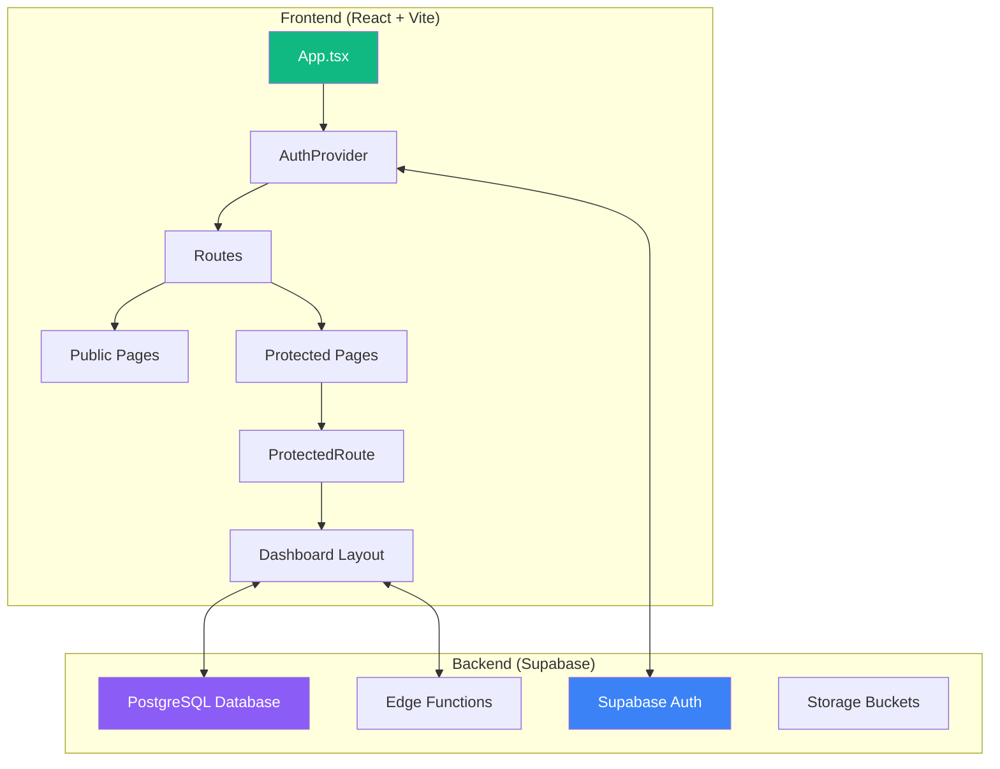
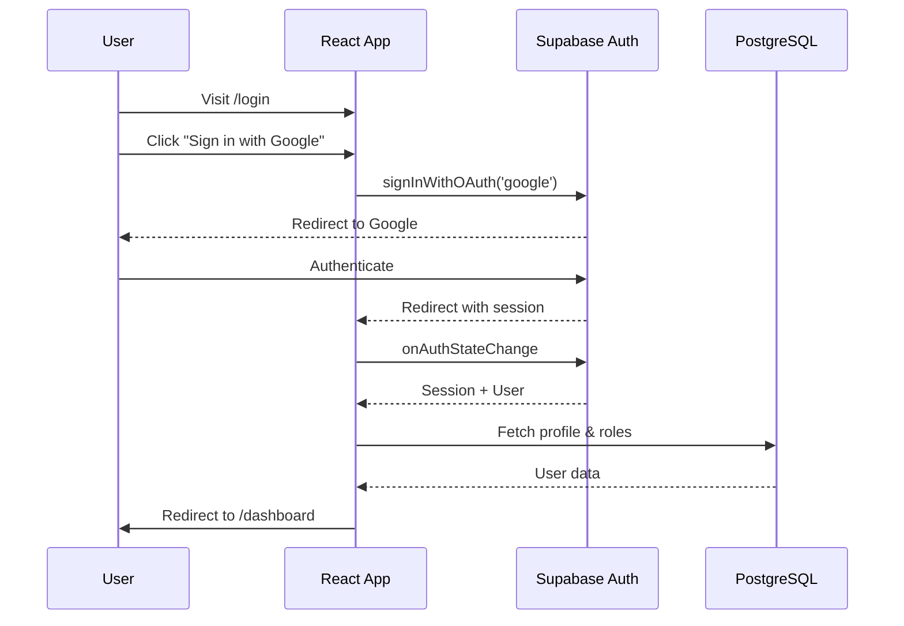
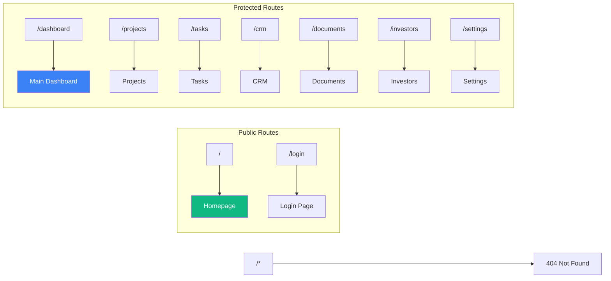
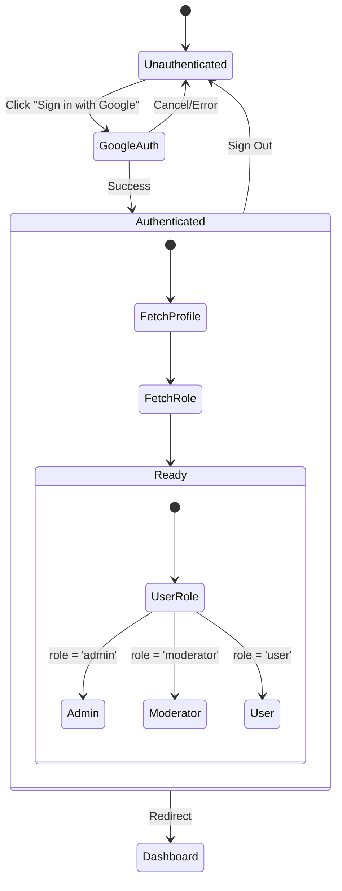
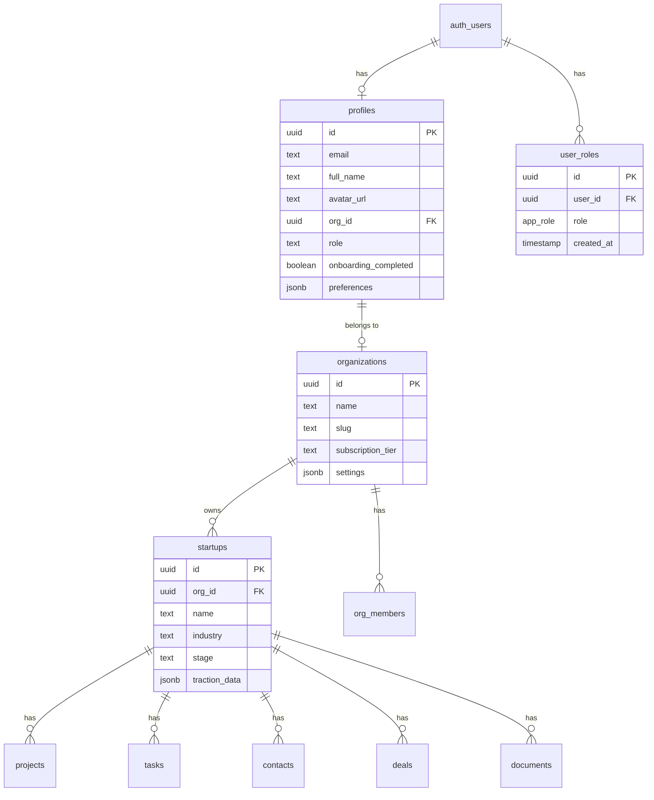
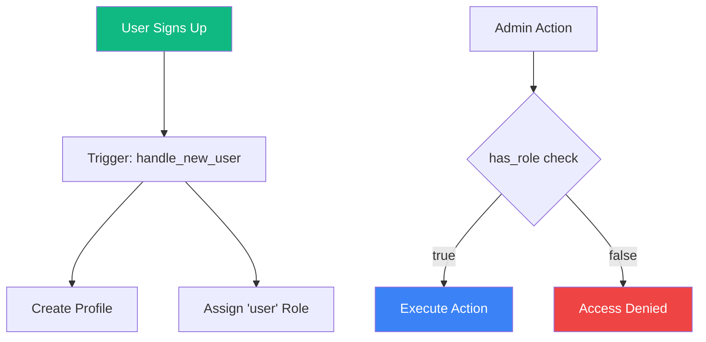
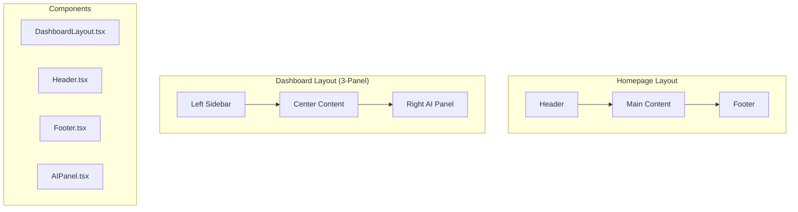
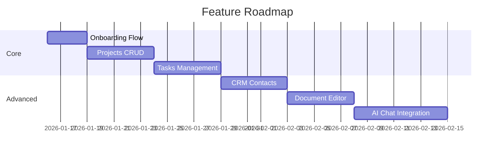
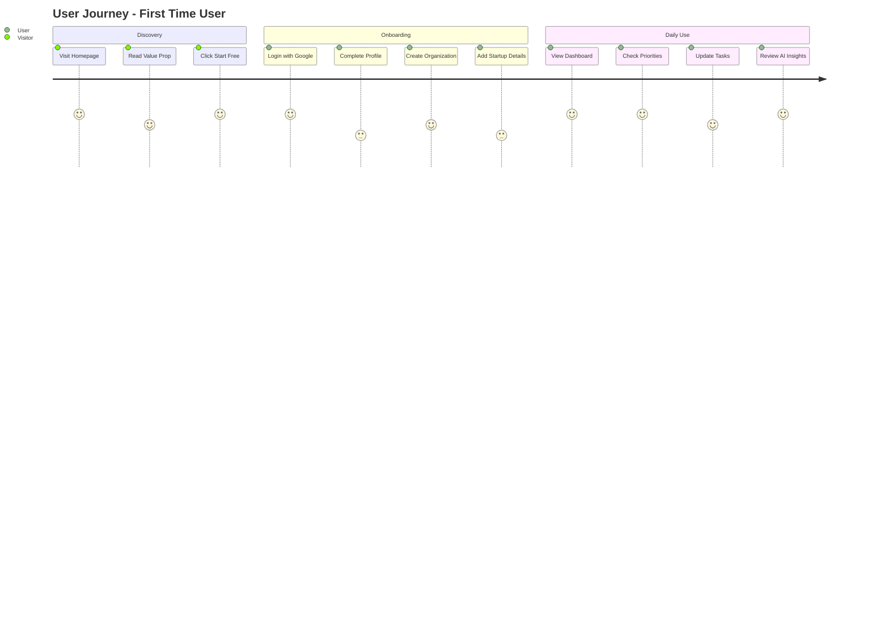
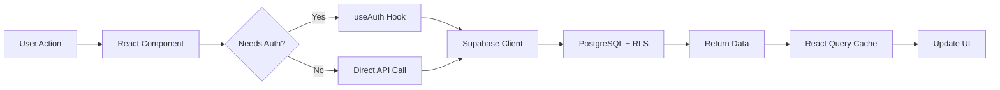

# StartupAI - Technical Overview

> AI-Powered Operating System for Founders

## Table of Contents
- [Tech Stack](#tech-stack)
- [Architecture Overview](#architecture-overview)
- [Directory Structure](#directory-structure)
- [Routing & Navigation](#routing--navigation)
- [Authentication Flow](#authentication-flow)
- [Database Schema](#database-schema)
- [Component Architecture](#component-architecture)
- [Import Paths](#import-paths)
- [Features](#features)
- [Deployment](#deployment)

---

## Tech Stack

### Core Frameworks

| Technology | Version | Purpose |
|------------|---------|---------|
| React | ^18.3.1 | UI Library |
| Vite | ^5.4.19 | Build Tool & Dev Server |
| TypeScript | ^5.8.3 | Type Safety |
| React Router | ^6.30.1 | Client-side Routing |

### Styling & UI

| Technology | Version | Purpose |
|------------|---------|---------|
| Tailwind CSS | ^3.4.17 | Utility-first CSS |
| shadcn/ui | Latest | Component Library (Radix-based) |
| Framer Motion | ^12.26.2 | Animations |
| Lucide React | ^0.462.0 | Icon Library |
| class-variance-authority | ^0.7.1 | Variant Management |
| tailwind-merge | ^2.6.0 | Class Merging |

### State & Data

| Technology | Version | Purpose |
|------------|---------|---------|
| TanStack React Query | ^5.83.0 | Server State Management |
| Supabase JS | ^2.90.1 | Backend as a Service |
| React Hook Form | ^7.61.1 | Form Management |
| Zod | ^3.25.76 | Schema Validation |

### UI Components (Radix Primitives)

| Component | Version |
|-----------|---------|
| @radix-ui/react-dialog | ^1.1.14 |
| @radix-ui/react-dropdown-menu | ^2.1.15 |
| @radix-ui/react-avatar | ^1.1.10 |
| @radix-ui/react-tabs | ^1.1.12 |
| @radix-ui/react-toast | ^1.2.14 |
| @radix-ui/react-tooltip | ^1.2.7 |
| + 20 more... | Various |

### Development Tools

| Technology | Version | Purpose |
|------------|---------|---------|
| ESLint | ^9.32.0 | Linting |
| Vitest | ^3.2.4 | Unit Testing |
| Testing Library | ^16.0.0 | Component Testing |
| PostCSS | ^8.5.6 | CSS Processing |
| Autoprefixer | ^10.4.21 | CSS Vendor Prefixes |

---

## Architecture Overview



### Frontend-Backend Flow



---

## Directory Structure

```
startupai/
├── docs/                          # Documentation
│   └── 01-overview.md
├── public/                        # Static assets
│   ├── favicon.ico
│   ├── placeholder.svg
│   └── robots.txt
├── src/
│   ├── components/
│   │   ├── auth/                  # Authentication components
│   │   │   └── ProtectedRoute.tsx
│   │   ├── dashboard/             # Dashboard-specific components
│   │   │   └── AIPanel.tsx
│   │   ├── home/                  # Homepage sections
│   │   │   ├── CTASection.tsx
│   │   │   ├── FeaturesSection.tsx
│   │   │   ├── HeroSection.tsx
│   │   │   ├── HowItWorksSection.tsx
│   │   │   ├── ProblemSection.tsx
│   │   │   └── WhatChangesSection.tsx
│   │   ├── layout/                # Layout components
│   │   │   ├── DashboardLayout.tsx
│   │   │   ├── Footer.tsx
│   │   │   └── Header.tsx
│   │   └── ui/                    # shadcn/ui components (48 components)
│   │       ├── button.tsx
│   │       ├── card.tsx
│   │       ├── dialog.tsx
│   │       └── ... (45 more)
│   ├── hooks/                     # Custom React hooks
│   │   ├── use-mobile.tsx
│   │   ├── use-toast.ts
│   │   └── useAuth.tsx
│   ├── integrations/
│   │   └── supabase/
│   │       ├── client.ts          # Supabase client config
│   │       └── types.ts           # Auto-generated types
│   ├── lib/
│   │   └── utils.ts               # Utility functions (cn)
│   ├── pages/                     # Route pages
│   │   ├── CRM.tsx
│   │   ├── Dashboard.tsx
│   │   ├── Documents.tsx
│   │   ├── Index.tsx              # Homepage
│   │   ├── Investors.tsx
│   │   ├── Login.tsx
│   │   ├── NotFound.tsx
│   │   ├── Projects.tsx
│   │   ├── Settings.tsx
│   │   └── Tasks.tsx
│   ├── test/                      # Test files
│   │   ├── example.test.ts
│   │   └── setup.ts
│   ├── App.css
│   ├── App.tsx                    # Root component
│   ├── index.css                  # Global styles + design tokens
│   ├── main.tsx                   # Entry point
│   └── vite-env.d.ts
├── supabase/
│   ├── migrations/                # Database migrations
│   └── config.toml                # Supabase configuration
├── .env                           # Environment variables
├── CHANGELOG.md
├── index.html
├── package.json
├── tailwind.config.ts
├── tsconfig.json
├── vite.config.ts
└── vitest.config.ts
```

---

## Routing & Navigation

### Sitemap



### Route Configuration

| Route | Component | Auth Required | Layout |
|-------|-----------|---------------|--------|
| `/` | Index | No | Header + Footer |
| `/login` | Login | No | Standalone |
| `/dashboard` | Dashboard | Yes | DashboardLayout |
| `/projects` | Projects | Yes | DashboardLayout |
| `/tasks` | Tasks | Yes | DashboardLayout |
| `/crm` | CRM | Yes | DashboardLayout |
| `/documents` | Documents | Yes | DashboardLayout |
| `/investors` | Investors | Yes | DashboardLayout |
| `/settings` | Settings | Yes | DashboardLayout |
| `*` | NotFound | No | Standalone |

### Router Setup (App.tsx)

```tsx
<BrowserRouter>
  <Routes>
    <Route path="/" element={<Index />} />
    <Route path="/login" element={<Login />} />
    <Route path="/dashboard" element={
      <ProtectedRoute><Dashboard /></ProtectedRoute>
    } />
    {/* ... other protected routes */}
    <Route path="*" element={<NotFound />} />
  </Routes>
</BrowserRouter>
```

---

## Authentication Flow



### Auth Hook Usage

```tsx
import { useAuth } from '@/hooks/useAuth';

function Component() {
  const { 
    user,           // Supabase User object
    session,        // Supabase Session
    profile,        // profiles table data
    userRole,       // { role: 'admin' | 'moderator' | 'user' }
    loading,        // boolean
    signInWithGoogle,
    signOut,
    isAdmin,        // boolean
    isModerator,    // boolean
  } = useAuth();
}
```

---

## Database Schema

### Core Tables



### Role System



---

## Component Architecture

### Layout System



### UI Component Library

48 shadcn/ui components available:

| Category | Components |
|----------|------------|
| **Feedback** | Alert, Toast, Sonner, Progress, Skeleton |
| **Form** | Input, Textarea, Select, Checkbox, Radio, Switch, Slider, Calendar |
| **Data Display** | Table, Card, Avatar, Badge, Chart |
| **Navigation** | Tabs, Menubar, Breadcrumb, Pagination, Navigation Menu |
| **Overlay** | Dialog, Drawer, Sheet, Popover, Tooltip, Hover Card |
| **Layout** | Accordion, Collapsible, Separator, Resizable, Scroll Area |

---

## Import Paths

### Path Aliases

```typescript
// tsconfig.json
{
  "compilerOptions": {
    "baseUrl": ".",
    "paths": {
      "@/*": ["./src/*"]
    }
  }
}
```

### Common Imports

```typescript
// Components
import { Button } from "@/components/ui/button";
import { Card } from "@/components/ui/card";
import DashboardLayout from "@/components/layout/DashboardLayout";

// Hooks
import { useAuth } from "@/hooks/useAuth";
import { useToast } from "@/hooks/use-toast";
import { useMobile } from "@/hooks/use-mobile";

// Integrations
import { supabase } from "@/integrations/supabase/client";

// Utilities
import { cn } from "@/lib/utils";
```

---

## Features

### Completed Features ✅

| Feature | Status | Description |
|---------|--------|-------------|
| Homepage | ✅ Complete | Marketing landing page with sections |
| Authentication | ✅ Complete | Google OAuth with profiles & roles |
| Dashboard | ✅ Complete | 3-panel layout with metrics |
| AI Panel | ✅ Complete | Insights, risks, suggestions UI |
| Protected Routes | ✅ Complete | Auth-gated pages |
| Design System | ✅ Complete | Premium light theme |

### Placeholder Pages 🔨

| Page | Status | Next Steps |
|------|--------|------------|
| Projects | Placeholder | Add Kanban board, project CRUD |
| Tasks | Placeholder | Add task list, filters, creation |
| CRM | Placeholder | Add contact management, deals |
| Documents | Placeholder | Add document editor, templates |
| Investors | Placeholder | Add investor pipeline |
| Settings | Placeholder | Add profile editing, preferences |

### Planned Features 📋



---

## Workflows

### User Journey



### Data Flow



---

## Deployment

### Environment Variables

```env
VITE_SUPABASE_PROJECT_ID="yvyesmiczbjqwbqtlidy"
VITE_SUPABASE_PUBLISHABLE_KEY="eyJhbG..."
VITE_SUPABASE_URL="https://yvyesmiczbjqwbqtlidy.supabase.co"
```

### Build Commands

```bash
# Development
npm run dev

# Production Build
npm run build

# Preview Production Build
npm run preview

# Run Tests
npm run test
```

### URLs

| Environment | URL |
|-------------|-----|
| Preview | https://id-preview--c853d8c8-40a1-4530-9351-9050838a00d9.lovable.app |
| Production | https://rocket-path-ai.lovable.app |
| Supabase | https://supabase.com/dashboard/project/yvyesmiczbjqwbqtlidy |

---

## Security Considerations

1. **Row Level Security (RLS)** - All tables have RLS policies
2. **Role-Based Access** - Roles stored in separate table to prevent privilege escalation
3. **Security Definer Functions** - Prevent RLS recursion attacks
4. **Auth State Listener** - Set up before getSession() to prevent race conditions
5. **Protected Routes** - Server-side validation via RLS, client-side via ProtectedRoute

---

*Last Updated: 2026-01-15*
