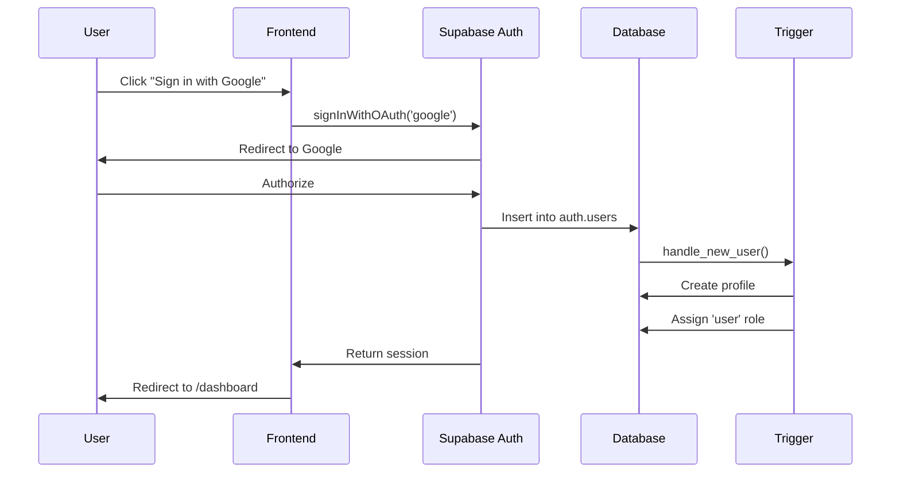
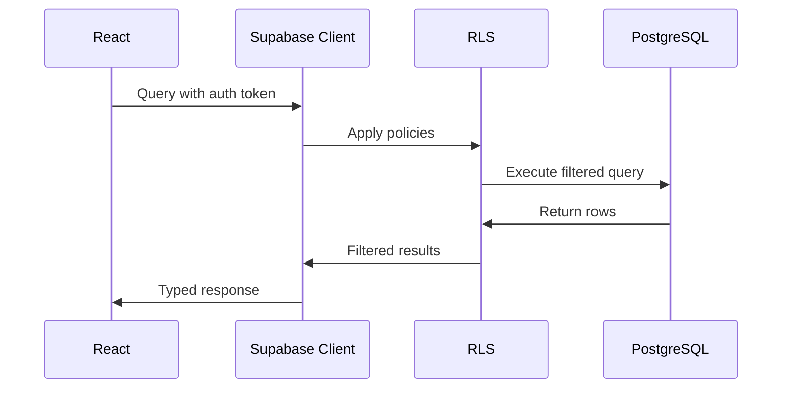

# Supabase Database Schema

> **Source of Truth**: This schema documentation reflects the actual Supabase database structure. All frontend types, API calls, and data models must align with this schema.
> 
> **Last Updated:** 2026-01-21  
> **Project ID:** yvyesmiczbjqwbqtlidy  
> **Total Tables:** 43  
> **RLS Policies:** 168

---

## Overview

The StartupAI platform uses Supabase as the backend-as-a-service, providing:
- **Authentication**: Google OAuth with automatic profile creation
- **PostgreSQL Database**: 43 tables with relational data storage
- **Row Level Security**: 168 policies for organization and user-scoped data access
- **Edge Functions**: Serverless backend logic (ai-chat deployed)

---

## Entity Relationship Diagram

```mermaid
erDiagram
    organizations ||--o{ profiles : "has members"
    organizations ||--o{ org_members : "memberships"
    organizations ||--o{ startups : "owns"
    organizations ||--o{ integrations : "configures"
    organizations ||--o{ agent_configs : "customizes"
    organizations ||--o{ ai_runs : "tracks"
    organizations ||--o{ proposed_actions : "reviews"
    organizations ||--o{ audit_log : "logs"
    
    profiles ||--o{ user_roles : "has roles"
    profiles ||--o{ chat_sessions : "owns"
    profiles ||--o{ chat_messages : "sends"
    profiles ||--o{ chat_facts : "stores"
    profiles ||--o{ notifications : "receives"
    
    startups ||--o{ projects : "contains"
    startups ||--o{ tasks : "tracks"
    startups ||--o{ contacts : "manages"
    startups ||--o{ deals : "pursues"
    startups ||--o{ documents : "stores"
    startups ||--o{ communications : "logs"
    startups ||--o{ file_uploads : "uploads"
    startups ||--o{ investors : "tracks"
    startups ||--o{ events : "hosts"
    startups ||--o{ benchmark_snapshots : "benchmarks"
    startups ||--o{ startup_playbooks : "follows"
    startups ||--o{ pitch_decks : "creates"
    
    events ||--o{ event_attendees : "has"
    events ||--o{ event_venues : "at"
    events ||--o{ event_assets : "produces"
    events ||--o{ sponsors : "supported by"
    
    projects ||--o{ tasks : "contains"
    contacts ||--o{ deals : "linked to"
    contacts ||--o{ communications : "has"
    contacts ||--o{ contact_tags : "tagged with"
    
    industry_packs ||--o{ playbooks : "contains"
    playbooks ||--o{ startup_playbooks : "matched to"
    
    chat_sessions ||--o{ chat_messages : "contains"
    proposed_actions ||--o{ action_executions : "executed as"
    
    pitch_decks ||--o{ pitch_deck_slides : "contains"
```



---

## Authentication & Authorization

### Auth Flow



### Role System

| Role Type | Location | Values | Purpose |
|-----------|----------|--------|---------|
| App Role | `user_roles.role` | admin, moderator, user | Application-wide permissions |
| Org Role | `profiles.role` | owner, admin, member | Organization-level access |

---

## Core Tables

### Organizations
| Column | Type | Default | Description |
|--------|------|---------|-------------|
| id | uuid | gen_random_uuid() | Primary key |
| name | text | — | Organization name |
| slug | text | — | URL-safe unique identifier |
| subscription_tier | text | 'free' | free, pro, enterprise |
| subscription_status | text | 'active' | active, cancelled, past_due |
| settings | jsonb | {} | AI configs, feature flags |
| stripe_customer_id | text | — | Billing integration |

### Profiles
| Column | Type | Default | Description |
|--------|------|---------|-------------|
| id | uuid | — | FK to auth.users.id |
| email | text | — | User email |
| full_name | text | — | Display name |
| avatar_url | text | — | Profile picture |
| org_id | uuid | — | FK to organizations |
| role | text | 'member' | Org role |
| onboarding_completed | boolean | false | Wizard completion flag |
| preferences | jsonb | {} | Theme, notifications, AI settings |

### Startups
| Column | Type | Default | Description |
|--------|------|---------|-------------|
| id | uuid | gen_random_uuid() | Primary key |
| org_id | uuid | — | FK to organizations |
| name | text | — | Startup name |
| industry | text | — | Industry category |
| stage | text | 'idea' | idea, mvp, growth, scale |
| traction_data | jsonb | {} | MRR, ARR, users, etc. |
| is_raising | boolean | false | Currently fundraising |
| raise_amount | numeric | — | Target raise |
| valuation_cap | numeric | — | Valuation cap |

---

## Events Module Tables

### Events
| Column | Type | Default | Description |
|--------|------|---------|-------------|
| id | uuid | gen_random_uuid() | Primary key |
| startup_id | uuid | — | FK to startups |
| title | text | — | Event title |
| name | text | — | Event name |
| description | text | — | Event description |
| start_date | timestamptz | — | Start date/time |
| end_date | timestamptz | — | End date/time |
| status | event_status | 'scheduled' | scheduled, in_progress, completed, cancelled, postponed |
| event_type | event_type | 'other' | conference, meetup, workshop, pitch_event, demo_day, webinar, networking, hackathon, other |
| event_scope | event_scope | 'internal' | internal, external |
| location_type | event_location_type | 'in_person' | in_person, virtual, hybrid |
| location | text | — | Physical location |
| virtual_meeting_url | text | — | Virtual meeting link |
| budget | numeric | 0 | Event budget |
| capacity | integer | — | Max attendees |
| health_score | integer | 0 | AI-calculated health |

### Event Attendees
| Column | Type | Default | Description |
|--------|------|---------|-------------|
| id | uuid | gen_random_uuid() | Primary key |
| event_id | uuid | — | FK to events |
| name | text | — | Attendee name |
| email | text | — | Attendee email |
| rsvp_status | rsvp_status | 'pending' | pending, invited, registered, confirmed, attended, no_show, cancelled |
| attendee_type | attendee_type | 'general' | general, vip, speaker, sponsor, staff, media, investor |
| checked_in | boolean | false | Check-in status |

### Event Venues
| Column | Type | Default | Description |
|--------|------|---------|-------------|
| id | uuid | gen_random_uuid() | Primary key |
| event_id | uuid | — | FK to events |
| name | text | — | Venue name |
| city | text | — | City |
| status | venue_status | 'researching' | researching, shortlisted, visited, negotiating, booked, confirmed, rejected |
| is_primary | boolean | false | Primary venue flag |
| capacity | integer | — | Venue capacity |
| rental_cost | numeric | 0 | Rental cost |

### Event Assets
| Column | Type | Default | Description |
|--------|------|---------|-------------|
| id | uuid | gen_random_uuid() | Primary key |
| event_id | uuid | — | FK to events |
| name | text | — | Asset name |
| asset_type | event_asset_type | — | social_post, email, banner, flyer, video, presentation, other |
| platform | asset_platform | 'other' | linkedin, twitter, instagram, facebook, tiktok, email, other |
| status | asset_status | 'draft' | draft, pending_review, approved, published, scheduled, rejected |
| ai_generated | boolean | false | AI-generated flag |

### Sponsors
| Column | Type | Default | Description |
|--------|------|---------|-------------|
| id | uuid | gen_random_uuid() | Primary key |
| event_id | uuid | — | FK to events |
| name | text | — | Sponsor name |
| company_name | text | — | Company name |
| tier | sponsor_tier | 'silver' | platinum, gold, silver, bronze, community, in_kind |
| status | sponsor_status | 'prospect' | prospect, contacted, negotiating, confirmed, declined, cancelled |
| amount | numeric | 0 | Sponsorship amount |

---

## CRM Tables

### Contacts
| Column | Type | Default | Description |
|--------|------|---------|-------------|
| id | uuid | gen_random_uuid() | Primary key |
| startup_id | uuid | — | FK to startups |
| name | text | — | Contact name |
| email | text | — | Email address |
| type | text | 'other' | investor, customer, partner, other |
| relationship_strength | text | 'cold' | cold, warm, hot |
| ai_summary | text | — | AI-generated summary |

### Deals
| Column | Type | Default | Description |
|--------|------|---------|-------------|
| id | uuid | gen_random_uuid() | Primary key |
| startup_id | uuid | — | FK to startups |
| contact_id | uuid | — | FK to contacts |
| name | text | — | Deal name |
| type | text | 'investor' | investor, customer |
| stage | text | 'research' | research, outreach, meeting, termsheet, closed |
| amount | numeric | — | Deal value |
| probability | integer | 0 | Win likelihood % |
| ai_score | integer | — | AI-calculated score |

### Investors
| Column | Type | Default | Description |
|--------|------|---------|-------------|
| id | uuid | gen_random_uuid() | Primary key |
| startup_id | uuid | — | FK to startups |
| name | text | — | Investor name |
| firm_name | text | — | Firm name |
| type | text | 'vc' | vc, angel, etc. |
| status | text | 'researching' | Pipeline status |
| check_size_min | numeric | — | Min check size |
| check_size_max | numeric | — | Max check size |

---

## AI System Tables

### AI Runs
| Column | Type | Default | Description |
|--------|------|---------|-------------|
| id | uuid | gen_random_uuid() | Primary key |
| org_id | uuid | — | FK to organizations |
| user_id | uuid | — | FK to profiles |
| agent_name | text | — | Which agent ran |
| model | text | — | LLM model used |
| provider | text | 'gemini' | AI provider |
| input_tokens | integer | — | Tokens consumed |
| output_tokens | integer | — | Tokens generated |
| thinking_tokens | integer | — | Thinking tokens |
| cost_usd | numeric | — | Calculated cost |
| status | text | 'success' | success, error |

### Agent Configs
| Column | Type | Default | Description |
|--------|------|---------|-------------|
| id | uuid | gen_random_uuid() | Primary key |
| org_id | uuid | — | FK to organizations (null = global) |
| agent_name | text | — | Agent identifier |
| display_name | text | — | Display name |
| model | text | 'gemini-3-flash-preview' | Default model |
| system_prompt | text | — | Custom instructions |
| enabled_tools | text[] | {} | Allowed tools |
| max_cost_per_run | numeric | 0.10 | Cost limit |
| daily_budget | numeric | — | Daily spending cap |

### Chat Sessions
| Column | Type | Default | Description |
|--------|------|---------|-------------|
| id | uuid | gen_random_uuid() | Primary key |
| user_id | uuid | — | FK to profiles |
| startup_id | uuid | — | Optional startup context |
| title | text | — | Auto-generated title |
| last_tab | text | 'coach' | coach, research, execute |
| message_count | integer | 0 | Total messages |

### Chat Messages
| Column | Type | Default | Description |
|--------|------|---------|-------------|
| id | uuid | gen_random_uuid() | Primary key |
| session_id | uuid | — | FK to chat_sessions |
| user_id | uuid | — | FK to profiles |
| role | text | — | user, assistant |
| content | text | — | Message content |
| tab | text | — | Which AI tab |
| sources | jsonb | [] | Citation data |
| suggested_actions | jsonb | [] | Proposed actions |

---

## Row Level Security

### Helper Functions
| Function | Returns | Purpose |
|----------|---------|---------|
| `user_org_id()` | uuid | Get current user's org_id |
| `org_role()` | text | Get user's role in org (owner/admin/member) |
| `startup_in_org(uuid)` | boolean | Check startup belongs to user's org |
| `is_org_member(uuid)` | boolean | Check if user is member of org |

### Policy Patterns

```sql
-- Org-scoped SELECT
CREATE POLICY "Users view startups in org" ON startups
FOR SELECT USING (org_id = user_org_id());

-- Admin-only UPDATE  
CREATE POLICY "Admins update organization" ON organizations
FOR UPDATE USING (
  id = user_org_id() AND 
  org_role() = ANY(ARRAY['owner', 'admin'])
);

-- Startup-scoped access
CREATE POLICY "Users view tasks in org" ON tasks
FOR SELECT USING (startup_in_org(startup_id));

-- User-scoped (personal data)
CREATE POLICY "Users view own notifications" ON notifications
FOR SELECT USING (user_id = auth.uid());

-- Event-scoped (child tables)
CREATE POLICY "authenticated can select event venues" ON event_venues
FOR SELECT USING (
  event_id IN (
    SELECT id FROM events 
    WHERE user_org_id() IS NULL OR startup_in_org(startup_id)
  )
);
```

---

## Database Enums

| Enum | Values |
|------|--------|
| app_role | admin, moderator, user |
| event_status | scheduled, in_progress, completed, cancelled, postponed |
| event_type | conference, meetup, workshop, pitch_event, demo_day, webinar, networking, hackathon, other |
| event_scope | internal, external |
| event_location_type | in_person, virtual, hybrid |
| rsvp_status | pending, invited, registered, confirmed, attended, no_show, cancelled |
| attendee_type | general, vip, speaker, sponsor, staff, media, investor |
| venue_status | researching, shortlisted, visited, negotiating, booked, confirmed, rejected |
| sponsor_status | prospect, contacted, negotiating, confirmed, declined, cancelled |
| sponsor_tier | platinum, gold, silver, bronze, community, in_kind |
| asset_platform | linkedin, twitter, instagram, facebook, tiktok, email, other |
| asset_status | draft, pending_review, approved, published, scheduled, rejected |
| event_asset_type | social_post, email, banner, flyer, video, presentation, other |

---

## Type Usage

```typescript
import { Tables, TablesInsert, TablesUpdate } from '@/integrations/supabase/types';

// Row type
type Event = Tables<'events'>;
type Startup = Tables<'startups'>;

// Insert type
type NewEvent = TablesInsert<'events'>;

// Update type  
type UpdateEvent = TablesUpdate<'events'>;
```

---

## Data Flow



---

## Security Notes

- ✅ RLS enabled on all 43 tables
- ✅ 168 policies covering all operations
- ⚠️ Leaked password protection disabled (minor - Google OAuth primary)
- ✅ Helper functions use SECURITY DEFINER appropriately
- ✅ Event child tables properly scoped via event_id
