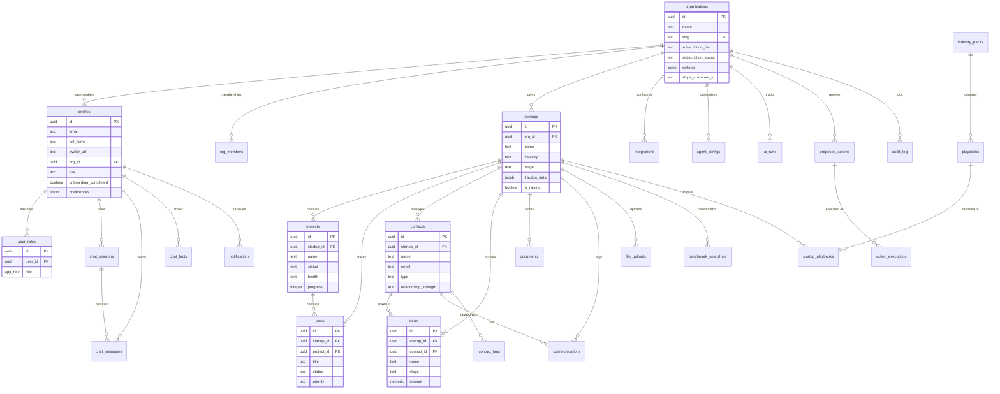
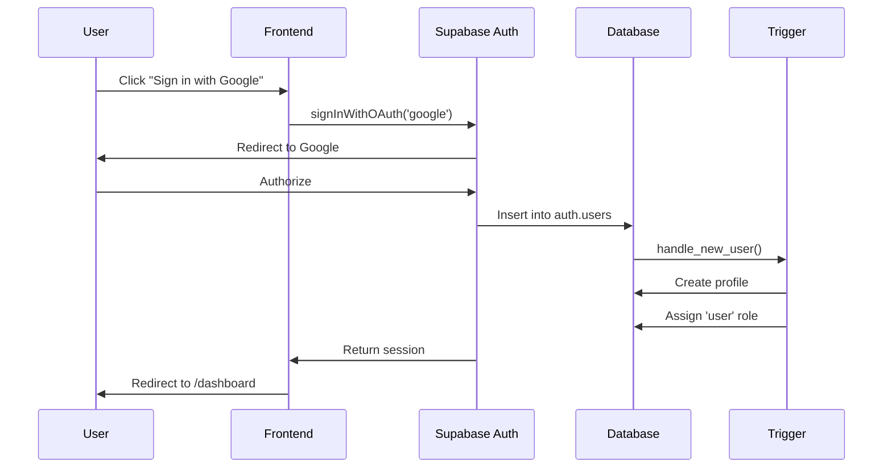
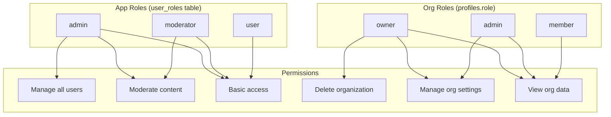
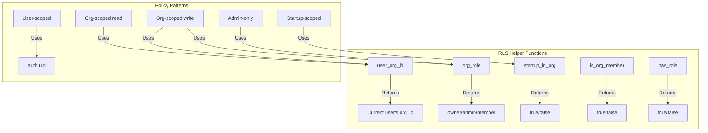
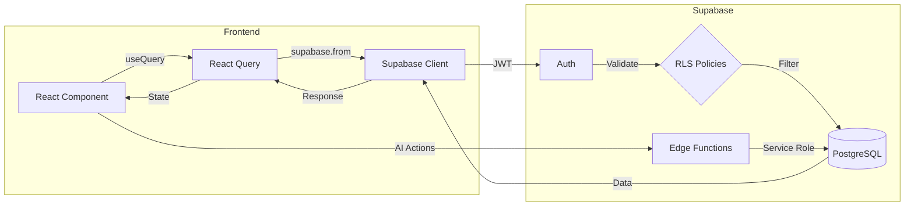

# Supabase Database Schema

> **Source of Truth**: This schema documentation reflects the actual Supabase database structure. All frontend types, API calls, and data models must align with this schema.

## Overview

The StartupAI platform uses Supabase as the backend-as-a-service, providing:
- **Authentication**: Google OAuth with automatic profile creation
- **PostgreSQL Database**: Relational data storage with RLS
- **Row Level Security**: Organization and user-scoped data access
- **Edge Functions**: Serverless backend logic

---

## Entity Relationship Diagram



---

## Authentication & Authorization

### Auth Flow



### Role System



---

## Core Tables

### Organizations
Central tenant for multi-org support.

| Column | Type | Description |
|--------|------|-------------|
| id | uuid | Primary key |
| name | text | Organization name |
| slug | text | URL-safe unique identifier |
| subscription_tier | text | free, pro, enterprise |
| subscription_status | text | active, cancelled, past_due |
| settings | jsonb | AI configs, feature flags |
| stripe_customer_id | text | Billing integration |

### Profiles
User profiles linked to auth.users.

| Column | Type | Description |
|--------|------|-------------|
| id | uuid | FK to auth.users.id |
| email | text | User email |
| full_name | text | Display name |
| avatar_url | text | Profile picture |
| org_id | uuid | FK to organizations |
| role | text | Org role (owner/admin/member) |
| onboarding_completed | boolean | Wizard completion flag |
| preferences | jsonb | Theme, notifications, AI settings |

### User Roles
Application-level roles separate from org membership.

| Column | Type | Description |
|--------|------|-------------|
| id | uuid | Primary key |
| user_id | uuid | FK to auth.users |
| role | app_role | admin, moderator, user |

### Startups
Company profiles within an organization.

| Column | Type | Description |
|--------|------|-------------|
| id | uuid | Primary key |
| org_id | uuid | FK to organizations |
| name | text | Startup name |
| industry | text | Industry category |
| stage | text | idea, mvp, growth, scale |
| traction_data | jsonb | MRR, ARR, users, etc. |
| is_raising | boolean | Currently fundraising |
| raise_amount | numeric | Target raise |
| valuation_cap | numeric | Valuation cap |

---

## CRM Tables

### Contacts
People relationships (investors, customers, partners).

| Column | Type | Description |
|--------|------|-------------|
| id | uuid | Primary key |
| startup_id | uuid | FK to startups |
| name | text | Contact name |
| email | text | Email address |
| type | text | investor, customer, partner, other |
| relationship_strength | text | cold, warm, hot |
| linkedin_url | text | LinkedIn profile |
| ai_summary | text | AI-generated summary |

### Deals
Pipeline tracking for fundraising and sales.

| Column | Type | Description |
|--------|------|-------------|
| id | uuid | Primary key |
| startup_id | uuid | FK to startups |
| contact_id | uuid | FK to contacts |
| name | text | Deal name |
| type | text | investor, customer |
| stage | text | research, outreach, meeting, termsheet, closed |
| amount | numeric | Deal value |
| probability | integer | Win likelihood % |
| ai_score | integer | AI-calculated score |

### Communications
Interaction history with contacts.

| Column | Type | Description |
|--------|------|-------------|
| id | uuid | Primary key |
| contact_id | uuid | FK to contacts |
| type | text | email, call, meeting, note |
| content | text | Full content |
| summary | text | AI summary |
| sentiment | text | positive, neutral, negative |
| action_items | text[] | Extracted actions |

---

## AI System Tables

### AI Runs
Tracks all AI operations for billing and debugging.

| Column | Type | Description |
|--------|------|-------------|
| id | uuid | Primary key |
| org_id | uuid | FK to organizations |
| agent_name | text | Which agent ran |
| model | text | LLM model used |
| input_tokens | integer | Tokens consumed |
| output_tokens | integer | Tokens generated |
| cost_usd | numeric | Calculated cost |
| status | text | success, error |

### Agent Configs
Per-org AI agent customization.

| Column | Type | Description |
|--------|------|-------------|
| id | uuid | Primary key |
| org_id | uuid | FK to organizations (null = global) |
| agent_name | text | Agent identifier |
| model | text | Default model |
| system_prompt | text | Custom instructions |
| enabled_tools | text[] | Allowed tools |
| max_cost_per_run | numeric | Cost limit |
| daily_budget | numeric | Daily spending cap |

### Proposed Actions
AI-suggested actions requiring approval.

| Column | Type | Description |
|--------|------|-------------|
| id | uuid | Primary key |
| org_id | uuid | FK to organizations |
| agent_name | text | Suggesting agent |
| action_type | text | create, update, delete |
| target_table | text | Affected table |
| payload | jsonb | Action data |
| status | text | pending, approved, rejected |
| reasoning | text | AI explanation |

---

## Chat System

### Chat Sessions
Conversation containers.

| Column | Type | Description |
|--------|------|-------------|
| id | uuid | Primary key |
| user_id | uuid | FK to auth.users |
| startup_id | uuid | Optional startup context |
| title | text | Auto-generated title |
| last_tab | text | coach, research, execute |
| message_count | integer | Total messages |

### Chat Messages
Individual messages in sessions.

| Column | Type | Description |
|--------|------|-------------|
| id | uuid | Primary key |
| session_id | uuid | FK to chat_sessions |
| user_id | uuid | FK to auth.users |
| role | text | user, assistant |
| content | text | Message content |
| tab | text | Which AI tab |
| sources | jsonb | Citation data |
| suggested_actions | jsonb | Proposed actions |

### Chat Facts
Extracted knowledge from conversations.

| Column | Type | Description |
|--------|------|-------------|
| id | uuid | Primary key |
| user_id | uuid | FK to auth.users |
| fact_type | text | preference, goal, context |
| content | text | Fact content |
| confidence | numeric | Extraction confidence |
| expires_at | timestamp | Optional expiration |

---

## Row Level Security

### Security Model



### Policy Examples

```sql
-- Org-scoped SELECT
CREATE POLICY "Users view startups in org" ON startups
FOR SELECT USING (org_id = user_org_id());

-- Admin-only UPDATE  
CREATE POLICY "Admins update organization" ON organizations
FOR UPDATE USING (
  id = user_org_id() AND 
  org_role() = ANY(ARRAY['owner', 'admin'])
);

-- Startup-scoped access
CREATE POLICY "Users view tasks in org" ON tasks
FOR SELECT USING (startup_in_org(startup_id));

-- User-scoped (personal data)
CREATE POLICY "Users view own notifications" ON notifications
FOR SELECT USING (user_id = auth.uid());
```

---

## Database Functions

### Authentication Trigger
```sql
-- Automatically creates profile and assigns role on signup
CREATE FUNCTION handle_new_user() RETURNS trigger AS $$
BEGIN
    INSERT INTO profiles (id, email, full_name, avatar_url)
    VALUES (NEW.id, NEW.email, ...);
    
    INSERT INTO user_roles (user_id, role)
    VALUES (NEW.id, 'user');
    
    RETURN NEW;
END;
$$ LANGUAGE plpgsql;
```

### Helper Functions
```sql
-- Get current user's org
CREATE FUNCTION user_org_id() RETURNS uuid AS $$
  SELECT org_id FROM profiles WHERE id = auth.uid()
$$ LANGUAGE sql STABLE SECURITY DEFINER;

-- Check startup belongs to user's org
CREATE FUNCTION startup_in_org(check_startup_id uuid) RETURNS boolean AS $$
  SELECT EXISTS (
    SELECT 1 FROM startups s
    INNER JOIN profiles p ON p.org_id = s.org_id
    WHERE s.id = check_startup_id AND p.id = auth.uid()
  )
$$ LANGUAGE sql STABLE SECURITY DEFINER;
```

---

## Enums

### app_role
```typescript
type AppRole = 'admin' | 'moderator' | 'user';
```

---

## Type Generation

Types are auto-generated from the schema:

```bash
# Located at: src/integrations/supabase/types.ts
# Generated via Supabase CLI or Lovable sync
```

### Usage in Frontend
```typescript
import { Tables, TablesInsert, TablesUpdate } from '@/integrations/supabase/types';

// Row type
type Startup = Tables<'startups'>;

// Insert type
type NewContact = TablesInsert<'contacts'>;

// Update type  
type UpdateDeal = TablesUpdate<'deals'>;
```

---

## Data Flow



---

## Best Practices

1. **Always use RLS** - Never disable RLS on user-facing tables
2. **Use helper functions** - `user_org_id()`, `startup_in_org()` for consistent access control
3. **Type safety** - Import types from `types.ts`, don't define manually
4. **Audit logging** - Important actions logged to `audit_log` table
5. **AI actions** - Use `proposed_actions` for AI-suggested changes requiring approval
