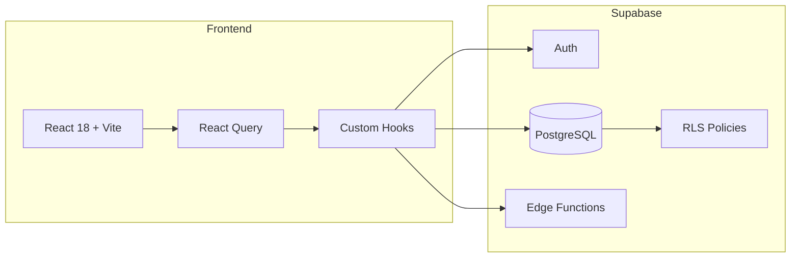

# Frontend-Backend Wiring Setup

> **Status:** Connected  
> **Project ID:** yvyesmiczbjqwbqtlidy  
> **Last Updated:** 2026-01-21

---

## Connection Overview



---

## 1. Supabase Client Setup

### Configuration
```typescript
// src/integrations/supabase/client.ts
import { createClient } from '@supabase/supabase-js';
import type { Database } from './types';

const SUPABASE_URL = "https://yvyesmiczbjqwbqtlidy.supabase.co";
const SUPABASE_PUBLISHABLE_KEY = "eyJhbGciOiJI...";

export const supabase = createClient<Database>(SUPABASE_URL, SUPABASE_PUBLISHABLE_KEY, {
  auth: {
    storage: localStorage,
    persistSession: true,
    autoRefreshToken: true,
  }
});
```

### Usage Pattern
```typescript
import { supabase } from '@/integrations/supabase/client';
```

---

## 2. Authentication Wiring

### Auth Hook
```typescript
// src/hooks/useAuth.tsx
export function useAuth() {
  const [user, setUser] = useState<User | null>(null);
  const [profile, setProfile] = useState<Profile | null>(null);
  const [loading, setLoading] = useState(true);

  useEffect(() => {
    // Listen for auth changes
    supabase.auth.onAuthStateChange((event, session) => {
      setUser(session?.user ?? null);
      if (session?.user) {
        fetchProfile(session.user.id);
      }
    });
  }, []);

  return { user, profile, loading, signIn, signOut };
}
```

### Auth Flow
1. User clicks "Sign in with Google"
2. `supabase.auth.signInWithOAuth({ provider: 'google' })`
3. Redirect to Google → callback
4. `handle_new_user()` trigger creates profile
5. Frontend receives session, fetches profile

---

## 3. Data Layer Wiring

### Hook Pattern
```typescript
// src/hooks/useEvents.ts
import { useQuery, useMutation, useQueryClient } from '@tanstack/react-query';
import { supabase } from '@/integrations/supabase/client';
import type { Database } from '@/integrations/supabase/types';

type Event = Database['public']['Tables']['events']['Row'];
type EventInsert = Database['public']['Tables']['events']['Insert'];

export function useEvents(filters?: EventFilters) {
  return useQuery({
    queryKey: ['events', filters],
    queryFn: async () => {
      const { data, error } = await supabase
        .from('events')
        .select(`
          *,
          event_attendees(id, rsvp_status),
          event_venues(id, name, city, is_primary)
        `)
        .order('start_date', { ascending: true });
      
      if (error) throw error;
      return data;
    },
  });
}

export function useCreateEvent() {
  const queryClient = useQueryClient();
  
  return useMutation({
    mutationFn: async (event: EventInsert) => {
      const { data, error } = await supabase
        .from('events')
        .insert(event)
        .select()
        .single();
      
      if (error) throw error;
      return data;
    },
    onSuccess: () => {
      queryClient.invalidateQueries({ queryKey: ['events'] });
    },
  });
}
```

### Available Data Hooks

| Hook | Tables | Status |
|------|--------|--------|
| `useAuth` | profiles, user_roles | ✅ Complete |
| `useDashboardData` | startups, projects, tasks, deals | ✅ Complete |
| `useProjects` | projects | ✅ Complete |
| `useTasks` | tasks | ✅ Complete |
| `useCRM` | contacts, deals | ✅ Complete |
| `useInvestors` | investors | ✅ Complete |
| `useEvents` | events, event_* | ✅ Complete |
| `useDocuments` | documents | ✅ Complete |
| `useLeanCanvas` | documents (lean_canvas type) | ✅ Complete |
| `useSettings` | profiles, startups | ✅ Complete |

---

## 4. Edge Functions Wiring

### Deployed Functions

| Function | Purpose | Status |
|----------|---------|--------|
| `ai-chat` | Conversational AI assistant | ✅ Deployed |

### Calling Edge Functions

```typescript
// src/hooks/useAIChat.ts
export function useAIChat() {
  return useMutation({
    mutationFn: async ({ message, context }: ChatInput) => {
      const { data, error } = await supabase.functions.invoke('ai-chat', {
        body: { message, context },
      });
      
      if (error) throw error;
      return data;
    },
  });
}
```

### Edge Function Pattern
```typescript
// supabase/functions/ai-chat/index.ts
import { serve } from "https://deno.land/std@0.168.0/http/server.ts";

const corsHeaders = {
  'Access-Control-Allow-Origin': '*',
  'Access-Control-Allow-Headers': 'authorization, x-client-info, apikey, content-type',
};

serve(async (req) => {
  if (req.method === 'OPTIONS') {
    return new Response(null, { headers: corsHeaders });
  }

  try {
    const { message, context } = await req.json();
    
    // AI processing logic...
    
    return new Response(JSON.stringify({ response }), {
      headers: { ...corsHeaders, 'Content-Type': 'application/json' },
    });
  } catch (error) {
    return new Response(JSON.stringify({ error: error.message }), {
      status: 500,
      headers: { ...corsHeaders, 'Content-Type': 'application/json' },
    });
  }
});
```

---

## 5. Real-time Subscriptions

```typescript
// Subscribe to real-time updates
useEffect(() => {
  const channel = supabase
    .channel('events-changes')
    .on(
      'postgres_changes',
      { event: '*', schema: 'public', table: 'events' },
      (payload) => {
        queryClient.invalidateQueries({ queryKey: ['events'] });
      }
    )
    .subscribe();

  return () => {
    supabase.removeChannel(channel);
  };
}, []);
```

---

## 6. Type Safety

### Auto-Generated Types
```typescript
// src/integrations/supabase/types.ts (auto-generated)
export type Database = {
  public: {
    Tables: {
      events: {
        Row: { id: string; title: string; start_date: string; ... }
        Insert: { title: string; start_date: string; ... }
        Update: { title?: string; start_date?: string; ... }
      }
      // ... 42 more tables
    }
    Enums: {
      app_role: 'admin' | 'moderator' | 'user'
      event_status: 'scheduled' | 'in_progress' | ...
      // ... more enums
    }
  }
}
```

### Usage
```typescript
import { Tables, TablesInsert, TablesUpdate, Enums } from '@/integrations/supabase/types';

type Event = Tables<'events'>;
type NewEvent = TablesInsert<'events'>;
type EventStatus = Enums<'event_status'>;
```

---

## 7. Error Handling Pattern

```typescript
export function useDataQuery() {
  return useQuery({
    queryKey: ['data'],
    queryFn: async () => {
      const { data, error } = await supabase.from('table').select('*');
      
      if (error) {
        // Log for debugging
        console.error('Query error:', error);
        
        // Handle specific errors
        if (error.code === '42501') {
          throw new Error('Access denied');
        }
        if (error.code === 'PGRST116') {
          return null; // No data found
        }
        
        throw error;
      }
      
      return data;
    },
    retry: (failureCount, error) => {
      // Don't retry auth errors
      if (error.message.includes('Access denied')) return false;
      return failureCount < 3;
    },
  });
}
```

---

## 8. Component Integration

### Three-Panel Layout Pattern
```typescript
// pages/Events.tsx
export default function Events() {
  const { data: events, isLoading, error } = useEvents(filters);
  
  return (
    <DashboardLayout>
      {/* Left Panel: Filters */}
      <aside>
        <EventFiltersPanel filters={filters} onChange={setFilters} />
      </aside>
      
      {/* Main Panel: Data */}
      <main>
        {isLoading && <LoadingState />}
        {error && <ErrorState error={error} />}
        {events?.length === 0 && <EmptyState />}
        {events?.map(event => <EventCard key={event.id} event={event} />)}
      </main>
      
      {/* Right Panel: AI */}
      <aside>
        <EventsAIPanel events={events} />
      </aside>
    </DashboardLayout>
  );
}
```

---

## 9. Wiring Checklist

### ✅ Connected
- [x] Supabase client configured
- [x] Auth hook with Google OAuth
- [x] React Query for data fetching
- [x] Generated types from schema
- [x] RLS policies active (168 total)
- [x] ai-chat edge function deployed

### 🔄 In Progress
- [ ] Additional edge functions (event-agent, etc.)
- [ ] Real-time subscriptions
- [ ] File storage integration

### 📋 To Do
- [ ] Webhook handlers
- [ ] Background jobs
- [ ] Advanced caching strategies

---

## 10. Quick Reference

```typescript
// Import client
import { supabase } from '@/integrations/supabase/client';

// Import types
import { Tables, TablesInsert, TablesUpdate } from '@/integrations/supabase/types';

// Query data
const { data, error } = await supabase.from('events').select('*');

// Insert data
const { data, error } = await supabase.from('events').insert({ ... }).select();

// Update data
const { data, error } = await supabase.from('events').update({ ... }).eq('id', id);

// Delete data
const { error } = await supabase.from('events').delete().eq('id', id);

// Call edge function
const { data, error } = await supabase.functions.invoke('ai-chat', { body: { ... } });

// Auth
const { data: { user } } = await supabase.auth.getUser();
await supabase.auth.signInWithOAuth({ provider: 'google' });
await supabase.auth.signOut();
```
