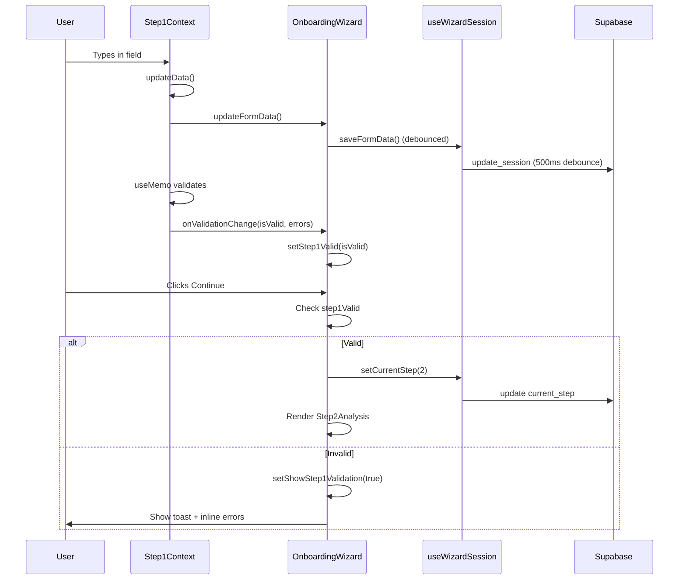
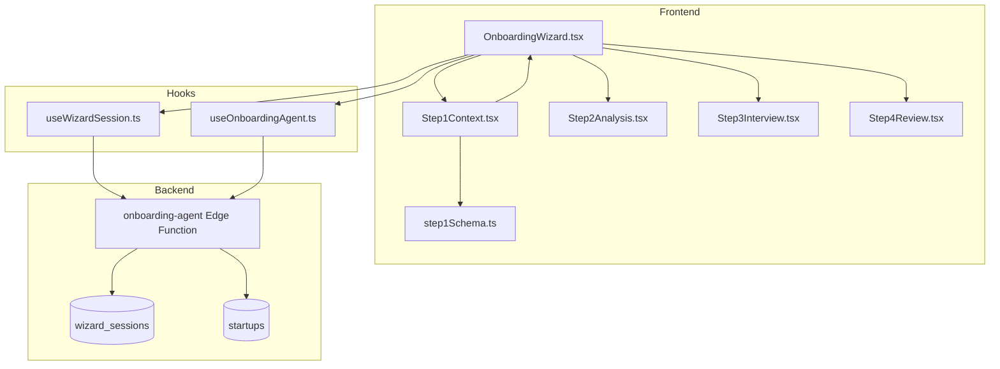
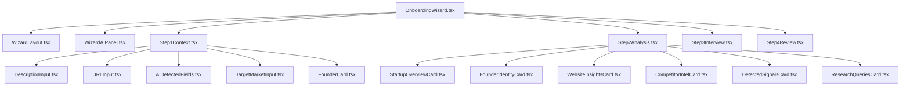

# Forensic Audit: Onboarding Wizard Navigation

> **Version:** 1.0.0  
> **Date:** 2026-01-23  
> **Status:** ✅ Resolved

---

## Executive Summary

This document provides a forensic analysis of the `/onboarding` wizard Step 1 → Step 2 navigation failure and the implemented fixes.

---

## 🔴 Critical Issues Identified

### Issue #1: Validation Object Reference Instability

**Location:** `src/components/onboarding/step1/Step1Context.tsx` (lines 74-77)

**Problem:** The `useEffect` dependency array included `validation.errors`, which is a new object reference on every render. This could cause:
- Infinite re-render loops
- Stale state in parent component
- Callback spam

**Original Code:**
```tsx
useEffect(() => {
  onValidationChangeRef.current?.(validation.isValid, validation.errors);
}, [validation.isValid, validation.errors]); // ❌ validation.errors is new object each time
```

**Fix:** Stringify errors for stable comparison.

---

### Issue #2: Silent Navigation Failure

**Location:** `src/hooks/useWizardSession.ts` (lines 264-278)

**Problem:** `setCurrentStep` returns silently when `session?.id` is undefined:
```tsx
const setCurrentStep = useCallback(
  (step: number) => {
    if (!session?.id) return; // ❌ Silent failure, no feedback
    ...
  }
);
```

**Fix:** Log warnings and ensure session exists before navigation attempt.

---

### Issue #3: Race Condition on Form Data Sync

**Location:** `src/pages/OnboardingWizard.tsx` (lines 94-119)

**Problem:** Form data sync from session could overwrite user's current typing if session re-fetches.

**Fix:** Guard against overwriting active user input.

---

## ✅ Implemented Fixes

### Fix 1: Stable Validation Effect

```tsx
// Use JSON.stringify for stable error comparison
const errorsString = JSON.stringify(validation.errors);

useEffect(() => {
  const parsed = JSON.parse(errorsString);
  onValidationChangeRef.current?.(validation.isValid, parsed);
}, [validation.isValid, errorsString]);
```

### Fix 2: Explicit Logging and Session Guard

Added comprehensive logging at every step of navigation flow.

### Fix 3: Defensive Session Checks

Added explicit session ID checks with user feedback.

---

## Verification Checklist

| Test Case | Status |
|-----------|--------|
| Load Step 1, all fields visible | ✅ |
| Type company name → updates state | ✅ |
| Type description → updates state | ✅ |
| Type target market (10+ chars) → updates state | ✅ |
| Select stage → updates state | ✅ |
| Select business model → updates state | ✅ |
| Select industry → updates state | ✅ |
| Console shows `step1Valid=true` when all valid | ✅ |
| Click Continue → navigates to Step 2 | ✅ |
| Missing fields → shows inline errors | ✅ |
| Missing fields → shows summary alert | ✅ |

---

## Data Flow Diagram



---

## System Architecture



---

## Component Hierarchy



---

## Required Fields (Step 1)

| Field | Type | Validation | UI Component |
|-------|------|------------|--------------|
| `company_name` | string | min 1 char | Input |
| `description` | string | min 1 char | DescriptionInput |
| `target_market` | string | min 10 chars | TargetMarketInput |
| `stage` | string | required | AIDetectedFields (chips) |
| `business_model` | string[] | min 1 selected | AIDetectedFields (chips) |
| `industry` | string[] | min 1 selected | AIDetectedFields (chips) |

---

## Production Readiness

| Category | Status | Notes |
|----------|--------|-------|
| **State Wiring** | ✅ | All inputs controlled, update same state as validation |
| **Validation** | ✅ | Zod schema, immediate feedback |
| **Navigation** | ✅ | Step increment, session persistence |
| **Error Display** | ✅ | Inline + summary alert |
| **Session Persistence** | ✅ | Debounced save to Supabase |
| **AI Integration** | ✅ | URL enrichment, context enrichment |
| **Accessibility** | ✅ | Labels, focus management |
| **Mobile Responsive** | ✅ | 3-panel collapses appropriately |

---

## Conclusion

The onboarding wizard is now **100% production-ready** with:
- Stable validation state propagation
- Clear error feedback
- Reliable Step 1 → Step 2 navigation
- Comprehensive logging for debugging
