# Forensic Audit: Onboarding Wizard Critical Fixes

> **Version:** 1.1.0  
> **Date:** 2026-01-23  
> **Status:** 🔴 3 Critical Issues Identified

---

## Executive Summary

| Issue | Severity | Status | File(s) |
|-------|----------|--------|---------|
| 1. `run_analysis` action not implemented | 🔴 CRITICAL | Fix Required | `useOnboardingAgent.ts`, `onboarding-agent/index.ts` |
| 2. Traction display schema mismatch | 🔴 CRITICAL | Fix Required | `Step4Review.tsx` |
| 3. Topic badge matching broken | 🟡 MEDIUM | Fix Required | `Step3Interview.tsx` |
| 4. Session creation race condition | 🟡 MEDIUM | Fix Required | `useWizardSession.ts` |
| 5. Session invalidation after create | 🟢 LOW | Enhancement | `useWizardSession.ts` |

**Overall Wizard Correctness: 68%** → Target: 100%

---

## Priority Order of Implementation

```
┌─────────────────────────────────────────────────────────────┐
│  P0: BLOCKER - Must fix before any testing                  │
├─────────────────────────────────────────────────────────────┤
│  1. Add run_analysis case to Edge Function                  │
│  2. Fix traction display to use mrr_range/is_raising        │
│  3. Invalidate session query after create_session           │
├─────────────────────────────────────────────────────────────┤
│  P1: HIGH - Fix for proper UX                               │
├─────────────────────────────────────────────────────────────┤
│  4. Normalize topic matching in Step3Interview              │
│  5. Add ensureSession() pattern                             │
└─────────────────────────────────────────────────────────────┘
```

---

## Issue #1: `run_analysis` Action Not Implemented

### Problem

**Client calls:**
```typescript
// src/hooks/useOnboardingAgent.ts:275-280
const runAnalysisMutation = useMutation({
  mutationFn: (params: { session_id: string }) =>
    invokeAgent({
      action: 'run_analysis',  // ❌ This action does NOT exist
      session_id: params.session_id,
    }),
});
```

**Backend switch (lines 1018-1110):**
```typescript
switch (action) {
  case "create_session": ...
  case "update_session": ...
  case "enrich_url": ...
  // ... NO "run_analysis" case
  default:
    throw new Error(`Unknown action: ${action}`);  // ← Guaranteed error
}
```

### Solution

**Option A (Recommended): Remove the unused mutation**

The `run_analysis` mutation is never called anywhere in the codebase. Remove it entirely.

**Option B: Implement as alias for calculate_readiness**

If needed, add a case that delegates to existing logic.

### Success Criteria

- [ ] No 400 error when calling `run_analysis`
- [ ] Clean codebase with no dead code

---

## Issue #2: Traction Display Schema Mismatch

### Problem

**Step4Review expects:**
```typescript
// src/components/onboarding/step4/Step4Review.tsx:311-334
data.extracted_traction?.current_mrr      // expects number
data.extracted_traction?.growth_rate      // expects number  
data.extracted_traction?.users            // expects number
data.extracted_funding?.target_amount     // expects number
```

**Backend stores (processAnswer):**
```typescript
// Backend saves string ranges, not numbers
extracted_traction = { mrr_range: "1k_10k" }
extracted_funding = { is_raising: true }
```

### Data Flow Diagram

```mermaid
graph LR
    A[User answers 'MRR $1k-$10k'] --> B[processAnswer]
    B --> C{Backend stores}
    C --> D["mrr_range: '1k_10k'"]
    D --> E[Step4Review reads]
    E --> F{UI expects}
    F --> G["current_mrr: number"]
    G --> H[❌ 'Not set' displayed]
```



### Solution

Fix Step4Review to parse string ranges:

```typescript
// Helper to parse MRR range strings
const parseMrrRange = (range?: string): string => {
  const labels: Record<string, string> = {
    'pre_revenue': 'Pre-revenue',
    '0_1k': '$0 - $1K',
    '1k_10k': '$1K - $10K',
    '10k_50k': '$10K - $50K',
    '50k_plus': '$50K+',
  };
  return labels[range || ''] || 'Not set';
};

// In UI:
<p>{parseMrrRange(data.extracted_traction?.mrr_range as string)}</p>
```

### Success Criteria

- [ ] Step 4 shows human-readable MRR ranges
- [ ] Step 4 shows "Raising" or "Not raising" correctly
- [ ] No "Not set" when user has answered

---

## Issue #3: Topic Badge Matching Broken

### Problem

**Step3Interview TOPICS array:**
```typescript
const TOPICS = ['Business Model', 'Market', 'Traction', 'Team', 'Funding'];
```

**Matching logic:**
```typescript
const isCovered = topicsCovered.includes(topic.toLowerCase());
// 'Business Model'.toLowerCase() = 'business model'
```

**Backend returns:**
```typescript
topic: 'traction'  // lowercase single word
// OR
topic: 'Traction'  // Title case
```

**Result:** `'business model' !== 'traction'` → badges never activate

### Solution

Normalize both sides:

```typescript
const norm = (s: string) => s.trim().toLowerCase().replace(/\s+/g, '');

const topicsCovered = new Set(
  answers
    .map(a => questions.find(q => q.id === a.question_id)?.topic)
    .filter(Boolean)
    .map(t => norm(t as string))
);

const isCovered = topicsCovered.has(norm(topic));
```

### Success Criteria

- [ ] Answering a "traction" question marks "Traction" badge as covered
- [ ] All TOPICS can be marked covered when answered

---

## Issue #4: Session Creation Race Condition

### Problem

**Current flow:**
```typescript
// useWizardSession.ts
createSessionMutation.onSuccess: (newSession) => {
  queryClient.setQueryData(['wizard-session', user?.id], newSession);
  // ❌ Optimistic update - may have stale/missing fields
}
```

**User clicks Continue before session is ready:**
```
1. User loads /onboarding
2. createSession() called
3. User quickly fills Step 1
4. User clicks Continue
5. session?.id is undefined → "No session ID" error
```

### Session State Diagram


### Solution

1. **Invalidate query after creation** to refetch real DB row:

```typescript
onSuccess: async () => {
  await queryClient.invalidateQueries({ queryKey: ['wizard-session', user?.id] });
}
```

2. **Add ensureSession() helper:**

```typescript
const ensureSession = async (): Promise<string> => {
  if (session?.id) return session.id;
  const created = await createSessionMutation.mutateAsync();
  await queryClient.invalidateQueries({ queryKey: ['wizard-session', user?.id] });
  return created.session_id;
};
```

### Success Criteria

- [ ] No "No session ID" errors after creation
- [ ] Session persists correctly across navigation
- [ ] Form data saves reliably

---

## Component Dependency Graph


---

## Fix Implementation Plan

### Step 1: Remove `run_analysis` mutation (useOnboardingAgent.ts)

```typescript
// DELETE lines 274-289 (runAnalysisMutation)
// DELETE line 301 (runAnalysis export)
// DELETE line 311 (isRunningAnalysis)
// UPDATE isProcessing to remove runAnalysisMutation.isPending
```

### Step 2: Fix Step4Review traction display

```typescript
// Add helper functions at top of file
const MRR_LABELS: Record<string, string> = {
  'pre_revenue': 'Pre-revenue',
  '0_1k': '$0 - $1K',
  '1k_10k': '$1K - $10K',
  '10k_50k': '$10K - $50K',
  '50k_100k': '$50K - $100K',
  '100k_plus': '$100K+',
};

const parseMrrRange = (range?: unknown): string => {
  if (typeof range === 'string' && MRR_LABELS[range]) {
    return MRR_LABELS[range];
  }
  if (typeof range === 'number') {
    return `$${range.toLocaleString()}`;
  }
  return 'Not set';
};

// Update rendering to use helpers
```

### Step 3: Fix topic matching in Step3Interview

```typescript
// Add normalization helper
const norm = (s: string) => s.trim().toLowerCase().replace(/[\s_-]+/g, '');

// Update topicsCovered computation
const topicsCovered = new Set(
  answers
    .map(a => questions.find(q => q.id === a.question_id)?.topic)
    .filter(Boolean)
    .map(t => norm(t as string))
);

// Update isCovered check
const isCovered = topicsCovered.has(norm(topic));
```

### Step 4: Fix session invalidation (useWizardSession.ts)

```typescript
// Update createSessionMutation onSuccess
onSuccess: async () => {
  await queryClient.invalidateQueries({ queryKey: ['wizard-session', user?.id] });
},
```

---

## Production Readiness Checklist

| Category | Check | Status |
|----------|-------|--------|
| **Session Management** | Session creates successfully | 🟡 |
| | Session persists across refresh | ✅ |
| | No "No session ID" errors | 🟡 |
| **Step 1** | All fields validate correctly | ✅ |
| | AI enrichment works | ✅ |
| | Navigation to Step 2 works | ✅ |
| **Step 2** | Readiness score calculates | ✅ |
| | Navigation to Step 3 works | ✅ |
| **Step 3** | Questions load | ✅ |
| | Answers save | ✅ |
| | Topic badges update | 🔴 |
| | Navigation to Step 4 works | ✅ |
| **Step 4** | Investor score displays | ✅ |
| | AI summary generates | ✅ |
| | Traction data displays | 🔴 |
| | Complete wizard works | ✅ |
| **Backend** | All actions implemented | 🔴 |
| | No 400/500 errors | 🔴 |

---

## Success Metrics

After implementing all fixes:

- **0** runtime errors from missing actions
- **100%** of traction answers display correctly
- **100%** of topic badges activate when answered
- **0** "No session ID" navigation failures
- **>95%** wizard completion rate

---

## Prompts to Fix Each Issue

### Prompt 1: Remove run_analysis
```
Remove the unused runAnalysisMutation from useOnboardingAgent.ts including:
- The mutation definition (lines 274-289)
- The runAnalysis export (line 301)  
- The isRunningAnalysis flag (line 311)
- Remove from isProcessing computation
```

### Prompt 2: Fix Traction Display
```
Update Step4Review.tsx to display traction data using string range parsing:
- Add MRR_LABELS mapping for mrr_range values
- Add parseMrrRange() and parseIsRaising() helpers
- Update the Traction & Funding section to use these helpers
- Handle both legacy numeric fields and new string ranges
```

### Prompt 3: Fix Topic Matching
```
Fix topic badge matching in Step3Interview.tsx:
- Add norm() helper function
- Update topicsCovered to use normalized comparison
- Update isCovered check to normalize both sides
```

### Prompt 4: Fix Session Creation
```
Fix session creation race condition in useWizardSession.ts:
- Change createSessionMutation onSuccess to invalidate query
- Optionally add ensureSession() helper for guaranteed session
```

---

## Verification Commands

After fixes, verify with:

1. **Console check:** No "Unknown action" errors
2. **Network check:** All Edge Function calls return 200
3. **UI check:** Traction shows ranges, not "Not set"
4. **UI check:** Topic badges activate when questions answered
5. **Flow check:** Complete wizard without "No session ID" errors
