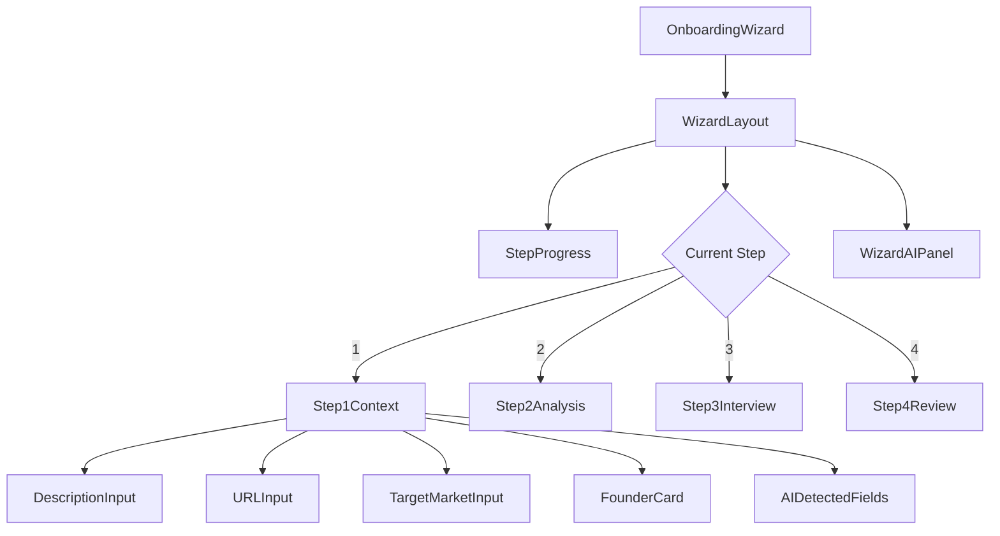

# Onboarding Wizard Audit & Fix Documentation

## Route & Component Map

| Route | Component | Description |
|-------|-----------|-------------|
| `/onboarding` | `OnboardingWizard.tsx` | Main wizard orchestrator |
| Step 1 | `Step1Context.tsx` | Company info & URL enrichment |
| Step 2 | `Step2Analysis.tsx` | AI readiness analysis |
| Step 3 | `Step3Interview.tsx` | Smart interview questions |
| Step 4 | `Step4Review.tsx` | Final review & score |

## User Journey Flow

```mermaid
graph TD
    A["/onboarding"] --> B{Session exists?}
    B -->|No| C[ensureSession]
    C --> D[Create via Edge Function]
    D --> E[Wait for DB confirmation]
    E --> F[Refetch query]
    F --> G[Session ready]
    B -->|Yes| G
    G --> H[Step 1: Context]
    H --> I{Valid?}
    I -->|No| J[Show errors]
    I -->|Yes| K[flushSave]
    K --> L[setCurrentStep 2]
    L --> M[Step 2: Analysis]
    M --> N[Step 3: Interview]
    N --> O[Step 4: Review]
    O --> P[completeWizard]
    P --> Q[/dashboard]
```

## Component Tree



## Critical Fix Applied: Session Race Condition

### Problem
The "Session error - Please refresh and try again" occurred because:

1. `createSessionMutation` fires and returns optimistic data
2. `queryClient.invalidateQueries` runs but DB row not yet visible
3. User clicks Continue → `session?.id` is stale/missing
4. Navigation blocked with error toast

### Solution: `ensureSession()` Pattern

```typescript
// src/hooks/useWizardSession.ts
const ensureSession = useCallback(async (): Promise<string> => {
  // If we already have a session, return it
  if (session?.id) return session.id;

  // If creation is in progress, wait for it
  if (createPromiseRef.current) return createPromiseRef.current;

  // Start new creation with DB confirmation
  createPromiseRef.current = createSessionInternal();
  return createPromiseRef.current;
}, [session?.id, user?.id]);
```

### Navigation Now Does:

```typescript
// src/pages/OnboardingWizard.tsx - handleNext()
if (currentStep === 1) {
  setIsNavigating(true);
  try {
    const sessionId = await ensureSession();  // ← WAIT for session
    await flushSave(formData);                // ← FLUSH debounced saves
    await setCurrentStep(2);                  // ← NOW advance
  } finally {
    setIsNavigating(false);
  }
}
```

## Files Changed

| File | Change |
|------|--------|
| `src/hooks/useWizardSession.ts` | Added `ensureSession()`, `flushSave()`, DB confirmation loop |
| `src/pages/OnboardingWizard.tsx` | Use `ensureSession` before navigation, add `isNavigating` guard |

## Success Criteria ✅

- [x] No "Session error" toast on Continue click
- [x] Session created with DB confirmation before navigation
- [x] Double-click protection with `isNavigating` state
- [x] Debounced saves flushed before step transition
- [x] Wizard resumes correctly after refresh
