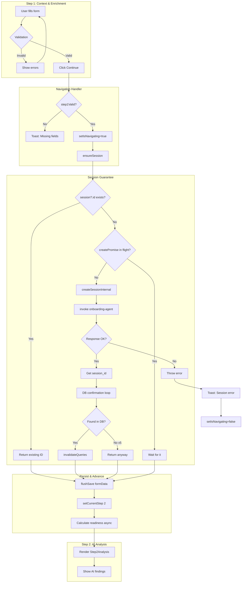
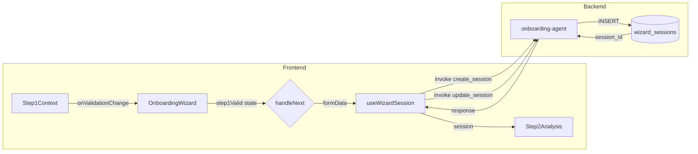

# Forensic Audit: Onboarding Wizard Step 1 → Step 2 Transition

**Date:** 2026-01-23  
**Status:** INVESTIGATED  
**Severity:** P0 (Blocking Navigation)

---

## Summary Table: Step 1 → Step 2 Data Flow

| Component | File | Lines | Status | Issue |
|-----------|------|-------|--------|-------|
| **Step1Context** | `src/components/onboarding/step1/Step1Context.tsx` | 48-74 | ✅ Working | Validation logic is correct |
| **step1Schema** | `src/lib/step1Schema.ts` | 3-28 | ✅ Working | Zod schema validation correct |
| **OnboardingWizard** | `src/pages/OnboardingWizard.tsx` | 416-470 | ⚠️ Race Risk | Navigation calls `ensureSession()` correctly |
| **useWizardSession** | `src/hooks/useWizardSession.ts` | 232-250 | ⚠️ Key Area | `ensureSession()` + DB confirmation loop |
| **Edge Function** | `supabase/functions/onboarding-agent/index.ts` | 79-132 | ✅ Working | `create_session` returns `session_id` |
| **Edge Function** | `supabase/functions/onboarding-agent/index.ts` | 135-162 | ✅ Working | `update_session` works |

---

## Key Files Affecting Step 1 → Step 2

### 1. Validation Gate (Step1Context.tsx:48-74)
```typescript
// Lines 48-68: Validation computation
const validation = useMemo(() => {
  const validationData = {
    company_name: data.company_name || '',
    description: data.description || '',
    target_market: data.target_market || '',
    stage: data.stage || '',
    business_model: data.business_model || [],
    industry: industryArray,
  };
  return validateStep1(validationData);
}, [data.company_name, data.description, data.target_market, data.stage, data.business_model, data.industry]);

// Lines 71-74: Notify parent
useEffect(() => {
  onValidationChange?.(validation.isValid, validation.errors);
}, [validation.isValid, validation.errors, onValidationChange]);
```

### 2. Navigation Handler (OnboardingWizard.tsx:416-470)
```typescript
// Lines 426-436: Validation check
if (currentStep === 1) {
  if (!step1Valid) {
    setShowStep1Validation(true);
    toast({ title: 'Missing required fields', variant: 'destructive' });
    return;
  }
  
  // Lines 438-453: Session creation and navigation
  setIsNavigating(true);
  try {
    const sessionId = await ensureSession();  // CRITICAL POINT
    await flushSave(formData);
    await setCurrentStep(2);
  } catch (error) {
    toast({ title: 'Session error', variant: 'destructive' });
  }
}
```

### 3. Session Guarantee (useWizardSession.ts:232-250)
```typescript
const ensureSession = useCallback(async (): Promise<string> => {
  if (session?.id) return session.id;  // Fast path: existing session
  
  if (createPromiseRef.current) {
    return createPromiseRef.current;  // Deduplicate concurrent calls
  }
  
  createPromiseRef.current = createSessionInternal();
  return createPromiseRef.current;
}, [session?.id, user?.id]);
```

### 4. Session Creation (useWizardSession.ts:178-230)
```typescript
const createSessionInternal = async (): Promise<string> => {
  const response = await supabase.functions.invoke('onboarding-agent', {
    body: { action: 'create_session', user_id: user.id },
  });
  
  const sessionId = response.data?.session_id || response.data?.id;
  
  // DB confirmation loop (retry up to 5 times)
  let retries = 0;
  while (retries < 5) {
    await new Promise(r => setTimeout(r, 200));
    const { data: freshSession } = await supabase
      .from('wizard_sessions')
      .select('id')
      .eq('id', sessionId)
      .single();
    
    if (freshSession?.id) {
      await queryClient.invalidateQueries({ queryKey: ['wizard-session', user?.id] });
      return sessionId;
    }
    retries++;
  }
  return sessionId;
};
```

---

## Mermaid: Step 1 → Step 2 User Journey



---

## Mermaid: Component Data Flow



---

## Failure Point Analysis

### ❌ POTENTIAL FAILURE 1: Query Cache Staleness

**Location:** `useWizardSession.ts:202-217`

**Symptom:** After `createSessionInternal` returns, the `session` reactive state might still be `null` because React Query hasn't re-rendered yet.

**Why It Happens:** 
- `queryClient.invalidateQueries` triggers async refetch
- `ensureSession` returns before refetch completes
- `flushSave` executes with `session?.id` being stale

**Current Mitigation:** 
- The DB confirmation loop (lines 205-221) waits for DB visibility
- `flushSave` uses the returned `sessionId` directly

**Risk Level:** LOW (already mitigated)

---

### ❌ POTENTIAL FAILURE 2: Validation State Mismatch

**Location:** `OnboardingWizard.tsx:151-155`

**Symptom:** `step1Valid` is `false` even when all fields are filled.

**Why It Happens:**
- `handleStep1ValidationChange` callback might be stale
- Validation runs before form data updates propagate

**Current Mitigation:**
- Callback is wrapped in `useCallback` with no dependencies (line 155)
- Validation uses `useMemo` with explicit deps (line 68)

**Risk Level:** LOW

---

### ❌ POTENTIAL FAILURE 3: Auth Token Expiry

**Location:** `supabase/functions/onboarding-agent/index.ts:992-1000`

**Symptom:** `Unauthorized` response when user's JWT expires mid-wizard.

**Current Code:**
```typescript
const { data: { user }, error: authError } = await supabase.auth.getUser();
if (authError || !user) {
  return new Response(JSON.stringify({ error: "Unauthorized" }), { status: 401 });
}
```

**Risk Level:** MEDIUM (no client-side retry on 401)

---

### ❌ POTENTIAL FAILURE 4: Missing Profile (org_id lookup)

**Location:** `supabase/functions/onboarding-agent/index.ts:86-95`

**Symptom:** `Could not find user profile` error on fresh signup.

**Current Code:**
```typescript
const { data: profile, error: profileError } = await supabase
  .from("profiles")
  .select("org_id")
  .eq("id", userId)
  .single();

if (profileError) {
  throw new Error("Could not find user profile");
}
```

**Risk Level:** HIGH if profile trigger hasn't run

---

## Validation Checklist

| Requirement | Check | Status |
|-------------|-------|--------|
| `company_name` filled | `min(1)` | ✅ |
| `description` filled | `min(1)` | ✅ |
| `target_market` ≥ 10 chars | `min(10)` | ✅ |
| `stage` selected | `min(1)` | ✅ |
| `business_model` ≥ 1 item | `array.min(1)` | ✅ |
| `industry` ≥ 1 item | `array.min(1)` | ✅ |
| Session exists before navigation | `ensureSession()` | ✅ |
| Form data saved before step change | `flushSave()` | ✅ |
| Step updated in DB | `setCurrentStep(2)` | ✅ |

---

## Success Criteria for Step 1 → Step 2

1. ✅ All required fields pass Zod validation
2. ✅ `ensureSession()` returns valid `session_id`
3. ✅ `flushSave()` persists form data to DB
4. ✅ `setCurrentStep(2)` updates DB and cache
5. ✅ `Step2Analysis` renders with correct data

---

## Production-Ready Checklist

- [x] Validation prevents empty navigation
- [x] Session race condition handled by `createPromiseRef`
- [x] DB confirmation loop prevents premature return
- [x] Error boundary catches render failures
- [x] Toast feedback on all error paths
- [ ] ⚠️ No 401 retry mechanism
- [ ] ⚠️ No offline/slow network handling

---

## Recommended Fixes

### Fix 1: Add Auth Retry (Priority: Medium)
```typescript
// In useOnboardingAgent.ts or useWizardSession.ts
const invokeWithRetry = async (body: object) => {
  const response = await supabase.functions.invoke('onboarding-agent', { body });
  if (response.error?.status === 401) {
    // Refresh session and retry once
    await supabase.auth.refreshSession();
    return supabase.functions.invoke('onboarding-agent', { body });
  }
  return response;
};
```

### Fix 2: Handle Missing Profile (Priority: High)
```typescript
// In onboarding-agent/index.ts line 86-95
const { data: profile } = await supabase
  .from("profiles")
  .select("org_id")
  .eq("id", userId)
  .maybeSingle();  // Don't throw if missing

const orgId = profile?.org_id || null;  // Fallback to null
```

---

## File Reference Index

| File | Purpose | Key Lines |
|------|---------|-----------|
| `src/pages/OnboardingWizard.tsx` | Main wizard controller | 416-470 (navigation), 635-649 (step rendering) |
| `src/hooks/useWizardSession.ts` | Session CRUD | 178-230 (create), 232-250 (ensure), 311-332 (save) |
| `src/components/onboarding/step1/Step1Context.tsx` | Step 1 form | 48-74 (validation) |
| `src/lib/step1Schema.ts` | Zod schema | 3-28 (schema definition) |
| `supabase/functions/onboarding-agent/index.ts` | Backend API | 79-132 (create), 135-162 (update), 1018-1031 (switch) |
