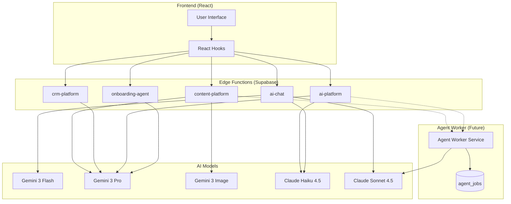

# StartupAI Agent System: Progress Tracker

**Purpose:** Track implementation status of all 10 agent types  
**Status:** In Development  
**Last Updated:** 2025-01-25

---

## Architecture Overview

---

## Agent Implementation Status

| # | Agent Type | Status | Edge Function | Model | Priority |
|---|------------|--------|---------------|-------|----------|
| 1 | **Extractor** | ✅ Done | `onboarding-agent` | gemini-3-pro-preview | P0 |
| 2 | **Scorer** | ✅ Done | `onboarding-agent` | gemini-3-pro-preview | P0 |
| 3 | **Retriever (RAG)** | 🔶 Partial | `ai-chat` | gemini-3-flash-preview | P1 |
| 4 | **Planner** | 🔶 Partial | `ai-chat` | gemini-3-pro-preview | P1 |
| 5 | **Analyst** | 🔶 Partial | `ai-chat` | gemini-3-pro-preview | P1 |
| 6 | **Ops Automation** | ❌ Not Started | `ai-platform` | claude-haiku-4-5 | P2 |
| 7 | **Content/Comms** | ❌ Not Started | `content-platform` | gemini-3-pro-preview | P2 |
| 8 | **Optimizer** | ❌ Not Started | `content-platform` | gemini-3-pro-preview | P2 |
| 9 | **Controller** | ❌ Not Started | `ai-platform` | gemini-3-pro-preview | P3 |
| 10 | **Orchestrator** | ❌ Not Started | Agent Worker | claude-sonnet-4-5 | P3 |

**Legend:**
- ✅ Done: Production-ready with tests
- 🔶 Partial: Basic implementation, needs enhancement
- ❌ Not Started: Not yet implemented

---

## Edge Function Status

| Edge Function | Status | Actions | Agents | Last Deployed |
|--------------|--------|---------|--------|---------------|
| `onboarding-agent` | ✅ Production | 11 | Extractor, Scorer, Planner | 2025-01-25 |
| `ai-chat` | ✅ Production | 5 | Retriever, Analyst, Planner | 2025-01-25 |
| `ai-platform` | ❌ Not Created | 22 | Controller, Ops Automation, Analyst | - |
| `crm-platform` | ❌ Not Created | 27 | Extractor, Scorer, Analyst | - |
| `content-platform` | ❌ Not Created | 32 | Content/Comms, Optimizer, Orchestrator | - |

---

## Database Schema Status

| Table | Status | Purpose | Used By |
|-------|--------|---------|---------|
| `ai_runs` | ✅ Exists | Log AI agent invocations | All agents |
| `agent_configs` | ✅ Exists | Store agent configurations | All agents |
| `proposed_actions` | ✅ Exists | Human-in-the-loop approvals | Controller |
| `action_executions` | ✅ Exists | Track executed actions | Controller |
| `automation_rules` | ✅ Exists | Define automation triggers | Ops Automation |
| `wizard_sessions` | ✅ Exists | Onboarding wizard state | Extractor |
| `wizard_extractions` | ✅ Exists | Store URL extractions | Extractor |
| `chat_sessions` | ✅ Exists | Store chat history | Retriever |
| `chat_messages` | ✅ Exists | Store chat messages | Retriever |
| `agent_jobs` | ❌ Not Created | Track async job progress | Orchestrator |

---

## Screen-to-Agent Mapping

| Screen | Primary Agent | Edge Function | Status |
|--------|--------------|---------------|--------|
| **Onboarding Step 1** | Extractor | `onboarding-agent` | ✅ Done |
| **Onboarding Step 2** | Analyst | `onboarding-agent` | ✅ Done |
| **Onboarding Step 3** | Planner | `onboarding-agent` | ✅ Done |
| **Onboarding Step 4** | Scorer | `onboarding-agent` | ✅ Done |
| **Dashboard** | Analyst | `ai-chat` | 🔶 Partial |
| **Tasks** | Planner | `ai-chat` | 🔶 Partial |
| **Investors** | Scorer | `crm-platform` | ❌ Not Started |
| **CRM / Contacts** | Extractor | `crm-platform` | ❌ Not Started |
| **Documents** | Content/Comms | `content-platform` | ❌ Not Started |
| **Pitch Deck** | Orchestrator | Agent Worker | ❌ Not Started |
| **Events** | Optimizer | `content-platform` | ❌ Not Started |
| **AI Chat** | Retriever | `ai-chat` | ✅ Done |

---

## Gemini 3 Features Status

| Feature | Status | Used By | Documentation |
|---------|--------|---------|---------------|
| **URL Context** | ✅ Implemented | Extractor (onboarding-agent) | `docs/gemini/03-url-context.md` |
| **Google Search Grounding** | ✅ Implemented | Extractor, Analyst | `docs/gemini/02-google-search-grounding.md` |
| **Structured Output** | ✅ Implemented | All Gemini agents | `docs/gemini/04-structured-output.md` |
| **Thinking Mode** | ✅ Implemented | Analyst, Scorer | `docs/gemini/06-thinking.md` |
| **Code Execution** | ❌ Not Implemented | Optimizer | - |
| **File Search (RAG)** | ❌ Not Implemented | Retriever | - |
| **Image Generation** | ❌ Not Implemented | Content/Comms | - |

---

## Claude API Status

| Feature | Status | Used By | Documentation |
|---------|--------|---------|---------------|
| **Messages API** | ✅ Implemented | ai-chat (Anthropic model) | `docs/agents/01-claude-sdk-reference.md` |
| **Agent SDK** | ❌ Not Implemented | Orchestrator | `docs/agents/01-claude-sdk-reference.md` |
| **Tool Calling** | 🔶 Partial | ai-chat | - |
| **Streaming** | ❌ Not Implemented | - | - |

---

## Files Impacted by Agent Implementation

### Currently Implemented

| File | Purpose | Agents |
|------|---------|--------|
| `supabase/functions/onboarding-agent/index.ts` | 11-action orchestrator | Extractor, Scorer, Planner |
| `supabase/functions/ai-chat/index.ts` | 5-action chat handler | Retriever, Analyst |
| `src/hooks/onboarding/useEnrichment.ts` | URL enrichment hook | Extractor |
| `src/hooks/onboarding/useInterview.ts` | Smart interview hook | Planner |
| `src/hooks/onboarding/useScoring.ts` | Readiness scoring hook | Scorer |
| `src/hooks/useAIChat.ts` | Chat interface hook | Retriever |
| `src/hooks/useStageGuidanceAI.ts` | Stage guidance hook | Analyst |

### To Be Created

| File | Purpose | Agents | Priority |
|------|---------|--------|----------|
| `supabase/functions/ai-platform/index.ts` | Platform-wide AI actions | Controller, Ops Automation, Analyst | P2 |
| `supabase/functions/crm-platform/index.ts` | CRM AI actions | Extractor, Scorer | P2 |
| `supabase/functions/content-platform/index.ts` | Content AI actions | Content/Comms, Optimizer | P2 |
| `services/agent-worker/` | Long-running agent jobs | Orchestrator | P3 |
| `src/hooks/useAIOrchestrator.ts` | Orchestrator interface hook | Orchestrator | P3 |
| `src/hooks/useController.ts` | Action validation hook | Controller | P3 |

---

## Implementation Phases

### Phase 1: Foundation (✅ Complete)
- [x] Extractor agent (onboarding-agent)
- [x] Scorer agent (onboarding-agent)
- [x] Planner agent (onboarding-agent)
- [x] Basic Retriever (ai-chat)
- [x] Gemini 3 URL Context + Google Search
- [x] Structured Output patterns

### Phase 2: Platform Agents (🔶 In Progress)
- [ ] Analyst agent (Dashboard)
- [ ] Enhanced Retriever (RAG with industry packs)
- [ ] Create `ai-platform` edge function
- [ ] Ops Automation (notifications)

### Phase 3: CRM & Content (❌ Not Started)
- [ ] CRM Extractor (contact enrichment)
- [ ] CRM Scorer (deal probability)
- [ ] Content/Comms (email generation)
- [ ] Optimizer (schedule optimization)

### Phase 4: Orchestration (❌ Not Started)
- [ ] Controller (action validation)
- [ ] Orchestrator (pitch deck generation)
- [ ] Agent Worker service
- [ ] `agent_jobs` table and polling

---

## Production Readiness Checklist

### Per-Agent Checklist

| Agent | Auth | Logging | Error Handling | Rate Limiting | Tests |
|-------|------|---------|----------------|---------------|-------|
| Extractor | ✅ | ✅ | ✅ | ❌ | ❌ |
| Scorer | ✅ | ✅ | ✅ | ❌ | ❌ |
| Planner | ✅ | ✅ | ✅ | ❌ | ❌ |
| Retriever | ✅ | ✅ | 🔶 | ❌ | ❌ |
| Analyst | ✅ | ✅ | 🔶 | ❌ | ❌ |
| Ops Automation | ❌ | ❌ | ❌ | ❌ | ❌ |
| Content/Comms | ❌ | ❌ | ❌ | ❌ | ❌ |
| Optimizer | ❌ | ❌ | ❌ | ❌ | ❌ |
| Controller | ❌ | ❌ | ❌ | ❌ | ❌ |
| Orchestrator | ❌ | ❌ | ❌ | ❌ | ❌ |

### Global Checklist

- [x] JWT authentication on edge functions
- [x] `ai_runs` logging for all AI calls
- [x] Supabase secrets configured (GEMINI_API_KEY, ANTHROPIC_API_KEY)
- [ ] Rate limiting per user/org
- [ ] Cost tracking per org
- [ ] Comprehensive test suite
- [ ] Error alerting/monitoring

---

## Next Steps

1. **Immediate (P0):** Add rate limiting to existing agents
2. **Short-term (P1):** Create `ai-platform` edge function with Controller
3. **Medium-term (P2):** Create `crm-platform` and `content-platform`
4. **Long-term (P3):** Implement Agent Worker for Orchestrator

---

## Related Documentation

| Document | Purpose |
|----------|---------|
| [Claude SDK Reference](./01-claude-sdk-reference.md) | Messages API & Agent SDK patterns |
| [Screen-Agent Mapping](./02-screen-agent-mapping.md) | Frontend-backend wiring |
| [Gemini Reference](../gemini/00-index.md) | Gemini 3 feature documentation |
| [Agent Prompts](./prompts/) | Individual agent prompt files |
