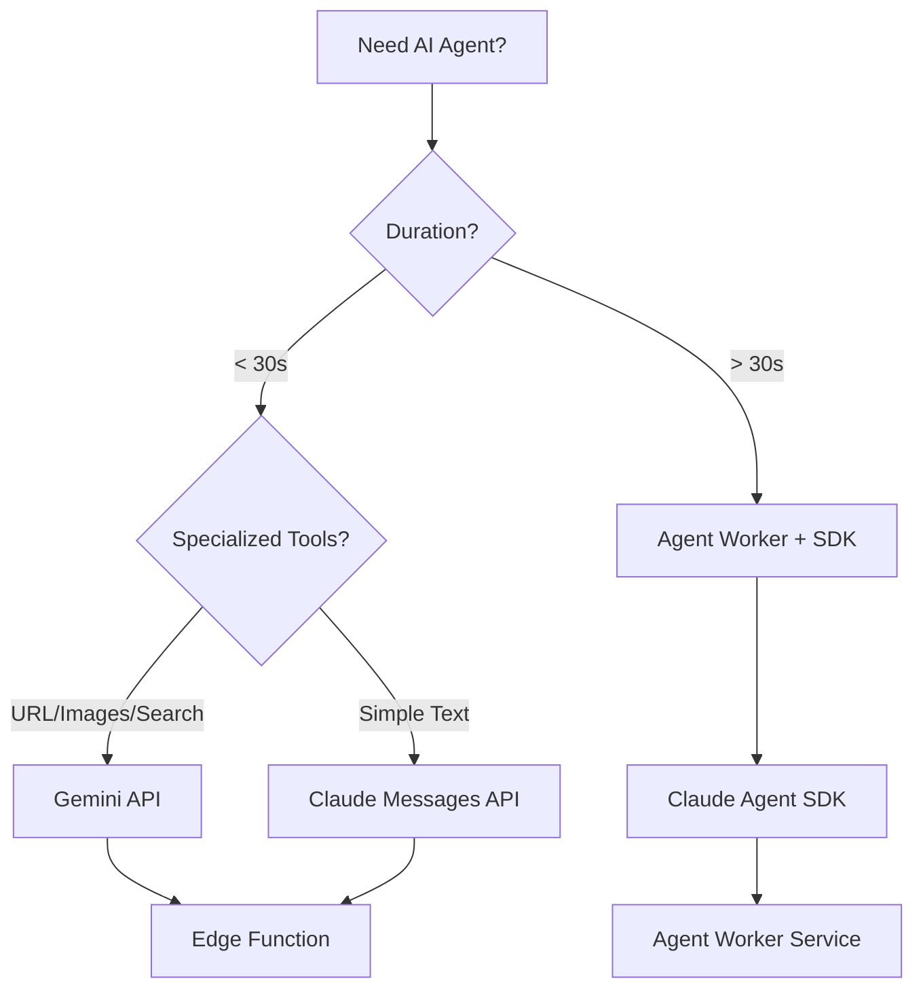
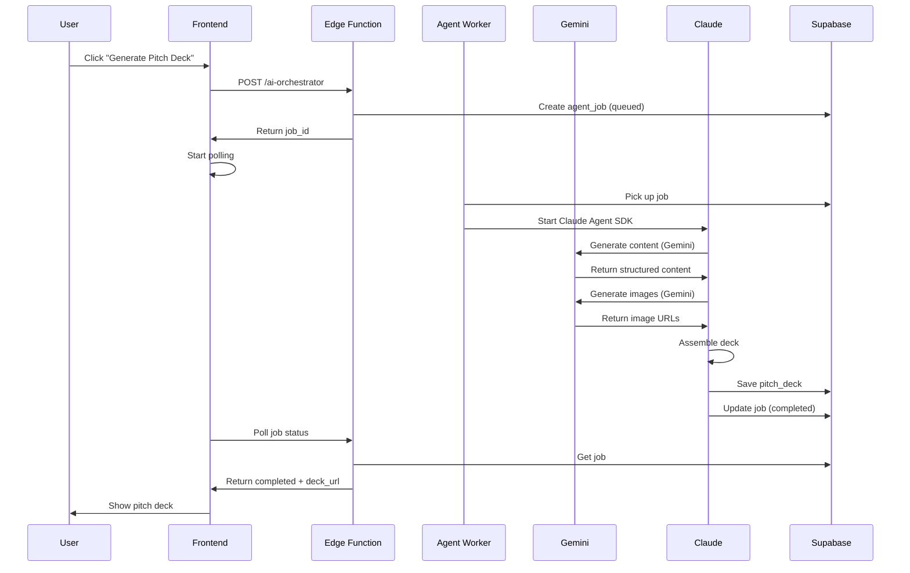

# Claude SDK & Messages API Reference

**Purpose:** Technical reference for implementing Claude Agent SDK and Messages API in StartupAI  
**Status:** Ready for Implementation  
**Last Updated:** 2025-01-25

---

## Decision Matrix



---

## Claude Messages API

### Overview

Direct API access for fast, stateless text generation. Best for simple tasks < 30s.

### When to Use

- ✅ Fast tasks (< 30s, ≤ 3 tool calls)
- ✅ Stateless request/response
- ✅ Simple text generation (notifications, summaries)
- ✅ Low cost needed (Haiku model)
- ✅ No file operations

### Models

| Model | Use Case | Cost/1M Tokens | Latency |
|-------|----------|----------------|---------|
| `claude-haiku-4-5` | Fast, simple tasks | $0.25 | < 1s |
| `claude-sonnet-4-5` | Balanced performance | $3.00 | 2-4s |
| `claude-opus-4-5` | Complex reasoning | $15.00 | 4-8s |

### Edge Function Implementation

```typescript
// supabase/functions/ai-platform/index.ts
import { serve } from "https://deno.land/std@0.168.0/http/server.ts";

const ANTHROPIC_API_KEY = Deno.env.get("ANTHROPIC_API_KEY");

interface NotificationContext {
  deal_name: string;
  old_stage: string;
  new_stage: string;
  meeting_date?: string;
}

async function sendNotification(context: NotificationContext): Promise<string> {
  const response = await fetch("https://api.anthropic.com/v1/messages", {
    method: "POST",
    headers: {
      "Content-Type": "application/json",
      "x-api-key": ANTHROPIC_API_KEY!,
      "anthropic-version": "2023-06-01",
    },
    body: JSON.stringify({
      model: "claude-haiku-4-5",
      max_tokens: 200,
      system: `Generate concise, actionable notifications. 
Keep under 200 characters. Use emoji for visual clarity.
Format: [emoji] [Deal] moved to [Stage]. [Action hint].`,
      messages: [
        {
          role: "user",
          content: JSON.stringify(context),
        },
      ],
    }),
  });

  const data = await response.json();
  return data.content?.[0]?.text || "";
}

serve(async (req) => {
  const { action, context } = await req.json();
  
  switch (action) {
    case "send_notification":
      const notification = await sendNotification(context);
      return new Response(JSON.stringify({ notification }));
    // ... other actions
  }
});
```

### Tool Calling Pattern

```typescript
async function callWithTools(
  prompt: string,
  tools: Tool[]
): Promise<ToolResult> {
  const response = await fetch("https://api.anthropic.com/v1/messages", {
    method: "POST",
    headers: {
      "Content-Type": "application/json",
      "x-api-key": ANTHROPIC_API_KEY!,
      "anthropic-version": "2023-06-01",
    },
    body: JSON.stringify({
      model: "claude-sonnet-4-5",
      max_tokens: 2048,
      messages: [{ role: "user", content: prompt }],
      tools: tools,
    }),
  });

  const data = await response.json();
  
  // Check if Claude wants to use a tool
  const toolUse = data.content?.find((c: any) => c.type === "tool_use");
  if (toolUse) {
    // Execute the tool
    const result = await executeToolCall(toolUse.name, toolUse.input);
    
    // Continue conversation with tool result
    return callWithToolResult(data, toolUse.id, result);
  }
  
  return { text: data.content?.[0]?.text };
}

// Define tool schema
const tools = [
  {
    name: "search_database",
    description: "Search the startup database for relevant records",
    input_schema: {
      type: "object",
      properties: {
        query: { type: "string", description: "Search query" },
        table: { type: "string", enum: ["tasks", "contacts", "deals"] },
      },
      required: ["query", "table"],
    },
  },
];
```

---

## Claude Agent SDK

### Overview

Autonomous agents with built-in tool execution for multi-step workflows. Best for complex tasks > 30s.

### When to Use

- ✅ Multi-step workflows (> 30s, > 3 tool calls)
- ✅ File operations required (Read, Edit, Write)
- ✅ Progress tracking needed
- ✅ Error recovery important
- ✅ Orchestration required

### Built-in Tools

| Tool | Description | Use Case |
|------|-------------|----------|
| **Read** | Read any file | Code analysis |
| **Write** | Create new files | Generate docs |
| **Edit** | Make precise edits | Fix bugs |
| **Bash** | Run terminal commands | Build, test |
| **Glob** | Find files by pattern | File discovery |
| **Grep** | Search file contents | Code search |
| **WebSearch** | Search the web | Research |
| **WebFetch** | Fetch web pages | URL analysis |
| **Task** | Spawn subagents | Parallel execution |
| **Memory** | Store/retrieve info | Persistence |

### Installation

```bash
# TypeScript
npm install @anthropic-ai/claude-agent-sdk

# Python
pip install claude-agent-sdk
```

### Basic Implementation

```typescript
// services/agent-worker/pitch-deck.ts
import { query, Agent } from "@anthropic-ai/claude-agent-sdk";

interface PitchDeckJob {
  id: string;
  startup_id: string;
  input_json: {
    startup_id: string;
    template?: string;
  };
}

export async function generatePitchDeck(job: PitchDeckJob) {
  const updateProgress = (step: number, message: string) => {
    // Update job progress in database
  };

  for await (const message of query({
    prompt: `Generate a pitch deck for startup ${job.input_json.startup_id}.
    
Steps:
1. Extract business data from startup profile
2. Generate 12 slide titles and content
3. Generate 4 slide images (title, problem, solution, team)
4. Assemble deck structure
5. Validate quality and completeness
6. Export to PPTX format
7. Save to database and return URL`,
    options: {
      allowedTools: ["Read", "Write", "Task"],
      model: "claude-sonnet-4-5",
      tools: [
        geminiContentTool,
        geminiImageTool,
        supabaseTool,
      ],
    },
  })) {
    if (message.type === "progress") {
      updateProgress(message.step, message.message);
    }
    
    if ("result" in message) {
      return message.result;
    }
  }
}
```

### Subagent Pattern

```typescript
// Parallel code review with subagents
for await (const message of query({
  prompt: "Review this codebase for security, style, and test coverage",
  options: {
    allowedTools: ["Read", "Grep", "Glob", "Task"],
    agents: {
      "security-reviewer": {
        description: "Security vulnerability analysis",
        prompt: "You are a security expert. Identify vulnerabilities, injection risks, auth issues.",
        tools: ["Read", "Grep", "Glob"], // Read-only
        model: "sonnet",
      },
      "style-checker": {
        description: "Code style and standards review",
        prompt: "Check coding standards, naming conventions, documentation.",
        tools: ["Read", "Grep", "Glob"], // Read-only
        model: "sonnet",
      },
      "test-coverage": {
        description: "Test execution and coverage",
        prompt: "Run tests, analyze coverage, identify gaps.",
        tools: ["Bash", "Read", "Grep"], // Can run tests
        model: "sonnet",
      },
    },
  },
})) {
  if ("result" in message) {
    // Main agent synthesizes subagent results
    return message.result;
  }
}
```

### Session & Memory Pattern

```typescript
let sessionId: string | undefined;

// First query: capture session ID
for await (const message of query({
  prompt: "Analyze the authentication module",
  options: {
    allowedTools: ["Read", "Glob"],
    tools: [
      { type: "memory_20250818", name: "memory" },
    ],
    betas: ["context-management-2025-06-27"],
  },
})) {
  if (message.type === "system" && message.subtype === "init") {
    sessionId = message.session_id;
  }
}

// Resume with full context
for await (const message of query({
  prompt: "Now find all places that call it",
  options: {
    resume: sessionId, // Remembers previous context
  },
})) {
  // Agent remembers the auth module from previous query
}
```

---

## Hybrid Pattern: Claude + Gemini

For optimal results, use Claude for orchestration and Gemini for specialized tasks.

```typescript
// Agent tool that calls Gemini
const geminiContentTool = {
  name: "generate_slide_content",
  description: "Generate slide content using Gemini",
  input_schema: {
    type: "object",
    properties: {
      startup_data: { type: "object" },
      slide_type: { type: "string" },
    },
    required: ["startup_data", "slide_type"],
  },
  execute: async (input: any) => {
    const genAI = new GoogleGenerativeAI(Deno.env.get("GEMINI_API_KEY")!);
    const model = genAI.getGenerativeModel({
      model: "gemini-3-pro-preview",
      generationConfig: {
        responseMimeType: "application/json",
        responseSchema: slideContentSchema,
      },
    });

    const result = await model.generateContent({
      contents: [
        {
          role: "user",
          parts: [
            {
              text: `Generate ${input.slide_type} slide content for: ${JSON.stringify(input.startup_data)}`,
            },
          ],
        },
      ],
    });

    return JSON.parse(result.response.text());
  },
};
```

---

## Integration with StartupAI

### Architecture Flow



### Frontend Integration

```typescript
// src/hooks/useAIOrchestrator.ts
import { useState, useCallback } from "react";
import { supabase } from "@/integrations/supabase/client";

interface JobStatus {
  id: string;
  status: "queued" | "in_progress" | "completed" | "failed";
  progress?: number;
  result?: any;
  error?: string;
}

export function useAIOrchestrator() {
  const [jobStatus, setJobStatus] = useState<JobStatus | null>(null);
  const [isLoading, setIsLoading] = useState(false);

  const startWorkflow = useCallback(
    async (workflowType: string, input: any) => {
      setIsLoading(true);

      const { data: session } = await supabase.auth.getSession();
      if (!session?.session) throw new Error("Not authenticated");

      // Start workflow
      const response = await supabase.functions.invoke("ai-orchestrator", {
        body: { workflow_type: workflowType, input },
      });

      const { job_id } = response.data;
      setJobStatus({ id: job_id, status: "queued" });

      // Poll for status
      const pollInterval = setInterval(async () => {
        const { data: job } = await supabase
          .from("agent_jobs")
          .select("*")
          .eq("id", job_id)
          .single();

        if (job) {
          setJobStatus({
            id: job.id,
            status: job.status,
            progress: job.progress,
            result: job.result,
            error: job.error_message,
          });

          if (job.status === "completed" || job.status === "failed") {
            clearInterval(pollInterval);
            setIsLoading(false);
          }
        }
      }, 2000);

      return job_id;
    },
    []
  );

  return { startWorkflow, jobStatus, isLoading };
}
```

---

## Error Handling Patterns

### Messages API

```typescript
async function callWithRetry(
  prompt: string,
  maxRetries = 3
): Promise<string> {
  for (let i = 0; i < maxRetries; i++) {
    try {
      const response = await fetch("https://api.anthropic.com/v1/messages", {
        method: "POST",
        headers: {
          "Content-Type": "application/json",
          "x-api-key": ANTHROPIC_API_KEY!,
          "anthropic-version": "2023-06-01",
        },
        body: JSON.stringify({
          model: "claude-haiku-4-5",
          max_tokens: 200,
          messages: [{ role: "user", content: prompt }],
        }),
      });

      if (response.status === 429) {
        // Rate limited - exponential backoff
        await new Promise((r) => setTimeout(r, Math.pow(2, i) * 1000));
        continue;
      }

      if (!response.ok) {
        throw new Error(`API error: ${response.status}`);
      }

      const data = await response.json();
      return data.content?.[0]?.text || "";
    } catch (error) {
      if (i === maxRetries - 1) throw error;
      await new Promise((r) => setTimeout(r, 1000));
    }
  }
  throw new Error("Max retries exceeded");
}
```

### Agent SDK

```typescript
// Agent SDK has built-in error recovery
for await (const message of query({
  prompt: "Generate pitch deck",
  options: {
    allowedTools: ["Read", "Write"],
    // Automatic retry with exponential backoff
    retryConfig: {
      maxRetries: 3,
      initialDelay: 1000,
      maxDelay: 10000,
    },
  },
})) {
  if (message.type === "error") {
    console.error("Agent error:", message.error);
    // Log to ai_runs with error status
  }
}
```

---

## Cost Optimization

### Model Selection

| Task | Model | Cost | Rationale |
|------|-------|------|-----------|
| Notifications | Haiku | $0.25/1M | Fast, simple text |
| Orchestration | Sonnet | $3.00/1M | Multi-step, balanced |
| Complex reasoning | Opus | $15.00/1M | Deep analysis |

### Token Limits

```typescript
// Set appropriate max_tokens based on task
const config = {
  notification: { model: "claude-haiku-4-5", max_tokens: 200 },
  email: { model: "claude-sonnet-4-5", max_tokens: 1024 },
  analysis: { model: "claude-sonnet-4-5", max_tokens: 2048 },
  orchestration: { model: "claude-sonnet-4-5", max_tokens: 4096 },
};
```

### Caching

```typescript
// Cache common prompts/responses
const cache = new Map<string, { result: string; timestamp: number }>();

async function cachedGenerate(key: string, prompt: string): Promise<string> {
  const cached = cache.get(key);
  if (cached && Date.now() - cached.timestamp < 3600000) {
    return cached.result; // Return if < 1 hour old
  }
  
  const result = await generate(prompt);
  cache.set(key, { result, timestamp: Date.now() });
  return result;
}
```

---

## Related Documentation

- [Agent Tracker](./00-agent-tracker.md) - Implementation status
- [Screen-Agent Mapping](./02-screen-agent-mapping.md) - Frontend wiring
- [Agent Prompts](./prompts/) - Individual agent prompts
- [Gemini Reference](../gemini/00-index.md) - Gemini 3 features
