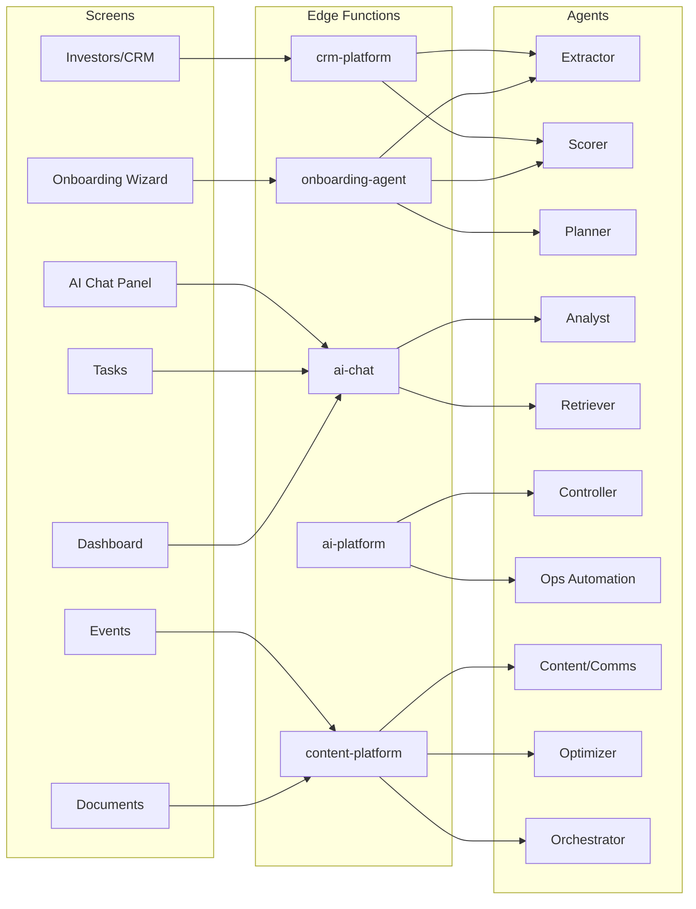
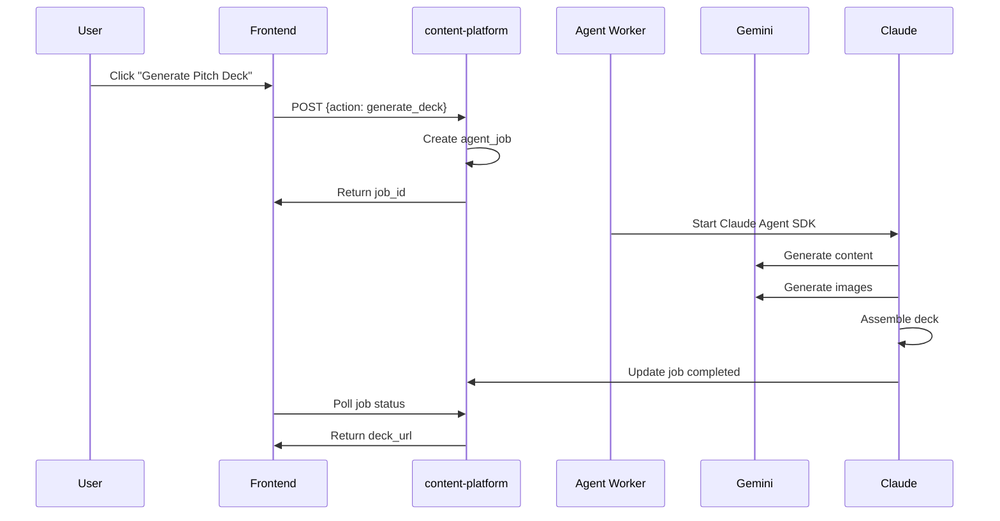

# Screen-to-Agent Mapping

**Purpose:** Map every screen to its AI agents with frontend-backend wiring details  
**Status:** Production Reference  
**Last Updated:** 2025-01-25

---

## Architecture Overview



---

## Screen Details

### 1. Onboarding Wizard

**Route:** `/onboarding`  
**Edge Function:** `onboarding-agent`  
**Status:** ✅ Production

| Step | Agent | Action | Model | Feature |
|------|-------|--------|-------|---------|
| Step 1 | Extractor | `enrich_url` | gemini-3-pro-preview | URL Context, Google Search |
| Step 1 | Extractor | `enrich_context` | gemini-3-pro-preview | Structured Output |
| Step 1 | Extractor | `enrich_founder` | gemini-3-pro-preview | URL Context |
| Step 2 | Analyst | `calculate_readiness` | gemini-3-pro-preview | Thinking Mode |
| Step 3 | Planner | `get_questions` | gemini-3-pro-preview | Structured Output |
| Step 3 | Planner | `process_answer` | gemini-3-pro-preview | Thinking Mode |
| Step 4 | Scorer | `calculate_investor_score` | gemini-3-pro-preview | Thinking Mode |
| Step 4 | Scorer | `get_summary` | gemini-3-pro-preview | Structured Output |
| Complete | Planner | `complete_wizard` | gemini-3-pro-preview | Task Generation |

**Frontend Hooks:**
- `src/hooks/onboarding/useEnrichment.ts` → Extractor
- `src/hooks/onboarding/useInterview.ts` → Planner
- `src/hooks/onboarding/useScoring.ts` → Scorer

**Backend Wiring:**
```typescript
// Frontend call
const { enrichUrl } = useEnrichment();
await enrichUrl("https://example.com");

// Hook implementation
const enrichUrl = async (url: string) => {
  return invokeAgent({ action: "enrich_url", data: { url } });
};

// Edge function handler
case "enrich_url":
  const enriched = await enrichWithGemini(data.url);
  return new Response(JSON.stringify(enriched));
```

---

### 2. Dashboard

**Route:** `/dashboard`  
**Edge Function:** `ai-chat`  
**Status:** 🔶 Partial

| Component | Agent | Action | Model | Feature |
|-----------|-------|--------|-------|---------|
| Health Score | Analyst | `analyze_risks` | gemini-3-pro-preview | Thinking Mode |
| Stage Guidance | Analyst | `stage_guidance` | gemini-3-pro-preview | Google Search |
| Task Suggestions | Planner | `generate_tasks` | gemini-3-pro-preview | Structured Output |
| AI Chat | Retriever | `chat` | gemini-3-flash-preview | RAG (future) |

**Frontend Hooks:**
- `src/hooks/useDashboardData.ts` → Dashboard data
- `src/hooks/useStageGuidanceAI.ts` → Analyst
- `src/hooks/useAIChat.ts` → Retriever

**Backend Wiring:**
```typescript
// Stage guidance call
const guidance = await supabase.functions.invoke("ai-chat", {
  body: { action: "stage_guidance", context: { startup_id } },
});
```

---

### 3. Tasks

**Route:** `/tasks`  
**Edge Function:** `ai-chat`  
**Status:** 🔶 Partial

| Component | Agent | Action | Model | Feature |
|-----------|-------|--------|-------|---------|
| Task Generation | Planner | `generate_tasks` | claude-haiku-4-5 | Messages API |
| Task Prioritization | Planner | `prioritize_tasks` | claude-sonnet-4-5 | Thinking |
| AI Suggestions | Retriever | `chat` | gemini-3-flash-preview | RAG |

**Frontend Hooks:**
- `src/hooks/useTasks.ts` → Task CRUD
- `src/components/tasks/TasksAIPanel.tsx` → AI Panel

**Backend Wiring:**
```typescript
// Task prioritization
const response = await supabase.functions.invoke("ai-chat", {
  body: {
    action: "prioritize_tasks",
    context: { tasks, startup_stage },
  },
});
```

---

### 4. Investors / CRM

**Route:** `/investors`, `/crm`  
**Edge Function:** `crm-platform` (to be created)  
**Status:** ❌ Not Started

| Component | Agent | Action | Model | Feature |
|-----------|-------|--------|-------|---------|
| Contact Enrichment | Extractor | `extract_contact_info` | gemini-3-pro-preview | URL Context |
| Deal Scoring | Scorer | `score_deal` | gemini-3-pro-preview | Thinking Mode |
| Investor Match | Analyst | `analyze_investor_fit` | gemini-3-pro-preview | Google Search |
| Email Generation | Content/Comms | `generate_email` | gemini-3-pro-preview | URL Context |

**Planned Frontend Hooks:**
- `src/hooks/useContactEnrichment.ts` → Extractor
- `src/hooks/useDealScoring.ts` → Scorer
- `src/hooks/useEmailGeneration.ts` → Content/Comms

**Planned Backend Wiring:**
```typescript
// Deal scoring
const score = await supabase.functions.invoke("crm-platform", {
  body: {
    action: "score_deal",
    data: { deal_id, investor_data, startup_data },
  },
});
```

---

### 5. Documents

**Route:** `/documents`  
**Edge Function:** `content-platform` (to be created)  
**Status:** ❌ Not Started

| Component | Agent | Action | Model | Feature |
|-----------|-------|--------|-------|---------|
| Document Generation | Content/Comms | `generate_document` | gemini-3-pro-preview | Structured Output |
| Pitch Deck | Orchestrator | `generate_deck` | claude-sonnet-4-5 | Agent SDK |
| Document Review | Analyst | `review_document` | gemini-3-pro-preview | Thinking Mode |

**Planned Architecture:**


---

### 6. Events

**Route:** `/events`, `/events/:id`  
**Edge Function:** `content-platform` (to be created)  
**Status:** ❌ Not Started

| Component | Agent | Action | Model | Feature |
|-----------|-------|--------|-------|---------|
| Schedule Optimization | Optimizer | `optimize_schedule` | gemini-3-pro-preview | Code Execution |
| Marketing Content | Content/Comms | `generate_marketing` | gemini-3-pro-preview | Image Generation |
| Attendee Analysis | Analyst | `analyze_attendees` | gemini-3-pro-preview | Thinking Mode |

---

### 7. AI Chat Panel (Global)

**Route:** All authenticated routes  
**Edge Function:** `ai-chat`  
**Status:** ✅ Production

| Mode | Agent | Action | Model | Feature |
|------|-------|--------|-------|---------|
| General Chat | Retriever | `chat` | gemini-3-flash-preview | RAG |
| Task Mode | Planner | `prioritize_tasks` | claude-sonnet-4-5 | Thinking |
| Analysis Mode | Analyst | `analyze_risks` | gemini-3-pro-preview | Google Search |

**Frontend Hook:**
- `src/hooks/useAIChat.ts`

**Backend Wiring:**
```typescript
// General chat
const response = await supabase.functions.invoke("ai-chat", {
  body: {
    message: userMessage,
    context: { screen: currentRoute, startup_id },
  },
});
```

---

## Agent-to-Action Reference

### Extractor
| Action | Edge Function | Input | Output |
|--------|---------------|-------|--------|
| `enrich_url` | onboarding-agent | URL string | Startup profile JSON |
| `enrich_context` | onboarding-agent | Description text | Enriched data JSON |
| `enrich_founder` | onboarding-agent | LinkedIn URL | Founder info JSON |
| `extract_contact_info` | crm-platform | LinkedIn/Email | Contact data JSON |

### Scorer
| Action | Edge Function | Input | Output |
|--------|---------------|-------|--------|
| `calculate_investor_score` | onboarding-agent | Startup data | Score 0-100 + factors |
| `score_deal` | crm-platform | Deal + investor data | Win probability + factors |
| `calculate_readiness` | onboarding-agent | Profile data | Readiness score + gaps |

### Planner
| Action | Edge Function | Input | Output |
|--------|---------------|-------|--------|
| `get_questions` | onboarding-agent | Interview state | Dynamic questions |
| `process_answer` | onboarding-agent | Q&A pair | Updated signals |
| `generate_tasks` | ai-chat | Startup context | Task list JSON |
| `prioritize_tasks` | ai-chat | Task list | Prioritized order |

### Analyst
| Action | Edge Function | Input | Output |
|--------|---------------|-------|--------|
| `calculate_readiness` | onboarding-agent | Profile data | Readiness analysis |
| `stage_guidance` | ai-chat | Startup data | Stage recommendations |
| `analyze_risks` | ai-platform | Metrics data | Risk list + severity |
| `analyze_investor_fit` | crm-platform | Startup + investor | Fit score + reasoning |

### Retriever
| Action | Edge Function | Input | Output |
|--------|---------------|-------|--------|
| `chat` | ai-chat | User message | AI response |
| `search_knowledge` | ai-platform | Query string | Documents + citations |

### Controller
| Action | Edge Function | Input | Output |
|--------|---------------|-------|--------|
| `validate_action` | ai-platform | Proposed action | Approved/Rejected + reason |

### Ops Automation
| Action | Edge Function | Input | Output |
|--------|---------------|-------|--------|
| `send_notification` | ai-platform | Event context | Notification text |

### Content/Comms
| Action | Edge Function | Input | Output |
|--------|---------------|-------|--------|
| `generate_email` | content-platform | Context + recipient | Email subject + body |
| `generate_document` | content-platform | Template + data | Document content |
| `generate_marketing` | content-platform | Event + target | Marketing copy + images |

### Optimizer
| Action | Edge Function | Input | Output |
|--------|---------------|-------|--------|
| `optimize_schedule` | content-platform | Constraints | Optimized schedule |

### Orchestrator
| Action | Edge Function | Input | Output |
|--------|---------------|-------|--------|
| `generate_deck` | Agent Worker | Startup ID | Pitch deck URL |
| `strategic_plan` | Agent Worker | Startup ID | Strategy document |

---

## Frontend Component → Hook → Agent

| Component | Hook | Agent | Edge Function |
|-----------|------|-------|---------------|
| `Step1Context.tsx` | `useEnrichment` | Extractor | onboarding-agent |
| `Step2Analysis.tsx` | `useScoring` | Analyst | onboarding-agent |
| `Step3Interview.tsx` | `useInterview` | Planner | onboarding-agent |
| `Step4Review.tsx` | `useScoring` | Scorer | onboarding-agent |
| `AIPanel.tsx` | `useAIChat` | Retriever | ai-chat |
| `StageGuidanceCard.tsx` | `useStageGuidanceAI` | Analyst | ai-chat |
| `TasksAIPanel.tsx` | `useAIChat` | Planner | ai-chat |
| `InvestorsAIPanel.tsx` | (future) | Scorer | crm-platform |
| `DocumentsAIPanel.tsx` | (future) | Content/Comms | content-platform |

---

## Database Tables by Agent

| Agent | Tables Read | Tables Write |
|-------|-------------|--------------|
| Extractor | startups, profiles | wizard_extractions, wizard_sessions |
| Scorer | startups, wizard_sessions | wizard_sessions, ai_runs |
| Planner | startups, tasks | tasks, wizard_sessions, ai_runs |
| Analyst | startups, metrics, deals | ai_runs |
| Retriever | industry_packs, documents | chat_messages, ai_runs |
| Controller | All tables | proposed_actions, ai_runs |
| Ops Automation | deals, tasks, contacts | notifications, ai_runs |
| Content/Comms | startups, contacts | documents, ai_runs |
| Optimizer | events, venues, sessions | events, ai_runs |
| Orchestrator | startups, documents | pitch_decks, agent_jobs, ai_runs |

---

## Related Documentation

- [Agent Tracker](./00-agent-tracker.md) - Implementation status
- [Claude SDK Reference](./01-claude-sdk-reference.md) - API patterns
- [Agent Prompts](./prompts/) - Individual agent prompts
