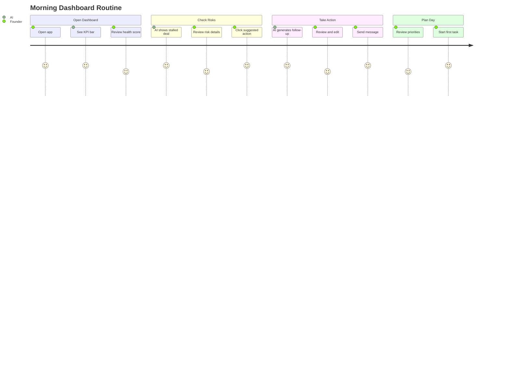

# Dashboard Module: Implementation Prompt

**Status:** 🟡 90% Complete | **Edge Function:** `ai-platform` | **Screens:** 11

---

## Summary Table

| Screen | Route | Agents | Features | Models |
|--------|-------|--------|----------|--------|
| Main Dashboard | `/app/dashboard` | RiskAnalyzer, RAGRetriever | KPIs, risks, priorities, next action | claude-sonnet-4-5, gemini-3-flash-preview |
| Projects | `/app/projects` | ProjectRiskAnalyzer, TaskGenerator | Project cards, health badges, task generation | claude-sonnet-4-5, gemini-3-pro-preview |
| Deals | `/app/deals` | DealScorer, PipelineAnalyzer | Kanban, win probability, pipeline health | gemini-3-pro-preview, claude-sonnet-4-5 |
| Contacts | `/app/contacts` | ContactEnricher, ContactScorer | LinkedIn import, auto-enrichment, scoring | gemini-3-flash-preview, gemini-3-pro-preview |
| Tasks | `/app/tasks` | TaskPrioritizer, TaskGenerator | Priority badges, AI reordering, generation | claude-sonnet-4-5, gemini-3-pro-preview |
| Discovery | `/app/discovery` | DiscoveryMatcher, Extractor | Natural search, match scores, one-click add | gemini-3-pro-preview, gemini-3-flash-preview |
| Events | `/app/events` | EventPlanner, EventAnalyzer | My Events, Industry Events, calendar | gemini-3-pro-preview, claude-sonnet-4-5 |
| Pitch Deck | `/app/pitch-deck` | Orchestrator, Content/Comms | Deck generation, editing, images, export | claude-sonnet-4-5, gemini-3-pro-preview, gemini-3-pro-image-preview |
| Lean Canvas | `/app/canvas` | Planner, Analyst | 9-section editor, AI suggestions, validation | gemini-3-pro-preview, claude-sonnet-4-5 |
| GTM Strategy | `/app/gtm` | Planner, Analyst | Strategy builder, ICP, channels, timeline | gemini-3-pro-preview, claude-sonnet-4-5 |
| Documents | `/app/documents` | Content/Comms, Optimizer | Editor, AI rewrite, generation, templates | claude-sonnet-4-5, gemini-3-pro-preview |

---

## Purpose & Goals

**What It Does:** Command center showing startup health, priorities, risks, and execution across 11 screens.

**Real-World Impact:**
- **Before:** Founder spends 30 minutes context-switching between tools, missing risks, unclear priorities
- **After:** 5-minute morning routine, AI identifies risks early, tasks auto-prioritized, deals scored

**Outcomes:**
- Single source of truth eliminates context-switching
- AI risk analysis prevents problems before they become crises
- Deal win probability guides investor prioritization
- Contact enrichment saves 15 minutes per contact
- Task prioritization ensures founder always works on what matters

---

## User Journey

---

## Real-World User Flows

### Flow 1: Morning Dashboard Routine

**Founder:** Maria, "AI Fashion Events Platform"  
**Time:** 8:00 AM  
**Duration:** 5 minutes

1. Opens `/app/dashboard` → KPI bar: MRR $5K (+20%), Users 150 (+10), Runway 8 months, Health 75%
2. Right panel shows: "⚠️ Deal stalled: Sequoia Capital (7 days no response). Action: Send follow-up email"
3. Main panel highlights: "Update pitch deck before investor meeting tomorrow"
4. Today's priorities: "🔴 Call investor (Today), 🟠 Update deck (+1 day), 🟢 Ship feature (+1 week)"
5. Clicks "Send follow-up" → AI generates email → Reviews → Sends
6. Dashboard updates: Deal status changes, risk disappears, new priority appears

**Result:** Maria knows exactly what to work on, addresses risks proactively, completes morning routine in 5 minutes.

---

### Flow 2: Deal Pipeline Management

**Founder:** James, "SaaS Analytics Tool"  
**Context:** Tracking 12 investor conversations

1. Opens `/app/deals` → Kanban: Research (3), Outreach (4), Meeting (3), Due Diligence (1), Closed (1)
2. Clicks "Sequoia Capital" → Right panel: "Win Probability: 72%. Factors: Strong fit (95%), Active seed stage (90%), Recent B2B SaaS (85%)"
3. Drags deal "Meeting" → "Due Diligence"
4. Right panel updates: "Deal advanced. Action: Prepare data room (Financials, cap table, legal docs, team bios)"
5. Clicks action → AI generates checklist → Creates tasks

**Result:** James never loses track of conversations, knows which deals to prioritize, receives AI-powered next steps.

---

## User Stories & Acceptance Criteria

### US-1: Main Dashboard Overview

**As a founder**, I want to see startup health, priorities, and risks at a glance, so I know what to work on each morning.

**Acceptance:**
- [ ] KPI bar: MRR, Users, Runway, Health Score
- [ ] Next best action prominently displayed
- [ ] Risk analysis: 3-5 risks with severity (🔴 Critical, 🟡 Warning, 🟢 Info)
- [ ] Today's priorities: Top 5 tasks
- [ ] Real-time updates as data changes
- [ ] AI explanations show reasoning

**Agent:** RiskAnalyzer (claude-sonnet-4-5), RAGRetriever (gemini-3-flash-preview)  
**API:** Messages API (< 10s)

---

### US-2: Deal Win Probability

**As a founder**, I want win probability for each deal, so I can prioritize investor outreach.

**Acceptance:**
- [ ] Kanban: 5 stages (Research, Outreach, Meeting, Due Diligence, Closed)
- [ ] Deal cards: Name, amount, win probability %
- [ ] Right panel: Scoring factors when selected
- [ ] Drag-drop updates deal status
- [ ] AI suggests next action per deal
- [ ] Pipeline health analysis

**Agent:** DealScorer (gemini-3-pro-preview), PipelineAnalyzer (claude-sonnet-4-5)  
**API:** Messages API (< 10s)

---

### US-3: Contact Auto-Enrichment

**As a founder**, I want to paste LinkedIn URL and have contact data extracted automatically.

**Acceptance:**
- [ ] Form accepts LinkedIn URLs
- [ ] Extraction completes < 10s
- [ ] Extracted data shows in right panel
- [ ] Form auto-fills: Name, Company, Role, Email
- [ ] User can edit any field
- [ ] Enrichment score displays after save

**Agent:** ContactEnricher (gemini-3-flash-preview), ContactScorer (gemini-3-pro-preview)  
**API:** Messages API (< 10s)  
**Gemini Feature:** URL Context

---

### US-4: Task Prioritization

**As a founder**, I want AI to prioritize tasks automatically, so I always work on what matters most.

**Acceptance:**
- [ ] Task list with priority badges (🔴 Urgent, 🟠 High, 🟢 Normal)
- [ ] "Prioritize with AI" button reorders tasks
- [ ] Right panel shows reasoning
- [ ] Filtering: All, Pending, Completed
- [ ] Completion updates dashboard immediately
- [ ] AI suggests new tasks from goals

**Agent:** TaskPrioritizer (claude-sonnet-4-5), TaskGenerator (gemini-3-pro-preview)  
**API:** Messages API (< 5s)

---

## Implementation Details

### Models & APIs

**Fast Tasks (< 30s):** Messages API
- Risk summaries: claude-sonnet-4-5 (< 10s)
- Deal scoring: gemini-3-pro-preview (< 10s)
- Contact extraction: gemini-3-flash-preview (< 10s)
- Task prioritization: claude-sonnet-4-5 (< 5s)

**Heavy Tasks (> 30s):** Agent SDK
- Pitch deck generation: claude-sonnet-4-5 (7-step workflow, 90s)
- Strategic planning: claude-opus-4-5 (multi-step, 60-120s)

### Gemini 3 Features

**URL Context:** Contact enrichment from LinkedIn  
**Google Search Grounding:** Investor discovery, market research  
**Structured Output:** Deal scoring, contact extraction (JSON schemas)  
**Thinking Mode:** Complex risk analysis (thinkingLevel: 'high')  
**Image Generation:** Pitch deck slide visuals (gemini-3-pro-image-preview)

### Database Tables

- `startups` - Startup profile data
- `contacts` - Contact management
- `deals` - Deal pipeline
- `tasks` - Task management
- `projects` - Project tracking
- `documents` - Document storage
- `activities` - Activity log

### Files Impacted

**Frontend:**
- `src/pages/Dashboard.tsx`
- `src/components/dashboard/AIPanel.tsx`
- `src/components/dashboard/MetricCard.tsx`
- `src/components/dashboard/TaskList.tsx`
- `src/components/dashboard/DealsPipeline.tsx`
- `src/hooks/useDashboardData.ts`

**Backend:**
- `supabase/functions/ai-platform/index.ts` (22 actions)

---

## Production Checklist

- [ ] All 11 screens render correctly
- [ ] Real data integration complete
- [ ] AI responses < 10s for fast tasks
- [ ] Error handling for API failures
- [ ] Loading states for all AI operations
- [ ] Mobile responsive design
- [ ] RLS policies verified

---

**Next:** Complete real data integration (remaining 10%)
