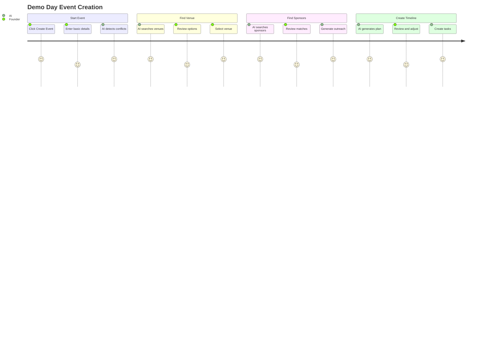

# Events System Module: Implementation Prompt

**Status:** ✅ 65% Complete | **Edge Functions:** 8 functions | **Screens:** 8

---

## Summary Table

| Screen | Route | Agents | Features | Models |
|--------|-------|--------|----------|--------|
| Events Directory | `/app/events` | — | Grid/list, filters, calendar | — |
| Event Dashboard | `/app/events/:id` | EventPlanner, EventAnalyzer | Overview, timeline, readiness, risks | claude-sonnet-4-5, gemini-3-flash-preview |
| Event Wizard | `/app/events/new` | EventPlanner | 4-step creation, AI pre-fill, conflicts | claude-sonnet-4-5 |
| Sponsors Manager | `/app/events/:id/sponsors` | SponsorScout, EventMarketer | Search, outreach, matching | gemini-3-pro-preview, claude-sonnet-4-5 |
| Venue Finder | `/app/events/:id/venues` | VenueFinder | Search, capacity match, pricing | gemini-3-flash-preview |
| Attendees Manager | `/app/events/:id/attendees` | Ops Automation | Registration, check-in, feedback | gemini-3-flash-preview |
| Marketing Hub | `/app/events/:id/marketing` | EventMarketer | Social posts, emails, images | claude-sonnet-4-5, gemini-3-pro-image-preview |
| WhatsApp Console | `/app/events/:id/whatsapp` | WhatsAppAgent | Bulk messaging, Q&A bot | claude-sonnet-4-5 |

---

## Purpose & Goals

**What It Does:** AI-powered event planning for demo days, investor meetings, product launches, networking events.

**Real-World Impact:**
- **Before:** Founder spends 2 weeks planning event (research sponsors, find venues, write content, manage attendees)
- **After:** Complete event plan in 2 hours, AI finds sponsors in 5 minutes, WhatsApp handles 80% of inquiries

**Outcomes:**
- Event planning reduced from weeks to hours
- AI finds 10 relevant sponsors in 5 minutes
- WhatsApp agent handles 80% of attendee inquiries automatically
- Event analytics show clear ROI and improvements

---

## User Journey

---

## Real-World User Flows

### Flow 1: Demo Day Event Creation

**Founder:** David, "AI SaaS Platform"  
**Context:** Needs demo day for 150 investors in 6 weeks  
**Duration:** 30 minutes

1. Clicks "Create Event" → Event Wizard opens
2. Step 1: Enters "Demo Day 2026", March 15, 150 attendees, San Francisco
3. Right panel: "Similar events: TechCrunch Disrupt (March 10), YC Demo Day (March 20). Avoid conflicts?"
4. Step 2: AI searches venues → "Found 8 venues. Top: Tech Hub SF (capacity 200, $5K/day)"
5. Step 3: AI searches sponsors → "Found 12 sponsors. Top: Stripe (sponsors tech events, $10K average)"
6. Step 4: AI generates timeline → "6-week plan: Week 1 (Venue), Week 2 (Sponsors), Week 3 (Marketing)..."
7. Event created → Dashboard shows plan, tasks generated

**Result:** David has complete event plan (venue, sponsors, timeline) in 30 minutes instead of days of research.

---

### Flow 2: Sponsor Discovery

**Founder:** Sarah, "Fashion Tech Platform"  
**Context:** Organizing fashion tech networking event  
**Duration:** 5 minutes

1. Opens `/app/events/:id/sponsors` → Types: "Find fashion tech sponsors"
2. Right panel: "Searching..."
3. Main panel: "12 sponsors found. Top: LVMH (sponsors fashion events, $50K average), Farfetch (tech events), Stitch Fix (networking events)"
4. Right panel for each: "🟢 95% LVMH. Why? Sponsors fashion events, $50K average, Paris-based, recent fashion tech investments"
5. Clicks "Add LVMH, Farfetch" → Sponsors added
6. Right panel: "Generate outreach email for LVMH?"
7. Clicks "Generate" → AI creates personalized email
8. Reviews → Edits → Sends

**Result:** Sarah finds 12 relevant sponsors in 5 minutes, has personalized outreach emails ready.

---

## User Stories & Acceptance Criteria

### US-1: Event Creation Wizard

**As a founder**, I want to create events with AI guidance, so I can plan faster without missing steps.

**Acceptance:**
- [ ] 4-step wizard: Details, Venue, Sponsors, Timeline
- [ ] AI pre-fills based on event type
- [ ] Conflict detection warns about overlapping events
- [ ] Timeline generation creates 6-week plan
- [ ] Task list generated from timeline
- [ ] Event saves with all metadata

**Agent:** EventPlanner (claude-sonnet-4-5)  
**API:** Messages API (< 30s)

---

### US-2: Sponsor Discovery

**As a founder**, I want to find sponsors using natural language search, so I can identify potential sponsors quickly.

**Acceptance:**
- [ ] Natural search: "fashion tech sponsors"
- [ ] Google Search Grounding returns real-time results
- [ ] Match scores: 0-100% per sponsor
- [ ] "Why Match?" explanation in right panel
- [ ] One-click "Add Sponsor" creates record
- [ ] Search completes < 15s

**Agent:** SponsorScout (gemini-3-pro-preview)  
**API:** Messages API (< 15s)  
**Gemini Feature:** Google Search Grounding

---

### US-3: Venue Discovery

**As a founder**, I want to find venues matching my criteria, so I can book the right venue quickly.

**Acceptance:**
- [ ] Search: Location, capacity, budget
- [ ] Google Search Grounding returns real venues
- [ ] Structured output: Name, address, capacity, cost, amenities
- [ ] Venue cards display all info
- [ ] Save venue to event
- [ ] Search completes < 10s

**Agent:** VenueFinder (gemini-3-flash-preview)  
**API:** Messages API (< 10s)  
**Gemini Feature:** Google Search Grounding, Structured Output

---

### US-4: Marketing Content Generation

**As a founder**, I want AI to generate social posts and emails, so I can promote my event without writing manually.

**Acceptance:**
- [ ] Social posts: Twitter, LinkedIn, Instagram
- [ ] Email templates: Attendees, sponsors, speakers
- [ ] Image generation for event visuals
- [ ] Content preview in right panel
- [ ] Edit before publishing
- [ ] Scheduling posts at optimal times

**Agent:** EventMarketer (claude-sonnet-4-5, gemini-3-pro-image-preview)  
**API:** Messages API (< 30s)

---

## Implementation Details

### Database Tables (7)

- `events` - Main events (35 columns)
- `event_sponsors` - Sponsor management (tier, amount, match_score)
- `event_venues` - Venue booking (capacity, cost, amenities)
- `event_attendees` - Registration (RSVP, check-in, dietary, feedback)
- `event_messages` - WhatsApp/SMS (direction, AI handling, sentiment)
- `event_assets` - Marketing (type, platform, impressions, clicks)
- `startup_event_tasks` - Event tasks (linked to main tasks)

### Edge Functions (8)

- `event-wizard` - AI-guided creation (claude-sonnet-4-5)
- `event-plan-generator` - Timeline and tasks (claude-sonnet-4-5)
- `event-marketing` - Content generation (claude-sonnet-4-5)
- `event-analytics` - Performance analysis (gemini-3-flash-preview)
- `sponsor-search` - Google Search discovery (gemini-3-pro-preview)
- `sponsor-outreach` - Email generation (claude-sonnet-4-5)
- `venue-search` - Google Search finder (gemini-3-flash-preview)
- `whatsapp-agent` - Attendee communication (claude-sonnet-4-5)

### Files Impacted

**Frontend:**
- `src/pages/Events.tsx`
- `src/pages/EventDetail.tsx`
- `src/pages/EventWizard.tsx`
- `src/components/events/EventCard.tsx`
- `src/components/events/EventFiltersPanel.tsx`
- `src/components/events/EventsAIPanel.tsx`
- `src/components/events/wizard/*.tsx`
- `src/hooks/useEvents.ts`

**Backend:**
- `supabase/functions/event-wizard/index.ts`
- `supabase/functions/sponsor-search/index.ts`
- `supabase/functions/venue-search/index.ts`
- `supabase/functions/event-marketing/index.ts`

---

## Production Checklist

- [ ] All 8 screens render correctly
- [ ] Google Search Grounding works for sponsors/venues
- [ ] Event creation wizard saves all data
- [ ] Marketing content generation works
- [ ] WhatsApp integration setup complete
- [ ] RLS policies verified
- [ ] Error handling for search failures

---

**Next:** Complete WhatsApp API setup, advanced analytics, performance optimization (remaining 35%)
