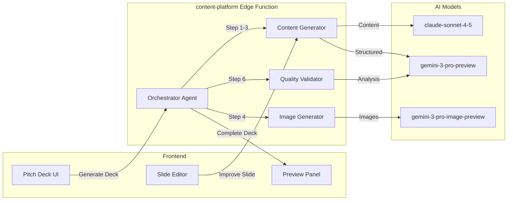

# Pitch Deck Generator Module: Implementation Prompt

**Status:** ✅ 70% Complete | **Edge Function:** `content-platform` | **Screens:** 3

---

## Summary Table

| Screen | Route | Agents | Features | Models |
|--------|-------|--------|----------|--------|
| Pitch Deck Generator | `/app/pitch-deck` | Orchestrator, Content/Comms | 7-step generation, progress tracking | claude-sonnet-4-5, gemini-3-pro-preview, gemini-3-pro-image-preview |
| Deck Editor | `/app/pitch-deck/:id/edit` | Content/Comms, Optimizer | Slide editing, AI rewrite, analysis | claude-sonnet-4-5, gemini-3-pro-preview |
| Presentation Mode | `/app/pitch-deck/:id/present` | — | Fullscreen, navigation, keyboard shortcuts | — |

---

## Purpose & Goals

**What It Does:** Generate investor-ready pitch decks automatically in 2-3 minutes with AI-powered content and images.

**Real-World Impact:**
- **Before:** Founder spends 8-12 hours creating pitch deck manually
- **After:** Complete deck in 90 seconds, 30 minutes refining instead of 8 hours creating

**Outcomes:**
- Complete deck (10-15 slides) generated in 90 seconds
- Images generated automatically for visual slides
- AI improvements enhance content quality
- Export to PPTX/PDF works seamlessly

---

## Architecture Flow

---

## Real-World User Flows

### Flow 1: Complete Deck Generation

**Founder:** Sarah, "AI Fashion Events Platform"  
**Context:** Needs pitch deck for $500K seed round  
**Duration:** 90 seconds generation + 30 minutes refining

1. Opens `/app/pitch-deck` → Clicks "Generate Pitch Deck"
2. Progress: "Step 1/7: Extracting startup data..." → "Step 2/7: Generating slide titles..."
3. Right panel shows progress: "Step 3/7: Creating slide content... Step 4/7: Generating images..."
4. Step 5: "Assembling deck structure..." → Step 6: "Validating quality..." → Step 7: "Export ready"
5. Deck previews in right panel: 12 slides with content and images
6. Sarah reviews → Edits Problem slide, improves Solution narrative
7. Clicks "Export to PPTX" → Downloads complete deck

**Result:** Sarah has investor-ready deck in 90 seconds. Spends 30 minutes refining instead of 8 hours creating.

---

### Flow 2: Slide Content Improvement

**Founder:** James, "SaaS Analytics Tool"  
**Context:** Generated deck, wants to improve Problem slide  
**Duration:** 2 minutes

1. Opens deck editor → Clicks Problem slide
2. Right panel: "Analysis: Clarity 7/10, Impact 6/10, Tone 8/10. Suggestion: Make problem more specific with data"
3. Right panel: "Improved version: 'SaaS founders waste 40% of their time context-switching between analytics tools...'"
4. Compares original vs improved → Clicks "Apply"
5. Slide updates → Adds customer quote
6. Right panel: "Re-analysis: Clarity 9/10, Impact 8/10"

**Result:** James improves slide quality from 7/10 to 9/10 in 2 minutes with AI assistance.

---

## User Stories & Acceptance Criteria

### US-1: Complete Deck Generation

**As a founder**, I want to generate a complete pitch deck automatically, so I can have investor-ready deck in minutes.

**Acceptance:**
- [ ] Generation completes < 3 minutes
- [ ] All standard slides: Problem, Solution, Market, Traction, Team, Financials, Ask
- [ ] Content matches startup profile
- [ ] Images generated for visual slides
- [ ] Progress indicator shows current step (1/7, 2/7, etc.)
- [ ] Export to PPTX/PDF works

**Agent:** Orchestrator (claude-sonnet-4-5), Content/Comms (gemini-3-pro-preview, gemini-3-pro-image-preview)  
**API:** Agent SDK (7-step workflow, 90s)

---

### US-2: Slide Content Editing

**As a founder**, I want to edit slides with AI suggestions, so I can improve deck quality quickly.

**Acceptance:**
- [ ] Rich text editor for slide content
- [ ] AI suggestions appear in right panel
- [ ] Accept/reject suggestions
- [ ] Slide updates immediately
- [ ] Changes save automatically
- [ ] Undo/redo works

**Agent:** Content/Comms (claude-sonnet-4-5), Optimizer (gemini-3-pro-preview)  
**API:** Messages API (< 10s)

---

### US-3: Slide Image Generation

**As a founder**, I want AI to generate images for slides automatically, so I don't create visuals manually.

**Acceptance:**
- [ ] Image generation completes < 10s
- [ ] Images match slide content and theme
- [ ] Professional quality (4K resolution)
- [ ] Can regenerate if not satisfied
- [ ] Images save to slide correctly
- [ ] Export includes images

**Agent:** Content/Comms (Image Generation)  
**API:** Gemini Image API (< 10s)  
**Model:** gemini-3-pro-image-preview

---

### US-4: Slide Quality Analysis

**As a founder**, I want AI to analyze slide quality and suggest improvements, so I can create compelling deck.

**Acceptance:**
- [ ] Analysis shows: Clarity, Impact, Tone scores (0-10)
- [ ] Feedback explains strengths and weaknesses
- [ ] Suggestions are specific and actionable
- [ ] Analysis completes < 5s
- [ ] Scores update after content changes
- [ ] Overall deck quality score calculated

**Agent:** Optimizer (gemini-3-pro-preview)  
**API:** Messages API (< 5s)  
**Gemini Feature:** Thinking Mode (high)

---

## Implementation Details

### Generation Workflow (7 Steps)

1. **Extract Startup Data** - Gemini extracts from profile (gemini-3-pro-preview, < 10s)
2. **Generate Slide Titles** - Gemini creates 12 titles (gemini-3-pro-preview, < 10s)
3. **Generate Slide Content** - Gemini creates content per slide (gemini-3-pro-preview, < 30s)
4. **Generate Images** - Gemini Image creates 4 visuals (gemini-3-pro-image-preview, < 40s)
5. **Assemble Deck** - System assembles structure (< 5s)
6. **Validate Quality** - AI checks completeness (< 10s)
7. **Export Format** - System exports to PPTX/PDF (< 5s)

**Total Duration:** 90-120 seconds  
**API:** Agent SDK (multi-step orchestration)

### Database Tables

- `documents` - Deck storage (type: 'pitch_deck')
- `deck_templates` - Template storage
- `startups` - Source data for extraction

### Files Impacted

**Frontend:**
- `src/pages/PitchDeck.tsx` (to be created)
- `src/components/pitchdeck/DeckGenerator.tsx`
- `src/components/pitchdeck/SlideEditor.tsx`
- `src/components/pitchdeck/SlidePreview.tsx`
- `src/hooks/usePitchDeck.ts`

**Backend:**
- `supabase/functions/content-platform/index.ts` (32 actions)

---

## Production Checklist

- [ ] 7-step workflow completes successfully
- [ ] Image generation produces quality visuals
- [ ] PPTX export works correctly
- [ ] PDF export works correctly
- [ ] Slide editing saves properly
- [ ] Progress tracking displays correctly
- [ ] Error recovery for failed steps

---

**Next:** Add templates, collaboration features, advanced editing (remaining 30%)
