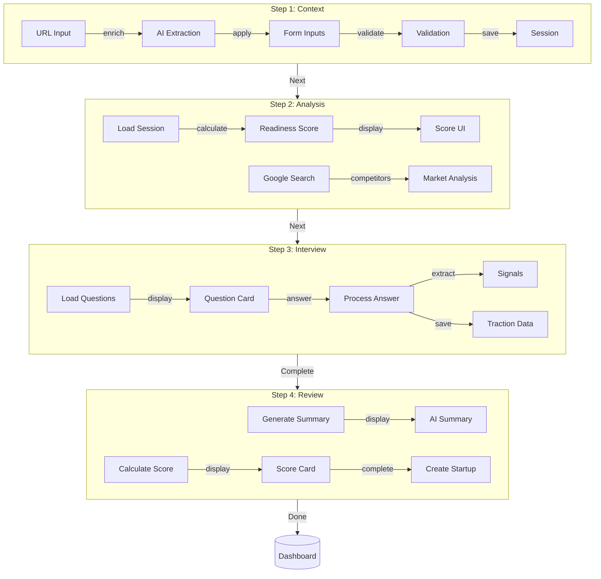

# Onboarding Wizard Module: Implementation Prompt

**Status:** 🟡 85% Complete | **Edge Function:** `onboarding-agent` | **Steps:** 5

---

## Summary Table

| Step | Route | Agents | Features | Models |
|------|-------|--------|----------|--------|
| Step 1: Context | `/app/onboarding/step1` | ProfileExtractor | URL extraction, smart autofill | gemini-3-flash-preview |
| Step 2: AI Analysis | `/app/onboarding/step2` | Analyst, Extractor, Scorer | Competitor analysis, market signals, readiness | gemini-3-pro-preview |
| Step 3: Interview | `/app/onboarding/step3` | Analyst, Planner | Smart interview, signal extraction | gemini-3-pro-preview, claude-sonnet-4-5 |
| Step 4: Review | `/app/onboarding/step4` | Analyst, Scorer | Funding, metrics, investor score | gemini-3-pro-preview |
| Complete | `/app/dashboard` | TaskGenerator | Task generation, profile completion | claude-sonnet-4-5 |

---

## Purpose & Goals

**What It Does:** Guide founders through creating complete startup profile in 15-25 minutes with AI-powered extraction, analysis, and task generation.

**Real-World Impact:**
- **Before:** Founder spends hours entering data manually, unclear what information is needed
- **After:** Complete profile in 20 minutes, AI extracts from URL, generates tasks automatically

**Outcomes:**
- Profile completion in 20 minutes instead of hours
- URL extraction saves 15 minutes per profile
- AI generates 10-15 actionable tasks automatically
- Readiness score shows startup health (0-100%)

---

## Architecture Flow

---

## Real-World User Flows

### Flow 1: URL-Based Profile Extraction

**Founder:** Maria, "AI Fashion Events Platform"  
**Context:** Starting wizard, has website  
**Duration:** 2 minutes

1. Step 1 opens → Pastes "https://fashionevents.ai" in website field
2. Right panel: "Extracting company information..."
3. Right panel: "Extracted: Company Name: FashionEvents AI, Industry: Fashion Tech, Description: AI-powered platform connecting fashion brands with event venues..."
4. Main panel auto-fills: Company Name, Industry, Description, Key Features
5. Reviews extracted data → Edits description for clarity
6. Clicks "Continue" → Moves to Step 2

**Result:** Maria saves 15 minutes of manual entry. Profile 80% complete from URL extraction.

---

### Flow 2: Competitor Analysis

**Founder:** James, "SaaS Analytics Tool"  
**Context:** Completed Step 1, wants to understand competitive landscape  
**Duration:** 1 minute

1. Step 2 opens → AI analyzes extracted data
2. Right panel: "Analyzing market context and competitors..."
3. Main panel: "5 competitors found: Mixpanel, Amplitude, Segment, Heap, PostHog"
4. Right panel: "Market signals: Growing demand for product analytics (20% YoY), Enterprise focus shifting to self-serve, AI integration becoming standard"
5. Right panel: "Readiness Score: 65%. Strengths: Clear problem, experienced team. Gaps: Limited traction, undefined GTM strategy"
6. Reviews competitor analysis → Notes market opportunities
7. Clicks "Continue" → Moves to Step 3 with market context

**Result:** James understands competitive landscape and market position before defining solution.

---

### Flow 3: Smart Interview

**Founder:** Sarah, "AI Content Platform"  
**Context:** Completed Step 2, entering interview phase  
**Duration:** 10 minutes

1. Step 3 opens → First question: "What problem does your startup solve?"
2. Types answer → AI extracts signals: "Problem: Content creation time, Signal: Productivity pain point"
3. Next question adapts based on answer: "How does your solution differ from existing tools?"
4. Continues through 5-7 questions → Topic badges show coverage (Traction ✅, Market ✅, Team ⏳)
5. Completes interview → "All topics covered. Extracted 12 signals."
6. Clicks "Continue" → Moves to Step 4

**Result:** Sarah provides detailed information through natural conversation, AI extracts structured data.

---

## User Stories & Acceptance Criteria

### US-1: URL-Based Profile Extraction

**As a founder**, I want to paste my startup URL and have company information extracted automatically.

**Acceptance:**
- [ ] URL field accepts website URLs
- [ ] Extraction completes < 10s
- [ ] Extracted data displays in right panel
- [ ] Form auto-fills: Name, Industry, Description, Features
- [ ] User can edit any extracted field
- [ ] Extraction works for common website formats

**Agent:** ProfileExtractor (gemini-3-flash-preview)  
**API:** Messages API (< 10s)  
**Gemini Feature:** URL Context

---

### US-2: Competitor Analysis

**As a founder**, I want AI to identify competitors and analyze market signals, so I understand my competitive landscape.

**Acceptance:**
- [ ] Competitor analysis identifies 5-10 relevant competitors
- [ ] Market signals show industry trends and opportunities
- [ ] Analysis completes < 15s
- [ ] Results display in main panel
- [ ] User can add/remove competitors
- [ ] Analysis uses Google Search Grounding for real-time data

**Agent:** Analyst, Extractor (gemini-3-pro-preview)  
**API:** Messages API (< 15s)  
**Gemini Feature:** Google Search Grounding

---

### US-3: Smart Interview

**As a founder**, I want AI to interview me with adaptive questions, so I provide comprehensive information naturally.

**Acceptance:**
- [ ] Questions adapt based on previous answers
- [ ] Signal extraction identifies key data points
- [ ] Topic coverage badges show progress
- [ ] 5-7 questions complete full profile
- [ ] Traction data extracted from answers
- [ ] Interview completes in 10-15 minutes

**Agent:** Analyst, Planner (gemini-3-pro-preview, claude-sonnet-4-5)  
**API:** Messages API (< 10s per question)

---

### US-4: Investor Readiness Scoring

**As a founder**, I want to see my investor readiness score, so I know what to improve before fundraising.

**Acceptance:**
- [ ] Readiness score calculates (0-100%)
- [ ] Score factors display (traction, team, market, etc.)
- [ ] Score updates as user enters data
- [ ] Recommendations show how to improve score
- [ ] Score calculation completes < 10s
- [ ] Score saves to profile

**Agent:** Scorer, Analyst (gemini-3-pro-preview)  
**API:** Messages API (< 10s)  
**Gemini Feature:** Thinking Mode (high)

---

## Implementation Details

### Edge Function Actions (11)

- `create_session` - Create wizard session
- `save_step` - Save step data
- `wizard_extract_startup` - Extract from URL (gemini-3-flash-preview)
- `wizard_analyze_readiness` - Analyze readiness (gemini-3-pro-preview)
- `get_questions` - Get interview questions
- `process_answer` - Process interview answer
- `wizard_score_startup` - Calculate score (gemini-3-pro-preview)
- `generate_summary` - Generate AI summary
- `wizard_generate_tasks` - Generate tasks (claude-sonnet-4-5)
- `complete_wizard` - Complete wizard and create startup

### Database Tables

- `wizard_sessions` - Wizard state persistence
- `wizard_extractions` - URL extraction cache
- `startups` - Final startup profile
- `tasks` - Generated tasks
- `profiles` - User profile link

### Files Impacted

**Frontend:**
- `src/pages/OnboardingWizard.tsx`
- `src/components/onboarding/WizardLayout.tsx`
- `src/components/onboarding/WizardAIPanel.tsx`
- `src/components/onboarding/step1/*.tsx`
- `src/components/onboarding/step2/*.tsx`
- `src/components/onboarding/step3/*.tsx`
- `src/components/onboarding/step4/*.tsx`
- `src/hooks/onboarding/*.ts`

**Backend:**
- `supabase/functions/onboarding-agent/index.ts`

---

## Production Checklist

- [x] URL extraction with Gemini URL Context
- [x] Google Search Grounding for competitors
- [x] Smart interview with signal extraction
- [x] Readiness scoring with Thinking Mode
- [x] Session persistence across refreshes
- [x] JWT authentication on all calls
- [ ] Task generation linked to projects
- [ ] Advanced validation for all fields

---

**Next:** Complete AI integration, advanced validation, task linking (remaining 15%)
