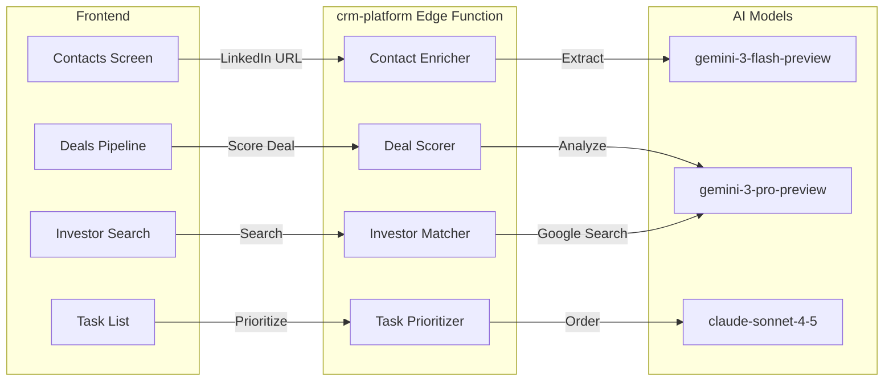

# CRM Platform Module: Implementation Prompt

**Status:** 🔴 20% Complete | **Edge Function:** `crm-platform` | **Screens:** 5

---

## Summary Table

| Screen | Route | Agents | Features | Models |
|--------|-------|--------|----------|--------|
| Contacts | `/app/contacts` | ContactEnricher, ContactScorer | LinkedIn import, auto-enrichment, scoring | gemini-3-flash-preview, gemini-3-pro-preview |
| Deals Pipeline | `/app/deals` | DealScorer, PipelineAnalyzer | Kanban, win probability, pipeline health | gemini-3-pro-preview, claude-sonnet-4-5 |
| Investors | `/app/investors` | InvestorMatcher, Scorer | Search, matching, scoring, tracking | gemini-3-pro-preview, gemini-3-flash-preview |
| Projects | `/app/projects` | ProjectRiskAnalyzer, TaskGenerator | Project cards, health badges, task generation | claude-sonnet-4-5, gemini-3-pro-preview |
| Tasks | `/app/tasks` | TaskPrioritizer, TaskGenerator | Priority badges, AI reordering, generation | claude-sonnet-4-5, gemini-3-pro-preview |

---

## Purpose & Goals

**What It Does:** Unified CRM for contacts, deals, investors, projects, and tasks with AI-powered enrichment, scoring, and prioritization.

**Real-World Impact:**
- **Before:** Founder manages 50+ investor contacts manually, loses track of conversations, unclear priorities
- **After:** Contacts auto-enriched, deals scored, tasks prioritized, no conversations fall through cracks

**Outcomes:**
- Contact enrichment saves 15 minutes per contact
- Deal win probability guides investor prioritization
- Project health tracking identifies at-risk projects early
- Task prioritization ensures founder works on what matters

---

## Architecture Flow

---

## Real-World User Flows

### Flow 1: Contact Auto-Enrichment

**Founder:** Sarah, "Event Management SaaS"  
**Context:** Met investor at networking event  
**Duration:** 2 minutes

1. Opens `/app/contacts` → Clicks "Add Contact" → Pastes LinkedIn URL
2. Right panel: "Extracting contact information..."
3. Right panel: "Extracted: John Smith, Partner at Sequoia Capital, Focus: AI/ML, Seed stage, Recent: Similar.ai, DataFlow.io"
4. Main panel auto-fills: Name, Company, Role, Email (if found)
5. Adds notes: "Met at TechCrunch Disrupt, interested in B2B SaaS"
6. Saves → Contact created, linked to Deals
7. Right panel: "Action: Create deal for Sequoia Capital ($500K target)"

**Result:** Sarah saves 15 minutes of manual entry. Contact enriched with company data, investment focus, recent activity.

---

### Flow 2: Deal Win Probability

**Founder:** James, "SaaS Analytics Tool"  
**Context:** Tracking 12 investor conversations  
**Duration:** 1 minute

1. Opens `/app/deals` → Clicks "Sequoia Capital" deal
2. Right panel: "Win Probability: 72%. Factors: Strong fit (AI/ML focus: 95%), Active in seed stage (90%), Recent B2B SaaS investments (85%), Last contact 5 days ago (70%)"
3. Drags deal "Meeting" → "Due Diligence"
4. Right panel updates: "Deal advanced. Action: Prepare data room (Financials, cap table, legal docs, team bios)"
5. Clicks action → AI generates checklist → Creates tasks

**Result:** James knows Sequoia has 72% win probability, should be prioritized. AI suggests next action.

---

### Flow 3: Investor Discovery

**Founder:** Mike, "SaaS Analytics Tool"  
**Context:** Needs seed VCs in B2B SaaS and AI/ML  
**Duration:** 2 minutes

1. Opens `/app/investors` → Types: "Find seed VCs in B2B SaaS and AI/ML"
2. Right panel: "Searching..."
3. Main panel: "47 found. High fit: 12"
4. Right panel for each: "🟢 95% Sequoia Capital. Why? AI/ML focus, Seed stage, Recent B2B SaaS, SF-based"
5. Clicks "Add all 12" → Contacts created automatically
6. Right panel: "Action: Create outreach campaign for 12 investors"

**Result:** Mike finds 12 highly relevant investors in 2 minutes instead of hours of manual research.

---

## User Stories & Acceptance Criteria

### US-1: Contact Auto-Enrichment

**As a founder**, I want to paste LinkedIn URL and have contact data extracted automatically.

**Acceptance:**
- [ ] Form accepts LinkedIn URLs
- [ ] Extraction completes < 10s
- [ ] Extracted data: Name, Company, Role, Email, Investment focus
- [ ] Form auto-fills with extracted data
- [ ] User can edit any field
- [ ] Enrichment score displays after save

**Agent:** ContactEnricher (gemini-3-flash-preview), ContactScorer (gemini-3-pro-preview)  
**API:** Messages API (< 10s)  
**Gemini Feature:** URL Context

---

### US-2: Deal Win Probability

**As a founder**, I want win probability for each deal, so I can prioritize investor outreach.

**Acceptance:**
- [ ] Kanban: 5 stages (Research, Outreach, Meeting, Due Diligence, Closed)
- [ ] Deal cards: Name, amount, win probability %
- [ ] Right panel: Scoring factors when selected
- [ ] Drag-drop updates deal status
- [ ] AI suggests next action per deal
- [ ] Pipeline health analysis

**Agent:** DealScorer (gemini-3-pro-preview), PipelineAnalyzer (claude-sonnet-4-5)  
**API:** Messages API (< 10s)  
**Gemini Feature:** Structured Output, Thinking Mode (high)

---

### US-3: Project Health Tracking

**As a founder**, I want to see project progress and health, so I can identify at-risk projects early.

**Acceptance:**
- [ ] Project cards: Name, progress %, health badge
- [ ] Health badges: 🟢 On Track, 🟡 At Risk, 🔴 Behind
- [ ] Right panel: Project insights when selected
- [ ] AI suggests tasks for at-risk projects
- [ ] Progress bars update as tasks complete
- [ ] Filtering by health status

**Agent:** ProjectRiskAnalyzer (claude-sonnet-4-5), TaskGenerator (gemini-3-pro-preview)  
**API:** Messages API (< 10s)

---

### US-4: Task Prioritization

**As a founder**, I want AI to prioritize tasks automatically, so I always work on what matters most.

**Acceptance:**
- [ ] Task list with priority badges (🔴 Urgent, 🟠 High, 🟢 Normal)
- [ ] "Prioritize with AI" button reorders tasks
- [ ] Right panel shows reasoning
- [ ] Filtering: All, Pending, Completed
- [ ] Completion updates dashboard immediately
- [ ] AI suggests new tasks from goals

**Agent:** TaskPrioritizer (claude-sonnet-4-5), TaskGenerator (gemini-3-pro-preview)  
**API:** Messages API (< 5s)

---

### US-5: Investor Matching

**As a founder**, I want to find investors matching my startup profile, so I can build targeted investor list.

**Acceptance:**
- [ ] Natural language search accepts queries
- [ ] Results display with match score (0-100%)
- [ ] Right panel shows "Why Match?" for each result
- [ ] One-click "Add to CRM" creates contact automatically
- [ ] Search completes < 15s
- [ ] Results include contact information when available

**Agent:** InvestorMatcher (gemini-3-pro-preview), Scorer (gemini-3-flash-preview)  
**API:** Messages API (< 15s)  
**Gemini Feature:** Google Search Grounding

---

## Implementation Details

### Edge Function Actions (27)

**Contact Management:**
- `enrich_contact` - Extract from LinkedIn (gemini-3-flash-preview, < 10s)
- `enrich_company` - Extract company data (gemini-3-flash-preview, < 15s)
- `score_contact` - Calculate engagement score (gemini-3-flash-preview, < 5s)
- `analyze_contact` - Relationship health (gemini-3-pro-preview, < 10s)

**Deal Management:**
- `score_deal` - Calculate win probability (gemini-3-pro-preview, < 10s)
- `analyze_deal` - Deep deal analysis (gemini-3-pro-preview, < 15s)
- `analyze_pipeline` - Pipeline health (gemini-3-pro-preview, < 20s)
- `suggest_next_action` - Recommend action (gemini-3-flash-preview, < 5s)

**Investor Management:**
- `find_investors` - Investor search (gemini-3-pro-preview, < 15s)
- `match_investors` - Match to startup (gemini-3-pro-preview, < 10s)

**Task Management:**
- `generate_tasks` - Create from goals (claude-sonnet-4-5, < 15s)
- `prioritize_tasks` - Prioritize list (claude-sonnet-4-5, < 5s)

### Database Tables

- `contacts` - Contact management
- `deals` - Deal pipeline
- `projects` - Project management
- `tasks` - Task management
- `communications` - Communication log

### Files Impacted

**Frontend:**
- `src/pages/CRM.tsx`
- `src/pages/Investors.tsx`
- `src/pages/Projects.tsx`
- `src/pages/Tasks.tsx`
- `src/components/crm/*.tsx`
- `src/components/investors/*.tsx`
- `src/components/tasks/*.tsx`
- `src/hooks/useCRM.ts`
- `src/hooks/useInvestors.ts`
- `src/hooks/useTasks.ts`

**Backend:**
- `supabase/functions/crm-platform/index.ts` (to be created)

---

## Production Checklist

- [ ] Create `crm-platform` edge function
- [ ] Implement all 27 actions
- [ ] LinkedIn URL extraction works
- [ ] Google Search Grounding for investors
- [ ] Deal scoring with Thinking Mode
- [ ] Task prioritization works
- [ ] RLS policies verified

---

**Next:** Consolidate edge functions, implement all 27 actions, add advanced features (remaining 80%)
