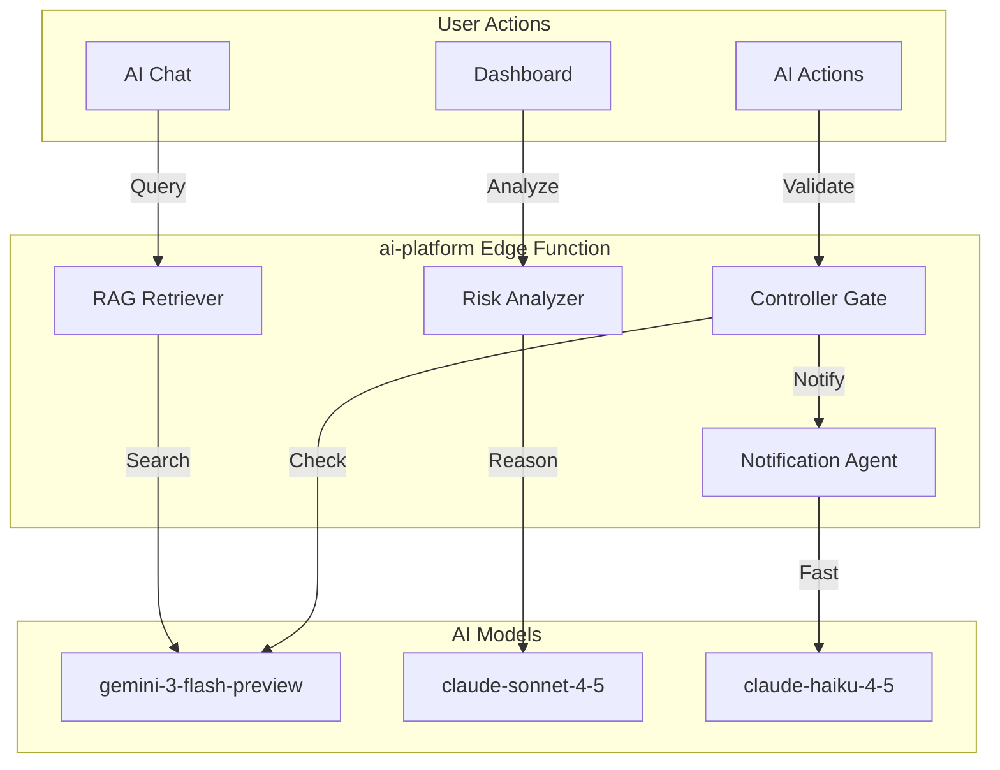

# AI Platform Module: Implementation Prompt

**Status:** 🔴 40% Complete | **Edge Function:** `ai-platform` | **Features:** 4

---

## Summary Table

| Feature | Route | Agents | Features | Models |
|---------|-------|--------|----------|--------|
| AI Chat | `/app/chat` | RAGRetriever, Analyst | Conversational AI, knowledge search | gemini-3-flash-preview, claude-sonnet-4-5 |
| Dashboard AI Panel | `/app/dashboard` (right) | RiskAnalyzer, RAGRetriever | Risk analysis, insights, recommendations | claude-sonnet-4-5, gemini-3-flash-preview |
| Notifications | All screens | Ops Automation | Real-time alerts, updates | claude-haiku-4-5 |
| Approval Gates | All screens | Controller | Action validation, safety checks | gemini-3-flash-preview |

---

## Purpose & Goals

**What It Does:** AI-powered assistance across all StartupAI features—conversational chat, knowledge search, risk analysis, notifications, and approval gates.

**Real-World Impact:**
- **Before:** Founder searches documentation, waits for support, misses risks, unclear what to do
- **After:** Instant answers from knowledge base, AI identifies risks early, notifications keep founder informed, approval gates prevent unauthorized actions

**Outcomes:**
- Instant answers to startup questions from knowledge base
- AI identifies risks before they become problems
- Notifications keep founder informed without overwhelming
- Approval gates prevent AI from making unauthorized changes

---

## Architecture Flow

---

## Real-World User Flows

### Flow 1: Knowledge Base Search

**Founder:** Maria, "AI Fashion Events Platform"  
**Context:** Asks "How do I calculate my startup's runway?"  
**Duration:** 5 seconds

1. Opens `/app/chat` → Types: "How do I calculate my startup's runway?"
2. AI searches knowledge base → Finds Financial Planning Guide
3. AI responds: "Runway = Cash / Monthly Burn Rate. Example: $100K cash ÷ $10K monthly burn = 10 months runway. [Source: Financial Planning Guide]"
4. Right panel: "Would you like me to calculate your runway? I can use your current cash and monthly burn rate from your profile."
5. Clicks "Calculate" → AI: "Your runway: 8 months ($80K cash ÷ $10K monthly burn)"
6. Reviews → Saves to notes

**Result:** Maria gets instant, accurate answer from knowledge base instead of searching documentation.

---

### Flow 2: Risk Identification

**Founder:** James, "SaaS Analytics Tool"  
**Context:** Opens dashboard, AI identifies critical risk  
**Duration:** 10 seconds

1. Opens `/app/dashboard` → Dashboard loads
2. Right panel: "⚠️ Critical Risk: Deal stalled. Sequoia Capital hasn't responded in 7 days. Last contact: Email sent Jan 18. Action: Send follow-up email or schedule call."
3. Clicks risk → Main panel shows deal details, communication history
4. Right panel: "Generate follow-up email? I can reference your previous email and add new traction data."
5. Clicks "Generate" → AI creates personalized follow-up
6. Reviews → Edits → Sends

**Result:** James catches stalled deal early. AI suggests specific action with context, preventing deal from going cold.

---

### Flow 3: Approval Gate

**Founder:** Lisa, "AI Content Platform"  
**Context:** Uses AI to generate tasks  
**Duration:** 30 seconds

1. Clicks "Generate Tasks" on Tasks screen
2. AI creates 15 tasks based on profile and goals
3. Controller validates: "15 tasks proposed. Impact: High (will create 15 database records). Safety: Safe (no data deletion)."
4. Right panel: "Proposed: Create 15 tasks. Reasoning: Based on your goals. Review tasks below."
5. Reviews all 15 tasks with priorities and due dates
6. Removes 3 tasks, adjusts priorities for 5 tasks
7. Clicks "Apply" → 12 tasks created (Lisa's adjusted list)

**Result:** Lisa maintains control. AI proposes actions, but Lisa reviews and approves before execution.

---

## User Stories & Acceptance Criteria

### US-1: Conversational AI Assistant

**As a founder**, I want to ask questions and get instant answers from knowledge base.

**Acceptance:**
- [ ] Chat interface accepts natural language
- [ ] Knowledge base search returns relevant documents
- [ ] Answers include citations to source documents
- [ ] Suggested actions extracted from responses
- [ ] Conversation history maintained
- [ ] Response time < 5s

**Agent:** RAGRetriever (gemini-3-flash-preview), Analyst (claude-sonnet-4-5)  
**API:** Messages API (< 5s)  
**Gemini Feature:** File Search (RAG)

---

### US-2: Risk Analysis on Dashboard

**As a founder**, I want AI to identify risks on my dashboard, so I can address issues before they become problems.

**Acceptance:**
- [ ] Risk analysis displays 3-5 risks with severity
- [ ] Risk cards show: Type, severity, description, suggested action
- [ ] Clicking risk shows detailed information
- [ ] AI suggests specific actions for each risk
- [ ] Risks update in real-time as data changes
- [ ] Analysis completes < 10s

**Agent:** RiskAnalyzer (claude-sonnet-4-5)  
**API:** Messages API (< 10s)

---

### US-3: Real-Time Notifications

**As a founder**, I want to receive notifications for important events, so I never miss critical updates.

**Acceptance:**
- [ ] Notifications for: Deal stage changes, task due dates, project milestones
- [ ] AI generates concise, actionable messages (< 200 characters)
- [ ] Notifications display in-app and via email
- [ ] User can dismiss or act on notifications
- [ ] Notification generation completes < 5s
- [ ] Notifications don't overwhelm (max 5 per hour)

**Agent:** Ops Automation (claude-haiku-4-5)  
**API:** Messages API (< 5s)

---

### US-4: Approval Gate for AI Actions

**As a founder**, I want to review all AI-proposed actions before they execute, so I maintain control.

**Acceptance:**
- [ ] All AI-proposed actions show in right panel
- [ ] Proposal shows: Action, reasoning, impact, safety check
- [ ] User can approve, reject, or modify proposal
- [ ] No actions execute without user approval
- [ ] Controller validates: Safety, permissions, data integrity
- [ ] Approval process is clear and fast (< 2 clicks)

**Agent:** Controller (gemini-3-flash-preview)  
**API:** Messages API (< 5s)

---

## Implementation Details

### Edge Function Actions (22)

**Chat & Knowledge:**
- `chat` - Conversational AI (gemini-3-flash-preview, < 5s)
- `search_knowledge` - Knowledge base search (gemini-3-flash-preview, < 5s)
- `analyze_context` - Context analysis (claude-sonnet-4-5, < 10s)

**Risk & Analysis:**
- `analyze_risks` - Risk identification (claude-sonnet-4-5, < 10s)
- `analyze_startup_health` - Health analysis (gemini-3-pro-preview, < 15s)

**Notifications:**
- `send_notification` - Notification generation (claude-haiku-4-5, < 5s)

**Approval:**
- `validate_action` - Action validation (gemini-3-flash-preview, < 5s)

### Database Tables

- `chat_sessions` - Chat history
- `chat_messages` - Individual messages
- `chat_facts` - Extracted facts
- `proposed_actions` - Pending actions
- `action_executions` - Executed actions

### Files Impacted

**Frontend:**
- `src/pages/Chat.tsx` (to be created)
- `src/components/dashboard/AIPanel.tsx`
- `src/components/dashboard/AIStrategicReview.tsx`
- `src/hooks/useAIChat.ts`

**Backend:**
- `supabase/functions/ai-platform/index.ts` (to be created)
- `supabase/functions/ai-chat/index.ts` (existing)

---

## Production Checklist

- [ ] Create `ai-platform` edge function
- [ ] Implement all 22 actions
- [ ] Knowledge base RAG works
- [ ] Risk analysis identifies real risks
- [ ] Notifications generate correctly
- [ ] Approval gates prevent unauthorized actions
- [ ] Response times meet targets

---

**Next:** Consolidate edge functions, implement all 22 actions, add advanced features (remaining 60%)
