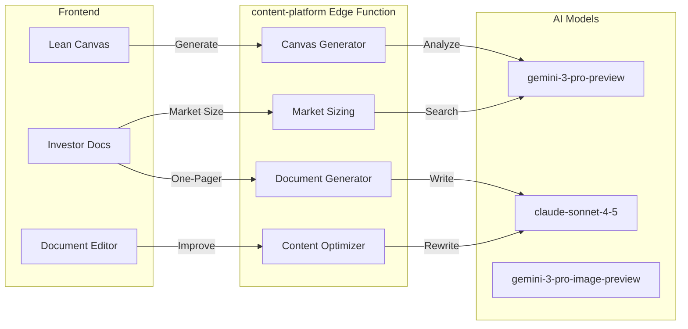

# Content Platform Module: Implementation Prompt

**Status:** 🔴 30% Complete | **Edge Function:** `content-platform` | **Screens:** 3

---

## Summary Table

| Screen | Route | Agents | Features | Models |
|--------|-------|--------|----------|--------|
| Lean Canvas | `/app/canvas` | Planner, Analyst | 9-section editor, AI suggestions, validation | gemini-3-pro-preview, claude-sonnet-4-5 |
| Investor Docs | `/app/investor-docs` | Content/Comms, Planner | One-pager, market sizing, GTM strategy, business plan | claude-sonnet-4-5, gemini-3-pro-preview |
| Documents | `/app/documents` | Content/Comms, Optimizer | Editor, AI rewrite, generation, templates | claude-sonnet-4-5, gemini-3-pro-preview |

---

## Purpose & Goals

**What It Does:** Create structured business documents (lean canvas, investor one-pagers, business plans) with AI assistance in minutes instead of hours.

**Real-World Impact:**
- **Before:** Founder spends hours creating lean canvas, writing one-pagers, calculating market sizing manually
- **After:** Complete documents in 10-15 minutes, AI generates content, suggests improvements, exports to PDF

**Outcomes:**
- Lean canvas created in 10 minutes instead of 2 hours
- Investor one-pager generated automatically from profile
- Market sizing calculated with real-time data
- GTM strategy structured with AI guidance

---

## Architecture Flow

---

## Real-World User Flows

### Flow 1: Lean Canvas Creation

**Founder:** David, "AI SaaS Platform"  
**Context:** Needs lean canvas for startup  
**Duration:** 15 minutes

1. Opens `/app/canvas` → Right panel: "Generate canvas from your profile? I can extract: Problem, Solution, Key Metrics..."
2. Clicks "Generate" → AI extracts data from profile → Fills 9 sections
3. Canvas displays: Problem, Solution, Key Metrics, Value Proposition, Unfair Advantage, Channels, Customer Segments, Cost Structure, Revenue Streams
4. Right panel: "Canvas Health: 75% complete. Missing: Unfair Advantage details, specific Customer Segments."
5. Fills "Unfair Advantage" section, defines Customer Segments
6. Right panel updates: "Canvas Health: 90% complete."
7. Completes remaining sections → Exports to PDF

**Result:** David creates complete lean canvas in 15 minutes instead of 2 hours.

---

### Flow 2: Investor One-Pager Generation

**Founder:** Sarah, "Fashion Tech Platform"  
**Context:** Needs one-pager for investor outreach  
**Duration:** 5 minutes

1. Opens `/app/investor-docs` → Clicks "Generate One-Pager"
2. AI extracts: Company name, problem, solution, traction, team, ask
3. AI creates sections: Header, Problem, Solution, Market, Traction, Team, Ask
4. Right panel shows formatted one-pager preview
5. Reviews → Edits problem statement, adds specific traction numbers
6. Right panel: "Suggestion: Add customer testimonial quote."
7. Applies suggestion → Exports to PDF
8. Downloads PDF → Sends to investors

**Result:** Sarah has professional investor one-pager in 5 minutes.

---

### Flow 3: Market Sizing Analysis

**Founder:** James, "SaaS Analytics Tool"  
**Context:** Needs TAM/SAM/SOM for pitch deck  
**Duration:** 2 minutes

1. Opens `/app/investor-docs` → Clicks "Generate Market Sizing"
2. AI uses Google Search Grounding: "Researching SaaS analytics market size..."
3. AI finds: "Global SaaS analytics market: $50B TAM, $5B SAM, $500M SOM"
4. Right panel shows breakdown with methodology
5. AI generates market size diagram showing TAM/SAM/SOM
6. Reviews → Verifies numbers, adjusts SOM based on specific focus
7. Exports market sizing to PDF → Includes in pitch deck

**Result:** James has accurate market sizing with real-time data in 2 minutes.

---

## User Stories & Acceptance Criteria

### US-1: Lean Canvas Creation

**As a founder**, I want to create lean canvas with AI assistance, so I can validate business model quickly.

**Acceptance:**
- [ ] Canvas displays 9 sections (Problem, Solution, Key Metrics, etc.)
- [ ] AI pre-fill extracts data from startup profile
- [ ] AI suggestions appear in right panel for each section
- [ ] User can accept/reject suggestions
- [ ] Canvas validation checks for completeness
- [ ] Export to PDF/image works
- [ ] Canvas saves automatically

**Agent:** Planner, Analyst (gemini-3-pro-preview, claude-sonnet-4-5)  
**API:** Messages API (< 30s)

---

### US-2: Investor One-Pager Generation

**As a founder**, I want to generate investor one-pager automatically, so I can create professional investor materials quickly.

**Acceptance:**
- [ ] One-pager generation completes < 2 minutes
- [ ] All standard sections: Problem, Solution, Market, Traction, Team, Ask
- [ ] Content matches startup profile data
- [ ] One-pager preview displays correctly
- [ ] User can edit all sections
- [ ] Export to PDF works
- [ ] One-pager saves to documents

**Agent:** Content/Comms, Planner (claude-sonnet-4-5, gemini-3-pro-preview)  
**API:** Messages API (< 2 minutes)

---

### US-3: Market Sizing Analysis

**As a founder**, I want AI to calculate TAM/SAM/SOM with real-time market data, so I have accurate market sizing.

**Acceptance:**
- [ ] Market sizing uses Google Search Grounding for real-time data
- [ ] TAM/SAM/SOM calculated correctly
- [ ] Analysis includes methodology and sources
- [ ] Visual diagram generated (TAM/SAM/SOM chart)
- [ ] User can adjust calculations
- [ ] Export to PDF/image works
- [ ] Analysis completes < 15s

**Agent:** Analyst, Retriever (gemini-3-pro-preview)  
**API:** Messages API (< 15s)  
**Gemini Feature:** Google Search Grounding

---

### US-4: GTM Strategy Document

**As a founder**, I want AI to generate go-to-market strategy document, so I can plan launch effectively.

**Acceptance:**
- [ ] GTM strategy includes: ICP, channels, timeline, budget
- [ ] AI suggests specific channel tactics
- [ ] Strategy links to startup profile data
- [ ] User can edit all sections
- [ ] Export to document format works
- [ ] Strategy saves to documents

**Agent:** Planner, Analyst (gemini-3-pro-preview, claude-sonnet-4-5)  
**API:** Messages API (< 2 minutes)

---

## Implementation Details

### Document Types

**Lean Canvas (9 Sections):**
1. Problem - Top 3 problems customers face
2. Solution - Top 3 features that solve problems
3. Key Metrics - How you measure success
4. Unique Value Proposition - Single compelling message
5. Unfair Advantage - Something competitors can't copy
6. Channels - How you reach customers
7. Customer Segments - Target customers
8. Cost Structure - Major costs
9. Revenue Streams - How you make money

**Investor One-Pager:**
- Header (Company name, tagline, logo)
- Problem (1-2 sentences)
- Solution (1-2 sentences)
- Market (TAM/SAM/SOM)
- Traction (Key metrics)
- Team (Founders, advisors)
- Ask (Funding amount, use of funds)

**Market Sizing (TAM/SAM/SOM):**
- TAM (Total Addressable Market)
- SAM (Serviceable Addressable Market)
- SOM (Serviceable Obtainable Market)

**GTM Strategy:**
- ICP (Ideal Customer Profile)
- Channels (How you reach customers)
- Timeline (Launch and scale phases)
- Budget (Marketing and sales allocation)
- Tactics (Specific channel tactics)

### Edge Function Actions (32)

**Document Generation:**
- `canvas_generate` - Generate lean canvas (gemini-3-pro-preview, < 30s)
- `one_pager_generate` - Generate one-pager (claude-sonnet-4-5, < 2 minutes)
- `market_sizing` - Calculate TAM/SAM/SOM (gemini-3-pro-preview, < 15s)
- `gtm_strategy` - Generate GTM strategy (claude-sonnet-4-5, < 2 minutes)
- `business_plan` - Generate business plan (claude-sonnet-4-5, < 5 minutes)

**Content Improvement:**
- `document_improve` - Improve content (claude-sonnet-4-5, < 10s)
- `document_analyze` - Analyze quality (gemini-3-pro-preview, < 5s)

### Database Tables

- `documents` - Document storage
- `lean_canvases` - Lean canvas data
- `startups` - Source data for generation

### Files Impacted

**Frontend:**
- `src/pages/LeanCanvas.tsx`
- `src/pages/Documents.tsx`
- `src/components/leancanvas/*.tsx`
- `src/components/documents/*.tsx`
- `src/hooks/useLeanCanvas.ts`
- `src/hooks/useDocuments.ts`

**Backend:**
- `supabase/functions/content-platform/index.ts` (to be created)

---

## Production Checklist

- [ ] Create `content-platform` edge function
- [ ] Implement all 32 actions
- [ ] Lean canvas generation works
- [ ] One-pager generation works
- [ ] Market sizing uses Google Search
- [ ] GTM strategy generation works
- [ ] PDF export works for all documents

---

**Next:** Expand beyond pitch decks, add lean canvas, investor docs, business plans (remaining 70%)
