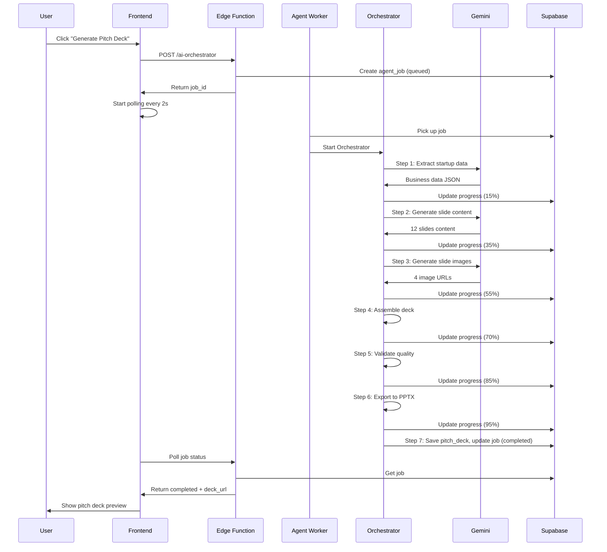

# Agent 01: Orchestrator

**Type:** Heavy Workflow Agent  
**API:** Claude Agent SDK  
**Model:** `claude-sonnet-4-5` (or `claude-opus-4-5` for complex reasoning)  
**Duration:** 30-120 seconds  
**Status:** ❌ Not Implemented

---

## Description

The Orchestrator is the "conductor" that coordinates complex multi-step workflows. It manages dependencies, handles errors, tracks progress, and coordinates multiple agents to complete large tasks like pitch deck generation or strategic planning.

## Purpose

Enable complex workflows that require:
- Multiple steps (> 3 tool calls)
- Error recovery and retries
- Progress tracking for user feedback
- File operations (PPTX assembly, PDF export)
- Coordination of multiple specialized agents

## User Story

**As a** founder preparing for investor meetings  
**I want to** generate a complete pitch deck with one click  
**So that** I can spend time on my pitch delivery instead of slide creation

## Real-World Scenario

Sarah, founder of "AI Fashion Events Platform", needs a pitch deck for her $500K seed round. She clicks "Generate Pitch Deck" and the Orchestrator coordinates 7 steps:

1. Extracts her startup data from profile
2. Generates 12 slide titles and content
3. Creates 4 slide images (title, problem, solution, team)
4. Assembles the deck structure
5. Validates quality (completeness, investor-readiness)
6. Exports to PPTX format
7. Returns the deck URL

Sarah reviews the complete deck in 90 seconds instead of spending hours creating it manually.

---

## User Journey



---

## Acceptance Criteria

- [ ] User can trigger pitch deck generation with one click
- [ ] Progress indicator shows real-time step updates (0-100%)
- [ ] Generated deck includes all 12 investor slides
- [ ] Images are generated for key slides (title, problem, solution, team)
- [ ] Deck is exported to PPTX format
- [ ] User can preview, edit, and re-export the deck
- [ ] Errors are handled gracefully with retry option
- [ ] Job history is stored in `agent_jobs` table

---

## Implementation

### Edge Function Router

```typescript
// supabase/functions/ai-orchestrator/index.ts
import { serve } from "https://deno.land/std@0.168.0/http/server.ts";
import { createClient } from "https://esm.sh/@supabase/supabase-js@2";

serve(async (req) => {
  const supabase = createClient(
    Deno.env.get("SUPABASE_URL")!,
    Deno.env.get("SUPABASE_SERVICE_ROLE_KEY")!
  );

  const { workflow_type, input } = await req.json();

  // Create job in database
  const { data: job } = await supabase
    .from("agent_jobs")
    .insert({
      workflow_type,
      input_json: input,
      status: "queued",
      progress: 0,
    })
    .select()
    .single();

  // Agent Worker will pick this up
  return new Response(JSON.stringify({ job_id: job.id }));
});
```

### Agent Worker

```typescript
// services/agent-worker/pitch-deck.ts
import { query } from "@anthropic-ai/claude-agent-sdk";

interface PitchDeckJob {
  id: string;
  input_json: { startup_id: string };
}

export async function generatePitchDeck(job: PitchDeckJob) {
  const updateProgress = async (progress: number, step: string) => {
    await supabase
      .from("agent_jobs")
      .update({ progress, current_step: step })
      .eq("id", job.id);
  };

  for await (const message of query({
    prompt: `Generate an investor-ready pitch deck for startup.
    
Workflow Steps:
1. Extract business data from startup profile
2. Generate content for 12 slides (Title, Problem, Solution, Market, Product, Traction, Business Model, Competition, Team, Financials, Ask, Contact)
3. Generate 4 key images using Gemini Image
4. Assemble deck structure in JSON format
5. Validate quality: completeness, investor-readiness, clarity
6. Export to PPTX format
7. Save to database and return URL

Context:
- Startup ID: ${job.input_json.startup_id}
- Target: Series Seed investors
- Style: Professional, data-driven`,

    options: {
      model: "claude-sonnet-4-5",
      allowedTools: ["Read", "Write", "Task"],
      tools: [
        geminiContentTool,
        geminiImageTool,
        supabaseTool,
        pptxAssemblyTool,
      ],
    },
  })) {
    if (message.type === "tool_use" && message.name === "update_progress") {
      await updateProgress(message.input.progress, message.input.step);
    }

    if ("result" in message) {
      await supabase
        .from("agent_jobs")
        .update({
          status: "completed",
          progress: 100,
          result: message.result,
        })
        .eq("id", job.id);

      return message.result;
    }
  }
}
```

### Custom Tools

```typescript
// Gemini Content Tool
const geminiContentTool = {
  name: "generate_slide_content",
  description: "Generate slide content using Gemini 3 Pro",
  input_schema: {
    type: "object",
    properties: {
      startup_data: { type: "object" },
      slide_type: {
        type: "string",
        enum: [
          "title",
          "problem",
          "solution",
          "market",
          "product",
          "traction",
          "business_model",
          "competition",
          "team",
          "financials",
          "ask",
          "contact",
        ],
      },
    },
    required: ["startup_data", "slide_type"],
  },
  execute: async (input: any) => {
    const model = genAI.getGenerativeModel({
      model: "gemini-3-pro-preview",
      generationConfig: {
        responseMimeType: "application/json",
        responseSchema: slideContentSchema,
      },
    });

    const result = await model.generateContent({
      contents: [
        {
          role: "user",
          parts: [
            {
              text: `Generate ${input.slide_type} slide content for:
${JSON.stringify(input.startup_data, null, 2)}

Requirements:
- Title: Concise, impactful (max 8 words)
- Bullets: 3-5 points, data-driven
- Notes: Speaker notes for presenter`,
            },
          ],
        },
      ],
    });

    return JSON.parse(result.response.text());
  },
};

// Gemini Image Tool
const geminiImageTool = {
  name: "generate_slide_image",
  description: "Generate slide image using Gemini 3 Image",
  input_schema: {
    type: "object",
    properties: {
      prompt: { type: "string" },
      style: { type: "string", default: "professional, minimalist, corporate" },
    },
    required: ["prompt"],
  },
  execute: async (input: any) => {
    const model = genAI.getGenerativeModel({
      model: "gemini-3-pro-image-preview",
    });

    const result = await model.generateContent({
      contents: [
        {
          role: "user",
          parts: [
            {
              text: `Create a ${input.style} image for a pitch deck slide:
${input.prompt}

Requirements:
- 16:9 aspect ratio
- Professional, clean design
- No text in the image
- Suitable for investor presentation`,
            },
          ],
        },
      ],
    });

    // Return image URL from Gemini response
    return result.response.candidates[0].content.parts[0].inlineData;
  },
};
```

---

## Database Schema

```sql
-- Required: agent_jobs table
CREATE TABLE IF NOT EXISTS public.agent_jobs (
  id UUID PRIMARY KEY DEFAULT gen_random_uuid(),
  workflow_type TEXT NOT NULL,
  input_json JSONB NOT NULL DEFAULT '{}',
  status TEXT NOT NULL DEFAULT 'queued',
  progress INTEGER DEFAULT 0,
  current_step TEXT,
  result JSONB,
  error_message TEXT,
  started_at TIMESTAMPTZ,
  completed_at TIMESTAMPTZ,
  created_at TIMESTAMPTZ DEFAULT now(),
  user_id UUID REFERENCES auth.users(id),
  startup_id UUID REFERENCES public.startups(id)
);

-- Enable RLS
ALTER TABLE public.agent_jobs ENABLE ROW LEVEL SECURITY;

-- Users can view their own jobs
CREATE POLICY "Users view own jobs"
  ON public.agent_jobs FOR SELECT
  USING (auth.uid() = user_id);
```

---

## Dependencies

- **Claude Agent SDK:** `@anthropic-ai/claude-agent-sdk`
- **Gemini API:** `@google/generative-ai`
- **PPTX Library:** `pptxgenjs` or similar
- **Supabase:** Database and storage

---

## Production Checklist

- [ ] Agent Worker service deployed
- [ ] `agent_jobs` table created with RLS
- [ ] Gemini Image API key configured
- [ ] PPTX assembly library integrated
- [ ] Progress polling endpoint created
- [ ] Error handling and retry logic
- [ ] Cost tracking per job
- [ ] Job timeout (5 minute limit)

---

## Files Impacted

| File | Change |
|------|--------|
| `supabase/functions/ai-orchestrator/index.ts` | Create new edge function |
| `services/agent-worker/index.ts` | Create worker service |
| `services/agent-worker/pitch-deck.ts` | Create workflow handler |
| `src/hooks/useAIOrchestrator.ts` | Create frontend hook |
| `src/components/documents/PitchDeckGenerator.tsx` | Create UI component |

---

## Success Criteria

1. **Functional:** User generates complete pitch deck in < 2 minutes
2. **Quality:** Deck includes all 12 slides with relevant content
3. **Visual:** 4 key slides have generated images
4. **UX:** Progress indicator shows real-time updates
5. **Reliability:** < 5% job failure rate
6. **Cost:** < $0.50 per deck generation
