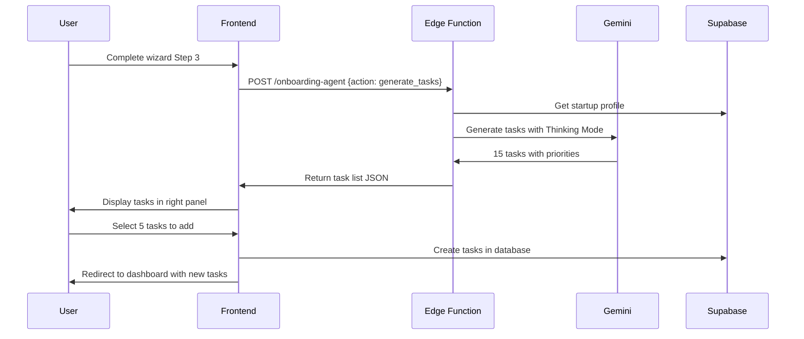

# Agent 02: Planner

**Type:** Fast Agent  
**API:** Gemini API (Edge Function)  
**Model:** `gemini-3-pro-preview`  
**Duration:** < 10 seconds  
**Status:** 🔶 Partial (onboarding-agent)

---

## Description

The Planner breaks high-level goals into actionable plans, tasks, and strategies. It analyzes context and generates prioritized, specific, measurable tasks that help founders move from planning to execution.

## Purpose

Transform abstract goals ("raise seed round") into concrete action items:
- "Create investor one-pager" (High priority)
- "Research 50 seed VCs" (High priority)
- "Prepare pitch deck" (High priority)

## User Story

**As a** first-time founder overwhelmed by options  
**I want to** receive a prioritized list of next steps  
**So that** I know exactly what to work on today

## Real-World Scenario

Marcus completes the onboarding wizard for his B2B SaaS startup. He's overwhelmed - doesn't know what to work on next. The Planner analyzes his profile:
- B2B SaaS, Pre-seed stage
- $5K MRR, 50 customers
- 2-person team

The Planner generates 15 prioritized tasks:
1. "Validate pricing model with 10 existing customers" (High)
2. "Create investor one-pager for seed round" (High)
3. "Set up customer success process" (Medium)

Marcus reviews the tasks, selects 5 to add to his task list, and now has a clear action plan.

---

## User Journey



---

## Acceptance Criteria

- [ ] Generate 5-15 actionable tasks based on startup profile
- [ ] Each task has: title, description, priority, category, estimated time
- [ ] Tasks are sorted by priority (high → medium → low)
- [ ] Tasks align with startup stage (idea, validation, traction, scaling)
- [ ] User can select which tasks to add to their list
- [ ] Selected tasks are saved to database with correct metadata

---

## Implementation

### System Prompt

```typescript
const PLANNER_SYSTEM_PROMPT = `You are TaskPlanner, an AI agent specialized in breaking down goals into actionable tasks for startup founders.

Your role:
1. Analyze the startup's current stage, industry, and challenges
2. Generate specific, measurable, actionable tasks
3. Prioritize tasks based on impact and urgency
4. Align tasks with the founder's immediate goals

Task Categories:
- discovery: Customer research, validation, interviews
- product: Building, shipping, iterating
- growth: Marketing, sales, distribution
- fundraising: Investor outreach, pitch prep, due diligence
- operations: Hiring, legal, finance, infrastructure

Priority Levels:
- high: Must do this week, blocks other work
- medium: Should do within 2 weeks
- low: Nice to have, do when time allows

Task Format:
- Title: Action verb + specific outcome (max 60 chars)
- Description: What, why, and expected result (max 200 chars)
- Priority: high | medium | low
- Category: discovery | product | growth | fundraising | operations
- Estimated Time: 1h | 2h | 4h | 1d | 2d | 1w

Rules:
- Generate 5-15 tasks (more for complex situations)
- First 3 tasks should be high priority
- Include at least one task per relevant category
- Tasks should be completable by a solo founder
- Avoid vague tasks like "think about strategy"`;
```

### Edge Function Handler

```typescript
// supabase/functions/onboarding-agent/index.ts
case "generate_tasks":
  const { startup_data, interview_responses } = data;
  
  const model = genAI.getGenerativeModel({
    model: "gemini-3-pro-preview",
    generationConfig: {
      responseMimeType: "application/json",
      responseSchema: {
        type: "object",
        properties: {
          tasks: {
            type: "array",
            items: {
              type: "object",
              properties: {
                title: { type: "string" },
                description: { type: "string" },
                priority: { type: "string", enum: ["high", "medium", "low"] },
                category: { 
                  type: "string", 
                  enum: ["discovery", "product", "growth", "fundraising", "operations"] 
                },
                estimated_time: { type: "string" },
                reasoning: { type: "string" },
              },
              required: ["title", "description", "priority", "category"],
            },
          },
          focus_recommendation: { type: "string" },
          quick_wins: {
            type: "array",
            items: { type: "string" },
          },
        },
        required: ["tasks", "focus_recommendation"],
      },
    },
    thinkingConfig: {
      thinkingLevel: "medium",
    },
  });

  const result = await model.generateContent({
    contents: [
      {
        role: "user",
        parts: [
          {
            text: `Generate prioritized tasks for this startup:

Profile:
${JSON.stringify(startup_data, null, 2)}

Interview Responses:
${JSON.stringify(interview_responses, null, 2)}

Generate 10-15 actionable tasks aligned with their stage and goals.`,
          },
        ],
      },
    ],
    systemInstruction: { parts: [{ text: PLANNER_SYSTEM_PROMPT }] },
  });

  return new Response(JSON.stringify(JSON.parse(result.response.text())));
```

### Frontend Hook

```typescript
// src/hooks/onboarding/useInterview.ts
export function useInterview() {
  const generateTasks = async (
    startupData: StartupData,
    responses: InterviewResponse[]
  ) => {
    const result = await invokeAgent<TaskGenerationResult>({
      action: "generate_tasks",
      data: {
        startup_data: startupData,
        interview_responses: responses,
      },
    });

    return result;
  };

  return { generateTasks };
}
```

---

## Output Schema

```typescript
interface TaskGenerationResult {
  tasks: Task[];
  focus_recommendation: string;
  quick_wins: string[];
}

interface Task {
  title: string;
  description: string;
  priority: "high" | "medium" | "low";
  category: "discovery" | "product" | "growth" | "fundraising" | "operations";
  estimated_time?: string;
  reasoning?: string;
}
```

---

## Example Output

```json
{
  "tasks": [
    {
      "title": "Interview 5 target customers this week",
      "description": "Schedule 30-min calls with ideal customers to validate problem and understand buying triggers",
      "priority": "high",
      "category": "discovery",
      "estimated_time": "4h",
      "reasoning": "Customer validation is critical at pre-seed stage"
    },
    {
      "title": "Create investor one-pager",
      "description": "One page summary: problem, solution, traction, ask. Use for warm intros",
      "priority": "high",
      "category": "fundraising",
      "estimated_time": "2h",
      "reasoning": "Enables faster fundraising outreach"
    },
    {
      "title": "Set up product analytics",
      "description": "Implement Mixpanel/Amplitude to track user engagement and retention",
      "priority": "medium",
      "category": "product",
      "estimated_time": "1d",
      "reasoning": "Data-driven decisions require tracking"
    }
  ],
  "focus_recommendation": "Focus on customer discovery this week. Your $5K MRR shows early traction, but understanding WHY customers buy will unlock faster growth.",
  "quick_wins": [
    "Send NPS survey to existing customers",
    "Update LinkedIn headline with clear value prop",
    "Export customer emails to CRM"
  ]
}
```

---

## Gemini Features Used

| Feature | Purpose | Configuration |
|---------|---------|---------------|
| Structured Output | Enforce task schema | `responseMimeType: 'application/json'` |
| Thinking Mode | Strategic task planning | `thinkingLevel: 'medium'` |
| Context Understanding | Analyze startup profile | System prompt |

---

## Production Checklist

- [x] Edge function handler created
- [x] Structured output schema defined
- [x] Thinking mode enabled
- [x] Frontend hook implemented
- [ ] Rate limiting per user
- [ ] Task caching (same profile = same tasks for 1 hour)
- [ ] A/B test task quality
- [ ] User feedback collection

---

## Files Impacted

| File | Status | Purpose |
|------|--------|---------|
| `supabase/functions/onboarding-agent/index.ts` | ✅ Exists | Handle generate_tasks action |
| `src/hooks/onboarding/useInterview.ts` | ✅ Exists | Frontend hook |
| `src/components/onboarding/step4/TaskList.tsx` | 🔶 Partial | Display generated tasks |

---

## Success Criteria

1. **Relevance:** 80% of generated tasks are actionable
2. **Priority Accuracy:** High priority tasks match founder's immediate needs
3. **Completion Rate:** Users complete 50% of generated tasks within 2 weeks
4. **User Satisfaction:** 4+ star rating on task quality
