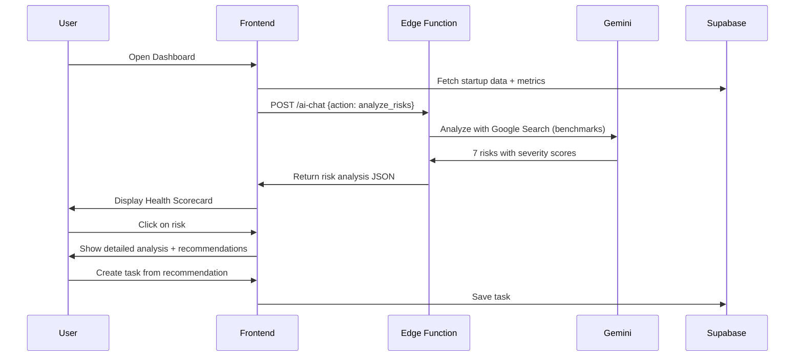

# Agent 03: Analyst

**Type:** Fast Agent  
**API:** Gemini API (Edge Function)  
**Model:** `gemini-3-pro-preview`  
**Duration:** < 10 seconds  
**Status:** 🔶 Partial (ai-chat)

---

## Description

The Analyst finds patterns, risks, and insights from data. It analyzes metrics, identifies anomalies, compares against industry benchmarks, and provides actionable recommendations for proactive risk identification.

## Purpose

Proactive risk identification before problems escalate:
- Spot high churn before losing customers
- Identify declining revenue trends early
- Flag runway concerns before crisis

## User Story

**As a** startup founder or accelerator admin  
**I want to** see risks identified automatically from my data  
**So that** I can address problems before they become critical

## Real-World Scenario

TechBoost accelerator reviews portfolio startup "CloudSync" dashboard. The Analyst receives startup data:
- $20K MRR (down from $25K last month)
- 15% churn (industry average: 5%)
- 3-person team with no sales hire
- $200K runway (6 months)

The Analyst identifies 7 risks:
- **Critical:** Churn rate 3x industry average
- **High:** Revenue declining 20% month-over-month
- **High:** Runway < 6 months without new funding
- **Medium:** No dedicated sales capacity

Admin clicks a risk to see detailed analysis with recommendations, then schedules intervention meeting with the founder.

---

## User Journey



---

## Acceptance Criteria

- [ ] Analyze startup metrics and identify 3-10 risks
- [ ] Each risk has: id, severity, title, description, factors, recommendations
- [ ] Severity levels: critical, high, medium, low
- [ ] Recommendations are actionable and specific
- [ ] Industry benchmarks sourced via Google Search
- [ ] User can create task from any recommendation

---

## Implementation

### System Prompt

```typescript
const ANALYST_SYSTEM_PROMPT = `You are RiskAnalyst, an AI agent specialized in identifying risks and insights from startup data.

Your role:
1. Analyze startup metrics against industry benchmarks
2. Identify patterns and anomalies in data
3. Assess risk severity based on impact and urgency
4. Provide actionable recommendations for each risk

Risk Categories:
- revenue: MRR, ARR, growth rate, churn
- runway: Burn rate, funding status, months remaining
- product: Engagement, retention, NPS
- team: Hiring, capacity, skill gaps
- market: Competition, timing, trends
- operations: Legal, compliance, infrastructure

Severity Levels:
- critical: Existential threat, needs immediate action (< 1 week)
- high: Significant risk, needs action soon (< 1 month)
- medium: Moderate concern, should address (< 3 months)
- low: Minor issue, good to fix (when time allows)

Analysis Approach:
1. Compare metrics against industry benchmarks
2. Look for trends (improving/declining)
3. Identify interdependencies (e.g., high churn + low runway = crisis)
4. Consider startup stage in assessment

Rules:
- Maximum 10 risks per analysis
- At least one recommendation per risk
- Cite industry benchmarks when available
- Be direct but constructive`;
```

### Edge Function Handler

```typescript
// supabase/functions/ai-chat/index.ts
case "analyze_risks":
  const { startup_data, metrics } = context.data;

  const model = genAI.getGenerativeModel({
    model: "gemini-3-pro-preview",
    generationConfig: {
      responseMimeType: "application/json",
      responseSchema: {
        type: "object",
        properties: {
          risks: {
            type: "array",
            items: {
              type: "object",
              properties: {
                id: { type: "string" },
                severity: { 
                  type: "string", 
                  enum: ["critical", "high", "medium", "low"] 
                },
                category: { type: "string" },
                title: { type: "string" },
                description: { type: "string" },
                factors: {
                  type: "array",
                  items: { type: "string" },
                },
                recommendations: {
                  type: "array",
                  items: {
                    type: "object",
                    properties: {
                      action: { type: "string" },
                      priority: { type: "string" },
                      expected_outcome: { type: "string" },
                    },
                  },
                },
                benchmark: { type: "string" },
              },
              required: ["id", "severity", "title", "description", "recommendations"],
            },
          },
          health_score: { type: "number" },
          summary: { type: "string" },
          positive_signals: {
            type: "array",
            items: { type: "string" },
          },
        },
        required: ["risks", "health_score", "summary"],
      },
    },
    tools: [{ googleSearch: {} }], // For industry benchmarks
    thinkingConfig: {
      thinkingLevel: "high",
    },
  });

  const result = await model.generateContent({
    contents: [
      {
        role: "user",
        parts: [
          {
            text: `Analyze this startup for risks and issues:

Startup Profile:
${JSON.stringify(startup_data, null, 2)}

Current Metrics:
${JSON.stringify(metrics, null, 2)}

Use Google Search to find current industry benchmarks for their sector.
Identify 3-10 risks with severity, factors, and recommendations.
Calculate overall health score (0-100).`,
          },
        ],
      },
    ],
    systemInstruction: { parts: [{ text: ANALYST_SYSTEM_PROMPT }] },
  });

  return new Response(JSON.stringify(JSON.parse(result.response.text())));
```

### Frontend Integration

```typescript
// src/hooks/useDashboardData.ts
export function useDashboardData() {
  const analyzeRisks = async (startupId: string) => {
    const { data: startup } = await supabase
      .from("startups")
      .select("*")
      .eq("id", startupId)
      .single();

    const response = await supabase.functions.invoke("ai-chat", {
      body: {
        action: "analyze_risks",
        context: {
          data: {
            startup_data: startup,
            metrics: {
              mrr: startup.mrr,
              churn_rate: startup.churn_rate,
              runway_months: startup.runway_months,
              team_size: startup.team_size,
              // ... other metrics
            },
          },
        },
      },
    });

    return response.data;
  };

  return { analyzeRisks };
}
```

---

## Output Schema

```typescript
interface RiskAnalysis {
  risks: Risk[];
  health_score: number;
  summary: string;
  positive_signals: string[];
}

interface Risk {
  id: string;
  severity: "critical" | "high" | "medium" | "low";
  category: string;
  title: string;
  description: string;
  factors: string[];
  recommendations: Recommendation[];
  benchmark?: string;
}

interface Recommendation {
  action: string;
  priority: string;
  expected_outcome: string;
}
```

---

## Example Output

```json
{
  "risks": [
    {
      "id": "churn_critical",
      "severity": "critical",
      "category": "revenue",
      "title": "Churn rate 3x industry average",
      "description": "15% monthly churn vs 5% SaaS benchmark. At this rate, you lose 80% of customers annually.",
      "factors": [
        "15% monthly churn rate",
        "Industry average: 5%",
        "Trend: increasing from 12% last month"
      ],
      "recommendations": [
        {
          "action": "Call 5 churned customers this week to understand why they left",
          "priority": "immediate",
          "expected_outcome": "Identify top 3 churn reasons"
        },
        {
          "action": "Implement customer health scoring",
          "priority": "this week",
          "expected_outcome": "Proactive intervention before churn"
        }
      ],
      "benchmark": "B2B SaaS average churn: 5% monthly (SaaS Metrics Report 2024)"
    },
    {
      "id": "runway_high",
      "severity": "high",
      "category": "runway",
      "title": "Runway < 6 months without action",
      "description": "$200K remaining at $35K/month burn. 5.7 months runway with no buffer.",
      "factors": [
        "Current runway: 5.7 months",
        "Monthly burn: $35K",
        "Revenue: $20K MRR (declining)"
      ],
      "recommendations": [
        {
          "action": "Start fundraising immediately (6 months = danger zone)",
          "priority": "immediate",
          "expected_outcome": "Extend runway before crisis"
        },
        {
          "action": "Identify $5-10K monthly cost cuts",
          "priority": "this week",
          "expected_outcome": "Extend runway to 8+ months"
        }
      ]
    }
  ],
  "health_score": 42,
  "summary": "CloudSync faces critical churn and runway risks. Immediate action needed on customer retention and fundraising.",
  "positive_signals": [
    "Team is small and agile (3 people)",
    "Product exists with paying customers",
    "$20K MRR shows product-market fit potential"
  ]
}
```

---

## Gemini Features Used

| Feature | Purpose | Configuration |
|---------|---------|---------------|
| Google Search | Industry benchmarks | `tools: [{ googleSearch: {} }]` |
| Structured Output | Enforce risk schema | `responseMimeType: 'application/json'` |
| Thinking Mode | Deep pattern analysis | `thinkingLevel: 'high'` |

---

## Production Checklist

- [x] Edge function handler exists (ai-chat)
- [ ] Google Search grounding enabled
- [ ] Structured output schema defined
- [ ] Health score algorithm validated
- [ ] Benchmark caching (reduce API calls)
- [ ] Risk severity UI components
- [ ] "Create task" action from recommendations

---

## Files Impacted

| File | Status | Purpose |
|------|--------|---------|
| `supabase/functions/ai-chat/index.ts` | 🔶 Partial | Add analyze_risks action |
| `src/hooks/useDashboardData.ts` | 🔶 Partial | Add risk analysis hook |
| `src/components/dashboard/StartupHealth.tsx` | ✅ Exists | Display health score |
| `src/components/dashboard/RiskRadar.tsx` | ❌ Create | Display risk list |

---

## Success Criteria

1. **Accuracy:** 90% of identified risks are valid concerns
2. **Benchmarks:** Industry data is current (< 1 year old)
3. **Actionability:** Recommendations lead to measurable actions
4. **Timeliness:** Analysis completes in < 10 seconds
5. **User Value:** Founders report catching issues earlier
