# Agent 04: Ops Automation

**Type:** Fast Agent (Trigger-based)  
**API:** Claude Messages API (Edge Function)  
**Model:** `claude-haiku-4-5`  
**Duration:** < 5 seconds  
**Status:** ❌ Not Implemented

---

## Description

Ops Automation watches database triggers and events, generates concise notifications, and sends alerts via email/SMS/in-app. It automates routine communication without human intervention.

## Purpose

Ensure founders never miss important events:
- Deal updates (stage changes, meeting scheduled)
- Task deadlines (due today, overdue)
- Milestones (revenue goals, user targets)
- System alerts (integration failures, low runway)

## User Story

**As a** founder managing multiple deals and tasks  
**I want to** receive automatic notifications for important events  
**So that** I never miss a critical update

## Real-World Scenario

Founder updates deal "Sequoia Capital" from "Initial Contact" to "Meeting Scheduled" in CRM. Supabase trigger fires automatically. Ops Automation generates notification:

> 🎯 Sequoia Capital moved to Meeting Scheduled (Feb 15). Prepare pitch deck and Q&A.

Notification sends via email and in-app alert. Founder receives alert immediately, clicks to open deal detail page, and prepares for meeting using AI meeting prep tools. No manual reminder needed.

---

## User Journey

```mermaid
sequenceDiagram
    participant U as User
    participant CRM as CRM Interface
    participant DB as Supabase
    participant T as Database Trigger
    participant E as Edge Function
    participant C as Claude Haiku
    participant N as Notification Service
    participant M as Email/Push

    U->>CRM: Update deal stage
    CRM->>DB: UPDATE deals SET stage = 'meeting'
    DB->>T: Trigger fires
    T->>E: POST /ai-platform {action: send_notification}
    E->>C: Generate notification
    C->>E: "🎯 Sequoia Capital moved to..."
    E->>N: Create notification record
    E->>M: Send email + push
    M->>U: Receive notification
    U->>CRM: Click notification → Open deal
```



---

## Acceptance Criteria

- [ ] Trigger on deal stage changes
- [ ] Trigger on task due dates (due today, overdue)
- [ ] Trigger on milestone achievements
- [ ] Notifications are concise (< 200 characters)
- [ ] Include actionable next step hint
- [ ] Send via email and in-app
- [ ] User can configure notification preferences
- [ ] Notification history stored in database

---

## Implementation

### Database Trigger

```sql
-- Create trigger for deal stage changes
CREATE OR REPLACE FUNCTION notify_deal_change()
RETURNS TRIGGER AS $$
DECLARE
  notification_payload JSONB;
BEGIN
  -- Only trigger on stage change
  IF OLD.stage IS DISTINCT FROM NEW.stage THEN
    notification_payload := jsonb_build_object(
      'event_type', 'deal_stage_change',
      'deal_id', NEW.id,
      'deal_name', NEW.name,
      'old_stage', OLD.stage,
      'new_stage', NEW.stage,
      'meeting_date', NEW.expected_close,
      'user_id', NEW.startup_id
    );
    
    -- Call edge function via pg_net
    PERFORM net.http_post(
      url := 'https://your-project.supabase.co/functions/v1/ai-platform',
      body := jsonb_build_object(
        'action', 'send_notification',
        'context', notification_payload
      )::text,
      headers := jsonb_build_object(
        'Content-Type', 'application/json',
        'Authorization', 'Bearer ' || current_setting('app.service_role_key')
      )::jsonb
    );
  END IF;
  
  RETURN NEW;
END;
$$ LANGUAGE plpgsql;

CREATE TRIGGER deal_stage_change_trigger
  AFTER UPDATE ON deals
  FOR EACH ROW
  EXECUTE FUNCTION notify_deal_change();
```

### System Prompt

```typescript
const OPS_AUTOMATION_PROMPT = `You are NotificationBot, an AI that generates concise, actionable notifications for startup founders.

Rules:
1. Keep notifications under 200 characters
2. Start with relevant emoji
3. Include key context (name, date, amount)
4. End with actionable hint
5. Be professional but friendly

Emoji Guide:
- 🎯 Deal updates
- ✅ Task completed
- ⚠️ Deadline warning
- 🚀 Milestone achieved
- 💰 Revenue update
- 📅 Meeting scheduled
- ❌ Task overdue

Examples:
- Deal: "🎯 Sequoia Capital moved to Meeting Scheduled (Feb 15). Prepare pitch deck and Q&A."
- Task: "⚠️ 'Prepare investor deck' due today. 2 hours estimated remaining."
- Milestone: "🚀 Hit $10K MRR milestone! Time to update your investor deck."`;
```

### Edge Function Handler

```typescript
// supabase/functions/ai-platform/index.ts
import { serve } from "https://deno.land/std@0.168.0/http/server.ts";

const ANTHROPIC_API_KEY = Deno.env.get("ANTHROPIC_API_KEY");

async function sendNotification(context: NotificationContext): Promise<void> {
  // Generate notification text
  const response = await fetch("https://api.anthropic.com/v1/messages", {
    method: "POST",
    headers: {
      "Content-Type": "application/json",
      "x-api-key": ANTHROPIC_API_KEY!,
      "anthropic-version": "2023-06-01",
    },
    body: JSON.stringify({
      model: "claude-haiku-4-5",
      max_tokens: 200,
      system: OPS_AUTOMATION_PROMPT,
      messages: [
        {
          role: "user",
          content: `Generate notification for this event:
Event Type: ${context.event_type}
Details: ${JSON.stringify(context, null, 2)}`,
        },
      ],
    }),
  });

  const data = await response.json();
  const notificationText = data.content?.[0]?.text || "";

  // Get user email from startup
  const { data: startup } = await supabase
    .from("startups")
    .select("profiles(email)")
    .eq("id", context.startup_id)
    .single();

  // Create notification record
  await supabase.from("notifications").insert({
    user_id: context.user_id,
    type: context.event_type,
    title: notificationText,
    entity_type: "deal",
    entity_id: context.deal_id,
    read: false,
  });

  // Send email (using your email provider)
  await sendEmail({
    to: startup?.profiles?.email,
    subject: `StartupAI: ${context.deal_name} Update`,
    body: notificationText,
  });

  // Log AI run
  await supabase.from("ai_runs").insert({
    agent_name: "OpsAutomation",
    action: "send_notification",
    model: "claude-haiku-4-5",
    provider: "anthropic",
    status: "completed",
    // ...
  });
}

serve(async (req) => {
  const { action, context } = await req.json();

  switch (action) {
    case "send_notification":
      await sendNotification(context);
      return new Response(JSON.stringify({ success: true }));
    // ... other actions
  }
});
```

---

## Notification Types

| Event Type | Trigger | Template |
|------------|---------|----------|
| `deal_stage_change` | Deal stage updated | "🎯 {deal} moved to {stage}. {hint}" |
| `task_due_today` | Task due date = today | "⚠️ '{task}' due today. {estimated_time}" |
| `task_overdue` | Task due date < today | "❌ '{task}' is {days} days overdue." |
| `milestone_achieved` | Metric crosses threshold | "🚀 Hit {milestone}! {suggestion}" |
| `meeting_scheduled` | Calendar event created | "📅 Meeting with {contact} on {date}." |
| `runway_warning` | Runway < 6 months | "⚠️ Runway at {months} months. Consider fundraising." |

---

## Output Schema

```typescript
interface NotificationContext {
  event_type: string;
  user_id: string;
  startup_id: string;
  entity_type: string;
  entity_id: string;
  // Event-specific fields
  deal_name?: string;
  old_stage?: string;
  new_stage?: string;
  meeting_date?: string;
  task_title?: string;
  milestone_name?: string;
  milestone_value?: number;
}

interface Notification {
  id: string;
  user_id: string;
  type: string;
  title: string;
  entity_type: string;
  entity_id: string;
  read: boolean;
  created_at: string;
}
```

---

## Database Schema

```sql
-- Notifications table
CREATE TABLE IF NOT EXISTS public.notifications (
  id UUID PRIMARY KEY DEFAULT gen_random_uuid(),
  user_id UUID REFERENCES auth.users(id) NOT NULL,
  type TEXT NOT NULL,
  title TEXT NOT NULL,
  entity_type TEXT,
  entity_id UUID,
  read BOOLEAN DEFAULT false,
  created_at TIMESTAMPTZ DEFAULT now()
);

-- Enable RLS
ALTER TABLE public.notifications ENABLE ROW LEVEL SECURITY;

CREATE POLICY "Users view own notifications"
  ON public.notifications FOR SELECT
  USING (auth.uid() = user_id);

CREATE POLICY "System can insert notifications"
  ON public.notifications FOR INSERT
  WITH CHECK (true);
```

---

## Production Checklist

- [ ] Create `ai-platform` edge function
- [ ] Create database triggers for deal/task changes
- [ ] Create `notifications` table with RLS
- [ ] Integrate email provider (Resend, SendGrid)
- [ ] Add in-app notification UI component
- [ ] User notification preferences
- [ ] Notification history view
- [ ] Rate limiting (max 10 notifications/hour)

---

## Files Impacted

| File | Status | Purpose |
|------|--------|---------|
| `supabase/functions/ai-platform/index.ts` | ❌ Create | Edge function handler |
| `supabase/migrations/xxx_notifications.sql` | ❌ Create | Notifications table + triggers |
| `src/components/layout/NotificationBell.tsx` | ❌ Create | In-app notification UI |
| `src/hooks/useNotifications.ts` | ❌ Create | Notification hook |

---

## Success Criteria

1. **Timeliness:** Notifications sent within 5 seconds of trigger
2. **Relevance:** < 5% notification dismissal rate
3. **Actionability:** 30% of notifications lead to action
4. **Delivery:** 99% email delivery rate
5. **Cost:** < $0.01 per notification (Haiku is cheap)
