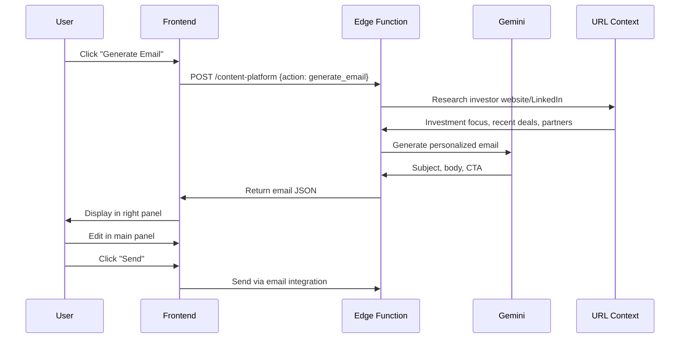

# Agent 05: Content/Comms

**Type:** Fast Agent  
**API:** Gemini API (Edge Function)  
**Model:** `gemini-3-pro-preview` (text) / `gemini-3-pro-image-preview` (images)  
**Duration:** < 10 seconds  
**Status:** ❌ Not Implemented

---

## Description

Content/Comms generates emails, documents, and content with research and personalization. It creates professional, context-aware communications that save founders hours of writing time.

## Purpose

Enable founders to send personalized, professional communications quickly:
- Research investor backgrounds before emailing
- Generate tailored emails with proper context
- Create documents with AI assistance
- Generate marketing content for events

## User Story

**As a** founder reaching out to investors  
**I want to** generate personalized emails based on investor research  
**So that** I can send professional outreach in minutes instead of hours

## Real-World Scenario

Founder needs to send follow-up email to investor "Andreessen Horowitz" after initial pitch. Instead of spending 30 minutes researching and writing, founder clicks "Generate Email".

Content/Comms uses URL Context to research Andreessen Horowitz website:
- Investment focus: B2B SaaS, marketplaces
- Recent investments: similar fashion tech companies
- Partner: Chris Dixon interested in marketplaces

Generates personalized email with subject, body, and CTA. Email appears in right panel for review. Founder edits in main panel, adds personal touches, clicks "Send". Professional email ready in 2 minutes instead of 30.

---

## User Journey



---

## Acceptance Criteria

- [ ] Research investor using URL Context (website, LinkedIn)
- [ ] Generate personalized email with subject, body, CTA
- [ ] Include relevant context from investor research
- [ ] User can edit email before sending
- [ ] Email history saved to database
- [ ] Support multiple email templates (intro, follow-up, update)

---

## Implementation

### System Prompt

```typescript
const CONTENT_COMMS_PROMPT = `You are EmailWriter, an AI that generates personalized, professional emails for startup founders.

Your role:
1. Research the recipient using provided context
2. Personalize the email based on their interests and background
3. Write clear, concise, action-oriented emails
4. Match the appropriate tone for the relationship stage

Email Types:
- intro: First contact, cold outreach
- follow_up: After meeting or call
- update: Monthly investor update
- thank_you: After meeting or intro

Email Structure:
- Subject: Clear, specific, under 60 characters
- Opening: Personal hook based on research
- Body: Value proposition + context
- CTA: Clear, single ask
- Signature: Professional but warm

Rules:
- Keep emails under 200 words
- One clear CTA per email
- Use recipient's name naturally
- Reference specific, relevant details
- Avoid generic phrases like "I hope this finds you well"
- Be direct but respectful`;
```

### Edge Function Handler

```typescript
// supabase/functions/content-platform/index.ts
case "generate_email":
  const { investor, startup, email_type, previous_context } = data;

  const model = genAI.getGenerativeModel({
    model: "gemini-3-pro-preview",
    generationConfig: {
      responseMimeType: "application/json",
      responseSchema: {
        type: "object",
        properties: {
          subject: { type: "string" },
          body: { type: "string" },
          cta: { type: "string" },
          research_notes: {
            type: "array",
            items: { type: "string" },
          },
          personalization_used: {
            type: "array",
            items: { type: "string" },
          },
        },
        required: ["subject", "body", "cta"],
      },
    },
    tools: [{ urlContext: {} }], // Research investor
  });

  const result = await model.generateContent({
    contents: [
      {
        role: "user",
        parts: [
          {
            text: `Generate a ${email_type} email to this investor:

Investor:
- Name: ${investor.name}
- Company: ${investor.company}
- Website: ${investor.website}
- LinkedIn: ${investor.linkedin_url}

Startup Context:
${JSON.stringify(startup, null, 2)}

Previous Context:
${previous_context || "First contact"}

Research the investor's website and LinkedIn to personalize the email.
Include relevant investment focus, recent deals, or mutual connections.`,
          },
        ],
      },
    ],
    systemInstruction: { parts: [{ text: CONTENT_COMMS_PROMPT }] },
  });

  return new Response(JSON.stringify(JSON.parse(result.response.text())));
```

### Image Generation for Slides

```typescript
case "generate_slide_image":
  const { prompt, style, dimensions } = data;

  const model = genAI.getGenerativeModel({
    model: "gemini-3-pro-image-preview",
  });

  const result = await model.generateContent({
    contents: [
      {
        role: "user",
        parts: [
          {
            text: `Create a professional pitch deck slide image:

Prompt: ${prompt}
Style: ${style || "professional, minimalist, corporate"}
Dimensions: ${dimensions || "16:9 aspect ratio"}

Requirements:
- Clean, professional design
- No text in the image (text will be overlaid)
- Suitable for investor presentation
- Modern, tech-forward aesthetic`,
          },
        ],
      },
    ],
  });

  // Return image data
  const imageData = result.response.candidates[0].content.parts[0].inlineData;
  return new Response(JSON.stringify({ image: imageData }));
```

---

## Output Schema

```typescript
interface EmailGeneration {
  subject: string;
  body: string;
  cta: string;
  research_notes: string[];
  personalization_used: string[];
}

interface SlideImage {
  image: {
    mimeType: string;
    data: string; // base64
  };
}

interface DocumentContent {
  title: string;
  sections: Section[];
  metadata: {
    word_count: number;
    reading_time: string;
  };
}
```

---

## Example Output (Email)

```json
{
  "subject": "AI for Fashion Events - Quick Follow-up from TechCrunch",
  "body": "Hi Sarah,\n\nI noticed a]6's recent investment in StyleSnap - seems like you're actively looking at fashion-tech intersections.\n\nWe just hit $50K MRR helping brands like Nordstrom and Saks run AI-powered events. Our NPS is 85+ and we're growing 25% monthly.\n\nWould love to share a quick 3-minute Loom showing how we're different from traditional event platforms.\n\nWorth a look?",
  "cta": "Reply 'yes' and I'll send the Loom",
  "research_notes": [
    "a]6 invested in StyleSnap (fashion-tech)",
    "Sarah is partner focused on consumer/retail",
    "Recent blog post about retail innovation"
  ],
  "personalization_used": [
    "Referenced StyleSnap investment",
    "Mentioned fashion-tech focus",
    "Used 'quick' framing (busy VCs)"
  ]
}
```

---

## Gemini Features Used

| Feature | Purpose | Configuration |
|---------|---------|---------------|
| URL Context | Research investor | `tools: [{ urlContext: {} }]` |
| Structured Output | Enforce email schema | `responseMimeType: 'application/json'` |
| Image Generation | Create slide images | `model: 'gemini-3-pro-image-preview'` |

---

## Production Checklist

- [ ] Create `content-platform` edge function
- [ ] URL Context for investor research
- [ ] Image generation for slides
- [ ] Email template library
- [ ] Send email integration (Resend/SendGrid)
- [ ] Email history tracking
- [ ] A/B testing for email effectiveness

---

## Files Impacted

| File | Status | Purpose |
|------|--------|---------|
| `supabase/functions/content-platform/index.ts` | ❌ Create | Edge function handler |
| `src/hooks/useEmailGeneration.ts` | ❌ Create | Frontend hook |
| `src/components/crm/EmailComposer.tsx` | ❌ Create | Email editor UI |
| `src/components/documents/SlideGenerator.tsx` | ❌ Create | Image generation UI |

---

## Success Criteria

1. **Personalization:** 80% of emails include investor-specific details
2. **Quality:** Emails pass spam filters and get opened (30%+ open rate)
3. **Speed:** Email generation < 10 seconds
4. **User Satisfaction:** 4+ star rating on generated content
5. **Conversion:** 5%+ reply rate on AI-generated emails
