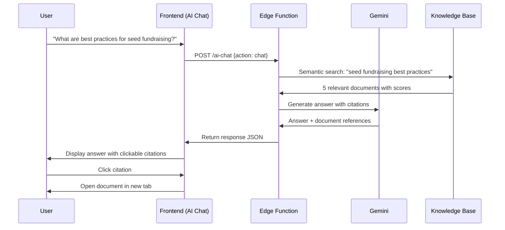

# Agent 06: Retriever (RAG)

**Type:** Fast Agent  
**API:** Gemini API (Edge Function)  
**Model:** `gemini-3-flash-preview`  
**Duration:** < 5 seconds  
**Status:** 🔶 Partial (ai-chat)

---

## Description

The Retriever searches knowledge bases and documents using semantic search. It retrieves relevant information from industry packs, documentation, and knowledge bases with citations.

## Purpose

Provide founders with actionable, sourced advice:
- Industry-specific guidance from curated knowledge bases
- Answers with citations to source documents
- Context-aware responses based on startup profile

## User Story

**As a** first-time founder  
**I want to** ask questions and get answers from trusted sources  
**So that** I can learn best practices without searching the internet

## Real-World Scenario

First-time founder asks chatbot: "What are best practices for seed fundraising?"

Instead of generic advice, Retriever searches industry packs knowledge base and finds:
- "Seed Fundraising Playbook" (Fashion Tech pack)
- "Investor Meeting Best Practices" (SaaS pack)
- "Pitch Deck Structure Guide" (General pack)

Synthesizes answer with citations:
> "1. Prepare 10-slide pitch deck (see: Pitch Deck Structure Guide)
> 2. Target 50-100 investors (see: Seed Fundraising Playbook)
> 3. Follow up within 48 hours (see: Investor Meeting Best Practices)"

Founder clicks citation → Opens full document.

---

## User Journey



---

## Acceptance Criteria

- [ ] Search knowledge base using semantic search
- [ ] Return top 5 most relevant documents
- [ ] Synthesize answer from documents
- [ ] Include citations with document links
- [ ] Filter by industry pack (if user has one)
- [ ] Track search queries for analytics
- [ ] < 5 second response time

---

## Implementation

### System Prompt

```typescript
const RETRIEVER_PROMPT = `You are KnowledgeBot, an AI that answers questions using a curated startup knowledge base.

Your role:
1. Search the knowledge base for relevant documents
2. Synthesize information from multiple sources
3. Provide actionable, specific answers
4. Always cite your sources

Citation Format:
- Use [Source Name] format inline
- List sources at the end
- Include document links when available

Answer Structure:
1. Direct answer to the question
2. 3-5 key points with citations
3. Practical next step

Rules:
- Only use information from the knowledge base
- If no relevant documents found, say so
- Prioritize actionable advice over theory
- Match answer depth to question complexity
- Keep answers under 300 words`;
```

### Edge Function Handler

```typescript
// supabase/functions/ai-chat/index.ts
case "chat":
  const { message, context } = body;
  
  // Step 1: Semantic search in knowledge base
  const searchResults = await searchKnowledgeBase(message, {
    industry: context.startup?.industry,
    stage: context.startup?.stage,
    limit: 5,
  });

  // Step 2: Generate answer with citations
  const model = genAI.getGenerativeModel({
    model: "gemini-3-flash-preview", // Fast for chat
    generationConfig: {
      responseMimeType: "application/json",
      responseSchema: {
        type: "object",
        properties: {
          answer: { type: "string" },
          citations: {
            type: "array",
            items: {
              type: "object",
              properties: {
                document_id: { type: "string" },
                document_name: { type: "string" },
                excerpt: { type: "string" },
                relevance_score: { type: "number" },
              },
            },
          },
          follow_up_questions: {
            type: "array",
            items: { type: "string" },
          },
        },
        required: ["answer"],
      },
    },
  });

  const result = await model.generateContent({
    contents: [
      {
        role: "user",
        parts: [
          {
            text: `Answer this question using the knowledge base:

Question: ${message}

Startup Context:
- Industry: ${context.startup?.industry || "Unknown"}
- Stage: ${context.startup?.stage || "Unknown"}

Relevant Documents:
${searchResults.map((doc, i) => `
[${i + 1}] ${doc.title}
Relevance: ${doc.score}
Content: ${doc.content.slice(0, 500)}...
`).join("\n")}

Synthesize an answer using these documents. Include citations.`,
          },
        ],
      },
    ],
    systemInstruction: { parts: [{ text: RETRIEVER_PROMPT }] },
  });

  return new Response(JSON.stringify(JSON.parse(result.response.text())));

// Knowledge base search function
async function searchKnowledgeBase(
  query: string,
  options: { industry?: string; stage?: string; limit: number }
) {
  // Use Supabase full-text search or vector search
  const { data } = await supabase
    .from("industry_packs")
    .select("id, title, content")
    .textSearch("content", query)
    .limit(options.limit);

  return data || [];
}
```

### Future: Vector Search with Embeddings

```typescript
// Vector search with embeddings (Phase 2)
async function vectorSearchKnowledgeBase(query: string, options: any) {
  // Generate query embedding
  const embedding = await generateEmbedding(query);
  
  // Search with pgvector
  const { data } = await supabase.rpc("match_documents", {
    query_embedding: embedding,
    match_threshold: 0.7,
    match_count: options.limit,
    filter_industry: options.industry,
  });
  
  return data;
}
```

---

## Output Schema

```typescript
interface ChatResponse {
  answer: string;
  citations: Citation[];
  follow_up_questions: string[];
}

interface Citation {
  document_id: string;
  document_name: string;
  excerpt: string;
  relevance_score: number;
}

interface SearchResult {
  id: string;
  title: string;
  content: string;
  score: number;
  industry_pack?: string;
}
```

---

## Example Output

```json
{
  "answer": "For seed fundraising, focus on three key areas:\n\n1. **Prepare a 10-slide pitch deck** [Pitch Deck Structure Guide] covering problem, solution, market, traction, team, and ask. Keep each slide to one key message.\n\n2. **Target 50-100 investors** [Seed Fundraising Playbook] who have invested in your space. Create a tiered list: Tier 1 (dream investors), Tier 2 (good fit), Tier 3 (backup).\n\n3. **Follow up within 48 hours** [Investor Meeting Best Practices] of every meeting with a thank you note and any promised materials.\n\n**Next step:** Create your investor target list this week.",
  "citations": [
    {
      "document_id": "doc_pitch_deck_guide",
      "document_name": "Pitch Deck Structure Guide",
      "excerpt": "A seed pitch deck should have 10-12 slides covering: Title, Problem, Solution, Market Size...",
      "relevance_score": 0.92
    },
    {
      "document_id": "doc_seed_playbook",
      "document_name": "Seed Fundraising Playbook",
      "excerpt": "Target 50-100 investors for a seed round. Create a tiered list based on fit...",
      "relevance_score": 0.88
    },
    {
      "document_id": "doc_meeting_practices",
      "document_name": "Investor Meeting Best Practices",
      "excerpt": "Follow up within 48 hours of every investor meeting with a brief thank you...",
      "relevance_score": 0.85
    }
  ],
  "follow_up_questions": [
    "How do I find investors who invest in my industry?",
    "What should I include in my follow-up email?",
    "How long does a typical seed round take?"
  ]
}
```

---

## Gemini Features Used

| Feature | Purpose | Configuration |
|---------|---------|---------------|
| Flash Model | Fast chat responses | `model: 'gemini-3-flash-preview'` |
| Structured Output | Enforce citation schema | `responseMimeType: 'application/json'` |
| File Search (Future) | Native RAG support | `tools: [{ fileSearch: {...} }]` |

---

## Knowledge Base Sources

| Source | Type | Content |
|--------|------|---------|
| Industry Packs | Curated | Stage-specific playbooks |
| Best Practices | Curated | General startup advice |
| Templates | Curated | Email, deck, document templates |
| FAQs | Generated | Common founder questions |

---

## Production Checklist

- [x] Basic chat functionality (ai-chat)
- [ ] Semantic search integration
- [ ] Citation extraction and linking
- [ ] Industry pack filtering
- [ ] Vector search with embeddings
- [ ] Search analytics tracking
- [ ] Document click tracking

---

## Files Impacted

| File | Status | Purpose |
|------|--------|---------|
| `supabase/functions/ai-chat/index.ts` | ✅ Exists | Add RAG search |
| `src/hooks/useAIChat.ts` | ✅ Exists | Display citations |
| `src/components/dashboard/AIPanel.tsx` | ✅ Exists | Citation UI |

---

## Success Criteria

1. **Relevance:** 80% of citations are relevant to the question
2. **Speed:** < 5 second response time
3. **Engagement:** 20% of users click on citations
4. **Satisfaction:** 4+ star rating on answers
5. **Coverage:** 90% of questions can be answered from knowledge base
