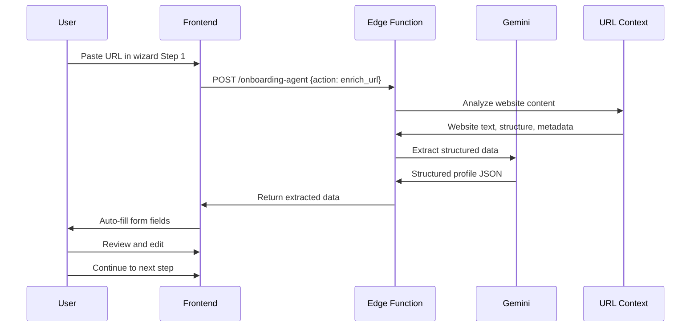

# Agent 07: Extractor

**Type:** Fast Agent  
**API:** Gemini API (Edge Function)  
**Model:** `gemini-3-pro-preview`  
**Duration:** < 10 seconds  
**Status:** ✅ Implemented (onboarding-agent)

---

## Description

The Extractor extracts structured data from URLs, text, or documents. It uses URL Context to analyze websites and returns structured JSON matching predefined schemas.

## Purpose

Eliminate manual data entry by automatically extracting:
- Startup information from websites
- Contact details from LinkedIn profiles
- Investor information from firm websites
- Event details from URLs

## User Story

**As a** founder filling out my profile  
**I want to** paste my website URL and have fields auto-filled  
**So that** I save 10 minutes of manual typing

## Real-World Scenario

Founder pastes startup website URL "https://fashionevents.ai" in wizard Step 1. Instead of manually typing:
- Company name
- Tagline
- Features
- Pricing
- Team size

Extractor uses URL Context to analyze website and extracts:
- "FashionEvents AI"
- "AI-powered event platform for fashion brands"
- Industry: "Fashion Tech / B2B SaaS"
- Stage: "Seed"
- Pricing: "$5,000/event"
- Team size: "5-10"

Data auto-fills form fields. Founder reviews, edits company name, adds missing info, clicks "Continue". Form completed in 30 seconds instead of 10 minutes.

---

## User Journey



---

## Acceptance Criteria

- [x] Extract data from website URLs using URL Context
- [x] Return structured JSON matching profile schema
- [x] Include confidence scores for each field
- [x] Handle various website formats (landing pages, docs, LinkedIn)
- [x] Graceful fallback when extraction fails
- [x] < 10 second response time

---

## Implementation

### System Prompt

```typescript
const EXTRACTOR_PROMPT = `You are ProfileExtractor, an AI that extracts structured startup information from websites.

Your role:
1. Analyze website content thoroughly
2. Extract relevant business information
3. Infer missing data when possible (with lower confidence)
4. Return structured JSON matching the schema

Extraction Fields:
- company_name: Official company/product name
- tagline: Main value proposition (1 sentence)
- description: What the company does (2-3 sentences)
- industry: Primary industry classification
- stage: Startup stage (idea, validation, traction, scaling)
- business_model: How they make money (B2B, B2C, Marketplace, etc.)
- target_market: Who they sell to
- key_features: List of main product features
- pricing: Pricing model if visible
- team_size: Estimated team size
- location: Company headquarters
- social_links: LinkedIn, Twitter, etc.

Confidence Scoring:
- 0.9-1.0: Directly stated on website
- 0.7-0.8: Strongly implied
- 0.5-0.6: Inferred from context
- < 0.5: Best guess

Rules:
- Extract only what you can verify from the website
- Use null for fields with no information
- Provide confidence scores for all extracted fields
- Don't hallucinate data`;
```

### Edge Function Handler (Current Implementation)

```typescript
// supabase/functions/onboarding-agent/index.ts
case "enrich_url":
  const { url } = data;

  const model = genAI.getGenerativeModel({
    model: "gemini-3-pro-preview",
    generationConfig: {
      responseMimeType: "application/json",
      responseSchema: {
        type: "object",
        properties: {
          company_name: { type: "string" },
          tagline: { type: "string" },
          description: { type: "string" },
          industry: { type: "string" },
          stage: {
            type: "string",
            enum: ["idea", "validation", "traction", "scaling"],
          },
          business_model: { type: "string" },
          target_market: { type: "string" },
          key_features: {
            type: "array",
            items: { type: "string" },
          },
          pricing: { type: "string" },
          team_size: { type: "string" },
          location: { type: "string" },
          social_links: {
            type: "object",
            properties: {
              linkedin: { type: "string" },
              twitter: { type: "string" },
              github: { type: "string" },
            },
          },
          confidence_scores: {
            type: "object",
            additionalProperties: { type: "number" },
          },
        },
        required: ["company_name", "description", "confidence_scores"],
      },
    },
    tools: [
      { urlContext: {} },
      { googleSearch: {} },
    ],
  });

  const result = await model.generateContent({
    contents: [
      {
        role: "user",
        parts: [
          {
            text: `Extract startup information from this URL: ${url}

Analyze the website thoroughly and extract all available business information.
Use Google Search to find additional context about the company if needed.
Include confidence scores for each extracted field.`,
          },
        ],
      },
    ],
    systemInstruction: { parts: [{ text: EXTRACTOR_PROMPT }] },
  });

  const extracted = JSON.parse(result.response.text());
  
  // Save extraction to database
  await supabase.from("wizard_extractions").insert({
    session_id: sessionId,
    source_url: url,
    extracted_data: extracted,
  });

  return new Response(JSON.stringify(extracted));
```

### Contact Extraction (Future)

```typescript
case "extract_contact_info":
  const { linkedin_url, email } = data;

  const model = genAI.getGenerativeModel({
    model: "gemini-3-pro-preview",
    generationConfig: {
      responseMimeType: "application/json",
      responseSchema: contactSchema,
    },
    tools: [{ urlContext: {} }],
  });

  const result = await model.generateContent({
    contents: [
      {
        role: "user",
        parts: [
          {
            text: `Extract contact information from LinkedIn: ${linkedin_url}

Extract:
- Full name
- Current title
- Company
- Location
- Bio/summary
- Experience highlights
- Education
- Skills`,
          },
        ],
      },
    ],
  });

  return new Response(result.response.text());
```

---

## Output Schema

```typescript
interface ExtractedProfile {
  company_name: string;
  tagline?: string;
  description: string;
  industry?: string;
  stage?: "idea" | "validation" | "traction" | "scaling";
  business_model?: string;
  target_market?: string;
  key_features?: string[];
  pricing?: string;
  team_size?: string;
  location?: string;
  social_links?: {
    linkedin?: string;
    twitter?: string;
    github?: string;
  };
  confidence_scores: Record<string, number>;
}

interface ExtractedContact {
  name: string;
  title?: string;
  company?: string;
  location?: string;
  bio?: string;
  experience?: string[];
  education?: string[];
  skills?: string[];
  confidence_scores: Record<string, number>;
}
```

---

## Example Output

```json
{
  "company_name": "FashionEvents AI",
  "tagline": "AI-powered event platform for fashion brands",
  "description": "FashionEvents AI helps fashion brands and retailers run virtual and hybrid events with AI-powered engagement, analytics, and attendee matching.",
  "industry": "Fashion Tech / B2B SaaS",
  "stage": "traction",
  "business_model": "B2B SaaS",
  "target_market": "Fashion brands, retailers, and event organizers",
  "key_features": [
    "AI-powered attendee matching",
    "Virtual showroom",
    "Real-time analytics",
    "Hybrid event support"
  ],
  "pricing": "$5,000 per event",
  "team_size": "5-10",
  "location": "New York, NY",
  "social_links": {
    "linkedin": "https://linkedin.com/company/fashionevents-ai",
    "twitter": "https://twitter.com/fashioneventsai"
  },
  "confidence_scores": {
    "company_name": 1.0,
    "tagline": 0.95,
    "description": 0.9,
    "industry": 0.85,
    "stage": 0.7,
    "business_model": 0.8,
    "target_market": 0.85,
    "key_features": 0.9,
    "pricing": 0.6,
    "team_size": 0.5,
    "location": 0.9,
    "social_links": 0.95
  }
}
```

---

## Gemini Features Used

| Feature | Purpose | Configuration |
|---------|---------|---------------|
| URL Context | Analyze website | `tools: [{ urlContext: {} }]` |
| Google Search | Additional context | `tools: [{ googleSearch: {} }]` |
| Structured Output | Enforce schema | `responseMimeType: 'application/json'` |

---

## Production Checklist

- [x] URL Context extraction working
- [x] Google Search grounding enabled
- [x] Structured output schema defined
- [x] Confidence scores included
- [x] Extraction saved to database
- [ ] Contact extraction from LinkedIn
- [ ] Investor extraction from firm websites
- [ ] Rate limiting per URL domain

---

## Files Impacted

| File | Status | Purpose |
|------|--------|---------|
| `supabase/functions/onboarding-agent/index.ts` | ✅ Done | Handle enrich_url action |
| `src/hooks/onboarding/useEnrichment.ts` | ✅ Done | Frontend hook |
| `src/components/onboarding/step1/URLInput.tsx` | ✅ Done | URL input component |

---

## Success Criteria

1. **Accuracy:** 85% of extracted fields are correct
2. **Coverage:** Extract 8+ fields from most websites
3. **Speed:** < 10 second response time
4. **Confidence:** Confidence scores correlate with accuracy
5. **User Value:** Saves 5+ minutes of manual data entry
