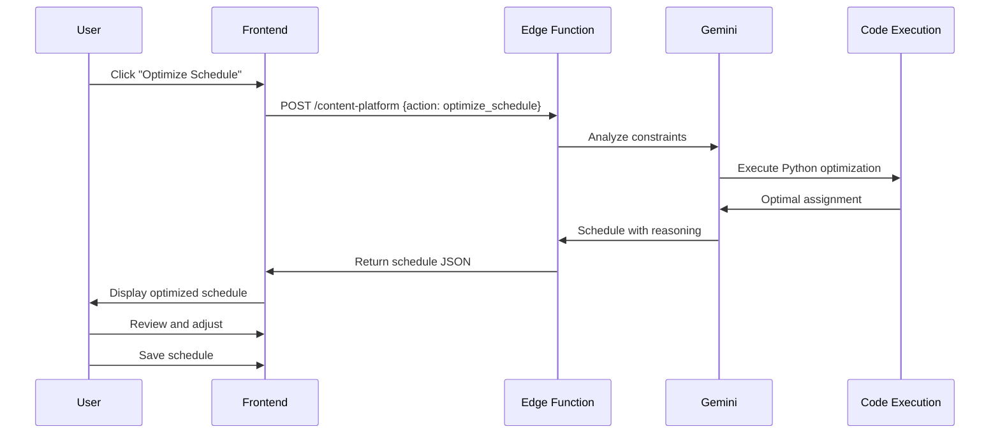

# Agent 08: Optimizer

**Type:** Fast Agent  
**API:** Gemini API (Edge Function)  
**Model:** `gemini-3-pro-preview`  
**Duration:** < 15 seconds  
**Status:** ❌ Not Implemented

---

## Description

The Optimizer optimizes schedules, budgets, and resource allocation using constraint solving and calculations. It maximizes efficiency while respecting constraints (capacity, availability, preferences).

## Purpose

Help founders make optimal decisions about:
- Event scheduling (multiple sessions, venues, speakers)
- Budget allocation (marketing spend, hiring)
- Resource planning (team allocation, project timelines)

## User Story

**As an** event organizer  
**I want to** automatically schedule sessions across venues  
**So that** I maximize attendance and minimize conflicts

## Real-World Scenario

Founder plans 3-day startup event with:
- 20 sessions
- 5 venues (capacities: 100, 200, 150, 300, 250)
- 15 speakers (various availability)
- 500 attendees

Manually scheduling would take hours and result in conflicts. Optimizer receives constraints and uses Code Execution to calculate optimal schedule:
- Maximizes venue utilization
- Minimizes speaker conflicts
- Balances attendee flow
- Includes networking breaks

Returns optimized schedule:
- Day 1: 7 sessions, 3 venues
- Day 2: 8 sessions, 4 venues
- Day 3: 5 sessions, 2 venues

Schedule displays in right panel with reasoning. Founder reviews, makes manual adjustments, saves. Optimal schedule in 15 seconds instead of 2 hours.

---

## User Journey



---

## Acceptance Criteria

- [ ] Accept sessions, venues, speakers, and constraints
- [ ] Use Code Execution for optimization calculations
- [ ] Return schedule with reasoning for assignments
- [ ] Respect all hard constraints (capacity, availability)
- [ ] Optimize for soft constraints (attendance, flow)
- [ ] Allow manual overrides after optimization
- [ ] < 15 second response time

---

## Implementation

### System Prompt

```typescript
const OPTIMIZER_PROMPT = `You are ScheduleOptimizer, an AI that creates optimal schedules using constraint satisfaction.

Your role:
1. Understand all constraints (hard and soft)
2. Use Code Execution to run optimization algorithms
3. Generate feasible schedules that maximize objectives
4. Provide reasoning for each assignment

Constraint Types:
Hard (must satisfy):
- Venue capacity >= expected attendees
- Speaker availability (can only be in one place)
- Time slot conflicts
- Required equipment availability

Soft (optimize for):
- Maximize venue utilization
- Balance attendee distribution
- Minimize speaker travel time between venues
- Group related sessions together
- Include networking breaks

Optimization Approach:
1. Parse constraints into mathematical model
2. Use Python to solve (constraint satisfaction or linear programming)
3. Validate solution meets all hard constraints
4. Calculate optimization score
5. Provide human-readable reasoning

Output Structure:
- Schedule: time slots with session-venue-speaker assignments
- Utilization: venue utilization percentages
- Reasoning: why each assignment was made
- Conflicts: any unresolved issues
- Optimization score: 0-100`;
```

### Edge Function Handler

```typescript
// supabase/functions/content-platform/index.ts
case "optimize_schedule":
  const { sessions, venues, speakers, constraints } = data;

  const model = genAI.getGenerativeModel({
    model: "gemini-3-pro-preview",
    generationConfig: {
      responseMimeType: "application/json",
      responseSchema: {
        type: "object",
        properties: {
          schedule: {
            type: "array",
            items: {
              type: "object",
              properties: {
                day: { type: "number" },
                time_slot: { type: "string" },
                session_id: { type: "string" },
                session_title: { type: "string" },
                venue_id: { type: "string" },
                venue_name: { type: "string" },
                speaker_id: { type: "string" },
                speaker_name: { type: "string" },
                expected_attendees: { type: "number" },
                reasoning: { type: "string" },
              },
            },
          },
          venue_utilization: {
            type: "object",
            additionalProperties: { type: "number" },
          },
          optimization_score: { type: "number" },
          unresolved_conflicts: {
            type: "array",
            items: { type: "string" },
          },
          summary: { type: "string" },
        },
        required: ["schedule", "optimization_score", "summary"],
      },
    },
    tools: [{ codeExecution: {} }], // Python for optimization
    thinkingConfig: {
      thinkingLevel: "high",
    },
  });

  const result = await model.generateContent({
    contents: [
      {
        role: "user",
        parts: [
          {
            text: `Optimize this event schedule:

Sessions (${sessions.length}):
${JSON.stringify(sessions, null, 2)}

Venues (${venues.length}):
${JSON.stringify(venues, null, 2)}

Speakers (${speakers.length}):
${JSON.stringify(speakers, null, 2)}

Constraints:
${JSON.stringify(constraints, null, 2)}

Use Python code execution to:
1. Model this as a constraint satisfaction problem
2. Find optimal session-venue-speaker assignments
3. Maximize venue utilization while respecting capacities
4. Ensure no speaker conflicts
5. Balance sessions across days

Return the optimized schedule with reasoning.`,
          },
        ],
      },
    ],
    systemInstruction: { parts: [{ text: OPTIMIZER_PROMPT }] },
  });

  return new Response(JSON.stringify(JSON.parse(result.response.text())));
```

---

## Output Schema

```typescript
interface OptimizedSchedule {
  schedule: ScheduleSlot[];
  venue_utilization: Record<string, number>;
  optimization_score: number;
  unresolved_conflicts: string[];
  summary: string;
}

interface ScheduleSlot {
  day: number;
  time_slot: string;
  session_id: string;
  session_title: string;
  venue_id: string;
  venue_name: string;
  speaker_id: string;
  speaker_name: string;
  expected_attendees: number;
  reasoning: string;
}

interface OptimizationConstraints {
  max_sessions_per_day: number;
  min_break_duration_minutes: number;
  preferred_session_duration_minutes: number;
  required_networking_breaks: number;
}
```

---

## Example Output

```json
{
  "schedule": [
    {
      "day": 1,
      "time_slot": "09:00-10:00",
      "session_id": "s1",
      "session_title": "Opening Keynote: Future of AI",
      "venue_id": "v4",
      "venue_name": "Main Hall",
      "speaker_id": "sp1",
      "speaker_name": "Sarah Chen",
      "expected_attendees": 280,
      "reasoning": "Keynote requires largest venue (300 capacity). Opening slot maximizes attendance."
    },
    {
      "day": 1,
      "time_slot": "10:30-11:30",
      "session_id": "s2",
      "session_title": "Workshop: Building AI Products",
      "venue_id": "v2",
      "venue_name": "Workshop Room A",
      "speaker_id": "sp3",
      "speaker_name": "Michael Torres",
      "expected_attendees": 80,
      "reasoning": "Workshop format suits smaller venue (100 capacity). Speaker available after keynote."
    }
  ],
  "venue_utilization": {
    "v1": 0.75,
    "v2": 0.82,
    "v3": 0.68,
    "v4": 0.93,
    "v5": 0.71
  },
  "optimization_score": 87,
  "unresolved_conflicts": [
    "Speaker sp5 has back-to-back sessions on Day 2 (no break)"
  ],
  "summary": "Optimized 20 sessions across 3 days with 87% efficiency. Main Hall fully utilized for keynotes. One speaker conflict flagged for manual review."
}
```

---

## Gemini Features Used

| Feature | Purpose | Configuration |
|---------|---------|---------------|
| Code Execution | Run Python optimization | `tools: [{ codeExecution: {} }]` |
| Thinking Mode | Complex constraint solving | `thinkingLevel: 'high'` |
| Structured Output | Enforce schedule schema | `responseMimeType: 'application/json'` |

---

## Production Checklist

- [ ] Create `content-platform` edge function
- [ ] Code Execution enabled for Python
- [ ] Schedule schema defined
- [ ] Constraint validation logic
- [ ] Manual override UI
- [ ] Schedule visualization component
- [ ] Export to calendar formats (ICS, Google Calendar)

---

## Files Impacted

| File | Status | Purpose |
|------|--------|---------|
| `supabase/functions/content-platform/index.ts` | ❌ Create | Edge function handler |
| `src/hooks/useScheduleOptimizer.ts` | ❌ Create | Frontend hook |
| `src/components/events/ScheduleOptimizer.tsx` | ❌ Create | Optimization UI |
| `src/components/events/ScheduleView.tsx` | ❌ Create | Schedule display |

---

## Success Criteria

1. **Feasibility:** 100% of hard constraints satisfied
2. **Optimization:** Average 80%+ venue utilization
3. **Speed:** < 15 second response time
4. **User Satisfaction:** 80% of schedules used without major changes
5. **Conflict Reduction:** 90% fewer scheduling conflicts vs manual
