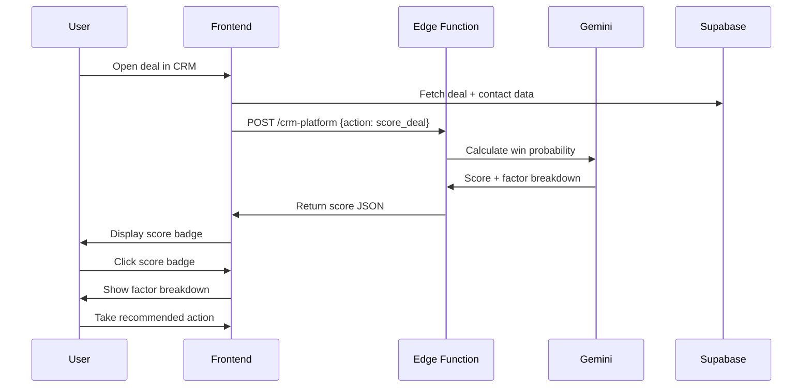

# Agent 09: Scorer

**Type:** Fast Agent  
**API:** Gemini API (Edge Function)  
**Model:** `gemini-3-pro-preview`  
**Duration:** < 5 seconds  
**Status:** ✅ Implemented (onboarding-agent)

---

## Description

The Scorer calculates scores (health, ROI, quality, win probability) based on data analysis. It returns scores with factor breakdowns and recommendations for data-driven prioritization.

## Purpose

Provide quantifiable scores instead of guesses:
- Investor readiness score (0-100)
- Deal win probability (0-100%)
- Startup health score (0-100)
- Task priority score (0-100)

## User Story

**As a** founder managing multiple deals  
**I want to** see win probability for each deal  
**So that** I can prioritize my outreach efforts

## Real-World Scenario

Founder views deal "Y Combinator" in CRM. Wants to know win probability to prioritize outreach.

Scorer analyzes deal data:
- Stage: "Meeting Scheduled"
- Engagement: 3 emails, 1 call
- Response time: 24 hours
- Fit: High (YC invests in B2B SaaS, fashion tech)
- Traction: $50K MRR, 50+ events
- Competition: 2 other startups in pipeline

Calculates win probability: **35%**
- Fit: +40%
- Traction: +30%
- Engagement: +20%
- Competition: -15%

Score displays in deal card badge. Founder clicks score → Shows detailed breakdown in right panel. Founder takes recommended action: "Prepare strong demo for meeting".

---

## User Journey



---

## Acceptance Criteria

- [x] Calculate investor readiness score (onboarding)
- [ ] Calculate deal win probability (CRM)
- [x] Return score with factor breakdown
- [x] Include recommendations for improvement
- [x] Scores update when data changes
- [x] < 5 second response time

---

## Implementation

### System Prompt (Investor Score)

```typescript
const INVESTOR_SCORER_PROMPT = `You are InvestorScorer, an AI that calculates startup investor readiness scores.

Your role:
1. Analyze startup profile and traction data
2. Score readiness for investor conversations
3. Identify strengths and gaps
4. Provide actionable improvement recommendations

Scoring Factors (100 points total):
- Team (20): Founder experience, team completeness, advisors
- Product (20): MVP status, user feedback, technical moat
- Traction (25): MRR, growth rate, user count, engagement
- Market (15): Market size, timing, competition positioning
- Fundraising Prep (20): Deck ready, ask defined, target investors identified

Score Interpretation:
- 80-100: Investor ready, start outreach
- 60-79: Almost ready, address key gaps
- 40-59: Early stage, focus on traction
- 0-39: Not ready, build foundation first

Rules:
- Be honest but constructive
- Identify top 3 gaps
- Provide specific improvement actions
- Consider stage context (seed vs series A)`;
```

### Edge Function Handler (Investor Score)

```typescript
// supabase/functions/onboarding-agent/index.ts
case "calculate_investor_score":
  const { startup_data, interview_responses } = data;

  const model = genAI.getGenerativeModel({
    model: "gemini-3-pro-preview",
    generationConfig: {
      responseMimeType: "application/json",
      responseSchema: {
        type: "object",
        properties: {
          total_score: { type: "number" },
          grade: { type: "string" },
          factors: {
            type: "array",
            items: {
              type: "object",
              properties: {
                name: { type: "string" },
                score: { type: "number" },
                max_score: { type: "number" },
                assessment: { type: "string" },
              },
            },
          },
          strengths: {
            type: "array",
            items: { type: "string" },
          },
          gaps: {
            type: "array",
            items: {
              type: "object",
              properties: {
                area: { type: "string" },
                issue: { type: "string" },
                recommendation: { type: "string" },
                impact: { type: "string" },
              },
            },
          },
          next_steps: {
            type: "array",
            items: { type: "string" },
          },
        },
        required: ["total_score", "grade", "factors", "gaps"],
      },
    },
    thinkingConfig: {
      thinkingLevel: "medium",
    },
  });

  const result = await model.generateContent({
    contents: [
      {
        role: "user",
        parts: [
          {
            text: `Calculate investor readiness score:

Startup Profile:
${JSON.stringify(startup_data, null, 2)}

Interview Responses:
${JSON.stringify(interview_responses, null, 2)}

Score across all factors and identify top gaps with recommendations.`,
          },
        ],
      },
    ],
    systemInstruction: { parts: [{ text: INVESTOR_SCORER_PROMPT }] },
  });

  return new Response(JSON.stringify(JSON.parse(result.response.text())));
```

### Deal Win Probability (Future)

```typescript
// supabase/functions/crm-platform/index.ts
case "score_deal":
  const { deal, investor, startup } = data;

  const model = genAI.getGenerativeModel({
    model: "gemini-3-pro-preview",
    generationConfig: {
      responseMimeType: "application/json",
      responseSchema: dealScoreSchema,
    },
    thinkingConfig: {
      thinkingLevel: "medium",
    },
  });

  const result = await model.generateContent({
    contents: [
      {
        role: "user",
        parts: [
          {
            text: `Calculate deal win probability:

Deal: ${JSON.stringify(deal, null, 2)}
Investor: ${JSON.stringify(investor, null, 2)}
Startup: ${JSON.stringify(startup, null, 2)}

Consider:
- Investor fit (do they invest in this space?)
- Stage fit (do they do this stage?)
- Engagement level (response times, meetings)
- Competition (other startups in their pipeline)
- Traction (does it meet their bar?)`,
          },
        ],
      },
    ],
  });

  return new Response(result.response.text());
```

---

## Output Schema

```typescript
interface InvestorScore {
  total_score: number;
  grade: "A" | "B" | "C" | "D" | "F";
  factors: Factor[];
  strengths: string[];
  gaps: Gap[];
  next_steps: string[];
}

interface Factor {
  name: string;
  score: number;
  max_score: number;
  assessment: string;
}

interface Gap {
  area: string;
  issue: string;
  recommendation: string;
  impact: "high" | "medium" | "low";
}

interface DealScore {
  win_probability: number;
  confidence: number;
  factors: {
    name: string;
    impact: number;
    reasoning: string;
  }[];
  recommended_actions: string[];
}
```

---

## Example Output (Investor Score)

```json
{
  "total_score": 72,
  "grade": "B",
  "factors": [
    {
      "name": "Team",
      "score": 16,
      "max_score": 20,
      "assessment": "Strong technical founder, needs business co-founder"
    },
    {
      "name": "Product",
      "score": 18,
      "max_score": 20,
      "assessment": "MVP launched with positive user feedback"
    },
    {
      "name": "Traction",
      "score": 15,
      "max_score": 25,
      "assessment": "$5K MRR is early but growing 20% monthly"
    },
    {
      "name": "Market",
      "score": 12,
      "max_score": 15,
      "assessment": "$50B market, good timing for AI-powered events"
    },
    {
      "name": "Fundraising Prep",
      "score": 11,
      "max_score": 20,
      "assessment": "Pitch deck started, investor list incomplete"
    }
  ],
  "strengths": [
    "Strong product with validated user demand",
    "Technical moat with AI technology",
    "Growing MRR with good unit economics"
  ],
  "gaps": [
    {
      "area": "Team",
      "issue": "No dedicated business/sales person",
      "recommendation": "Find a business-focused co-founder or senior hire",
      "impact": "high"
    },
    {
      "area": "Fundraising Prep",
      "issue": "Investor target list incomplete",
      "recommendation": "Research 50 seed investors in fashion tech space",
      "impact": "high"
    },
    {
      "area": "Traction",
      "issue": "MRR below typical seed threshold ($10K+)",
      "recommendation": "Focus on growth for 2-3 months before active fundraising",
      "impact": "medium"
    }
  ],
  "next_steps": [
    "Complete investor target list (50 investors)",
    "Finish pitch deck with updated traction",
    "Schedule 5 customer calls for testimonials"
  ]
}
```

---

## Gemini Features Used

| Feature | Purpose | Configuration |
|---------|---------|---------------|
| Structured Output | Enforce score schema | `responseMimeType: 'application/json'` |
| Thinking Mode | Scoring algorithm | `thinkingLevel: 'medium'` |

---

## Production Checklist

- [x] Investor readiness score (onboarding-agent)
- [x] Factor breakdown display
- [x] Gap identification
- [ ] Deal win probability (crm-platform)
- [ ] Score badges in CRM UI
- [ ] Historical score tracking
- [ ] Score comparison over time

---

## Files Impacted

| File | Status | Purpose |
|------|--------|---------|
| `supabase/functions/onboarding-agent/index.ts` | ✅ Done | Investor score action |
| `src/hooks/onboarding/useScoring.ts` | ✅ Done | Frontend hook |
| `src/components/onboarding/step4/InvestorScoreCard.tsx` | ✅ Done | Score display |
| `supabase/functions/crm-platform/index.ts` | ❌ Create | Deal score action |

---

## Success Criteria

1. **Accuracy:** Scores correlate with actual outcomes (deals closed, rounds raised)
2. **Actionability:** 80% of gap recommendations are actionable
3. **Speed:** < 5 second response time
4. **User Value:** Founders report better prioritization
5. **Calibration:** Score distribution matches expected bell curve
