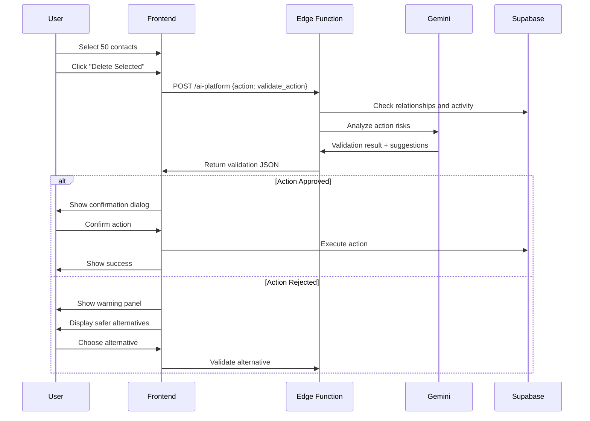

# Agent 10: Controller

**Type:** Fast Agent (Safety Guard)  
**API:** Gemini API (Edge Function)  
**Model:** `gemini-3-pro-preview`  
**Duration:** < 5 seconds  
**Status:** ❌ Not Implemented

---

## Description

The Controller validates proposed actions before execution. It checks for dangerous operations (bulk deletes, irreversible changes) and suggests safer alternatives. The "safety guard" that prevents accidental data loss.

## Purpose

Enforce approval gate pattern:
1. AI proposes action
2. Controller validates
3. Human approves
4. System executes

Prevents founders from accidentally:
- Deleting important data
- Making irreversible changes
- Breaking integrations
- Losing business context

## User Story

**As a** founder managing CRM data  
**I want to** be warned before dangerous bulk operations  
**So that** I don't accidentally delete important contacts

## Real-World Scenario

Founder selects 50 "Cold" contacts in CRM, clicks "Delete Selected". Instead of immediately deleting, Controller validates the action.

Controller checks:
- Are contacts used in deals? → 5 contacts linked
- Any recent activity? → 10 have notes from this month
- Any scheduled follow-ups? → 2 have pending tasks

Returns validation:
> ⚠️ **Dangerous bulk delete detected**
> - 5 contacts linked to active deals
> - 10 contacts have recent activity
> - 2 contacts have pending follow-ups
>
> **Suggestion:** Archive instead, or exclude contacts with deals/activity.

Warning displays in right panel. Founder reviews, chooses "Archive instead" (safer). Controller validates archive action → System executes. Data loss prevented.

---

## User Journey



---

## Acceptance Criteria

- [ ] Validate all destructive actions (DELETE, bulk UPDATE)
- [ ] Check for entity relationships and dependencies
- [ ] Identify irreversible operations
- [ ] Suggest safer alternatives
- [ ] Return approval/rejection with reasoning
- [ ] Log all validations for audit
- [ ] < 5 second response time

---

## Implementation

### System Prompt

```typescript
const CONTROLLER_PROMPT = `You are ActionValidator, a safety guard that validates proposed actions before execution.

Your role:
1. Analyze proposed actions for potential harm
2. Check dependencies and relationships
3. Identify irreversible consequences
4. Suggest safer alternatives when appropriate

Risk Categories:
- data_loss: Permanent deletion of records
- relationship_break: Breaking entity connections
- cascade_effect: Action affects related records
- irreversible: Cannot be undone easily
- compliance: May violate data policies

Validation Levels:
- approved: Safe to proceed
- warning: Proceed with caution, show confirmation
- blocked: Too risky, suggest alternative
- requires_review: Needs human review (edge case)

Safety Checks:
1. Check if entities are linked to other records
2. Check for recent activity (< 30 days)
3. Check for scheduled future events
4. Check for integration dependencies
5. Check for data that can't be recovered

Alternative Suggestions:
- DELETE → Archive instead
- Bulk DELETE → Exclude linked records
- Hard DELETE → Soft delete with recovery period
- Immediate → Schedule with cancellation window

Rules:
- Never approve bulk deletes without checking relationships
- Always suggest archive over delete when possible
- Flag any action affecting > 100 records
- Log reasoning for audit trail`;
```

### Edge Function Handler

```typescript
// supabase/functions/ai-platform/index.ts
case "validate_action":
  const { action_type, entity_type, entity_ids, user_id } = data;

  // Step 1: Gather context from database
  const context = await gatherActionContext(entity_type, entity_ids);

  const model = genAI.getGenerativeModel({
    model: "gemini-3-pro-preview",
    generationConfig: {
      responseMimeType: "application/json",
      responseSchema: {
        type: "object",
        properties: {
          approved: { type: "boolean" },
          validation_level: {
            type: "string",
            enum: ["approved", "warning", "blocked", "requires_review"],
          },
          risks: {
            type: "array",
            items: {
              type: "object",
              properties: {
                category: { type: "string" },
                severity: { type: "string" },
                description: { type: "string" },
                affected_count: { type: "number" },
              },
            },
          },
          suggested_alternative: {
            type: "object",
            properties: {
              action: { type: "string" },
              description: { type: "string" },
              safe_entity_ids: {
                type: "array",
                items: { type: "string" },
              },
            },
          },
          reasoning: { type: "string" },
          requires_confirmation: { type: "boolean" },
        },
        required: ["approved", "validation_level", "reasoning"],
      },
    },
    thinkingConfig: {
      thinkingLevel: "high", // High for safety-critical
    },
  });

  const result = await model.generateContent({
    contents: [
      {
        role: "user",
        parts: [
          {
            text: `Validate this action:

Action Type: ${action_type}
Entity Type: ${entity_type}
Entity Count: ${entity_ids.length}
User: ${user_id}

Entity Context:
${JSON.stringify(context, null, 2)}

Check for:
1. Linked relationships
2. Recent activity
3. Scheduled events
4. Irreversible consequences

Determine if action is safe and suggest alternatives if not.`,
          },
        ],
      },
    ],
    systemInstruction: { parts: [{ text: CONTROLLER_PROMPT }] },
  });

  const validation = JSON.parse(result.response.text());

  // Log to audit trail
  await supabase.from("proposed_actions").insert({
    user_id,
    action_type,
    entity_type,
    entity_ids,
    validation_result: validation,
    status: validation.approved ? "approved" : "blocked",
  });

  return new Response(JSON.stringify(validation));

// Helper function
async function gatherActionContext(entityType: string, entityIds: string[]) {
  const context: any = {};

  switch (entityType) {
    case "contacts":
      // Check deals linked to contacts
      const { data: deals } = await supabase
        .from("deals")
        .select("id, name, stage")
        .in("contact_id", entityIds);
      context.linked_deals = deals;

      // Check recent communications
      const { data: comms } = await supabase
        .from("communications")
        .select("id, type, occurred_at")
        .in("contact_id", entityIds)
        .gte("occurred_at", new Date(Date.now() - 30 * 24 * 60 * 60 * 1000).toISOString());
      context.recent_communications = comms;

      // Check pending tasks
      const { data: tasks } = await supabase
        .from("tasks")
        .select("id, title, due_date")
        .in("contact_id", entityIds)
        .eq("status", "pending");
      context.pending_tasks = tasks;
      break;

    // Add other entity types...
  }

  return context;
}
```

---

## Output Schema

```typescript
interface ActionValidation {
  approved: boolean;
  validation_level: "approved" | "warning" | "blocked" | "requires_review";
  risks: Risk[];
  suggested_alternative?: {
    action: string;
    description: string;
    safe_entity_ids?: string[];
  };
  reasoning: string;
  requires_confirmation: boolean;
}

interface Risk {
  category: string;
  severity: "critical" | "high" | "medium" | "low";
  description: string;
  affected_count: number;
}
```

---

## Example Output (Blocked)

```json
{
  "approved": false,
  "validation_level": "blocked",
  "risks": [
    {
      "category": "relationship_break",
      "severity": "high",
      "description": "5 contacts are linked to active deals",
      "affected_count": 5
    },
    {
      "category": "data_loss",
      "severity": "medium",
      "description": "10 contacts have recent communication history",
      "affected_count": 10
    },
    {
      "category": "cascade_effect",
      "severity": "low",
      "description": "2 contacts have pending follow-up tasks",
      "affected_count": 2
    }
  ],
  "suggested_alternative": {
    "action": "archive",
    "description": "Archive contacts instead of deleting. Preserves data for recovery.",
    "safe_entity_ids": ["c1", "c2", "c3"] // 47 without links
  },
  "reasoning": "Bulk delete blocked because 5 contacts are linked to active deals and 10 have recent activity. Deleting would break deal relationships and lose communication history. Suggest archiving instead.",
  "requires_confirmation": true
}
```

---

## Example Output (Warning)

```json
{
  "approved": true,
  "validation_level": "warning",
  "risks": [
    {
      "category": "data_loss",
      "severity": "low",
      "description": "3 contacts have old notes (> 90 days)",
      "affected_count": 3
    }
  ],
  "suggested_alternative": null,
  "reasoning": "Action can proceed with caution. 47 contacts have no links or recent activity. 3 contacts have old notes that will be lost. Consider exporting before deletion.",
  "requires_confirmation": true
}
```

---

## Gemini Features Used

| Feature | Purpose | Configuration |
|---------|---------|---------------|
| Thinking Mode | Safety-critical analysis | `thinkingLevel: 'high'` |
| Structured Output | Enforce validation schema | `responseMimeType: 'application/json'` |

---

## Database Schema

```sql
-- Proposed actions for audit trail
CREATE TABLE IF NOT EXISTS public.proposed_actions (
  id UUID PRIMARY KEY DEFAULT gen_random_uuid(),
  user_id UUID REFERENCES auth.users(id) NOT NULL,
  action_type TEXT NOT NULL,
  entity_type TEXT NOT NULL,
  entity_ids UUID[] NOT NULL,
  validation_result JSONB,
  status TEXT DEFAULT 'pending',
  executed_at TIMESTAMPTZ,
  created_at TIMESTAMPTZ DEFAULT now()
);

-- Enable RLS
ALTER TABLE public.proposed_actions ENABLE ROW LEVEL SECURITY;

CREATE POLICY "Users view own actions"
  ON public.proposed_actions FOR SELECT
  USING (auth.uid() = user_id);
```

---

## Production Checklist

- [ ] Create `ai-platform` edge function
- [ ] `proposed_actions` table exists (✅ in schema)
- [ ] Validation for DELETE actions
- [ ] Validation for bulk UPDATE actions
- [ ] UI warning dialog component
- [ ] Alternative action buttons
- [ ] Audit log integration
- [ ] Admin override capability

---

## Files Impacted

| File | Status | Purpose |
|------|--------|---------|
| `supabase/functions/ai-platform/index.ts` | ❌ Create | Validation handler |
| `src/hooks/useActionValidator.ts` | ❌ Create | Frontend hook |
| `src/components/ui/ValidationDialog.tsx` | ❌ Create | Warning UI |
| `proposed_actions` table | ✅ Exists | Audit trail |

---

## Success Criteria

1. **Prevention:** 100% of bulk deletes validated before execution
2. **Accuracy:** < 5% false positive rate (blocking safe actions)
3. **User Experience:** Validation adds < 5 seconds to workflow
4. **Data Safety:** 0 accidental data loss incidents after implementation
5. **Audit Trail:** All validations logged for compliance
