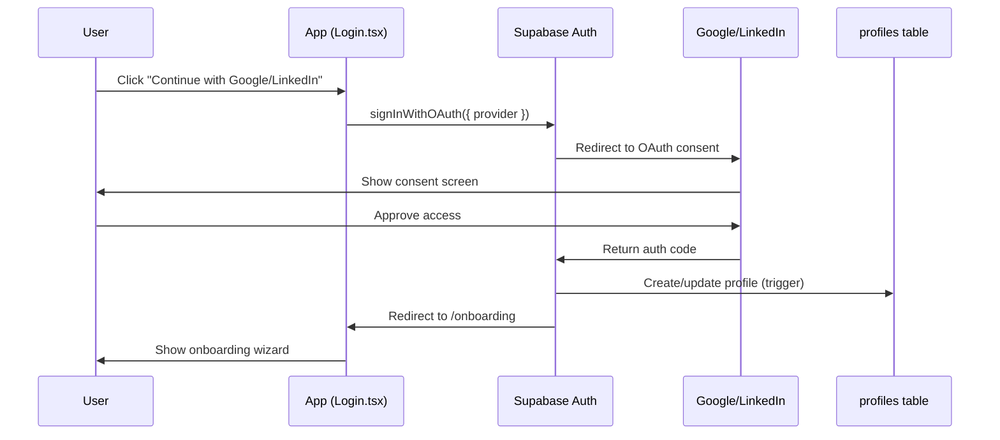

# Social Authentication Setup Guide

## Overview

StartupAI uses Supabase Auth with Google and LinkedIn OIDC providers for secure, frictionless onboarding.

## Architecture



## User Flow

```mermaid
flowchart TD
    A[Landing Page] -->|"Start Your Profile"| B[/login]
    B -->|Google OAuth| C[Google Consent]
    B -->|LinkedIn OAuth| D[LinkedIn Consent]
    C --> E{New User?}
    D --> E
    E -->|Yes| F[/onboarding]
    E -->|No + onboarding_completed| G[/dashboard]
    E -->|No + !onboarding_completed| F
    F -->|Complete| G
```

## Providers

### Google OAuth
- **Provider ID**: `google`
- **Scopes**: `openid`, `email`, `profile`
- **Dashboard**: https://supabase.com/dashboard/project/yvyesmiczbjqwbqtlidy/auth/providers

### LinkedIn OIDC
- **Provider ID**: `linkedin_oidc` (NOT `linkedin` - deprecated)
- **Scopes**: `openid`, `email`, `profile`
- **Dashboard**: https://supabase.com/dashboard/project/yvyesmiczbjqwbqtlidy/auth/providers

## Implementation Files

| File | Purpose |
|------|---------|
| `src/hooks/useAuth.tsx` | Auth context, session management, OAuth methods |
| `src/pages/Login.tsx` | Login UI with Google + LinkedIn buttons |
| `src/components/auth/ProtectedRoute.tsx` | Route guard with onboarding redirect |

## Supabase Configuration

### Required Secrets
- `GOOGLE_CLIENT_ID` ✅
- `GOOGLE_CLIENT_SECRET` ✅
- `LINKEDIN_OIDC_CLIENT_ID` (to be configured)
- `LINKEDIN_OIDC_CLIENT_SECRET` (to be configured)

### Redirect URLs
Add to Supabase Dashboard > Authentication > URL Configuration:
- Site URL: `https://rocket-path-ai.lovable.app`
- Redirect URLs:
  - `https://rocket-path-ai.lovable.app/**`
  - `https://id-preview--c853d8c8-40a1-4530-9351-9050838a00d9.lovable.app/**`

## Database Trigger

The `handle_new_user()` trigger automatically:
1. Creates a profile in `public.profiles`
2. Assigns the `user` role in `public.user_roles`

## Onboarding Redirect Logic

```typescript
// After OAuth callback:
if (profile?.onboarding_completed) {
  navigate('/dashboard');
} else {
  navigate('/onboarding');
}
```

## Troubleshooting

| Issue | Solution |
|-------|----------|
| "Invalid redirect URL" | Add URL to Supabase redirect allowlist |
| LinkedIn deprecated error | Use `linkedin_oidc` provider, not `linkedin` |
| Session not persisting | Check `onAuthStateChange` listener setup |
| Profile not created | Verify `handle_new_user` trigger exists |

## References

- [Supabase Google Auth](https://supabase.com/docs/guides/auth/social-login/auth-google)
- [Supabase LinkedIn OIDC](https://supabase.com/docs/guides/auth/social-login/auth-linkedin)
- [Auth Architecture](https://supabase.com/docs/guides/auth/architecture)
