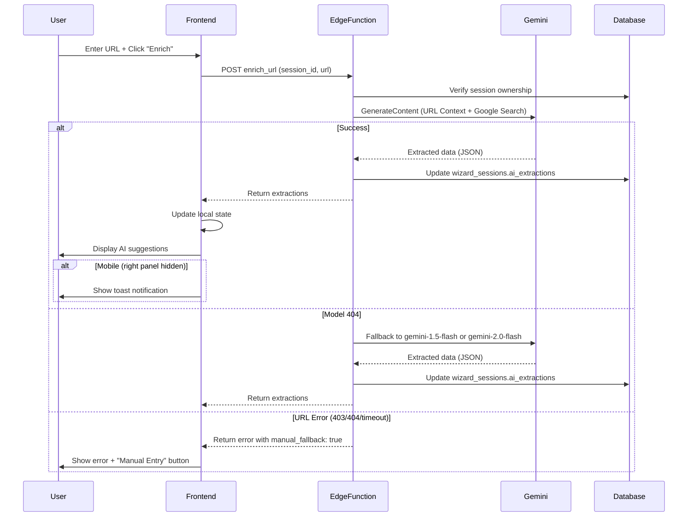
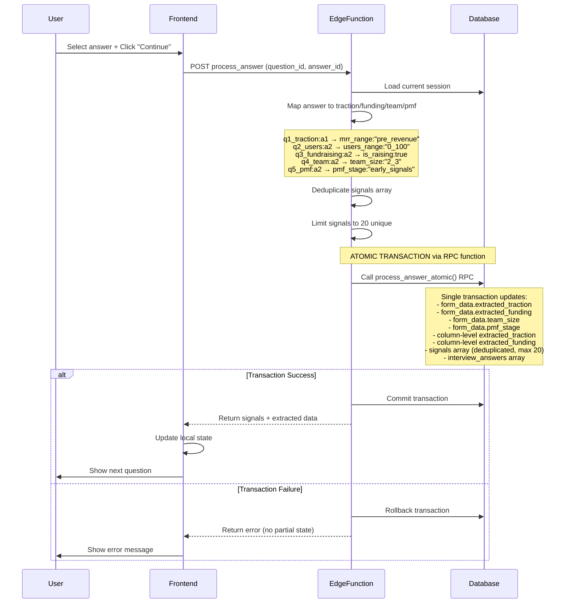
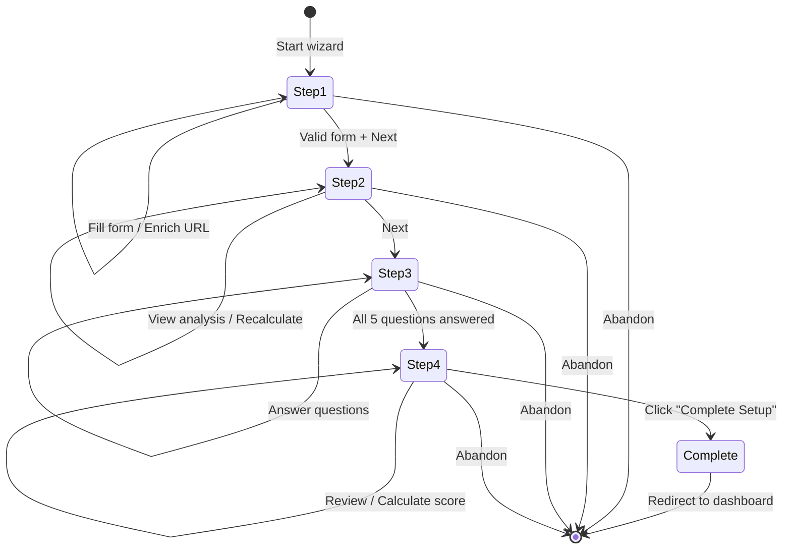
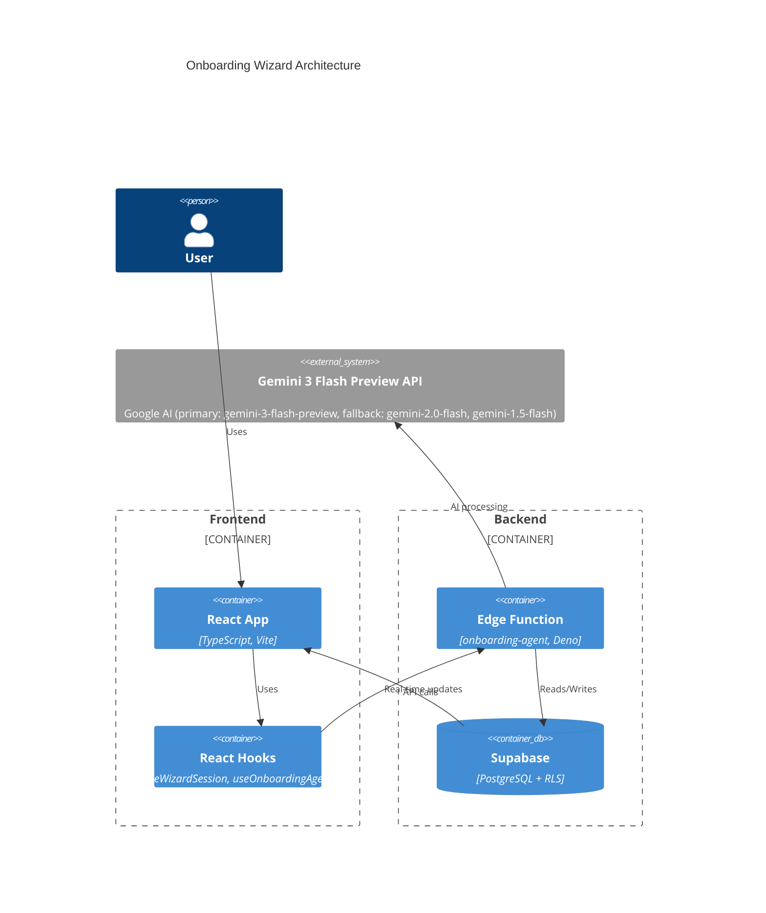
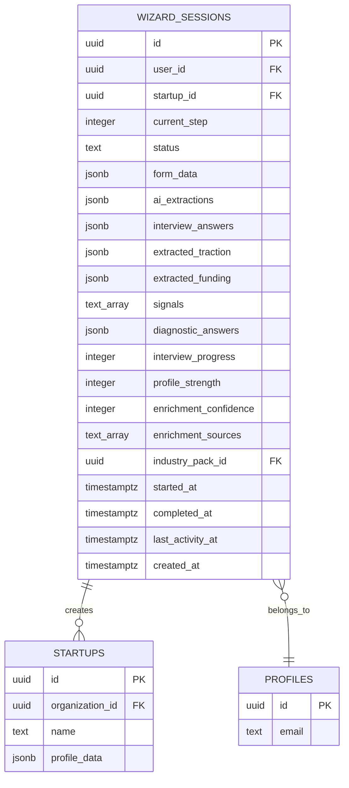
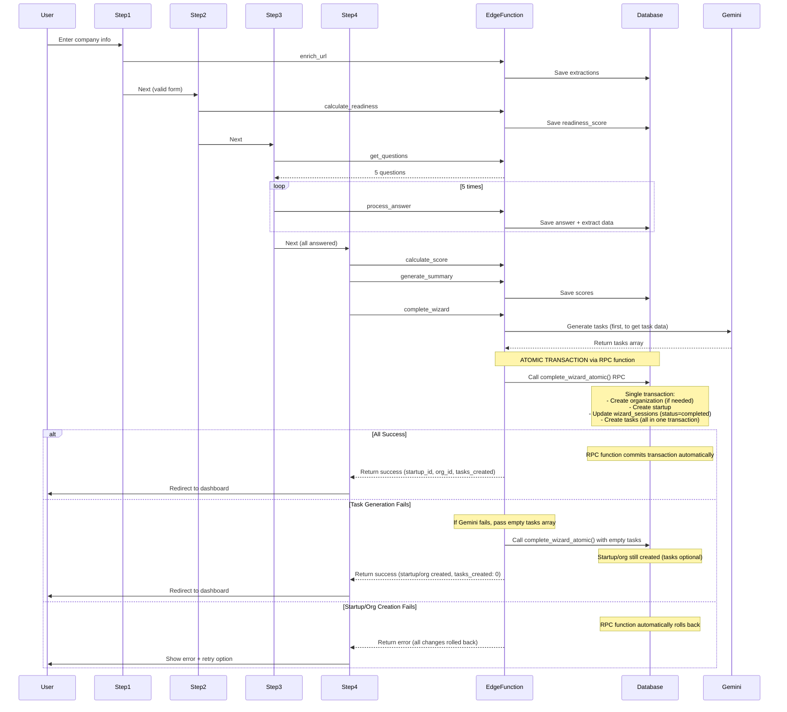
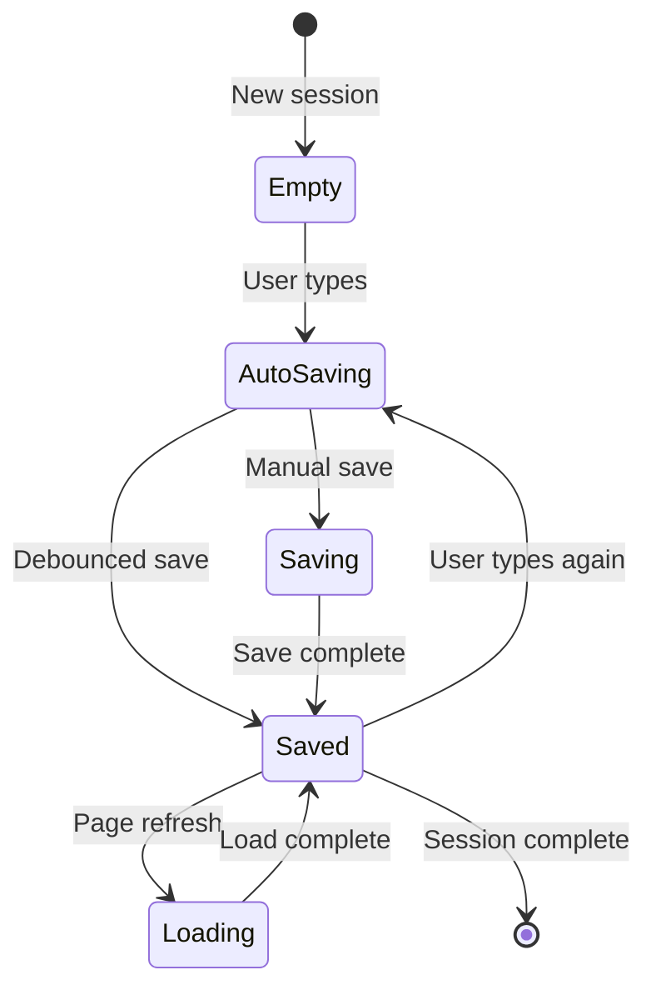

# Onboarding Wizard - Mermaid Diagrams

**Purpose:** Visual diagrams for onboarding wizard architecture, flow, and data model  
**Format:** Mermaid diagrams (render in Markdown)  
**Status:** Production-ready  
**Current Lovable Build:** `/home/sk/startupai16L/` (source of truth)

**Repository Status:**
- **Lovable Build:** `/home/sk/startupai16L/` - Current production build
- **Edge Function:** `supabase/functions/onboarding-agent/index.ts`
- **Database:** `wizard_sessions` table (6 migrations in startupai16L, 30 in startupai16)

---

## 1. User Journey - 4-Step Wizard Flow

```mermaid
journey
    title Onboarding Wizard User Journey
    section Step 1: Context
      Enter company info: 5: User
      Enter website URL: 5: User
      Click "Enrich": 4: User
      AI extracts data: 5: System
      Review AI suggestions: 4: User
      Add founders: 5: User
      Validate form: 4: System
    section Step 2: Analysis
      View AI analysis: 5: User
      See readiness score: 5: User
      Review competitors: 4: User
      Check signals: 4: User
    section Step 3: Interview
      Answer question 1: 5: User
      Answer question 2: 5: User
      Answer question 3: 5: User
      Answer question 4: 5: User
      Answer question 5: 5: User
      AI extracts signals: 5: System
    section Step 4: Review
      View investor score: 5: User
      Read AI summary: 5: User
      Review traction/funding: 5: User
      Complete setup: 5: User
      Redirect to dashboard: 5: System
```

---

## 2. Sequence Diagram - AI Enrichment Flow



---

## 3. Sequence Diagram - Answer Processing Flow



---

## 4. State Diagram - Wizard Steps



---

## 5. C4 Container Diagram - Architecture



---

## 6. ER Diagram - Wizard Sessions Data Model



---

## 7. Flowchart - Complete Wizard Flow

```mermaid
flowchart TD
    Start([User starts wizard]) --> Step1[Step 1: Context Collection]
    Step1 --> FillForm[Fill company info]
    FillForm --> EnrichURL{Enrich URL?}
    EnrichURL -->|Yes| AIExtract[AI extracts data]
    EnrichURL -->|No| Validate1{Form valid?}
    AIExtract --> Validate1
    Validate1 -->|No| FillForm
    Validate1 -->|Yes| Step2[Step 2: AI Analysis]
    
    Step2 --> CalculateScore[Calculate readiness score]
    CalculateScore --> DisplayAnalysis[Display analysis cards]
    DisplayAnalysis --> Step3[Step 3: Interview]
    
    Step3 --> LoadQuestions[Load 5 questions]
    LoadQuestions --> ShowQuestion[Show question]
    ShowQuestion --> AnswerQuestion[User answers]
    AnswerQuestion --> ProcessAnswer[Process answer]
    ProcessAnswer --> ExtractData[Extract signals/traction/funding]
    ExtractData --> SaveAnswer[Save to database]
    SaveAnswer --> MoreQuestions{More questions?}
    MoreQuestions -->|Yes| ShowQuestion
    MoreQuestions -->|No| Step4[Step 4: Review]
    
    Step4 --> CalculateInvestor[Calculate investor score]
    CalculateInvestor --> GenerateSummary[Generate AI summary]
    GenerateSummary --> DisplayReview[Display review]
    DisplayReview --> Complete{Complete?}
    Complete -->|Yes| CreateStartup[Create startup + org]
    Complete -->|No| DisplayReview
    CreateStartup --> Dashboard([Redirect to dashboard])
```



---

## 8. Sequence Diagram - Complete Wizard Flow



---

## 9. State Diagram - Data Persistence States



---

## 10. Flowchart - process_answer Logic

```mermaid
flowchart TD
    Start([process_answer called]) --> LoadSession[Load current session]
    LoadSession --> GetAnswer[Get question_id + answer_id]
    GetAnswer --> CheckQuestion{Question type?}
    
    CheckQuestion -->|q1_traction| MapMRR[Map to mrr_range]
    CheckQuestion -->|q2_users| MapUsers[Map to users_range]
    CheckQuestion -->|q3_fundraising| MapFunding[Map to is_raising + status]
    CheckQuestion -->|q4_team| ExtractTeam[Extract team signals + team_size]
    CheckQuestion -->|q5_pmf| ExtractPMF[Extract PMF signals + pmf_stage]
    
    MapMRR --> MergeData[Merge with existing extracted_traction]
    MapUsers --> MergeData
    MapFunding --> MergeFunding[Merge with existing extracted_funding]
    ExtractTeam --> UpdateTeam[Update signals + form_data.team_size]
    ExtractPMF --> UpdatePMF[Update signals + form_data.pmf_stage]
    
    MergeData --> DeduplicateSignals[Deduplicate signals: [...new Set(signals)]]
    MergeFunding --> DeduplicateSignals
    UpdateTeam --> DeduplicateSignals
    UpdatePMF --> DeduplicateSignals
    
    DeduplicateSignals --> CheckLimit{Signals > 20?}
    CheckLimit -->|Yes| TrimSignals[Keep first 20 unique signals]
    CheckLimit -->|No| BeginTransaction[Begin atomic transaction]
    TrimSignals --> BeginTransaction
    
    BeginTransaction --> CallRPC[Call process_answer_atomic() RPC function]
    Note over CallRPC: RPC function handles all updates in single transaction
    CallRPC --> SaveBoth[Save to form_data AND column-level (atomic)]
    SaveBoth --> SaveTeamPMF[Save team_size and pmf_stage to form_data]
    SaveTeamPMF --> SaveAnswers[Save to interview_answers array]
    SaveAnswers --> CommitTransaction{RPC transaction success?}
    CommitTransaction -->|Yes| Return([Return success + data])
    CommitTransaction -->|No| RollbackTransaction[RPC automatically rolls back]
    RollbackTransaction --> ReturnError([Return error - no partial state])
```

---

## Diagram Summary

| Diagram | Purpose | Use Case |
|---------|---------|----------|
| **User Journey** | User experience flow | UX planning, user satisfaction |
| **Sequence (Enrichment)** | AI enrichment flow | Debugging URL enrichment, error handling |
| **Sequence (Answer)** | Answer processing flow | Debugging traction/funding/team/pmf extraction, transaction safety |
| **State (Steps)** | Wizard navigation | Navigation logic |
| **C4 Container** | System architecture | High-level architecture docs |
| **ER Diagram** | Data model | Database schema reference |
| **Flowchart (Complete)** | End-to-end flow | Complete workflow visualization |
| **Sequence (Complete)** | Full wizard sequence | Integration testing, atomicity verification |
| **State (Persistence)** | Data save states | Auto-save debugging |
| **Flowchart (process_answer)** | Answer mapping logic | Debugging extraction, Q4/Q5 logic, signal deduplication |

## Critical Implementation Notes

### Transaction Safety
- **All dual saves** (form_data + column-level) MUST use atomic transactions
- **complete_wizard** MUST use transaction for all 3 steps (startup, org, tasks)
- **Rollback on failure** - never leave partial state

### Signal Management
- **Deduplication:** `signals = [...new Set(signals)]` before saving
- **Limit:** Maximum 20 unique signals to prevent overflow
- **Applied:** On every `process_answer` call

### Error Handling
- **Model 404:** Fallback to `gemini-1.5-flash` or `gemini-2.0-flash`
- **URL 403/404:** Return error with `manual_fallback: true`
- **Transaction failure:** Rollback all changes, return error

### Mobile UX
- **Toast notifications:** Required when right panel hidden and AI completes
- **Error feedback:** Show manual fallback button on mobile

---

*Diagrams created: 2026-01-25*  
*Status: Production-ready*  
*Render: Use Mermaid-compatible Markdown viewer*

---

## Quick Reference

**Database:** `wizard_sessions` table with `form_data`, `ai_extractions`, `interview_answers`, `extracted_traction`, `extracted_funding`, `signals`  
**Edge Function:** `onboarding-agent` with 11 actions (enrich_url, calculate_readiness, process_answer, etc.)  
**AI Model:** `gemini-3-flash-preview` (fallback: gemini-2.0-flash)  
**Questions:** 5 questions (q1_traction, q2_users, q3_fundraising, q4_team, q5_pmf)  
**Transactions:** Use atomic RPC functions for dual saves (form_data + column-level)
