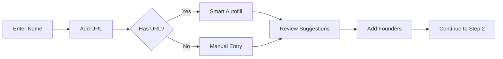
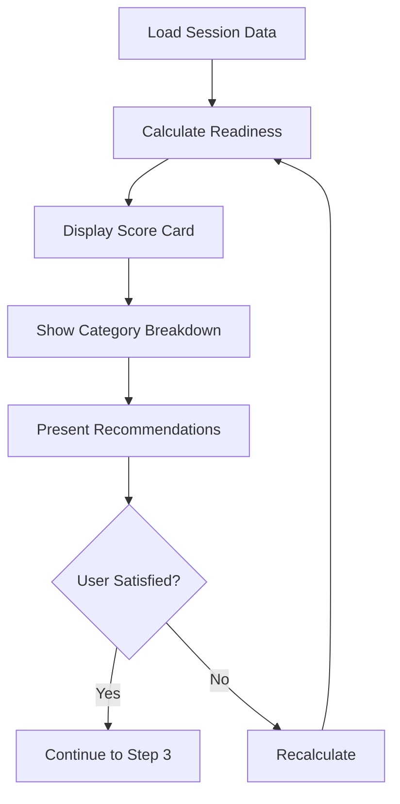
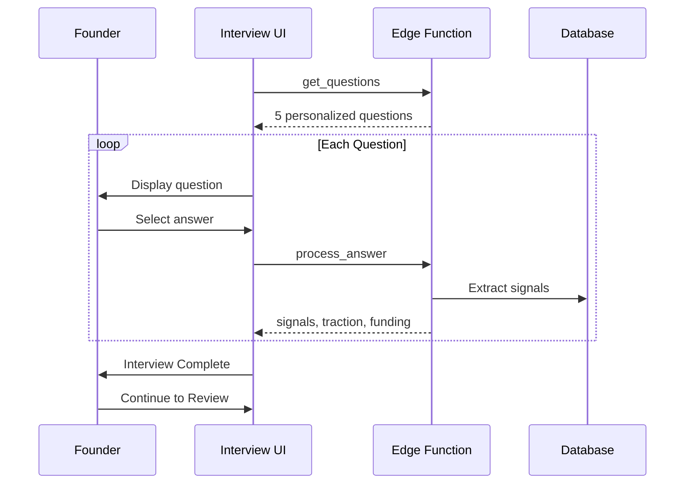
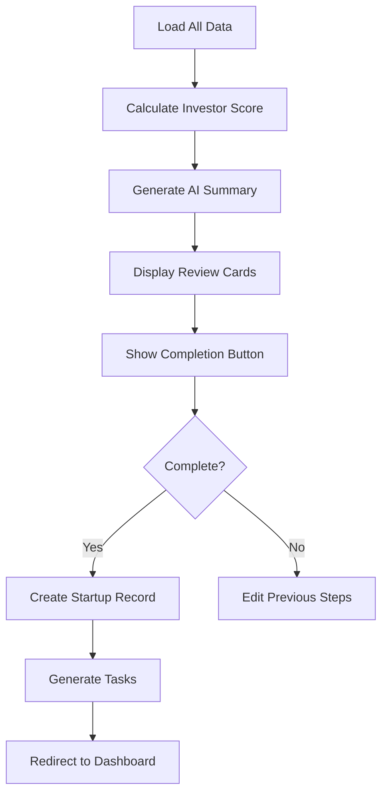
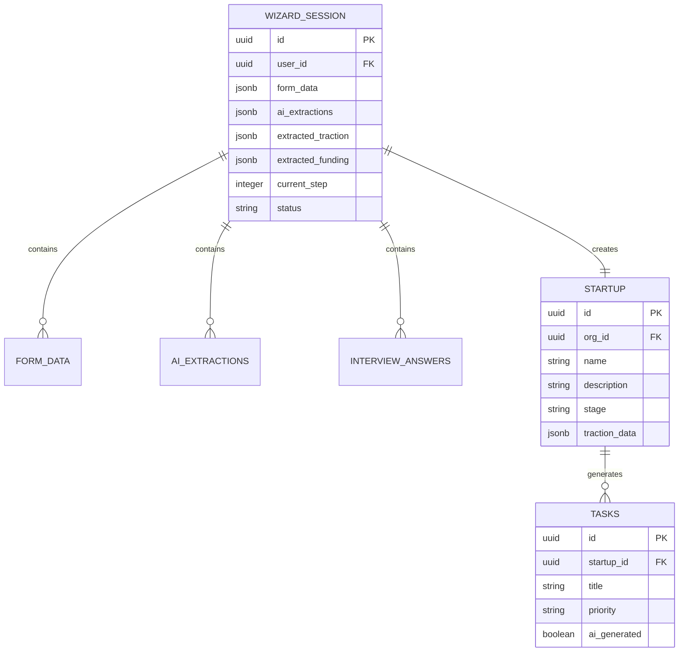

# Onboarding User Journey

**Last Updated:** 2026-01-25  
**Status:** Production Ready ✅

---

## Journey Overview

```mermaid
journey
    title Founder Onboarding Journey
    section Step 1: Context
      Enter company name: 5: Founder
      Add website URL: 4: Founder
      Click Smart Autofill: 5: Founder, AI
      Review AI suggestions: 4: Founder
      Add team members: 3: Founder
    section Step 2: Analysis
      View readiness score: 5: Founder
      Review market analysis: 4: Founder, AI
      Check competitor intel: 4: AI
      Refine detected signals: 3: Founder
    section Step 3: Interview
      Answer traction questions: 4: Founder
      Provide funding status: 4: Founder
      Describe PMF stage: 4: Founder
      Review extracted signals: 3: Founder, AI
    section Step 4: Review
      View investor score: 5: Founder, AI
      Review AI summary: 5: Founder
      Complete onboarding: 5: Founder
      Redirect to dashboard: 5: System
```

---

## Step-by-Step Breakdown

### Step 1: Context Collection

**Goal:** Gather foundational startup information



**User Actions:**
- Enter company name (required)
- Add website URL (optional, triggers AI)
- Review AI-detected fields
- Add founder cards

**AI Actions:**
- Extract company data from URL
- Detect industry, stage, business model
- Identify competitors via Google Search

**Success Criteria:**
- [ ] Company name provided
- [ ] Description filled (min 50 chars)
- [ ] At least 1 founder added

---

### Step 2: AI Analysis

**Goal:** Present AI-generated insights for review



**User Actions:**
- Review readiness score (0-100)
- Examine category breakdowns
- Read AI recommendations
- Optional: Recalculate score

**AI Actions:**
- Score product clarity
- Score market understanding
- Score team strength
- Generate improvement recommendations

**Success Criteria:**
- [ ] Readiness score displayed
- [ ] All category cards visible
- [ ] Recommendations shown

---

### Step 3: Smart Interview

**Goal:** Gather traction and funding data through guided questions



**User Actions:**
- Answer 5 interview questions
- View progress indicator
- See extracted signals

**AI Actions:**
- Map answers to traction data
- Extract funding status
- Detect business signals

**Question Topics:**
1. **Traction** - MRR range
2. **Users** - Active user count
3. **Fundraising** - Raising status
4. **Team** - Team size
5. **PMF** - Product-market fit stage

**Success Criteria:**
- [ ] All 5 questions answered
- [ ] Signals extracted correctly
- [ ] Data persisted to session

---

### Step 4: Review & Complete

**Goal:** Present final investor score and complete onboarding



**User Actions:**
- Review investor score (0-100)
- Read AI-generated summary
- View traction/funding summary
- Click "Complete Setup"

**AI Actions:**
- Calculate investor readiness
- Generate pitch summary
- Identify strengths/improvements

**Success Criteria:**
- [ ] Investor score displayed
- [ ] Summary generated
- [ ] Startup record created
- [ ] Initial tasks generated
- [ ] Redirect to dashboard

---

## Data Flow Summary



---

## Outcomes & Success Metrics

| Metric | Target | Measurement |
|--------|--------|-------------|
| Completion Rate | >80% | Sessions completed / Sessions started |
| Time to Complete | <10 min | Average session duration |
| Data Quality | >90% | Required fields populated |
| AI Accuracy | >85% | User acceptance of AI suggestions |
| Task Generation | 3+ tasks | Initial tasks created per startup |

---

## Error Handling

| Error | User Experience | Recovery |
|-------|-----------------|----------|
| AI timeout | Show retry button | Manual entry fallback |
| Session lost | Auto-resume on return | Session persistence |
| Auth expired | Redirect to login | Session preserved |
| Validation fail | Inline error messages | Field-level guidance |
