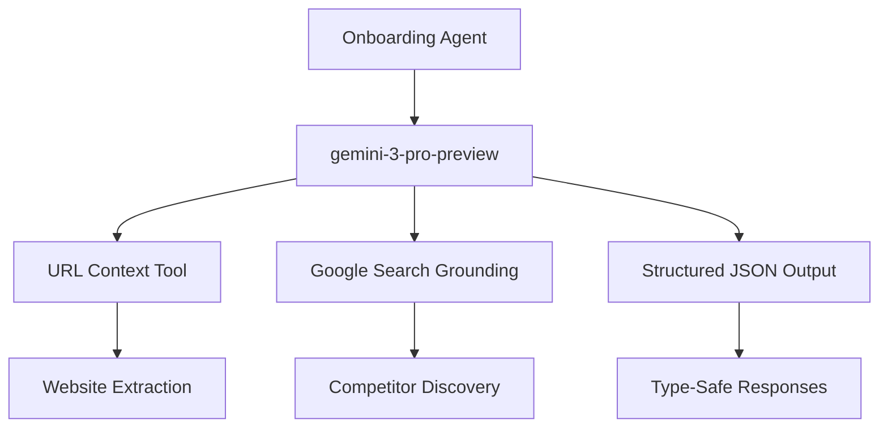

# Gemini API Documentation Index

**Last Updated:** 2026-01-25  
**Model in Use:** `gemini-3-pro-preview`  
**Status:** Production Ready ✅

---

## Documentation Files

| File | Description | Status |
|------|-------------|--------|
| [01-gemini-3-overview.md](./01-gemini-3-overview.md) | Gemini 3 model family overview | ✅ |
| [02-google-search-grounding.md](./02-google-search-grounding.md) | Real-time web search integration | ✅ |
| [03-url-context.md](./03-url-context.md) | URL content extraction tool | ✅ |
| [04-structured-output.md](./04-structured-output.md) | JSON Schema responses | ✅ |
| [05-text-generation.md](./05-text-generation.md) | Text generation API | ✅ |
| [06-thinking.md](./06-thinking.md) | Advanced reasoning capabilities | ✅ |
| [07-troubleshooting.md](./07-troubleshooting.md) | Error codes and solutions | ✅ |
| [08-api-reference.md](./08-api-reference.md) | Quick API reference | ✅ |
| [09-onboarding-agent-grounding.md](./09-onboarding-agent-grounding.md) | Onboarding AI integration | ✅ |
| [10-nano-banana-image-generation.md](./10-nano-banana-image-generation.md) | Official Nano Banana docs | ✅ |
| [11-nano-banana-implementation.md](./11-nano-banana-implementation.md) | Lovable AI Gateway integration | ✅ |

---

## Models Used in This Project



---

## Key Capabilities Implemented

### 1. URL Context Extraction
```typescript
tools: [{
  urlContext: {
    urls: [websiteUrl]
  }
}]
```
**Used in:** `enrich_url` action

### 2. Structured Output
```typescript
generationConfig: {
  responseMimeType: "application/json"
}
```
**Used in:** All AI actions for type-safe responses

### 3. Advanced Reasoning
- 1M context window for complex analysis
- Multi-step reasoning for investor scoring
- Pattern recognition for signal detection

---

## API Configuration

```typescript
// Production configuration
const GEMINI_ENDPOINT = "https://generativelanguage.googleapis.com/v1beta/models/gemini-3-pro-preview:generateContent";

const config = {
  temperature: 0.2-0.5,      // Lower for extraction, higher for summaries
  maxOutputTokens: 1000-2000, // Based on action requirements
  responseMimeType: "application/json"
};
```

---

## Quick Reference

| Action | Temperature | Max Tokens | Tools Used |
|--------|-------------|------------|------------|
| `enrich_url` | 0.2 | 2000 | URL Context |
| `enrich_context` | 0.2 | 1000 | None |
| `calculate_readiness` | 0.3 | 1000 | None |
| `calculate_score` | 0.3 | 1000 | None |
| `generate_summary` | 0.5 | 1000 | None |

---

## Pricing Reference

| Model | Input | Output |
|-------|-------|--------|
| gemini-3-pro-preview | $2/M tokens (<200k) | $12/M tokens |
| gemini-3-pro-preview | $4/M tokens (>200k) | $18/M tokens |
| gemini-3-flash-preview | $0.50/M tokens | $3/M tokens |
